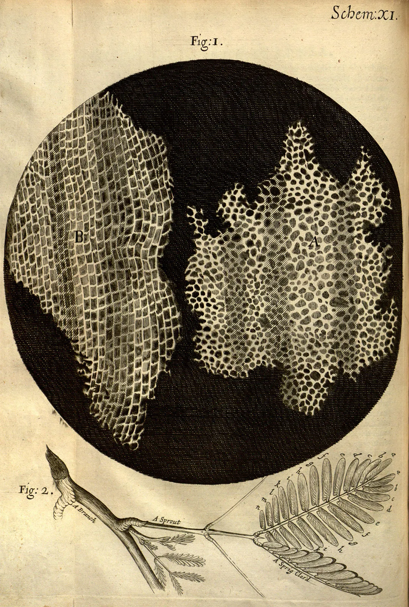

# 제1장 서론

## 1.1 의생명정보학의 정의와 범위

의생명정보학은 생명과학, 의학, 정보학이 융합되어 탄생한 학제간 분야이다. 의생명정보학은 다음과 같은 세 가지 주요 학문의 교차점에 위치한다:
- **의학**: 인체의 구조, 기능, 질병에 관한 연구
- **생명과학**: 생명 현상과 생물체의 특성에 관한 연구
- **정보학**: 데이터의 저장, 검색, 처리 및 분석에 관한 연구

이러한 학문 분야의 교차점에서 파생된 세부 영역은 다음과 같다:
- **의료정보학**: 의학과 정보학의 교차점으로, 의료 데이터의 관리와 분석에 중점
- **생명정보학**: 생명과학과 정보학의 교차점으로, 유전체, 단백질체 등의 생명과학적 데이터 분석에 중점
- **중개의학(Translational Medicine)**: 의학과 생명과학의 교차점으로, 기초 생명과학적 발견을 임상 응용으로 전환하는 과정에 중점

**Figure 1.1** 의생명정보학의 학문적 위치 - 의학, 생명과학, 정보학의 융합

따라서 이들의 교차점에 있는 의생명정보학이란 "의학적 문제를 해결하기 위해 생명과학적 데이터와 정보학적 방법을 통합적으로 활용하는 학문" 으로 정의내릴 수 있으며, 이는 곧 중개의학적 성격을 지닌 생명정보학이라고도 할 수 있을 것이다. 따라서 생명정보학에 대해 잘 아는 것이 매우 중요하다.

생명정보학은 그 역사가 다른 학문에 비해 짧으며, 따라서 그 경계 또한 모호한 편이다. 그러나, 많은 경우 생명과학적 데이터, 특히 대규모의 복잡한 데이터셋을 이해하기 위한 방법론과 소프트웨어 도구를 개발하는 학문으로 이해되고 있다. 간단히 말해, 생명과학 "빅데이터"를 다루기 위한 방법론과 도구를 개발하는 분야라고 할 수 있다.

**Figure 1.2** 생명정보학의 정의 (출처: Wikipedia)

다만 여기서 문제는 "생명과학" 이라는 단어에 있다. 생명이라는 현상은 매우 복잡하며, 단순하지 않다. 따라서 이를 잘 이해하기 위해서는 다양한 학문적 배경이 요구된다.

## 1.2 생명과학의 발전과 생명정보학의 등장

생명과학은 오랜 역사를 가지고 있다. 고대에는 오감을 통한 생물 분류가 주를 이루었다. 다음은 중국의 황전(黄筌, 903~965)이 그린 '사생진금도(写生珍禽图)' 라는 그림인데, 이는 희귀한 생물을 직접 관찰하고 그린 작품이며, 당시의 생명과학적 접근 방식을 보여준다.

**Figure 1.3** 사생진금도(写生珍禽图) - 고대 중국의 생물 분류 접근법 (황전, 903-965)

시간이 흘러 현미경이 발명되고, 전자현미경 등이 등장하며 현대 생명과학의 근간이 되는 중요한 발견들이 이루어졌다. 각 발견은 현대 생명과학을 이루는 다양한 학문들의 시발점이 되었다.

**Figure 1.4** 로버트 훅이 사용한 현미경 (17세기)

- **세포생물학**: 현미경으로 코르크를 관찰함으로써 '세포(cell)' 가 처음 발견되었다. 추후 모든 생물이 세포로 이루어져 있음이 알려졌다. 이를 통해 **세포가 생명의 기본 단위**라는 개념이 확립되었다.

**Figure 1.5** 로버트 훅의 코르크 관찰 - 세포(cell)의 최초 발견 (1665년)

**Figure 1.6** 세포 구조 - 진핵세포와 원핵세포의 기본 구조

- **분자생물학**: 세포의 내부를 관찰함으로써 DNA, RNA, 단백질 등의 분자를 발견하였다. DNA에서 RNA로, 그리고 단백질로 유전정보가 이어진다는 중심원리(Central Dogma)가 확립되었다. 이는 생명 현상을 이해하는 기본 틀이 되었다.

**Figure 1.7** Central Dogma - DNA에서 RNA, 단백질로 이어지는 유전정보의 플름

**Figure 1.8** Central Dogma의 세부 메커니즘 - 전사와 번역 과정

DNA가 생명의 설계도라는 것이 알려진 이후, 컴퓨터를 기반으로 이를 분석함으로써 생명을 이해해보려 하는 시도가 생겨났다. 이는 곧 현대 생물학의 중요한 관심사로 떠오르게 되었으며, "생명정보학" 이 등장하게 되는 계기가 되었다.

특히 인간 지놈 프로젝트 이후 시퀀싱 기술의 발전으로 유전체 분석 비용이 급격히 감소하여, 개인 맞춤 의학이 현실화되고 있다. 동시에 생명과학 분야에서는 데이터의 폭발적 증가가 나타나고 있다.

**Figure 1.9** 생명과학 분야 데이터 축적량의 급격한 증가 (출처: NIH/NLM)

## 1.3 체학

### 1.3.1 "-체(-ome)"과 "-체학(-omics)"의 개념

생명정보학에서는 생명 현상을 총체적으로 이해하기 위해 "-체(-ome)"과 "-체학(-omics)"이라는 개념이 중요하게 사용된다:

- **"-체(-ome)"**: "모든 대상의 집합"을 의미한다.
  - 유전체(Genome): 유전자(Gene) + ome = 모든 유전자의 집합 (일반적으로 DNA 전체를 의미)
  - 전사체(Transcriptome): 전사(Transcription) + ome = 모든 메신저 RNA 분자의 집합
  - 단백체(Proteome): 단백질(Protein) + ome = 모든 단백질의 집합
  - 대사체(Metabolome): 대사물질(Metabolite) + ome = 모든 대사물질의 집합

- **"-체학(-omics)"**: "대상 집합(-ome)에 대한 정량적 분석"을 의미한다.
  - 유전체학(Genomics): 유전체에 대한 연구
  - 전사체학(Transcriptomics): 전사체에 대한 연구
  - 단백체학(Proteomics): 단백체에 대한 연구
  - 대사체학(Metabolomics): 대사체에 대한 연구

### 1.3.2 인간 지놈 프로젝트와 기술 발전

**인간 지놈 프로젝트(Human Genome Project)** 는 의생명정보학 발전의 중요한 이정표이다. 1990년 10월부터 2003년 4월까지 진행된 이 프로젝트는 인간의 표준 유전체를 완성하는 데 13년이 걸렸으며, 약 30억 달러가 소요되었다.

그러나 현재는 기술의 발전으로 인해 유전체 해독이 몇 시간에서 며칠 내에 가능해졌으며, 비용도 500~1500 달러로 크게 감소했다. 이로 인해 1000 Genome Project, UK10k 등 대규모 지놈 프로젝트가 가능해졌고, 정밀의학(Precision Medicine)의 토대가 마련되었다. 최근 국내에서도 "울산 10만명 지놈 프로젝트" 등 시도가 이어지고 있다.

**Figure 1.10** 인간 유전체 해독 비용의 급격한 감소 (2001-2021)

이외에도 기술의 진보는 다양한 -체학 분야에서 대량의 데이터 생산을 가능하게 하고 있다:
- **유전체학/후성유전체학**: 차세대 시퀀싱(Next Generation Sequencing) 기술의 발전
- **전사체학**: 마이크로어레이(Microarray) 기술의 발전
- **단백체학**: 질량 분석법(Mass Spectrometry)의 발전

### 1.3.3 후성유전체학

후성유전체학은 DNA 서열 자체의 변화 없이 유전자 발현을 조절하는 메커니즘을 연구하는 분야이다. 이 중에서 중요한 개념인 CpG island는 암 연구에서 특히 중요한 역할을 한다. CpG island는 DNA 상에서 시토신(C)과 구아닌(G) 염기가 인접하게 위치하는 부분이 집중적으로 나타나는 부위를 말한다.

**Figure 1.11** CpG Island 메틸화와 유전자 발현 조절 메커니즘 

이러한 CpG island의 메틸화(methylation) 패턴은 유전자 발현 조절에 중요한 역할을 하며, 비정상적인 메틸화는 암의 발생과 밀접한 연관이 있다. 특히, 종양 억제 유전자의 프로모터 부위에 있는 CpG island가 과메틸화(hypermethylation)되면 해당 유전자의 발현이 억제되어 암 발생 위험이 증가할 수 있다. 반대로, 암 유전자(oncogene)의 프로모터 부위에 있는 CpG island가 저메틸화(hypomethylation)되면 해당 유전자의 발현이 증가하여 암 발생 위험이 증가할 수 있다.

**Figure 1.12** 정상 대장 상피세포와 대장암에서의 메틸화 패턴 차이

## 1.4 이미지 데이터

의생명정보학에서는 이미지 데이터 분석 또한 중요한 영역을 차지한다.

**Figure 1.13** 주요 이미징 기술 - 밝은 시야 이미징, 위상차 이미징, 형광 이미징

주요 이미징 기술로는 다음과 같은 것들이 있다:

- **밝은 시야 현미경법(Bright Field Microscopy)**: 가장 기본적인 현미경 기술로, 빛이 시료를 통과하여 명암 대비를 통해 세포 구조를 관찰할 수 있다. 염색 기법과 함께 사용되어 특정 세포 구조를 시각화할 수 있다.

**Figure 1.14** 밝은 시야 현미경법으로 관찰한 식물 세포 구조

- **위상차 현미경법(Phase Contrast Microscopy)**: 투명한 생체 시료의 위상차를 이용하여 염색 없이도 세포 구조를 선명하게 관찰할 수 있는 기술이다. 살아있는 세포의 동적 변화를 실시간으로 관찰하는 데 특히 유용하다.

**Figure 1.15** 위상차 현미경법으로 관찰한 살아있는 세포

- **형광 현미경법(Fluorescence Microscopy)**: 형광 염료나 단백질을 사용하여 특정 세포 구조나 단백질을 표지하고, 특정 파장의 빛을 조사하여 형광 신호를 관찰하는 기술이다. 이를 통해 특정 단백질의 위치, 상호작용, 발현 양상 등을 시각화할 수 있다.

**Figure 1.16** 형광 현미경을 이용한 다중 채널 이미징 (Nucleus, Vimentin, Actin)

이러한 이미지 데이터는 세포 및 조직 수준에서의 생물학적 현상을 이해하는 데 중요한 정보를 제공하며, 최근에는 딥러닝과 같은 인공지능 기술을 활용한 이미지 분석이 활발히 연구되고 있다.

## 1.5 단백질 구조 데이터

단백질의 3차원 구조를 분석하는 것은 단백질의 기능을 이해하고 약물 개발에 활용하는 데 필수적이다. 주요 단백질 구조 분석 기술로는 다음과 같은 것들이 있다:

- **X선 결정학(X-ray Crystallography, XRD)**: 단백질 결정에 X선을 조사하여 회절 패턴을 분석함으로써 원자 수준에서의 단백질 구조를 결정하는 기술이다. 가장 오래된 방법이지만 여전히 높은 해상도의 구조 정보를 제공한다.

**Figure 1.17** X선 결정학 과정 - 결정에서 원자 모델까지

- **극저온 전자현미경법(Cryo-Electron Microscopy, Cryo-EM)**: 단백질 시료를 초저온으로 급속 동결시킨 후 전자현미경으로 관찰하는 기술이다. 최근 기술의 발전으로 원자 수준의 해상도를 달성할 수 있게 되었으며, 결정화가 어려운 큰 단백질 복합체 구조 연구에 특히 유용하다. 이 기술의 혁신성을 인정받아 2017년 노벨 화학상을 수상했다.

**Figure 1.18** 2017년 노벨 화학상 수상자들 - Cryo-EM 기술 개발

- **단백질 접힘 예측(Protein Folding)**: 컴퓨터 알고리즘을 이용하여 단백질의 아미노산 서열로부터 3차원 구조를 예측하는 기술이다. 최근 DeepMind의 AlphaFold2와 같은 인공지능 기반 접근법이 획기적인 성과를 보이며 단백질 구조 생물학 분야에 혁명을 일으키고 있다.

**Figure 1.19** AlphaFold - 50년간의 단백질 구조 예측 문제 해결

이러한 구조 데이터는 PDB(Protein Data Bank)와 같은 데이터베이스에 저장되어 연구자들이 공유하고 활용할 수 있다.

## 1.6 의료정보학적 데이터

의료정보학은 의료 현장에서 생산된 빅데이터를 분석하는 방법론과 도구를 개발하는 분야로, 의생명정보학의 중요한 부분을 차지한다. 의료정보학적 데이터에는 다음과 같은 것들이 포함된다:

### 1.6.1 전자의무기록(Electronic Medical Record, EMR)

전자의무기록은 환자의 진료 정보를 디지털 형태로 저장한 데이터로, 다음과 같은 정보를 포함한다:
- 진찰 기록
- 환자 이력 (처방력, 술/담배 이력 등)
- 정량적 데이터 (키, 몸무게 등)
- 영상 및 음성 데이터

EMR은 의료 데이터의 핵심으로, 환자 케어의 연속성을 보장하고 의료 의사결정을 지원하는 데 중요한 역할을 한다.

**Figure 1.20** 전자의무기록(EMR) 시스템 인터페이스

### 1.6.2 국제질병분류(International Classification of Diseases, ICD)

ICD는 질병 진단을 위한 국제 표준 코드 시스템이다:
- 세계보건기구(World Health Organization, WHO)에서 관리한다.
- 현재 최신 버전은 ICD-11이다.
- 한국에서는 한국표준질병사인분류(Korean Standard Classification of Diseases, KCD)라는 한국 버전의 ICD를 사용한다.

**Figure 1.21** ICD-11 질병 분류 시스템 (결핵 관련 코드 예시)

이 표준화된 코드 시스템은 의료 데이터의 일관성을 유지하고, 국제적인 데이터 공유와 비교를 가능하게 한다.

### 1.6.3 의료영상 및 통신 표준(DICOM)

DICOM(Digital Imaging and Communications in Medicine)은 표준 의료영상/기록 포맷이다:
- 주로 병원 내 'PACS(Picture, Archive, Communications)' 시스템에 의해 처리된다.
- 현재 거의 대부분의 의료영상기록이 DICOM 포맷으로 저장된다.
- X-ray, CT, MRI 등 다양한 의료 영상 데이터를 포함한다.

**Figure 1.22** X-ray 영상 - 의료 영상의 기본적인 형태

**Figure 1.23** DICOM 뷰어를 통한 의료 영상 데이터 관리

### 1.6.4 비디지털 데이터와 그 처리

그러나 모든 의료 데이터가 디지털 포맷으로 저장되어 있지는 않다:
- 수기 및 필름 데이터가 여전히 존재한다.

**Figure 1.24** 의사의 손글씨 진료 기록 - 비디지털 의료 데이터의 예
- 이러한 데이터를 일일이 디지털 포맷으로 변환하는 것은 매우 어렵다.
- 이를 해결하기 위해 영상처리/필기인식 기술과 자연어 처리 기술이 활용되고 있다.

### 1.6.5 통계 데이터

의료 분야에는 다양한 통계 데이터가 존재한다:
- 임상시험 데이터
- 역학(Epidemiology) 데이터
- 메타분석 데이터

이러한 통계 데이터는 치료 효과 검증, 질병 패턴 분석, 공중 보건 정책 수립 등에 활용된다.

## 1.7 현대 생명정보학의 동향

이렇듯 컴퓨터를 활용한 체학 분석이 중요해지면서, 현대 생명과학의 연구에 있어서도 생명정보학이 점차 주도적 위치를 차지하고 있다. 이는 생명과학적 발견이 실험실 위주에서 데이터 분석 중심으로 변화하고 있음을 의미한다.

생명정보학 데이터 분석은 단순한 도구 사용을 넘어, 생명과학적 문제를 해결하기 위한 통합적 접근을 요구한다. 초창기에는 생명과학적 지식이 부족한 컴퓨터 과학자나 수학자들이 생명과학자들에게 보조적인 역할을 제공해 주는 식으로 연구가 이루어졌으나, 최근에는 생명과학적 지식, 통계적 방법론, 프로그래밍 기술을 모두 어느정도 갖추고 있는 생명정보학자들이 주체적으로 연구를 수행하는 형태로 점차 변화하고 있다.

**Figure 1.25** 계산생물학자의 역할 변화 - 과거 보조적 역할에서 현재 연구 주도적 역할로
