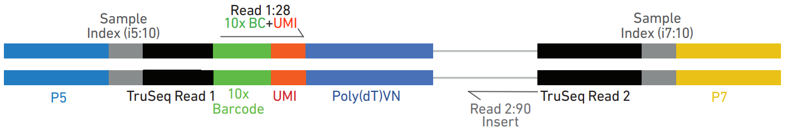
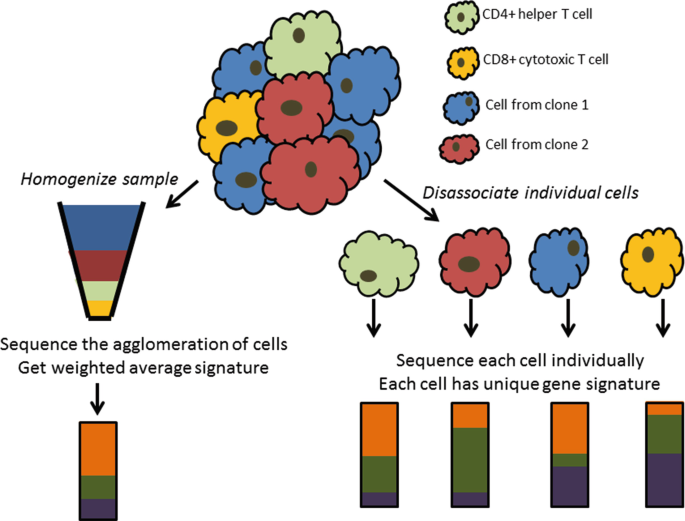
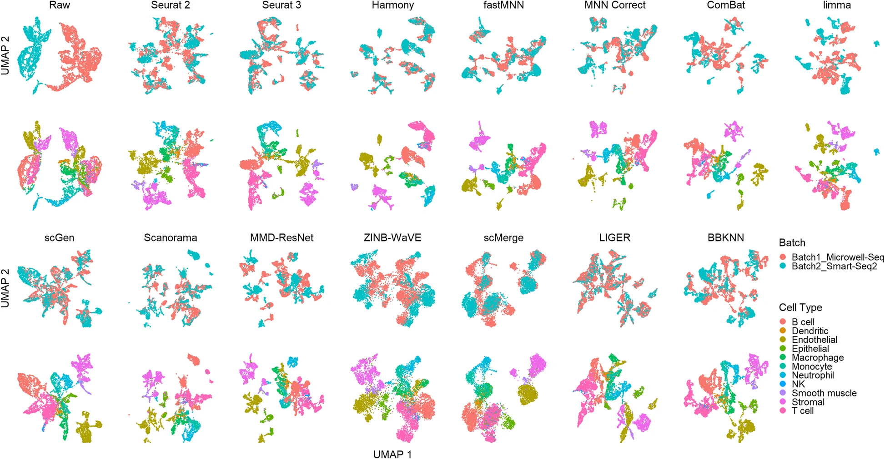
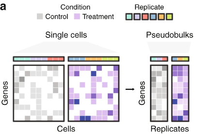

# 제10장 단일 세포 전사체학

## 10.1 단일세포 RNA 시퀀싱의 혁신

전통적인 벌크 RNA 시퀀싱(bulk RNA-seq)은 수백만 개의 세포에서 추출한 RNA를 혼합하여 분석하므로, 전체 세포 집단의 평균적인 발현 패턴만을 제시한다. 이러한 접근법은 조직 전체의 일반적인 특성을 파악하는 데는 유용하지만, 개별 세포 간의 차이나 희귀 세포 유형의 존재를 감지하기 어렵다는 한계가 있다.

단일세포 RNA 시퀀싱(single-cell RNA sequencing, scRNA-seq)은 이러한 한계를 극복하고 세포 이질성(cellular heterogeneity)을 직접 측정할 수 있는 혁신적인 기술이다. 이 기술을 통해 연구자들은 겉보기에 동일해 보이는 세포 집단 내에서도 유전자 발현 패턴이 현저히 다른 세포 아집단들을 발견할 수 있었다. 예를 들어, 종양 조직 내에서 암세포의 다양한 아형들이 서로 다른 전사체 프로파일을 보이며, 이러한 차이가 치료 반응성과 전이 능력에 영향을 미칠 수 있다는 것이 밝혀졌다.


**Figure 10.1** 벌크와 단일세포 RNA-seq 비교 - 벌크 분석의 평균화된 신호와 단일세포 분석의 개별 세포 정보

### 10.1.1 세포 분화와 발생학적 이해

scRNA-seq 기술은 세포 분화 과정을 시간적 순서에 따라 재구성할 수 있는 강력한 도구를 제공한다. 의사시간(pseudotime) 분석을 통해 발생 과정에서 줄기세포가 특화된 세포로 분화하는 경로를 추적할 수 있다. 이는 실제 시간 경과를 따라 실험을 수행하지 않고도, 서로 다른 분화 단계에 있는 세포들의 전사체 유사성을 바탕으로 발생학적 궤적을 재구성하는 계산적 방법이다.


**Figure 10.2** 단일세포 RNA-seq 응용 - 세포 분화, 발생학적 궤적, 세포 유형 발견의 다양한 응용 분야

RNA velocity 분석은 이러한 분석을 한 단계 더 발전시킨 기법으로, 각 세포에서 미성숙 mRNA(unspliced)와 성숙 mRNA(spliced)의 비율을 분석하여 유전자 발현의 동적 변화 방향을 예측한다. 이를 통해 세포가 어떤 방향으로 분화하고 있는지, 어떤 분기점에서 세포 운명이 결정되는지를 실시간으로 파악할 수 있다.

### 10.1.2 유전자 발현의 확률적 특성

단일세포 수준에서 관찰되는 유전자 발현은 벌크 분석에서 예상되는 것과는 매우 다른 특성을 보인다. 개별 세포에서 유전자 발현은 연속적이고 균일한 과정이 아니라, 간헐적이고 폭발적인 버스트(burst) 형태로 일어난다. 이는 유전자의 프로모터 영역이 활성 상태와 비활성 상태를 번갈아 가며, 활성 상태일 때 다량의 mRNA가 한꺼번에 생산되기 때문이다.

이러한 확률적 발현 패턴은 단일세포 데이터에서 이중모드(bimodal) 또는 다중모드 분포로 나타난다. 일부 세포에서는 특정 유전자가 높은 수준으로 발현되는 반면, 다른 세포에서는 거의 발현되지 않는 ON/OFF 스위치와 같은 패턴을 보인다. 이러한 발현의 불균질성은 세포가 환경 변화에 대응하거나 분화 신호에 반응할 때 표현형 다양성을 생성하는 중요한 메커니즘으로 작용한다.

### 10.1.3 단일세포 데이터의 클러스터링

단일세포 데이터에서 세포 유형을 분류하기 위해서는 고차원 데이터에 적합한 클러스터링 알고리즘이 필요하다. 주요 클러스터링 방법과 차원 축소 기법의 상세한 내용은 11장 "차원 축소와 데이터 분석"에서 다룬다.

## 10.2 플로우 사이토메트리

### 10.2.1 기술의 물리적 원리

플로우 사이토메트리(flow cytometry)는 유체역학적 집속(hydrodynamic focusing) 원리를 이용하여 세포를 한 개씩 분리하고 분석하는 기술이다. 이 시스템에서 세포가 포함된 시료는 중앙의 세포 스트림을 형성하고, 양쪽에서 순환하는 전해질 용액(sheath fluid)에 의해 둘러싸여 층류(laminar flow) 상태를 만든다. 이러한 층류 조건에서 세포들은 단일 파일로 정렬되어 레이저 빔을 통과하게 된다.

세포가 레이저와 만나는 순간, 빛의 산란과 형광 신호가 발생한다. 전방 산란(Forward Scatter, FSC)은 세포의 상대적 크기를 반영하며, 측방 산란(Side Scatter, SSC)은 세포 내부의 복잡도나 과립의 정도를 나타낸다. 이 두 매개변수만으로도 혈액 세포의 주요 유형들(림프구, 단핵구, 과립구)을 구별할 수 있다.


**Figure 10.3** 플로우 사이토메터 - 유체역학적 집속과 레이저 기반 세포 분석 원리

### 10.2.2 형광 활성화 세포 분류(FACS)

형광 활성화 세포 분류(Fluorescence-Activated Cell Sorting, FACS)는 플로우 사이토메트리 기술을 확장하여 관심 있는 세포를 물리적으로 분리할 수 있는 시스템이다. 이 과정에서 세포가 포함된 스트림은 진동에 의해 균일한 크기의 미세한 액적(droplet)으로 분할된다. 각 액적에는 통계적으로 0개 또는 1개의 세포가 포함되며, 세포의 형광 특성에 따라 특정 전하로 대전된다.

대전된 액적들은 전기장을 통과하면서 편향되어 서로 다른 수집 용기로 분류된다. 이를 통해 특정 마커를 발현하는 세포만을 선택적으로 회수할 수 있으며, 분류된 세포들은 후속 실험에 바로 사용할 수 있을 정도로 높은 순도와 생존율을 유지한다. FACS는 특히 희귀 세포 집단의 농축이나 줄기세포 분리에 널리 활용된다.


**Figure 10.4** FACS 분류 - 형광 활성화 세포 분류를 통한 세포 집단 분리 과정

### 10.2.3 다중 매개변수 분석

현대의 플로우 사이토메터는 10개 이상의 서로 다른 형광 채널을 동시에 측정할 수 있어, 복잡한 세포 집단의 다차원적 분석이 가능하다. 그러나 여러 형광 염료들의 방출 스펙트럼이 부분적으로 겹치는 경우가 많아, 이를 보정하기 위한 스펙트럼 보상(spectral compensation) 과정이 필요하다.

보상 과정에서는 각 형광 염료로 단독 염색된 대조군 시료들을 이용해 보상 매트릭스를 계산한다. 이 매트릭스는 각 검출기에서 측정된 신호 중 다른 형광 염료로부터 누출된 신호의 비율을 정량화하여, 실제 신호에서 이를 수학적으로 제거한다.

데이터 분석에서는 단계적 게이팅(sequential gating) 전략을 사용한다. 먼저 FSC/SSC 분포를 이용해 세포 파편과 응집체(doublet)를 제거하고, 생존/사멸 염료를 이용해 생존 세포만을 선별한다. 이후 특정 표면 마커나 세포내 단백질의 발현 패턴에 따라 순차적으로 세포 아집단을 정의한다. 이러한 체계적 접근을 통해 복잡한 조직에서도 정확한 세포 유형 분류와 정량 분석이 가능하다.

## 10.3 미세유체학과 단일세포 포획 기술

### 10.3.1 미세유체학의 물리적 특성

미세유체학(microfluidics)은 마이크로미터 규모의 채널에서 유체의 흐름을 제어하는 기술이다. 플로우 사이토메트리가 1960년대부터 발전해온 것과 달리, 미세유체학은 2000년대 후반부터 단일세포 분석 분야에 본격적으로 도입되었다.


**Figure 10.5** 액적 단일세포 포획 - 미세유체학적 액적 생성을 통한 단일세포 포획 과정


**Figure 10.6** 10x 시퀀싱 - 10x Genomics 플랫폼의 단일세포 분석 워크플로우

마이크로미터 규모에서는 유체역학적 특성이 거시적 환경과 크게 달라지는데, 예를 들어 점성력이 상대적으로 더 커지게 되어 층류(laminar flow)가 지배적이게 된다. 이러한 특성 때문에 서로 다른 유체 흐름이 만나더라도 난류 혼합 없이 안정적인 계면을 형성하게 된다.

이러한 물리적 특성을 활용하여 T자형 또는 flow-focusing 구조의 채널에서 균일한 크기의 액적(droplet)을 생성할 수 있다. 이러한 기술의 발전은 이를 활용한 단일세포 전사체 분석 방법들이 등장하는 계기가 되었다.

### 10.3.2 Drop-seq 기술의 원리

Drop-seq는 미세유체학적 액적 생성 기술을 단일세포 전사체 분석에 적용한 방법이다. 이 시스템의 핵심은 각 액적에 세포와 바코드된 비드(barcoded bead)를 함께 포함시키는 것이다. 비드 표면에는 poly-T 서열, 고유한 세포 바코드(Cell Barcode, BC), 그리고 분자 식별자(Unique Molecular Identifier, UMI)가 순서대로 연결된 올리고뉴클레오타이드가 부착되어 있다.

세포와 비드의 액적 내 분포는 포아송 분포를 따르므로, 희석된 농도에서는 대부분의 액적에 0개 또는 1개의 세포가 포함된다. 세포 바코드는 일반적으로 12-16개 염기로 구성되어 수만 개의 서로 다른 세포를 구별할 수 있으며, UMI는 증폭 과정에서 발생할 수 있는 편향을 보정하기 위해 각 mRNA 분자를 고유하게 표지한다.

액적이 형성된 후, 계면활성제를 이용해 세포막을 용해시키고 mRNA를 방출시킨다. 비드 표면의 poly-T 서열이 mRNA의 poly-A tail에 결합하여 역전사 반응이 일어나며, 이 과정에서 각 cDNA 분자에는 해당 세포의 고유한 바코드와 UMI가 함께 부착된다.


**Figure 10.7** Drop-seq 기술 - 바코드된 비드와 단일세포를 이용한 전사체 분석 과정

### 10.3.3 라이브러리 제작과 상용화 플랫폼

역전사 반응이 완료된 후에는 계면활성제를 이용해 액적을 파괴하고 바코드된 cDNA를 회수한다. 회수된 cDNA는 PCR 증폭을 통해 시퀀싱에 충분한 양으로 늘리며, 이 과정에서 샘플 식별을 위한 추가 바코드와 Illumina 시퀀싱에 필요한 어댑터 서열이 부착된다.

현재 여러 상용화된 플랫폼이 이러한 원리를 구현하고 있다. 10x Genomics의 Chromium 시리즈는 가장 널리 사용되는 플랫폼으로, 한 번의 실험에서 수천에서 수만 개의 세포를 분석할 수 있다. BD Biosciences의 Rhapsody 시스템은 다중 시료 처리에 최적화되어 있으며, Bio-Rad의 ddSEQ 시스템은 비용 효율적인 대안을 제공한다.



**Figure 10.8** 단일세포 라이브러리 구조 - 10x Genomics 라이브러리의 바코드와 UMI 구조

상용 플랫폼들은 표준화된 프로토콜과 자동화된 처리 과정을 제공하여 실험 간 재현성을 향상시켰다. 세포 포획 효율, 유전자 검출 감도, 처리량 등이 개선되면서 단일세포 전사체학의 활용 범위가 확대되고 있다.

## 10.4 전사체 데이터 분석 방법론

### 10.4.1 통계적 검정과 다중 비교 보정

전사체 데이터, 특히 단일세포 RNA-seq 데이터는 일반적인 생물학적 데이터와는 매우 다른 통계적 특성을 보인다. 가장 두드러진 특징은 "영점 과다(zero inflation)" 현상으로, 많은 유전자가 특정 세포에서 전혀 발현되지 않아 측정값이 0이 되는 경우가 빈번하다. 이는 기술적 한계(낮은 검출 감도, 증폭 편향)와 생물학적 특성(확률적 발현, 세포 특이적 발현) 모두에 기인한다.

이러한 특성 때문에 전통적인 t-검정이나 분산분석과 같은 모수적 검정보다는 비모수적 검정이 선호된다. Wilcoxon rank-sum 검정(또는 Mann-Whitney U test 라고도 불림)은 분포에 대한 가정 없이 두 그룹 간의 차이를 검정할 수 있어 널리 사용된다.

전사체 분석에서는 수천에서 수만 개의 유전자를 동시에 검정하므로 다중 비교 문제가 심각하다. 이를 해결하기 위해 거짓 발견률(False Discovery Rate, FDR)을 제어하는 Benjamini-Hochberg 방법이나 더 보수적인 본페로니 보정이 적용된다.

### 10.4.2 차원 축소 기법

단일세포 전사체 데이터의 시각화와 분석을 위해서는 차원 축소가 필수적이다. PCA, t-SNE, UMAP 등의 주요 차원 축소 기법과 그 특성에 대한 상세한 설명은 11장 "차원 축소와 데이터 분석"에서 다룬다.

### 10.4.3 클러스터링과 품질 평가

차원 축소된 데이터에서 세포들을 유사한 그룹으로 분류하는 클러스터링은 세포 유형 발견의 핵심 과정이다. 다양한 클러스터링 알고리즘과 품질 평가 방법에 대한 상세한 내용은 11장 "차원 축소와 데이터 분석"에서 다룬다.

## 10.5 단일세포 데이터 분석 파이프라인의 개요와 중요성

단일세포 RNA 시퀀싱(single-cell RNA sequencing, scRNA-seq) 기술의 발전은 의생명정보학 분야에 혁신적인 변화를 가져왔다. 전통적인 벌크 RNA 시퀀싱이 수백만 개 세포의 평균적인 발현 정보를 제공하는 것과 달리, 단일세포 분석은 개별 세포의 유전자 발현 패턴을 측정할 수 있게 해준다. 이러한 기술적 혁신을 통해 연구자들은 조직 내 세포 이질성을 직접 관찰하고, 희귀 세포 유형을 발견하며, 세포 분화 과정을 상세히 추적할 수 있게 되었다.



**Figure 10.9** 단일세포 RNA-seq 개요 - 단일세포 분석의 전체 워크플로우와 주요 단계들

단일세포 데이터 분석 파이프라인은 원시 시퀀싱 데이터에서 생물학적으로 의미 있는 정보를 추출하기 위한 체계적인 절차를 의미한다. 이 파이프라인은 데이터의 특수한 특성을 고려하여 설계되어야 한다. 단일세포 데이터는 일반적으로 다음과 같은 특징을 가진다:

**희소성(Sparsity)**: 단일세포 RNA-seq 데이터에서는 전체 측정값의 60-90%가 0 또는 매우 낮은 값을 나타낸다. 이는 기술적 한계(검출 감도, 포획 효율)와 생물학적 특성(확률적 유전자 발현) 모두에 기인한다.

**고차원성(High-dimensionality)**: 수만 개의 유전자를 수천에서 수십만 개의 개별 세포에서 측정하므로, 차원의 저주 문제가 심각하게 나타날 수 있다.

**노이즈(Noise)**: 세포 포획, 역전사, PCR 증폭 등 여러 실험 단계에서 발생하는 기술적 변이와 세포 주기, 환경 반응 등으로 인한 생물학적 변이가 복합적으로 작용한다.

이러한 특성으로 인해 단일세포 데이터 분석은 전통적인 벌크 분석과는 완전히 다른 접근법을 요구하며, 전용 분석 도구와 방법론의 개발이 필요하다.

## 10.6 단일세포 데이터 분석의 핵심 단계

단일세포 RNA-seq 데이터 분석은 일련의 체계적인 과정을 통해 수행된다. 각 단계는 데이터의 품질과 최종 분석 결과에 직접적인 영향을 미치므로, 각 과정의 원리와 목적을 정확히 이해하는 것이 중요하다.

### 10.6.1 데이터 정량화와 품질 관리

**정량화 과정의 이해**: 단일세포 분석의 첫 번째 단계는 각 세포에서 각 유전자의 발현량을 정확히 측정하는 것이다. 이 과정에서 생성되는 것이 세포×유전자 행렬(cell × gene matrix)로, 이는 모든 후속 분석의 기반이 된다. 벌크 RNA-seq과 달리 단일세포 분석에서는 각 개별 세포가 하나의 샘플이 되므로, 수천에서 수만 개의 개별 샘플을 동시에 처리하는 것과 같다.

정량화 지표로는 다음과 같은 두 가지 방법이 주로 사용된다.
- **Raw count**: 각 유전자에 대해 매핑된 리드의 수를 직접 계산한 값
- **UMI count**: Unique Molecular Identifier를 이용하여 PCR 증폭 편향을 보정한 값

**품질 관리 지표**: 단일세포 데이터의 품질을 평가하기 위해 여러 지표를 사용한다. 각 세포에서 검출된 총 유전자 수는 세포의 건강 상태를 나타내는 중요한 지표이다. 너무 적은 유전자가 검출되면 세포가 손상되었거나 죽은 상태일 가능성이 높다. 미토콘드리아 유전자의 발현 비율도 중요한 품질 지표로, 세포막이 손상되면 세포질 mRNA는 손실되지만 미토콘드리아 mRNA는 상대적으로 보존되어 이 비율이 높아진다.

**10x Genomics 플랫폼의 기술적 특징**: 현재 가장 널리 사용되는 단일세포 RNA 시퀀싱 플랫폼 중 하나인 10x Genomics는 독특한 바코딩 시스템을 사용한다. 각 세포는 16nt의 Cell Barcode로 구분되며, 각 RNA 분자에는 12nt의 UMI(Unique Molecular Identifier)가 부착된다. Poly(dT) 프라이머를 사용하여 mRNA만을 선택적으로 포획한다. 실험 과정에서 세포를 마이크로드롭에 가두고 용해한 뒤 역전사를 진행하면서 바코드와 UMI를 부착하고, 이어서 cDNA를 증폭해 라이브러리를 제작한다.

**UMI의 중요성**: UMI는 같은 RNA 분자에서 나온 모든 리드를 하나로 묶어 PCR 편향을 제거하는 핵심 역할을 한다. 이를 통해 리드 수 대신 실제 분자 수를 정확하게 계산할 수 있어, 정량화의 정확도가 크게 향상된다.


**Figure 10.10** 단일세포 RNA-seq 정량화 - 10x Genomics 플랫폼에서의 세포 바코드와 UMI 기반 정량화 과정


**Figure 10.11** PCR 편향 - PCR 증폭 과정에서 발생하는 편향과 UMI의 역할


**Figure 10.12** UMI 원리 - Unique Molecular Identifier를 이용한 분자 수 정확한 정량화

**드롭아웃 현상의 이해**: 단일세포 데이터의 가장 특징적인 현상 중 하나는 드롭아웃(dropout)으로, 전체 값의 95% 가까이가 0으로 나타나기도 한다. 이는 낮은 포획 효율, 역전사 실패, 시퀀싱 깊이 부족 같은 기술적 요인과 실제 발현 부재, 세포 주기, 세포 특이적 발현 같은 생물학적 요인이 복합적으로 작용한 결과이다.


**Figure 10.13** 단일세포 FASTQ 파일 미리보기 Read1 - 단일세포 RNA-seq Read1의 FASTQ 파일 구조와 바코드 정보


**Figure 10.14** 단일세포 FASTQ 파일 미리보기 Read2 - 단일세포 RNA-seq Read2의 FASTQ 파일 구조와 cDNA 서열 정보


**Figure 10.15** 단일세포 데이터의 드롭아웃과 과대산포 - 단일세포 데이터의 특징적인 통계적 성질

### 10.6.2 배치 효과 교정과 데이터 정규화

**배치 효과의 이해**: 단일세포 실험에서 배치 효과(batch effect)는 생물학적 변이가 아닌 기술적 요인으로 인해 발생하는 체계적 편향을 의미한다. 실험 수행 일자, 실험자, 시약 로트, 장비 상태, 시료 보관 조건 등 다양한 요인이 배치 효과를 유발할 수 있다. 이러한 효과는 실제 생물학적 신호를 가릴 수 있어 반드시 보정되어야 한다.

**배치 교정 방법들**: ComBat은 경험적 베이즈 방법을 사용하여 유전자별로 배치 효과를 모델링하고 제거한다. Harmony는 차원 축소된 공간에서 배치 효과를 교정하는 방법으로, 계산 효율성이 높고 대용량 데이터에 적합하다. Seurat Integration은 서로 다른 데이터셋 간의 공통 구조를 찾아 통합하는 방법으로, 상호 최근접 이웃(mutual nearest neighbors)을 이용한다. 추가적으로 BBKNN과 같은 도구들도 단일세포 데이터에서 배치 간 차이를 조정하는 데 사용된다.


**Figure 10.16** 배치 보정 - 서로 다른 배치 사이의 기술적 변이 제거 과정



**Figure 10.17** 다양한 단일세포 배치 보정 알고리즘 - ComBat, Harmony, Seurat Integration 등 주요 배치 보정 방법들

**정규화의 필요성**: 세포마다 포획된 mRNA의 총량이 다르고, 유전자마다 길이가 달라 정규화가 필수적이다. 라이브러리 크기 정규화는 세포 간 시퀀싱 깊이 차이를 보정하고, 유전자 길이 정규화는 긴 유전자가 더 많은 리드를 생성하는 편향을 교정한다.

### 10.6.3 차원 축소와 그래프 기반 클러스터링

**분석 파이프라인**: 단일세포 데이터 분석에서는 차원 축소와 클러스터링이 핵심적인 단계이다. PCA를 통한 초기 차원 축소, k-최근접 이웃 그래프 구성, Leiden 클러스터링, 그리고 t-SNE/UMAP을 이용한 시각화 등의 구체적인 방법론과 매개변수 설정에 대한 상세한 내용은 11장 "차원 축소와 데이터 분석"에서 다룬다.

## 10.7 세포 유형 식별과 마커 유전자 분석

단일세포 분석에서 클러스터링이 완료되면, 각 클러스터가 어떤 세포 유형을 나타내는지 결정하는 것이 다음 중요한 단계이다. 이 과정은 생물학적 해석의 핵심이며, 정확한 세포 유형 주석(cell type annotation)이 후속 분석의 신뢰성을 좌우한다.

### 10.7.1 마커 유전자 발견

**차별적 발현 분석**: 각 클러스터에서 특이적으로 발현되는 유전자를 찾기 위해 차별적 발현 분석을 수행한다. 이는 특정 클러스터의 세포들과 다른 모든 세포들 간의 유전자 발현 차이를 통계적으로 검정하는 과정이다.일반적으로 Wilcoxon rank-sum test가 주로 사용되나, 최근의 추세는 "슈도벌크 접근법" 을 사용하는 것이다.

**슈도벌크 접근법**: 단일세포 데이터에서 차등 발현 분석의 또 다른 중요한 방법은 슈도벌크(pseudobulk) 접근법이다. 이 방법은 동일한 조건과 세포 유형의 세포들을 묶어 "슈도벌크" 샘플을 만든 뒤, DESeq2나 edgeR 같은 전통적인 벌크 분석 도구를 적용한다. 이 접근법의 장점은 생물학적 복제를 고려하면서 신뢰도 높은 차등 발현 분석을 수행할 수 있다는 점이다.



**Figure 10.18** 슈도벌크 분석 - 단일세포 데이터에서 세포 집단을 묶어 벌크 분석 수행

**마커 유전자의 특성**: 좋은 마커 유전자는 다음과 같은 특성을 가져야 한다. 첫째, 특정 세포 유형에서 높은 발현량을 보여야 하고(높은 평균 발현), 둘째, 해당 세포 유형의 많은 세포에서 일관되게 발현되어야 하며(높은 발현 빈도), 셋째, 다른 세포 유형과 명확한 발현 차이를 보여야 한다(높은 특이성).


**Figure 10.19** 마커 유전자 - 세포 유형별 특이적 발현 패턴을 보이는 마커 유전자들

### 10.7.2 세포 유형 주석 과정

**문헌 기반 주석**: 발견된 마커 유전자들을 기존 문헌과 비교하여 세포 유형을 결정한다. 예를 들어, CD3E, CD3D, CD3G가 높게 발현되는 클러스터는 T세포로, CD19, CD20(MS4A1), PAX5가 발현되는 클러스터는 B세포로 주석할 수 있다. 이 과정에서는 단일 마커보다는 여러 마커의 조합을 고려하는 것이 중요하다.

**데이터베이스 활용**: CellMarker, PanglaoDB, Human Cell Atlas 같은 공개 데이터베이스를 활용하여 조직 특이적이고 세포 유형 특이적인 마커 정보를 얻을 수 있다. 이러한 데이터베이스는 수많은 연구에서 검증된 마커 정보를 제공하여 주석 과정의 객관성과 정확성을 높인다.

**시각화를 통한 검증**: 마커 유전자의 발현 패턴을 다양한 방법으로 시각화하여 세포 유형 주석의 타당성을 검증한다. 점 그래프(dot plot)는 각 클러스터에서 마커 유전자의 평균 발현량과 발현 세포 비율을 동시에 보여준다. Feature plot은 UMAP이나 t-SNE 좌표계에서 특정 유전자의 발현 분포를 색상으로 표현하여 공간적 패턴을 확인할 수 있게 한다.


**Figure 10.20** 점 그래프 - 세포 유형별 마커 유전자의 발현량과 발현 비율 시각화

### 10.7.3 자동화된 세포 유형 주석

**참조 기반 방법**: 기존에 잘 주석된 참조 데이터셋을 이용하여 새로운 데이터의 세포 유형을 자동으로 예측하는 방법이다. 이는 주로 참조 데이터셋의 각 세포 유형별 발현 프로파일과 새로운 데이터의 세포들을 비교하여 가장 유사한 세포 유형을 할당하는 방식으로 동작한다.

**기계학습 기반 분류**: 지도학습 알고리즘을 이용하여 세포 유형을 분류하는 방법도 널리 사용된다. 이는 미리 라벨링된 훈련 데이터셋을 이용하여 분류 모델을 학습시키고, 이를 새로운 데이터에 적용하는 방식이다. 최근에는 딥러닝 기반의 방법들도 개발되어 복잡한 세포 유형 분류에서 높은 성능을 보이고 있다.

## 10.8 대규모 단일세포 연구와 세포 아틀라스 프로젝트

단일세포 기술의 발전과 함께 인간과 모델 생물의 모든 세포 유형을 망라하는 포괄적인 세포 아틀라스 구축 프로젝트들이 활발히 진행되고 있다. 이러한 대규모 연구들은 생명과학 연구의 패러다임을 바꾸고 있으며, 질병 연구와 치료법 개발에 새로운 기회를 제공하고 있다.

### 10.8.1 Human Cell Atlas (HCA) 프로젝트

**프로젝트의 비전과 목표**: Human Cell Atlas는 인간 몸의 모든 세포 유형을 단일세포 수준에서 포괄적으로 매핑하는 국제적 연구 컨소시엄이다. 2016년 Aviv Regev(MIT/Broad Institute)와 Sarah Teichmann(Wellcome Sanger Institute)이 공동으로 설립한 이 프로젝트는 인간 발생, 성인 조직, 질병 상태에서의 모든 세포를 분자 수준에서 특성화하는 것을 목표로 한다.


**Figure 10.21** 휴먼 셀 아틀라스와 챈 주커버그 이니셔티브 - HCA 프로젝트와 주요 후원 기관들

이 프로젝트는 단순히 데이터를 수집하는 것을 넘어서, 표준화된 실험 프로토콜, 데이터 분석 방법론, 그리고 데이터 공유 체계를 구축하여 전 세계 연구자들이 일관된 방식으로 협력할 수 있는 기반을 마련하고 있다. 현재까지 수백만 개의 세포 데이터가 생성되었으며, 이는 인간 생물학에 대한 우리의 이해를 근본적으로 변화시키고 있다.


**Figure 10.22** 휴먼 참조 아틀라스 - HCA에서 개발된 인간 세포 유형의 포괄적 참조 데이터셋


**Figure 10.23** 휴먼 셀 아틀라스 - 인간 모든 세포 유형의 포괄적 매핑 프로젝트

**주요 성과와 영향**: HCA를 통해 이전에 알려지지 않았던 새로운 세포 유형들이 발견되었고, 기존에 알려진 세포 유형들의 아형(subtype)과 상태(state) 변화가 상세히 밝혀졌다. 특히 면역계, 신경계, 발생 과정에서의 세포 다양성과 상호작용에 대한 새로운 통찰이 제공되었다.

### 10.8.2 모델 생물 아틀라스 프로젝트

**Tabula Muris (2018)**: 이 프로젝트는 마우스의 20개 장기와 조직에서 약 10만 개의 세포를 분석하여 포괄적인 마우스 세포 아틀라스를 구축했다. 이는 인간 연구의 중요한 참조점이 되며, 질병 모델 연구에서 세포 수준의 비교 분석을 가능하게 한다. 특히 aging, 성별 차이, 조직 특이적 세포 분포 등에 대한 중요한 기초 자료를 제공한다.


**Figure 10.24** Tabula Muris - 마우스 20개 장기의 포괄적 단일세포 아틀라스

**Tabula Sapiens (2022)**: 성인 인간의 24개 장기와 조직을 대상으로 한 대규모 단일세포 연구로, 약 50만 개의 세포 데이터를 포함한다. 이 연구는 인간 성인 조직의 세포 구성과 기능을 이해하는 데 중요한 기준점을 제공하며, 질병 연구와 치료법 개발에 직접적으로 활용되고 있다.


**Figure 10.25** Tabula Sapiens - 성인 인간 24개 장기의 대규모 단일세포 연구

### 10.8.3 참조 매핑과 전이 학습

**참조 기반 세포 유형 예측**: 잘 구축된 세포 아틀라스는 새로운 실험 데이터에서 세포 유형을 자동으로 식별하는 참조 데이터셋으로 활용된다. 이는 연구자들이 매번 처음부터 세포 유형을 주석할 필요 없이, 기존의 고품질 참조 데이터와 비교하여 빠르고 정확하게 세포 유형을 결정할 수 있게 해준다.

**파운데이션 모델과 제로샷 학습**: 최근에는 수백만 개의 세포 데이터로 사전 훈련된 대규모 기계학습 모델들이 개발되고 있다. scGPT, nicheformer와 같은 모델들은 새로운 조직이나 질병 샘플에서도 사전 훈련 없이 세포 유형을 예측할 수 있는 제로샷(zero-shot) 전이 학습 능력을 보여준다. 이러한 접근법은 희귀 질병이나 새로운 조직에서의 세포 분석을 크게 용이하게 한다.

## 10.9 세포 디콘볼루션: 벌크 데이터에서 세포 구성 추정

벌크 RNA 시퀀싱 데이터는 조직 전체의 평균적인 유전자 발현을 측정하지만, 실제로는 다양한 세포 유형이 혼재되어 있다. 세포 디콘볼루션(cellular deconvolution)은 이러한 혼합된 신호에서 각 세포 유형의 비율과 특성을 추정하는 계산적 방법이다. 이는 특히 임상 샘플이나 대규모 코호트 연구에서 세포 구성 변화와 질병의 관련성을 이해하는 데 중요하다.

### 10.9.1 참조 기반 디콘볼루션 방법

**기본 원리와 수학적 모델링**: 참조 기반 디콘볼루션은 벌크 RNA-seq 데이터가 개별 세포 유형의 발현 프로파일의 선형 조합으로 표현될 수 있다는 가정에 기반한다. 수학적으로는 다음과 같이 표현된다:


**Figure 10.26** 세포 디콘볼루션 원리 - 벌크 데이터에서 세포 유형별 비율 추정의 수학적 모델

```
Y = X × β + ε
```

여기서 Y는 벌크 샘플의 유전자 발현 벡터, X는 각 세포 유형의 참조 발현 프로파일 행렬, β는 각 세포 유형의 비율 벡터, ε는 노이즈 항이다. 이 방정식을 풀어 β를 추정하는 것이 디콘볼루션의 핵심이다. 여기에는 대표적으로 CIBERSORT와 같은 방법론이 있다.

**참조 데이터셋의 중요성**: 정확한 디콘볼루션을 위해서는 고품질의 세포 유형별 참조 발현 프로파일이 필요하다. 이러한 참조 데이터는 단일세포 RNA-seq, 정제된 세포 유형별 RNA-seq, 또는 면역형광으로 분류된 세포들의 발현 데이터에서 얻을 수 있다. 참조 데이터의 품질과 포괄성이 디콘볼루션 결과의 정확성을 크게 좌우한다.

### 10.9.2 참조 프리 디콘볼루션 방법

**비음수 행렬 분해(Non-negative Matrix Factorization, NMF)**: 참조 데이터가 없는 상황에서는 NMF와 같은 비지도 학습 방법을 사용할 수 있다. NMF는 벌크 발현 행렬 V를 두 개의 비음수 행렬 W(세포 유형별 시그니처)와 H(세포 유형 비율)의 곱으로 분해한다:


**Figure 10.27** 비음수 행렬 분해 - NMF를 이용한 참조 프리 디콘볼루션 방법


**Figure 10.28** NMF 알고리즘 - 비음수 행렬 분해의 반복적 최적화 알고리즘과 수렴 과정


```
V = W × H
```

이 방법의 장점은 사전 정의된 세포 유형에 의존하지 않고도 데이터 자체에서 세포 유형 시그니처를 발견할 수 있다는 것이다. 하지만 발견된 시그니처의 생물학적 해석이 어려울 수 있다는 한계가 있다.

**통계적 최적화**: NMF의 목적 함수는 일반적으로 다음과 같이 정의된다:

```
min ||V - WH||²_F + λR(W,H)
```

여기서 첫 번째 항은 재구성 오차를, 두 번째 항은 정규화 항을 나타낸다. 정규화 항은 과적합을 방지하고 생물학적으로 의미 있는 해를 찾는 데 도움이 된다.

### 10.9.3 디콘볼루션 결과의 검증과 해석

**검증 방법들**: 디콘볼루션 결과의 정확성을 검증하기 위해 여러 방법이 사용된다. 모의 데이터(simulated data)를 이용한 검증에서는 알려진 세포 비율로 구성된 가상의 벌크 데이터를 생성하고 추정 결과와 비교한다. 실험적 검증으로는 면역조직화학염색이나 플로우 사이토메트리로 측정한 세포 비율과 비교할 수 있다.

**임상적 응용**: 디콘볼루션은 암 연구에서 종양 미세환경의 면역세포 침윤 정도를 평가하거나, 자가면역질환에서 조직별 면역세포 분포 변화를 분석하는 데 활용된다. 또한 치료 반응 예측이나 예후 평가에서도 중요한 바이오마커로 사용되고 있다.


**Figure 10.29** 세포 디콘볼루션 검증 - 디콘볼루션 결과의 검증 방법과 임상적 응용 사례

## 10.10 임상 응용과 미래 전망

### 10.10.1 정밀의학에서의 역할

단일세포 전사체학은 개별 환자의 세포 구성과 기능 상태를 정밀하게 분석하여 맞춤형 치료법을 선택하는 정밀의학의 핵심 도구로 자리잡고 있다. 특히 면역치료 효과 예측, 치료 저항성 메커니즘 규명, 그리고 새로운 치료 표적 발견에서 중요한 역할을 담당하고 있다.

### 10.10.2 기술 발전 방향

향후 단일세포 기술은 더 높은 처리량, 더 낮은 비용, 그리고 실시간 분석 능력을 갖춘 방향으로 발전할 것으로 예상된다. 또한 다중 오믹스 통합 분석과 인공지능 기반 자동화 분석 파이프라인의 개발이 가속화될 것이다.

### 10.10.3 도전 과제와 해결 방안

표준화 부족, 배치 효과, 대용량 데이터 처리 등의 기술적 도전과 함께, 개인정보 보호와 윤리적 문제들도 해결해야 할 중요한 과제이다. 이를 위해 국제적 협력과 표준화된 프로토콜 개발이 지속되고 있다.

단일세포 전사체학은 생명과학 연구와 의학 발전에 지속적으로 혁신적인 변화를 가져올 것이며, 이를 통해 질병의 이해와 치료에서 새로운 돌파구를 제공할 것으로 기대된다.
