# 제11장 차원 축소와 데이터 분석

## 11.1 고차원 데이터의 문제점과 차원 축소의 필요성

의생명정보학에서 다루는 데이터는 종종 고차원의 특성을 가진다. 예를 들어, 유전자 발현 데이터에서는 수만 개의 유전자가 변수로 작용하고, 단일세포 RNA 시퀀싱 데이터에서는 각 세포가 2만여 개의 유전자 발현값을 가질 수 있다. 이러한 고차원 데이터는 분석과 해석에 있어 여러 가지 근본적인 문제를 야기한다.

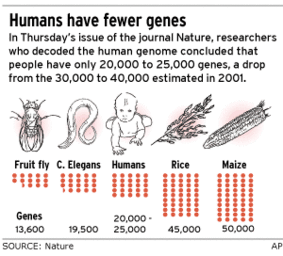

**Figure 11.1** 고차원 데이터의 유전자 수 - 의생명정보학 데이터에서 다루어야 할 방대한 수의 유전자

### 11.1.1 차원의 저주(Curse of Dimensionality)

차원의 저주는 고차원 공간에서 데이터 분석이 직면하는 핵심적인 문제이다. 이 현상을 수학적으로 이해하기 위해 유클리드 거리 공식을 살펴보자:

```
d(p,q) = √[(p₁-q₁)² + (p₂-q₂)² + ... + (pₙ-qₙ)²]
```

차원 수 n이 증가할수록 거리 계산에 포함되는 항의 수가 늘어나며, 이는 데이터 포인트들 간의 거리가 점점 비슷해지는 결과를 낳는다. 고차원 공간에서는 모든 점들이 서로 "멀리" 떨어져 있게 되어, 거리 기반 알고리즘의 분별력이 급격히 저하된다. 이는 최근접 이웃 탐색, 클러스터링, 분류 등 많은 기계학습 알고리즘의 성능에 심각한 영향을 미친다.

### 11.1.2 희소성(Sparsity) 문제

의생명정보학 데이터, 특히 단일세포 RNA 시퀀싱 데이터는 극심한 희소성을 보인다. 전체 측정값의 70~90%가 0이거나 거의 0에 가까운 값을 가지는 것이 일반적이다. 이러한 희소성은 여러 요인에 기인한다:

**기술적 요인**: 개별 세포에서 추출할 수 있는 RNA의 양이 제한적이고, 현재 시퀀싱 기술의 검출 한계로 인해 낮은 발현량을 가진 유전자들이 측정되지 않을 수 있다. 또한 PCR 증폭 과정에서 발생하는 편향이나 시퀀싱 깊이의 한계도 희소성을 증가시킨다.

**생물학적 요인**: 많은 유전자들이 특정 조건이나 시점에서만 발현되며, 전사 과정 자체가 확률적(stochastic) 특성을 가지고 있다. 특히 단일세포 수준에서는 유전자 발현이 버스트(burst) 형태로 일어나기 때문에 측정 시점에 따라 0 또는 높은 값을 보일 수 있다.

### 11.1.3 밀집(Dense)과 희소(Sparse) 데이터의 처리 전략

데이터의 희소성 정도에 따라 적절한 분석 전략을 선택해야 한다. **밀집 데이터**는 대부분의 변수에서 의미 있는 값이 관측되는 경우로, 전통적인 통계 기법과 기계학습 알고리즘이 안정적으로 작동한다. 반면 **희소 데이터**는 관측되지 않은 값(missing value)이나 0값이 많아 모델의 불안정성을 야기할 수 있다.

희소 데이터를 다룰 때는 다음과 같은 특별한 고려사항이 필요하다: 1) 0값이 진정한 0인지 아니면 기술적 한계로 인한 결측값인지 구별해야 하고, 2) 희소성을 고려한 정규화 기법을 적용해야 하며, 3) 희소 행렬에 최적화된 알고리즘을 선택해야 한다. 이러한 문제들을 해결하기 위해 차원 축소는 데이터의 본질적인 구조를 보존하면서도 계산적으로 다루기 쉬운 저차원 표현으로 변환하는 핵심적인 역할을 담당한다.

## 11.2 주성분 분석(Principal Component Analysis, PCA)

주성분 분석은 차원 축소의 가장 기본이 되는 선형 기법으로, 1901년 Karl Pearson에 의해 처음 소개되었다. PCA의 핵심 아이디어는 고차원 데이터의 분산을 최대한 보존하면서 더 적은 수의 변수(주성분)로 데이터를 표현하는 것이다.

단일 세포 데이터 분석의 주 목적 중 하나는 세포별로 그 세포 유형을 구분해내는 것이다. 그런데 동일한 생물학적 경로(pathway)에 속한 유전자들은 함께 발현되는 경향이 있어 서로 높은 상관성을 나타내므로, 유전자 간 상관관계(공분산)을 기반으로 한 차원 축소 기법인 PCA가 특히 유용하다.

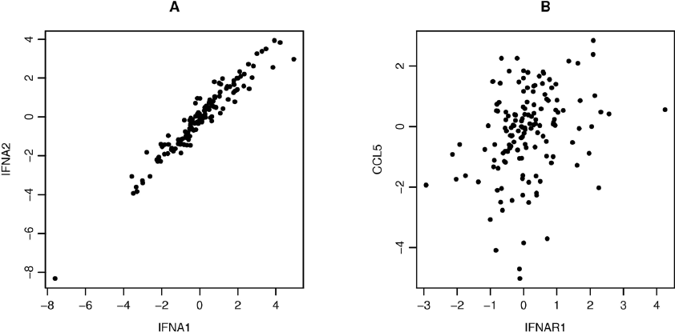

**Figure 11.2** 유전자 간 상관관계 - 동일 생물학적 경로에 속한 유전자들의 높은 상관성

### 11.2.1 PCA의 수학적 원리

PCA의 수학적 과정은 다음과 같은 단계로 구성된다:

**1단계: 데이터 중심화(Centering)**
먼저 각 변수(유전자)의 평균을 0으로 맞춘다. 이는 모든 데이터 포인트에서 해당 변수의 평균값을 빼는 과정이다.

**2단계: 공분산 행렬 계산**
중심화된 데이터로부터 공분산 행렬을 계산한다. 이 행렬은 변수들 간의 선형 관계를 나타낸다.

**3단계: 고유값 분해(Eigenvalue Decomposition)**
공분산 행렬을 고유값과 고유벡터로 분해한다. 고유벡터는 주성분의 방향을 나타내고, 고유값은 해당 방향에서의 분산의 크기를 나타낸다.

공분산 행렬은 에르미트 행렬(Hermitian matrix)이므로 다음과 같은 중요한 성질을 가진다:
- 모든 고유값이 실수이다
- 고유벡터들이 서로 직교한다(orthogonal)
- 고유값의 크기에 따라 고유벡터를 정렬할 수 있으며, 가장 큰 고유값에 해당하는 고유벡터가 데이터의 최대 분산 방향을 나타낸다

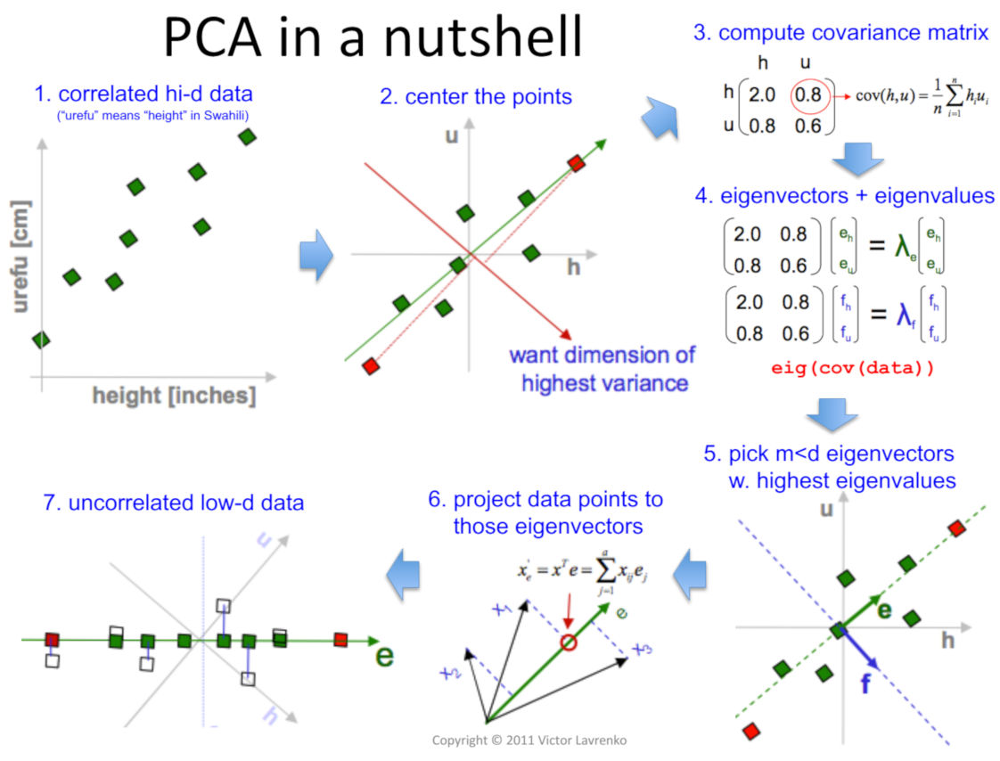

**Figure 11.3** PCA 개요 - 주성분 분석의 기본 원리와 고유벡터 방향

### 11.2.3 최적 주성분 개수 결정

적절한 주성분의 개수를 선택하는 것은 PCA 분석에서 중요한 결정이다. 이를 위해 여러 방법이 사용된다:

**엘보우 플롯(Elbow Plot)**: 주성분의 개수에 따른 설명된 분산의 비율을 그래프로 나타낸 것이다. 그래프에서 기울기가 급격히 완만해지는 지점(엘보우 포인트)을 선택한다.

**누적 분산 기여율**: 일반적으로 전체 분산의 80-95%를 설명하는 주성분까지를 선택한다. 단일 세포 데이터에서는 보통 상위 50-100개의 주성분으로도 충분한 정보를 보존할 수 있다.

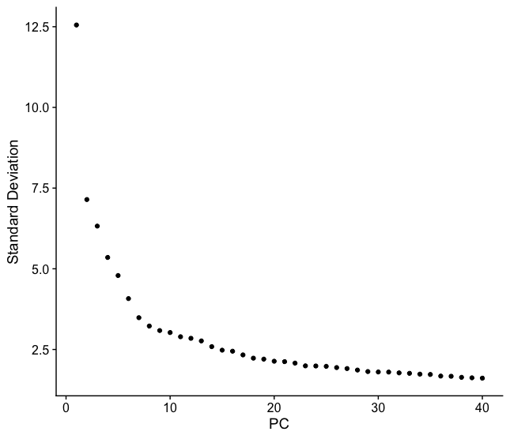

**Figure 11.4** 엘보우 플롯 - 최적 주성분 개수 결정을 위한 설명된 분산비율 그래프

### 11.2.4 의생명정보학에서의 PCA 응용 사례

**암 아형 분류**: 다양한 암 유형의 유전자 발현 데이터에 PCA를 적용하면, 각 암 유형이 주성분 공간에서 서로 다른 클러스터를 형성함을 시각화하여 볼 수 있다. 이는 각 암 유형이 고유한 전사체 시그니처를 가지고 있음을 보여준다.

**세포 유형 식별**: 단일세포 RNA 시퀀싱 데이터에서 PCA를 수행하면 상피세포(epithelial cells), 간질세포(stromal cells), T세포, 골수계 세포(myeloid cells) 등 서로 다른 세포 유형들이 주성분 공간에서 뚜렷이 구별된다. 이를 통해 복잡한 조직 내의 세포 이질성을 이해할 수 있다.

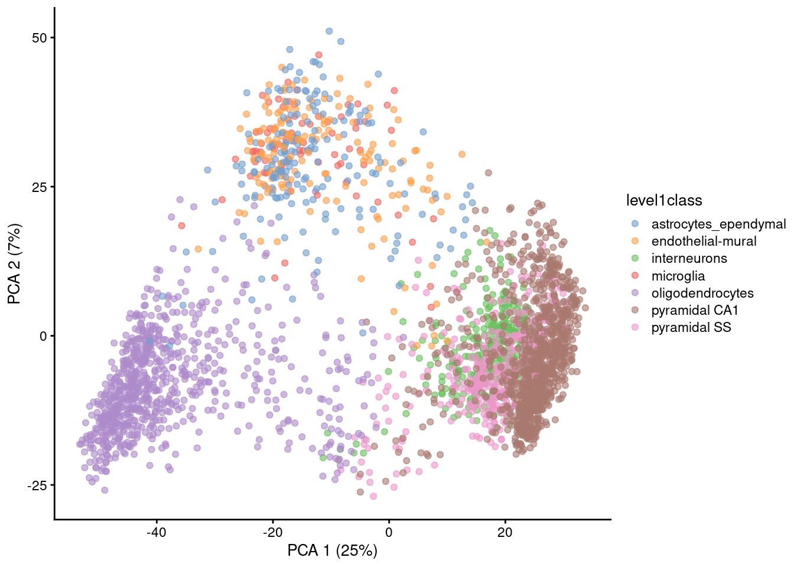

**Figure 11.5** PCA 암 세포 유형 - PCA를 이용한 다양한 암 세포 유형의 분류와 시각화

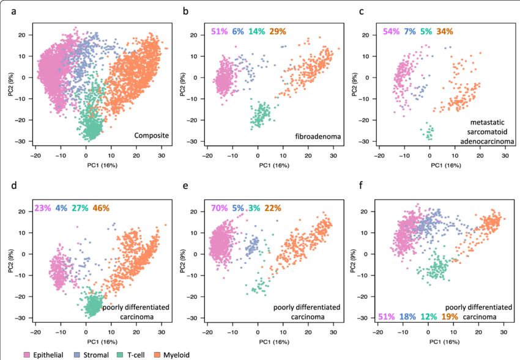

**Figure 11.6** PCA 예시 - 단일세포 데이터에서 PCA를 이용한 세포 유형 식별

## 11.3 비선형 차원 축소

선형 기법으로는 궤적 구조나 매니폴드 같은 복잡한 패턴을 온전히 표현하기 어렵다. 이를 보완하기 위해 비선형 방법이 등장했다.

### 11.3.1 확산 지도(Diffusion Maps)

가우시안 커널 `k(x, y) = exp(-||x-y||^2 / ε)`로 포인트 간 유사성을 계산하고, 그래프 라플라시안 `L^(α) = D^{-α} L D^{-α}`을 이용해 확산 과정을 모델링한다. 확산 좌표는 데이터의 연속적 변화를 잘 표현해 생물학적 궤적 분석에 자주 쓰이며, 여기서 파생된 확산 의사시간(Diffusion Pseudotime)은 세포 분화 순서를 추정하는 데 활용된다.

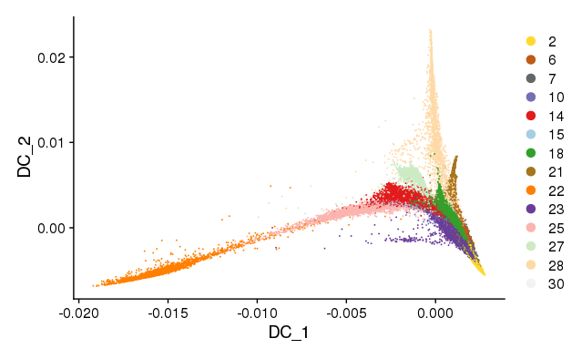

**Figure 11.7** 확산 지도 - 확산 과정을 모델링하여 생물학적 궤적을 표현하는 비선형 차원 축소

### 11.3.2 t-SNE

t-SNE는 고차원에서 가까운 점이 저차원에서도 가깝도록 확률 분포를 맞춘다. 고차원에서는 가우시안, 저차원에서는 자유도가 낮은 t-분포를 사용해 KL 발산(Kullback-Leibler divergence)을 최소화한다.

KL 발산은 두 확률 분포 간의 차이를 측정하는 방법으로, 다음과 같이 정의된다:
```
KL(P||Q) = Σ P(i) log(P(i)/Q(i))
```
여기서 P는 고차원 공간의 확률 분포, Q는 저차원 공간의 확률 분포이다. t-SNE는 이 값을 최소화하여 두 공간에서의 확률 분포를 가능한 한 유사하게 만든다.

t-SNE는 지역 구조 시각화에는 뛰어나지만, 클러스터 간 거리나 크기는 해석이 어렵다.

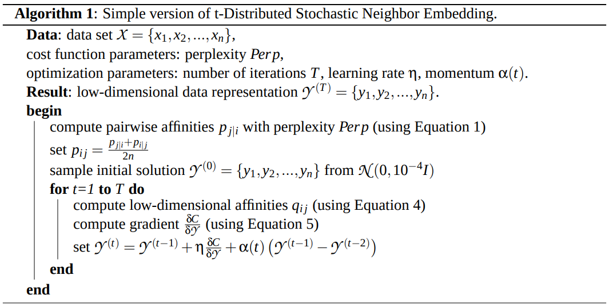

**Figure 11.8** t-SNE 알고리즘 - t-SNE의 고차원과 저차원 확률 분포 매칭 과정

### 11.3.3 UMAP

UMAP은 k-최근접 이웃(KNN)으로 퍼지 연결 그래프를 만든 뒤, 교차 엔트로피를 최소화하는 방식으로 저차원 임베딩을 학습한다.

```
C((A, μ), (A, ν)) = Σ[ μ(a) log(μ(a)/ν(a)) + (1-μ(a)) log((1-μ(a))/(1-ν(a))) ]
```

UMAP은 지역 구조와 전역 구조를 균형 있게 보존하고, 계산 속도와 재현성에서 장점이 있다.

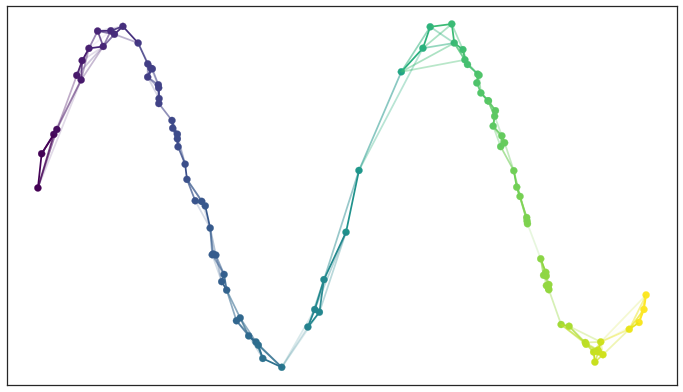

**Figure 11.9** UMAP 퍼지 그래프 - UMAP의 k-최근접 이웃 기반 퍼지 연결 그래프 구성

## 11.4 기법 비교

### 11.4.1 Swiss Roll 예제

3차원 나선형 구조인 Swiss Roll 데이터에 기법을 적용하면 차이가 분명하다. PCA는 나선을 펼치지 못하고, Diffusion Map은 연속적인 나선 구조를 보존한다. t-SNE는 클러스터는 잘 보이지만 전체 모양이 왜곡되고, UMAP은 지역과 전역 구조를 모두 고려해 균형 잡힌 결과를 제공한다.

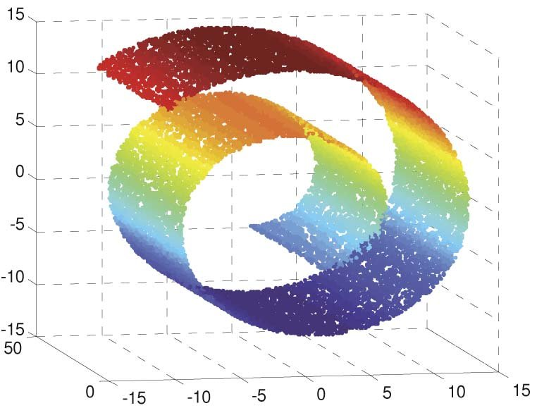

**Figure 11.10** Swiss Roll 데이터 - 3차원 나선형 구조를 가진 벤치마크 데이터셋

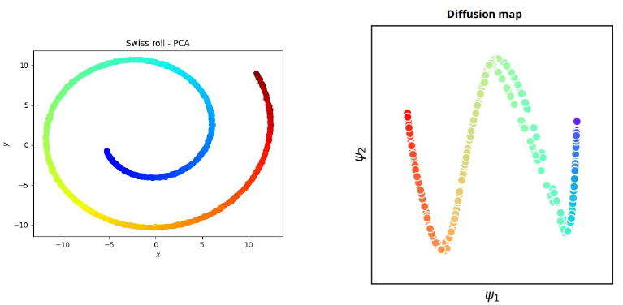

**Figure 11.11** Swiss Roll PCA와 확산 지도 - 선형 및 확산 기반 차원 축소 결과 비교

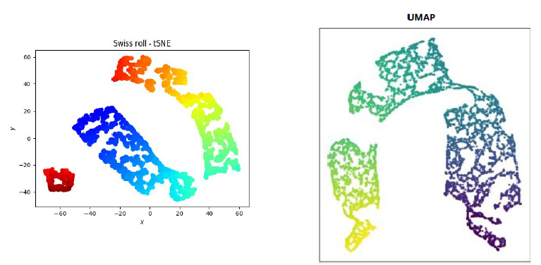

**Figure 11.12** Swiss Roll t-SNE와 UMAP - 비선형 차원 축소 기법들의 성능 비교

### 11.4.2 MNIST 손글씨

숫자 이미지를 차원 축소하면 각 숫자가 얼마나 잘 분리되는지 평가할 수 있다. t-SNE와 UMAP은 서로 다른 숫자를 잘 구분하지만, UMAP이 전역 구조까지 더 잘 유지하는 편이다.

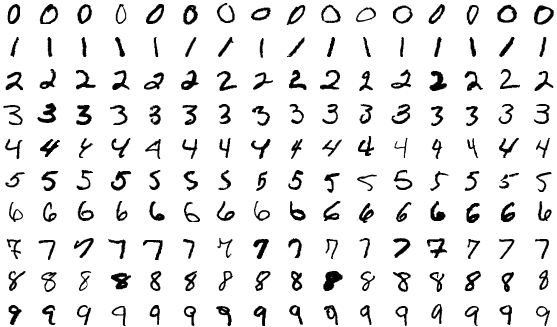

**Figure 11.13** MNIST 데이터 - 손글씨 숫자 이미지 데이터셋의 예시

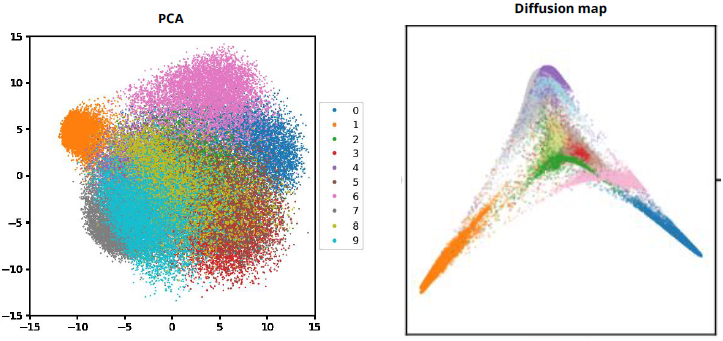

**Figure 11.14** MNIST PCA와 확산 지도 - 선형 및 확산 기반 차원 축소로 숫자 분류

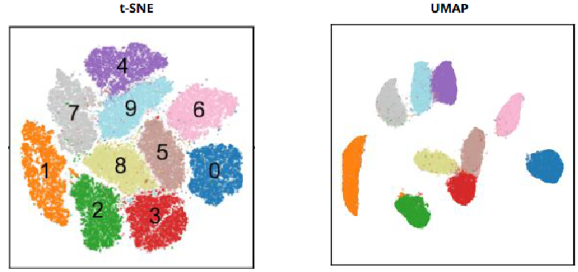

**Figure 11.15** MNIST t-SNE와 UMAP - 비선형 차원 축소로 숫자 클러스터링

## 11.5 클러스터링 기법

차원 축소 후에는 의미 있는 그룹을 찾기 위해 클러스터링을 적용한다.

### 11.5.1 K-means

1. k개의 중심을 초기화한다.
2. 각 점을 가장 가까운 중심에 할당한다.
3. 각 클러스터의 평균으로 중심을 업데이트한다.
4. 변화가 없을 때까지 반복한다.

애니메이션으로 보면 중심이 움직이며 클러스터가 형성되는 과정을 직관적으로 이해할 수 있다.

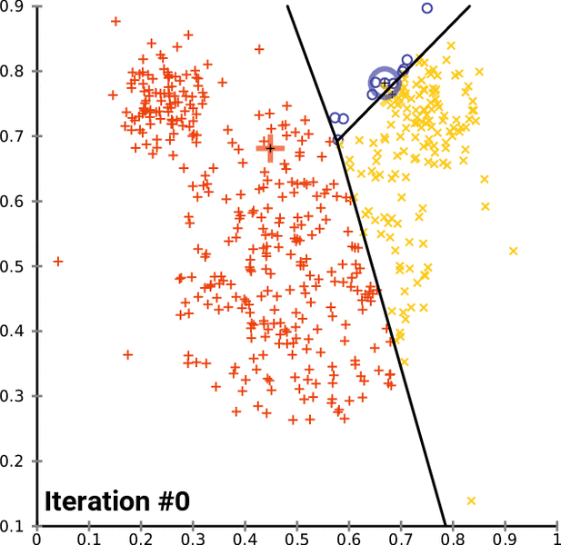

**Figure 11.16** K-means 애니메이션 - K-means 클러스터링 알고리즘의 반복적 최적화 과정

### 11.5.2 네트워크 기반 클러스터링

단일세포 데이터에서는 KNN 그래프를 만든 뒤 커뮤니티 탐지 알고리즘을 적용한다. Louvain은 모듈성을 최대화하는 방법이며, Leiden은 Louvain을 보완해 더 안정적이고 재현성 높은 결과를 제공하여 단일세포 분석에 널리 활용된다.

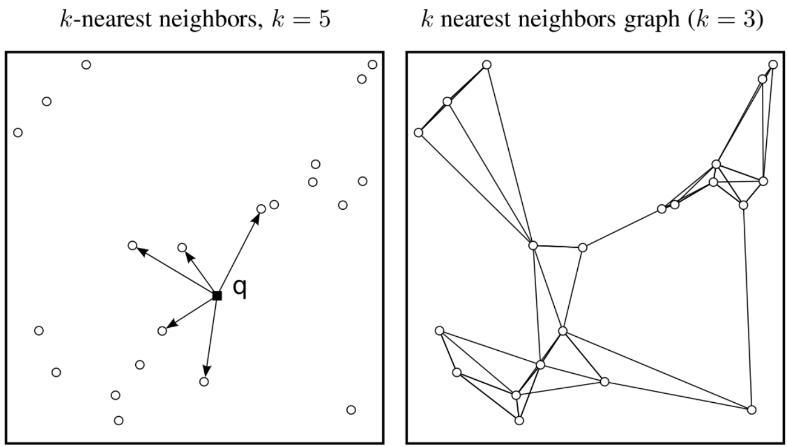

**Figure 11.17** KNN 그래프 - k-최근접 이웃 그래프 구성과 네트워크 기반 클러스터링

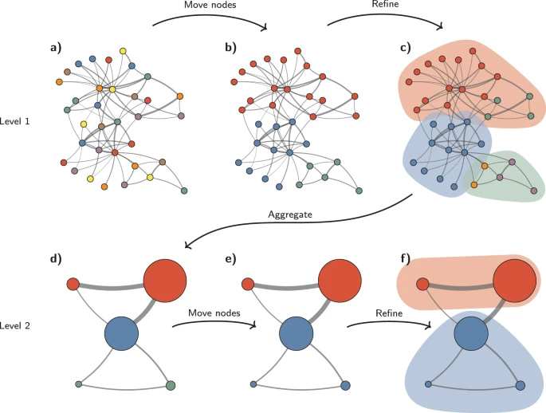

**Figure 11.18** Louvain 커뮤니티 탐지 - Louvain 알고리즘을 이용한 네트워크 커뮤니티 식별

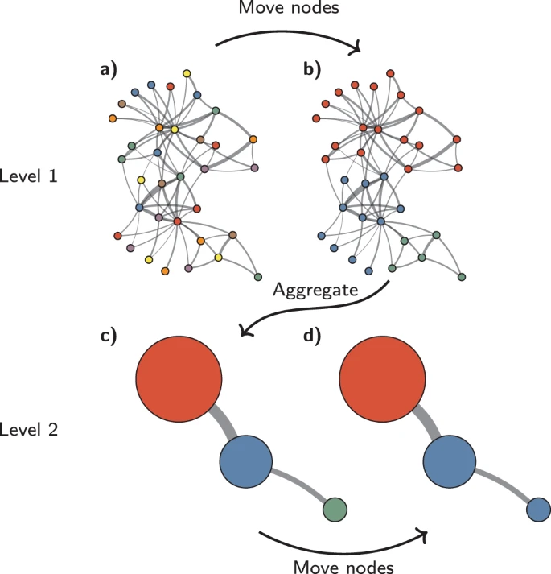

**Figure 11.19** Leiden 커뮤니티 탐지 - Leiden 알고리즘을 이용한 더 안정적인 커뮤니티 발견

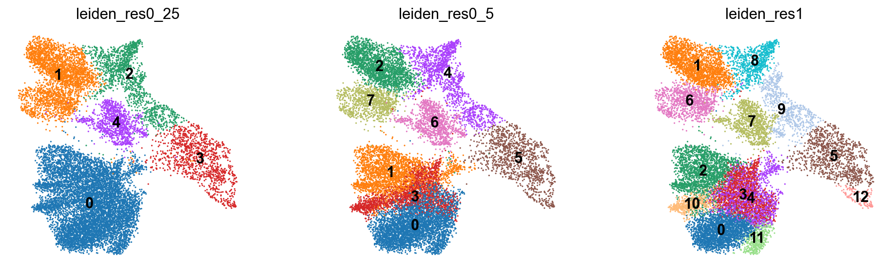

**Figure 11.20** Leiden 다양한 해상도 - 해상도 매개변수에 따른 Leiden 클러스터링 결과 변화

## 11.6 주요 도구

- **Monocle3**: 단일세포 궤적과 pseudotime 분석을 위한 R 패키지. (https://cole-trapnell-lab.github.io/monocle3/)
- **Destiny**: 확산 지도 분석을 지원하는 R 패키지. (https://academic.oup.com/bioinformatics/article/32/8/1241/1744143)

## 11.7 해석 시 주의점

### 11.7.1 t-SNE

- 클러스터 간 거리는 의미가 없을 수 있다.
- 클러스터 크기는 실제 비율을 반영하지 않는다.
- Perplexity 등 하이퍼파라미터에 민감하다.

특히 Perplexity 파라미터를 잘 조절하는 것이 중요하다. Distill의 "How to Use t-SNE Effectively"(https://distill.pub/2016/misread-tsne/)를 참고할 만하다.

### 11.7.2 UMAP 매개변수

n_neighbors, min_dist 같은 매개변수에 따라 결과가 달라질 수 있다. 데이터 특성과 분석 목표에 맞게 값을 조정하고, 여러 설정을 비교해 보는 것이 좋다. 원 논문은 https://arxiv.org/pdf/1802.03426.pdf 에서 확인할 수 있다.

### 11.7.3 2차원 시각화의 한계와 왜곡의 필연성

고차원 데이터를 2차원으로 축소하는 과정에서는 정보 손실과 왜곡이 필연적으로 발생한다. 이는 수학적으로 고차원 공간의 복잡한 구조를 저차원 공간에 완벽하게 보존하는 것이 불가능하기 때문이다. 특히 수천 개의 유전자 발현 데이터를 x, y 좌표만으로 표현할 때 고차원에서 멀리 떨어진 두 점이 2차원에서는 가깝게 보이거나, 반대로 가까운 점들이 멀어져 보일 수 있다.

따라서 **t-SNE나 UMAP의 2차원 시각화 결과만으로는 정량적 분석을 수행해서는 안 된다.** 이러한 시각화는 데이터의 전반적인 패턴을 탐색하고 가설을 세우는 용도로만 사용되어야 하며, 실제 분석과 결론 도출은 원본 고차원 데이터나 적절한 차원(예: PCA 상위 50개 성분)에서 수행되어야 한다. 시각화는 "보여주기 위한" 도구이지 "분석하기 위한" 도구가 아님을 명심해야 한다.

## 11.8 결론

차원 축소는 현대 의생명정보학에서 고차원 생물학 데이터를 이해하고 해석하는 데 없어서는 안 될 핵심 도구로, PCA와 같은 선형 기법은 계산이 빠르고 해석이 용이하며 유전자 발현 데이터의 공분산 구조를 효과적으로 활용하는 반면, t-SNE, UMAP, 확산 지도와 같은 비선형 기법은 복잡한 매니폴드 구조를 발견하고 국소적 패턴을 보존하는 데 뛰어나다. 특히 단일세포 RNA 시퀀싱 데이터 분석에서는 세포 유형을 정의하는 소수의 중요 유전자들과 동일 경로 유전자들 간의 높은 상관성을 고려할 때 적절한 차원 축소가 생물학적 신호를 노이즈로부터 분리하는 데 필수적이며, 실제 분석에서는 PCA로 초기 노이즈 제거와 계산 효율성을 확보한 후 t-SNE나 UMAP으로 세밀한 구조를 탐색하는 통합적 접근이 권장된다.

적절한 기법과 매개변수를 신중히 선택하고 결과를 생물학적 맥락에서 올바르게 해석할 때 차원 축소는 정밀의학과 개인맞춤 치료를 향한 깊이 있는 통찰을 제공하여 복잡한 생명 현상을 이해하고 질병 메커니즘을 밝히는 데 중요한 기여를 할 것으로 기대된다.