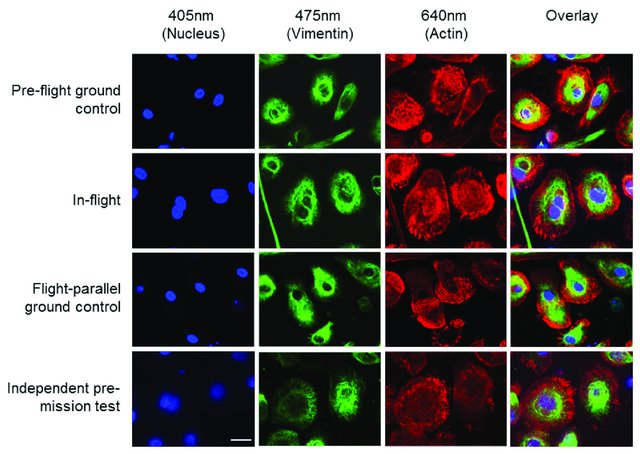
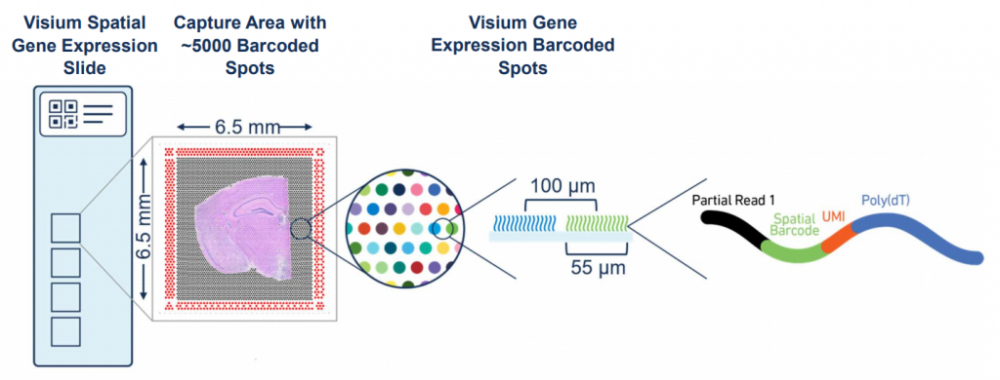
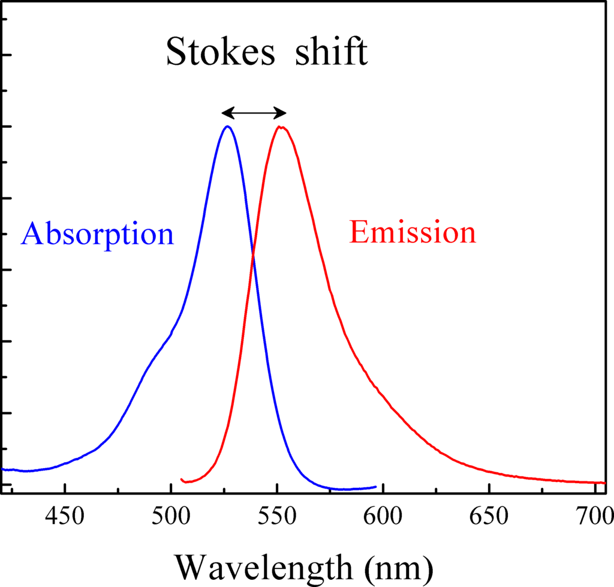
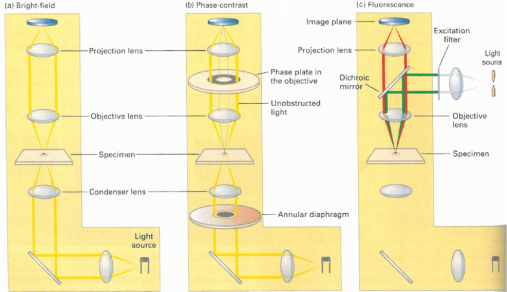
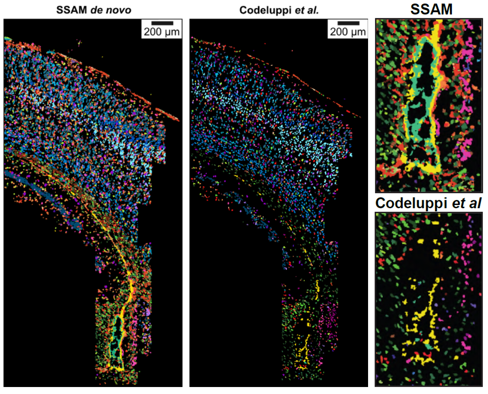

# 제12장 조직 병리학과 공간체학

## 12.1 공간 전사체학과 조직 병리학의 통합

최근 10년간 공간체학(spatial omics) 기술의 급속한 발전은 전통적인 조직 병리학의 패러다임을 근본적으로 변화시키고 있다. 기존의 형태학적 관찰에 국한되었던 병리학적 진단이 이제는 조직 내 각 세포의 위치별 분자적 특성을 정밀하게 분석할 수 있게 되었다. 공간 전사체학, 공간 단백체학, 공간 대사체학 등의 기술들이 통합되면서 조직의 3차원적 분자 지도 작성이 가능해졌고, 이는 질병 메커니즘 이해와 정밀 진단에 새로운 가능성을 열어주고 있다. 본 장에서는 이러한 기술 혁신이 조직 병리학에 미치는 영향과 최신 공간 분석 기술들을 다룬다.

### 12.1.1 조직학적 염색법의 원리

전통적인 조직병리학에서는 조직의 형태학적 특성을 관찰하기 위해 다양한 염색 기법을 사용한다. 가장 기본적인 헤마톡실린-에오신(Hematoxylin & Eosin, H&E) 염색에서 헤마톡실린은 양전하를 띠어 음전하를 가진 핵산(DNA, RNA)에 결합하여 세포핵을 파란색-보라색으로 염색한다. 반면 에오신은 음전하를 띠어 양전하를 가진 세포질 단백질에 결합하여 분홍색-빨간색으로 염색한다.

세포질의 염색 양상은 세포의 기능 상태를 반영한다. 거친 소포체(rough endoplasmic reticulum)가 발달한 세포는 많은 양의 리보솜 RNA 때문에 호염기성(basophilic)을 보이며, 단백질 합성이 활발한 세포는 호산성(eosinophilic) 염색 양상을 보인다. 분화가 덜 된 세포나 소기관이 적은 세포는 무색소성(amphophilic) 또는 양친성을 나타낸다.

**Figure 12.1** H&E 염색 - 헤마톡실린-에오신 염색의 기본 원리와 세포 구조 시각화

**Figure 12.2** 전형적인 H&E 염색 - 조직 내 다양한 세포 유형의 H&E 염색 양상

### 12.1.2 형광 이미징과 다중 표지

1장에서 살펴본 이미징 방법들 중 형광 현미경법은 특정 분자를 표적으로 하는 정밀한 분석을 가능하게 한다.

**Figure 12.3** 형광 이미징 - 다중 형광 표지를 이용한 조직 내 다양한 분자 시각화

DAPI(4',6-diamidino-2-phenylindole)는 DNA의 AT-rich 부위에 결합하여 자외선을 받으면 파란색 형광을 방출한다. 이를 통해 세포핵의 위치와 형태를 정확히 파악할 수 있으며, 세포 분열 단계나 세포 사멸 여부도 판단할 수 있다.

**Figure 12.4** DAPI 염색 - DNA 결합 형광 염료를 이용한 세포핵 시각화

**Figure 12.5** 형광 이미지에서의 DAPI - 파란색 DAPI 신호로 표시된 세포핵의 분포

다중 형광 표지(multiplexed fluorescence labeling)를 통해 여러 단백질이나 RNA를 동시에 시각화할 수 있다. 각기 다른 자극/방출 파장을 가진 형광 염료들을 조합하면, 한 조직 절편에서 다양한 세포 유형이나 분자적 상태를 구별할 수 있다. 공초점 현미경이나 초해상도 현미경을 사용하면 세포내 소기관 수준까지 정밀한 위치 정보를 얻을 수 있다.

### 12.1.3 공간 전사체학의 임상적 의의

공간 전사체학(spatial transcriptomics)은 조직 내에서 각 세포의 위치 정보를 보존하면서 전사체 분석을 수행하는 기술이다. 이 기술을 통해 종양의 이질성, 종양-기질 상호작용, 면역 미세환경의 공간적 분포 등을 정밀하게 분석할 수 있다.

예를 들어, 종양 조직에서는 종양 중심부, 침윤 경계, 주변 기질 등 위치에 따라 서로 다른 유전자 발현 패턴을 보인다. 이러한 공간적 이질성은 종양의 진행, 전이, 치료 반응성과 밀접한 관련이 있다. 또한 면역세포의 공간적 분포와 활성화 상태를 분석하면 면역치료의 효과를 예측하거나 저항성 메커니즘을 이해할 수 있다.

형태학적 변화와 분자적 변화를 통합적으로 분석하면 기존의 조직병리학적 진단을 한 단계 발전시킬 수 있다. 예를 들어, 형태학적으로는 유사해 보이는 종양이라도 분자적 프로파일이 다르면 예후나 치료 반응성이 달라질 수 있다. 이러한 정밀 진단은 개인맞춤 치료의 기초가 된다.

**Figure 12.6** 공간 전사체학 종합 이미지 - 다양한 공간 전사체학 기술들의 통합적 개념도

## 12.2 공간전사체학 기술의 발전과 응용

### 12.2.1 공간전사체학의 기본 원리

**공간 바코딩 시스템**: 공간전사체학의 핵심은 조직의 각 위치를 고유하게 식별할 수 있는 공간 바코드(spatial barcode) 시스템이다. 초기 방법에서는 유리 슬라이드 위에 poly-T 올리고뉴클레오타이드 프로브를 격자 형태로 배열하고, 각 위치마다 고유한 바코드 서열을 부착했다. 조직 절편을 이 슬라이드 위에 올리면 mRNA가 해당 위치의 프로브에 포획되고, 이후 시퀀싱을 통해 각 위치에서의 유전자 발현을 측정할 수 있다.

이 과정에서 각 프로브에는 공간 바코드와 함께 UMI(Unique Molecular Identifier)도 포함되어 있어, 개별 mRNA 분자를 정확히 계수할 수 있다. 이를 통해 조직의 형태학적 구조와 분자적 정보를 동시에 얻을 수 있어, 기존의 조직학적 분석과 분자생물학적 분석을 통합할 수 있다.

### 12.2.2 Visium 기술과 발전 방향

**Visium 플랫폼의 특성**: 10x Genomics에서 개발한 Visium은 현재 가장 널리 사용되는 상업적 공간전사체학 플랫폼이다. Visium은 6.5mm × 6.5mm 영역에 약 5,000개의 스팟을 배열하며, 각 스팟의 직경은 55μm이다. 이는 일반적인 세포 크기(10-20μm)보다 크므로, 하나의 스팟에는 여러 개의 세포가 포함될 수 있다.

**Figure 12.7** Visium 기술 - 10x Genomics Visium 플랫폼의 공간 바코딩 시스템

이러한 해상도 제한은 스팟 디콘볼루션(spot deconvolution)이라는 추가적인 분석 과정을 필요로 한다. 스팟 디콘볼루션은 각 스팟에 포함된 서로 다른 세포 유형의 비율을 추정하는 과정으로, 단일세포 참조 데이터와 computational 방법을 결합하여 수행된다.

**Figure 12.8** Visium 디콘볼루션 필요성 - 스훟 크기와 세포 크기 차이로 인한 디콘볼루션의 필요성

**고해상도 기술 발전**: Visium HD는 기존 Visium의 해상도를 크게 개선한 차세대 기술로, 더 작은 스팟 크기를 통해 단일세포에 가까운 해상도를 제공한다. 이를 통해 세포 경계를 더 정확히 구분할 수 있고, 세포 간 상호작용을 더 정밀하게 분석할 수 있다.

**Figure 12.9** Visium HD - 고해상도 공간 전사체학을 위한 차세대 Visium 기술

**Figure 12.10** Visium과 Visium HD 비교 - 기존 Visium과 고해상도 Visium HD 기술의 성능 차이

STOmics(Stereo-seq) 기술은 DNA 나노볼(DNB) 패턴 칩을 이용하여 서브 마이크로미터 해상도까지 달성할 수 있는 기술이다. 이는 세포보다 작은 픽셀 단위로 유전자 발현을 측정할 수 있어, 세포 내부의 공간적 구조까지 분석할 수 있는 가능성을 제시한다.

**Figure 12.11** STOmics Stereo-seq - 서브 마이크로미터 해상도를 제공하는 STOmics 공간 전사체학 기술

### 12.2.3 형광 기반 공간 분석 기술

**형광의 물리적 원리**: 형광 현상은 분자가 특정 파장의 빛을 흡수하여 전자가 들뜬 상태로 이동한 후, 바닥 상태로 돌아가면서 더 긴 파장의 빛(형광)을 방출하는 현상이다. 흡수 파장과 방출 파장 간의 차이를 스토크스 이동(Stokes shift)이라고 하며, 이 원리를 이용하여 서로 다른 분자들을 구별할 수 있다.

**Figure 12.12** 형광 원리 - 분자가 빛을 흡수하고 형광을 방출하는 물리적 과정

**Figure 12.13** 스토크스 이동 - 흡수 파장과 방출 파장의 차이를 보여주는 스토크스 이동 현상

**단일분자 형광 제자리 혼성화(smFISH)**: smFISH는 특정 mRNA 서열에 상보적인 단일가닥 DNA 올리고뉴클레오타이드 프로브를 형광 염료로 표지하여 조직 내에서 개별 mRNA 분자를 시각화하는 기술이다. 일반적으로 하나의 mRNA에 대해 20-50개의 짧은 프로브를 설계하여 신호를 증폭시킨다.

**Figure 12.14** FISH 개요 - 형광 제자리 혼성화 기술의 전체적인 실험 과정

**Figure 12.15** FISH 이미징 - 형광 제자리 혼성화를 이용한 세포 내 RNA 지역화 시각화

**Figure 12.16** 회절 한계 - 공간 이미징에서 발생하는 광학적 회절 한계와 해상도 제약

**Figure 12.17** 이미징 기술들 - 다양한 공간 이미징 및 바이오이미징 기술의 비교

실험 과정에서는 조직을 포름알데하이드나 메탄올로 고정한 후, 특이적 프로브를 이용한 혼성화 반응을 수행한다. 핵은 DAPI로 염색하여 세포의 위치를 확인할 수 있다. 이 기술의 장점은 단일 분자 해상도를 제공하며, 정량적 분석이 가능하다는 것이다.

또한 정확한 RNA의 위치 파악을 위해 신호 증폭 기술이 개발되었으며, 그 대표적인 예시 중 하나는 RNAscope를 들 수 있다. RNAscope은 분지형 DNA 증폭 시스템을 사용하여 단일 mRNA 분자도 검출할 수 있을 정도로 민감도를 높였다.

**Figure 12.18** RNAscope - 분지형 DNA 증폭을 이용한 고감도 RNA 검출 기술

**고도 다중화 형광 기술**: MERFISH(Multiplexed Error-Robust Fluorescence In Situ Hybridization)와 SeqFISH는 여러 라운드의 이미징과 바코딩을 결합하여 한 번의 실험에서 수백에서 수천 개의 유전자를 동시에 분석할 수 있다.

**Figure 12.19** MERFISH 증폭 - MERFISH 기술에서 사용되는 신호 증폭 시스템

**Figure 12.20** MERFISH 조합 바코딩 - 다중 유전자 분석을 위한 조합적 바코딩 시스템

**Figure 12.21** SeqFISH - 순차적 형광 제자리 혼성화를 통한 다중 유전자 분석 기술

**Figure 12.22** MERSCOPE - MERFISH 기술을 상업화한 Vizgen의 MERSCOPE 플랫폼

### 12.2.4 제자리 시퀀싱 기술

**ISS와 FISSEQ의 원리**: 제자리 시퀀싱(In Situ Sequencing, ISS)은 조직에서 RNA를 추출하지 않고 그 자리에서 직접 시퀀싱하는 기술이다. FISSEQ(Fluorescent In Situ Sequencing)는 이 분야의 선구적 기술로, 복잡한 프라이머 설계와 증폭 과정을 통해 다양한 RNA 서열을 *in situ* 에서 읽어낼 수 있다.

**Xenium 플랫폼**: 10x Genomics의 Xenium은 ISS와 FISSEQ 기술을 기반으로 한 상업적 플랫폼으로, 수백 개의 유전자를 세포 해상도로 동시에 분석할 수 있다. 이 플랫폼은 사용자 친화적인 워크플로우와 자동화된 분석 파이프라인을 제공하여, 연구자들이 복잡한 기술적 세부사항에 얽매이지 않고 생물학적 질문에 집중할 수 있게 해준다.

**Figure 12.23** Xenium 제자리 시퀀싱 - 10x Genomics Xenium 플랫폼의 제자리 시퀀싱 과정

실험 과정에서는 조직 절편에 특수하게 설계된 프라이머를 이용하여 역전사 반응을 수행하고, 여러 라운드의 시퀀싱 반응을 통해 각 mRNA 분자의 서열을 결정한다. 이때 각 시퀀싱 라운드에서는 서로 다른 형광 염료를 사용하여 뉴클레오타이드를 구별하며, 고해상도 현미경을 통해 신호를 검출한다.

**Figure 12.24** 제자리 시퀀싱 - 조직에서 RNA를 추출하지 않고 직접 시퀀싱하는 기술 개념도

**Figure 12.25** FISSEQ - 형광 제자리 시퀀싱 기술의 선구적 방법

### 12.2.5 공간전사체학 데이터 분석의 특수성

**공간 정보의 활용**: 공간전사체학 데이터 분석에서는 기존의 단일세포 분석에 공간 정보가 추가된다. 이를 통해 세포 간 물리적 거리, 조직 구조와의 관계, 국소적 미세환경의 영향 등을 분석할 수 있다. 공간적 자기상관(spatial autocorrelation) 분석을 통해 특정 유전자가 공간적으로 클러스터링되는 패턴을 확인할 수 있으며, 이는 세포 간 신호전달이나 조직 기능과 관련된 중요한 정보를 제공한다.

**세포 간 상호작용 추론**: 공간 정보를 활용하여 인접한 세포들 간의 리간드-수용체 상호작용을 추론할 수 있다. 이를 통해 특정 신호전달 경로가 조직의 어느 영역에서 활성화되는지 등을 매핑할 수 있다.

### 12.2.6 단일세포 수준에서의 공간 전사체학

**세포 분할**: 공간 전사체학을 단일세포 수준에서 분석하기 위해서는 먼저 조직 이미지에서 개별 세포를 정확히 구분하고 분할하는 과정, 즉 세포 분할(cell segmentation)이 필요하다.

**Figure 12.26** 세포 분할 - 공간 이미징 데이터에서 개별 세포를 분할하고 식별하는 전산 방법

**세포 유형 식별**: 세포 분할이 성공적으로 수행되면, 각 개별 세포에 대한 유전자 발현 프로파일을 얻을 수 있게 된다. 이때는 기존의 단일세포 RNA-seq 분석과 동일한 방법론을 적용하여 세포 유형을 식별할 수 있다. 구체적으로는 차원 축소 기법(PCA, t-SNE, UMAP), 클러스터링 알고리즘(Leiden, Louvain), 그리고 마커 유전자 기반 주석화 등의 표준적인 단일세포 분석 파이프라인을 그대로 사용할 수 있다.

이 접근법의 가장 큰 장점은 세포 유형 정보와 함께 정확한 공간적 위치 정보를 동시에 얻을 수 있다는 것이다. 즉, "어떤 세포 유형이 조직의 어느 위치에 분포하는가"라는 질문에 대해 단일세포 해상도로 답할 수 있게 된다. 이를 통해 세포 간 공간적 상호작용, 조직 구조와 세포 유형의 관계, 질병 진행에 따른 세포 분포 변화 등을 정밀하게 분석할 수 있다.

**Figure 12.27** 공간 세포 유형 식별 - 공간 전사체학 데이터를 이용한 조직 내 세포 유형 매핑

그러나 세포 분할은 기술적으로 쉽지 않은 편이다. 주요 도전 과제들은 다음과 같다. 첫째, 조직 내에서 세포들이 매우 밀집하게 배치되어 있어 경계를 명확히 구분하기 어렵다. 둘째, 세포마다 크기와 모양이 다른데, 특히 비정형적 모양의 세포들은 전통적인 알고리즘으로 처리하기 극히 어렵다. 셋째, DAPI나 세포질 마커 등의 염색 품질이 균일하지 않아 일부 세포가 과소 또는 과대 분할될 위험이 있다. 따라서 최근에는 세포 분할 과정을 생략하고도 단일세포 수준의 공간 전사체 분석을 수행할 수 있는 segmentation-free 방법들이 개발되고 있다. 이러한 방법들은 유전자 발현 패턴의 공간적 변화를 직접 분석한다.

대표적인 예로 SSAM 같은 방법이 있다. 이 방법은 공간적 좌표와 유전자 발현 정보를 동시에 고려하여 비슷한 전사체 프로파일을 가진 영역을 클러스터링하고, 이를 통해 세포 유형을 추론한다. 이러한 접근법은 세포 경계를 명시적으로 정의하지 않고도 세포 수준의 생물학적 정보를 추출할 수 있어, 공간 전사체학의 또 다른 가능성을 열어주고 있다.

**Figure 12.28** SSAM - 공간 전사체학 데이터의 통계 분석과 하위 세포 매핑 방법론

## 12.3 통합 분석과 다중 모달 접근법

### 12.3.1 단일세포와 공간전사체학 데이터의 통합

**참조 기반 스팟 디콘볼루션**: 단일세포 RNA-seq 데이터를 참조로 활용하여 공간전사체학의 각 스팟에 포함된 세포 유형 구성을 추정하는 방법이다. 이는 공간전사체학의 상대적으로 낮은 해상도를 보완하여 세포 수준의 공간 정보를 얻을 수 있게 해준다.

**가상 공간 재구성**: 단일세포 데이터의 세포들을 실제 조직 구조에 매핑하여 가상의 공간 전사체 지도를 생성하는 방법도 개발되고 있다. 이는 공간전사체학 실험을 수행하기 어려운 상황에서 공간 정보를 추론하는 데 활용된다.

### 12.3.2 다중 오믹스 통합

**동시 측정 기술**: 최근에는 공간상에서 전사체와 후성유전체(epigenome), 단백질체(proteome) 정보를 동시에 측정하는 기술들이 개발되고 있다. Spatial CITE-seq은 항체를 이용하여 단백질 발현과 RNA 발현을 공간상에서 동시에 측정하며, ATAC-seq과 결합한 방법들은 전사체와 염색질 접근성을 함께 분석할 수 있다.

**계산적 통합 방법**: 이러한 공간 다중 오믹스 기술들은 측정될 수 있는 유전자 수, 정확도 등의 한계가 있다. 따라서 단일세포 실험을 통해 얻은 다중 오믹스 데이터를 공간 오믹스 데이터와 통합하는 계산적 방법들도 활발히 개발되고 있다.

## 12.4 기술의 한계와 도전 과제

### 12.4.1 기술적 한계

**감도와 특이성의 균형**: 현재의 공간전사체학 기술들은 모두 감도와 특이성 사이의 트레이드오프를 가지고 있다. 높은 공간 해상도를 얻으려면 측정할 수 있는 유전자 수가 제한되고, 많은 유전자를 측정하려면 공간 해상도가 떨어진다. 이러한 기술적 제약은 실험 설계 시 연구 목적에 따른 신중한 선택을 요구한다.

**조직 처리로 인한 아티팩트**: 조직의 고정, 동결, 절편 과정에서 RNA 품질이 저하되거나 공간 구조가 변형될 수 있다. 특히 RNA의 분해는 측정 결과에 직접적인 영향을 미치므로, 샘플 준비 과정의 표준화가 중요하다.

### 12.4.2 분석상의 도전 과제

**배치 효과와 표준화**: 서로 다른 플랫폼, 실험실, 또는 실험 조건에서 생성된 데이터를 통합할 때 배치 효과가 심각한 문제가 될 수 있다. 특히 공간전사체학에서는 조직의 고정 방법, 절편 두께, 보관 조건 등이 모두 배치 효과의 원인이 될 수 있어, 이를 보정하는 방법론의 개발이 중요하다.

**통계적 검정력**: 공간전사체학 데이터는 일반적으로 측정되는 유전자 수가 전체 전사체에 비해 제한적이므로, 통계적 검정력이 상대적으로 낮을 수 있다. 이는 특히 희귀한 세포 유형이나 미묘한 발현 변화를 탐지하는 데 제약이 될 수 있다.

## 12.5 임상 응용과 미래 전망

### 12.5.1 질병 연구에서의 응용

**암 연구**: 공간전사체학은 종양 미세환경의 복잡한 구조를 이해하는 중요한 도구이다. 암세포와 면역세포, 혈관내피세포, 섬유아세포 등 다양한 세포 유형들 간의 공간적 관계와 상호작용을 직접 관찰할 수 있어, 암의 진행, 전이, 치료 저항성 메커니즘을 이해하는 데 중요한 기여를 하고 있다.

**신경과학 연구**: 뇌 조직의 복잡한 구조와 신경세포 네트워크를 이해하기 위해 공간전사체학이 적극 활용되고 있다. 특히 알츠하이머병, 파킨슨병 등 신경퇴행성 질환에서 질병 진행에 따른 공간적 변화 패턴을 추적하는 연구가 활발히 진행되고 있다.

### 12.5.2 정밀의학으로의 발전

**환자 맞춤 치료**: 개별 환자의 조직에서 세포 구성과 공간적 배치를 분석하여 최적의 치료법을 선택하는 정밀의학 접근법이 현실화되고 있다. 특히 면역치료의 효과를 예측하기 위해 종양 내 면역세포의 분포와 활성화 상태를 분석하는 연구가 주목받고 있다.

**치료 반응 모니터링**: 치료 전후의 조직을 비교 분석하여 치료 효과를 모니터링하고, 치료 저항성이 발생하는 부위와 메커니즘을 식별하는 데 공간전사체학이 활용되고 있다.

### 12.5.3 기술 발전 방향

**해상도와 처리량의 개선**: 향후 기술 발전은 더 높은 공간 해상도와 더 많은 유전자를 동시에 측정할 수 있는 처리량 개선에 초점을 맞출 것으로 예상된다. 단일세포 수준의 공간 해상도에서 전체 전사체를 측정하는 것이 궁극적인 목표이다.

**실시간 분석**: 현재는 고정된 조직에서만 분석이 가능하지만, 향후에는 살아있는 조직에서 실시간으로 유전자 발현 변화를 추적할 수 있는 기술 개발이 기대된다.

**다중 분자 측정**: 전사체뿐만 아니라 단백질, 대사물질, 후성유전체 정보를 동시에 공간적으로 측정할 수 있는 통합적 다중 오믹스 기술의 개발이 진행되고 있다.

## 12.6 결론

공간 전사체학과 단백체학은 조직 내 분자적 정보와 공간적 정보를 통합하여 생물학적 현상을 이해하는 새로운 접근법을 제공한다. 이러한 기술들의 통합과 발전을 통해 질병의 메커니즘 규명, 치료법 개발, 그리고 정밀의학 구현에서 중요한 돌파구를 제공할 것으로 기대된다.

특히 암 연구, 신경과학, 발생생물학 등 다양한 분야에서 조직의 공간적 구조와 기능적 특성을 동시에 분석할 수 있게 됨으로써, 생명 현상에 대한 더욱 깊이 있는 이해가 가능해질 것이다. 앞으로의 기술 발전을 통해 더 높은 해상도, 더 많은 분자 종류의 동시 측정, 그리고 실시간 분석이 가능해질 것으로 전망된다.
