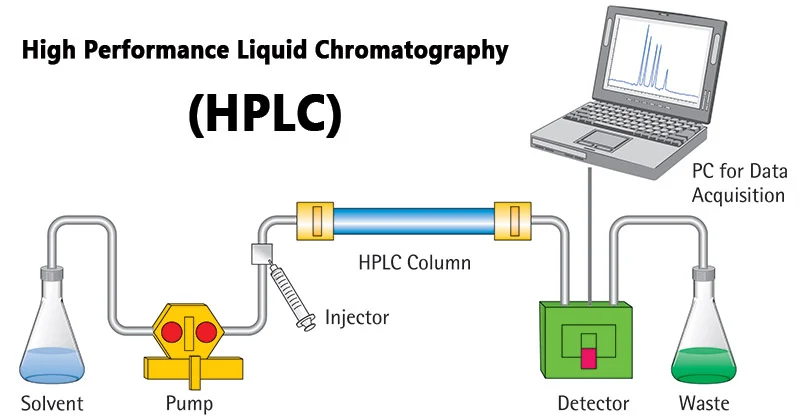

# 제13장 단백체학

## 13.1 단백체학 개요

단백체학(proteomics)은 생물체나 세포에서 발현되는 모든 단백질의 집합인 단백체(proteome)를 연구하는 분야이다. 유전체학이 생명체의 유전적 청사진을 다룬다면, 단백체학은 실제로 세포에서 기능하는 분자들을 직접적으로 연구한다. 단백질은 유전자의 최종 산물로서 세포의 구조를 형성하고, 효소 반응을 촉매하며, 신호전달을 담당하는 등 생명 현상의 핵심적인 역할을 수행한다.

**Figure 13.1** 마이크로어레이와 질량분석법 - 전통적인 마이크로어레이와 현대적인 질량분석법 기술의 비교

단백체는 유전체와 달리 시간과 조건에 따라 동적으로 변화한다. 같은 유전체를 가진 세포라도 발달 단계, 환경 조건, 질병 상태에 따라 서로 다른 단백질 프로파일을 보인다. 이러한 특성 때문에 단백체학은 질병 진단, 치료 표적 발굴, 바이오마커 개발 등에서 중요한 역할을 한다. 또한 약물의 작용 메커니즘을 이해하고 부작용을 예측하는 데도 필수적인 정보를 제공한다.

최근에는 단일세포 수준에서 단백질을 분석하는 기술과 공간적 위치 정보를 보존하면서 단백질 분포를 관찰하는 기술들이 급속히 발전하고 있다. 이러한 기술적 진보는 조직 내 세포 간 상호작용, 질병의 진행 과정, 치료에 대한 반응 등을 이해하는 새로운 관점을 제공하고 있다.

## 13.2 단백체학 기법

### 13.2.1 질량분석법 기반 단백체학

매트릭스 보조 레이저 탈착/이온화 비행시간 질량분석법(Matrix-Assisted Laser Desorption/Ionization Time-of-Flight Mass Spectrometry, MALDI-TOF MS)은 생체분자의 질량을 측정하는 분석 기술이다. 이 방법에서는 분석하고자 하는 시료를 특별한 매트릭스 물질과 혼합하여 공결정화시킨 후, 레이저 펄스를 조사하여 이온화시킨다.

매트릭스는 레이저 에너지를 흡수하여 시료 분자를 부드럽게 이온화시키는 역할을 한다. 이 과정에서 단백질이나 펩타이드와 같은 큰 생체분자도 분해되지 않고 그대로 이온화될 수 있다. 이온화된 분자들은 전기장에 의해 가속되어 비행관을 통과하며, 질량이 다른 이온들은 서로 다른 속도로 검출기에 도달한다. 비행시간을 측정함으로써 각 이온의 질량 대 전하비(m/z)를 정확하게 계산할 수 있다.

**Figure 13.2** MALDI 원리 - 매트릭스 보조 레이저 탈착/이온화 과정의 기본 원리

**Figure 13.3** TOF 질량분석기 - 비행시간 측정을 통한 질량 분석 원리

**Figure 13.4** MALDI-TOF 시스템 - MALDI와 TOF를 결합한 질량분석 시스템의 전체 구성

**Figure 13.5** 다나카 고이치 - 생체고분자의 질량분석법 개발로 2002년 노벨 화학상을 수상한 다나카 고이치

액체 크로마토그래피-질량분석법(Liquid Chromatography-Mass Spectrometry, LC-MS)은 복잡한 생체 시료에서 화합물을 분리하고 동정하는 분석 도구이다. 먼저 액체 크로마토그래피에서 시료 성분들이 화학적 성질에 따라 시간차를 두고 분리되고, 이어서 질량분석기에서 각 성분의 정확한 질량과 구조 정보를 얻는다.

**Figure 13.6** HPLC 시스템 - 고성능 액체 크로마토그래피를 이용한 단백질 분리 시스템

**Figure 13.7** 질량분석기 - 생체분자 분석을 위한 질량분석기의 기본 구성

**Figure 13.8** 질량분석법 과정 - 시료의 이온화부터 검출까지 전체적인 질량분석 과정

정량적 단백체학에서는 서로 다른 조건에서 단백질 발현량의 변화를 측정한다. 여기에는 라벨링 기반 방법과 라벨프리 방법이 주로 사용된다. 라벨링 방법은 동위원소 표지를 통해 정확한 정량이 가능하지만 비용이 높고 실험 설계가 복잡하다. 라벨프리 방법은 상대적으로 간단하지만 실험 간 변이를 보정하는 것이 중요하다.

### 13.2.2 항체 기반 단백체학

항체 기반 단백체학은 특정 단백질에 대한 항체의 특이적 결합을 이용하여 단백질을 검출하고 정량하는 방법들을 포함한다. 면역조직화학(immunohistochemistry)은 조직 절편에서 특정 단백질의 위치와 발현 정도를 시각화하는 기본적인 방법이다.

웨스턴 블롯(Western blot)은 전기영동으로 분리된 단백질을 막으로 전사한 후 특정 항체로 검출하는 방법으로, 단백질의 크기와 발현량을 정확히 분석할 수 있다. 단백질 어레이(protein array)는 다수의 항체나 단백질을 고밀도로 배열하여 단백질 간 상호작용이나 다중 단백질 발현을 동시에 분석할 수 있는 고처리량 기술이다.

## 13.3 공간 단백체학

### 13.3.1 질량분석 기반 공간 이미징

질량분석 이미징(Mass Spectrometry Imaging, MSI)은 조직 절편의 공간적 분자 분포를 시각화하는 기술이다. 조직 절편의 각 픽셀에서 질량 스펙트럼을 획득하여 특정 분자들의 공간적 분포 지도를 생성한다. 이를 통해 종양 조직에서 항암제의 분포나 대사물질의 변화를 직접 관찰할 수 있으며, 약물의 조직 침투성이나 효과를 평가할 수 있다.

**Figure 13.9** MALDI 이미징 - 조직 절편에서 분자의 공간적 분포를 시각화하는 MALDI 이미징 기술

이미징 질량 세포분석법(Imaging Mass Cytometry, IMC)은 조직 절편에서 금속 태그가 결합된 항체를 이용하여 다중 단백질 분석을 수행하는 기술이다. 이 방법은 레이저 절제를 통해 조직의 특정 영역을 제거하면서 동시에 질량분석을 수행하여 1마이크로미터 해상도로 40개 이상의 단백질 마커를 동시에 검출할 수 있다.

**Figure 13.10** 질량 세포분석법 - CyTOF를 이용한 단일세포 수준 다중 단백질 분석 원리

### 13.3.2 형광 기반 공간 이미징

형광 기반 공간 단백체학 방법으로는 CODEX(CO-Detection by indexing)가 대표적이다. CODEX는 동일한 조직 절편에서 형광 항체를 순차적으로 염색하고 탈색하는 과정을 반복하여 수십 개의 단백질을 분석하는 기술이다. 각 염색 라운드에서 3-4개의 형광 채널을 사용하여 다수의 마커를 순차적으로 검출하며, 최종적으로 모든 데이터를 통합하여 다중 단백질 발현 지도를 생성한다.

**Figure 13.11** CODEX 결과 - CODEX 기술을 이용한 다중 단백질 공간 이미징 결과

다중 면역조직화학(Multiplex IHC) 기술들도 발전하여 한 번의 염색으로 여러 단백질을 동시에 관찰할 수 있게 되었다. 이러한 기술들은 면역학, 종양학, 신경과학 등 다양한 분야에서 조직의 분자적 구조를 이해하는 데 활용되고 있으며, 공간 전사체학(spatial transcriptomics) 기술과의 통합을 통해 더욱 포괄적인 분자 지도를 제공하고 있다.

## 13.4 단일세포 단백체학

### 13.4.1 질량 세포분석법 (CyTOF)

질량 세포분석법(Cytometry by Time-of-Flight, CyTOF)은 전통적인 플로우 사이토메트리의 한계를 극복한 단일세포 분석 기술이다. 이 기술의 핵심은 형광 염료 대신 희토류 금속 동위원소를 항체에 결합시켜 세포 표면이나 세포내 단백질을 표지하는 것이다. 희토류 금속들은 자연 상태에서 생체 내에 거의 존재하지 않으므로 배경 신호가 극히 낮고, 각각의 질량이 뚜렷이 구별되어 스펙트럼 겹침 현상이 거의 없다.

측정 과정에서 금속 표지된 세포들은 고온의 아르곤 플라즈마를 통과하면서 완전히 이온화된다. 이때 금속 태그들도 이온화되어 질량분석기로 전달되며, 비행시간 측정을 통해 각 금속의 질량을 정확히 구별한다. 이러한 원리를 통해 현재 40개 이상의 매개변수를 동시에 측정할 수 있어, 세포의 복잡한 분자적 특성을 매우 정밀하게 분석할 수 있다.

CyTOF는 단일세포 수준에서 표현형과 기능을 동시에 평가할 수 있는 대표적인 기술이다. 세포 표면 마커를 통한 세포 유형 분류와 동시에 세포내 신호 전달 단백질, 전사 인자, 세포 주기 마커 등을 측정하여 각 세포의 기능 상태를 정밀하게 파악할 수 있다. 이는 특히 면역계의 복잡한 상호작용이나 종양 미세환경의 이질성을 이해하는 데 매우 유용하다.

### 13.4.2 다중 오믹스 단일세포 분석

CITE-seq(Cellular Indexing of Transcriptomes and Epitopes by sequencing)는 단일세포에서 RNA와 단백질을 동시에 측정하는 혁신적인 기술이다. 이 방법은 DNA 바코드가 결합된 항체를 사용하여 단백질을 표지하고, 10X Genomics와 같은 단일세포 RNA 시퀀싱 플랫폼에서 전사체와 단백질 정보를 함께 획득한다. 이를 통해 같은 세포에서 유전자 발현과 단백질 발현의 관계를 직접적으로 분석할 수 있으며, 전사 후 조절 메커니즘을 이해하는 데 중요한 정보를 제공한다.

REAP-seq(RNA Expression and Protein sequencing)와 같은 유사한 기술들도 개발되어 단일세포에서 다중 오믹스 정보를 획득할 수 있게 되었다. 이러한 전사체-단백체 통합 분석을 통해 유전자 발현과 단백질 발현 간의 불일치를 관찰하고, 번역 후 조절이나 단백질 안정성 등에 대한 정보를 얻을 수 있다.

## 13.5 단백체학 데이터 분석 및 해석

### 13.5.1 질량분석 데이터 처리

단백체학에서 생성되는 질량분석 데이터는 고차원적이고 복잡한 특성을 가진다. 각 단백질은 고유한 질량을 가지며, 번역 후 수정(post-translational modification)에 따라 다양한 형태로 존재할 수 있다. 또한 단백질의 농도 범위가 매우 넓어서 고농도 단백질에 의해 저농도 단백질의 신호가 가려지는 동적 범위(dynamic range) 문제가 존재한다.

데이터 전처리 과정에서는 배경 신호 제거, 노이즈 감소, 피크 검출, 질량 보정 등의 단계가 필요하다. 특히 서로 다른 실험 조건이나 시점에서 얻은 데이터를 비교할 때는 정규화(normalization)와 배치 효과 보정이 중요하다.

### 13.5.2 단일세포 단백체학 데이터 분석

단일세포 단백체학 데이터 분석 과정은 10장과 11장에서 설명한 단일세포 전사체 데이터의 차원 축소, 클러스터링 등과 기본적으로 동일하다. 그러나 단백질 마커의 수가 전사체에 비해 매우 적기 때문에(일반적으로 40-100개), 데이터의 특성에 맞는 정규화 방법이 필요하다.

특히 단일세포 수준의 단백체학 데이터에서는 CLR(Centered Log-Ratio) 정규화와 같은 변형된 형태의 로그 변환을 사용한다. CLR 정규화는 각 세포에서 모든 마커의 기하평균을 구한 후, 각 마커의 값을 이 기하평균으로 나누고 로그 변환하는 방법이다. 이는 낮은 정량화 효율로 인한 기술적 변동을 효과적으로 제거할 수 있다.

정규화된 데이터는 차원 축소 기법(t-SNE, UMAP)과 클러스터링 알고리즘을 통해 세포 유형을 분류하고 발달 궤적을 추적할 수 있다. 이를 통해 세포 분화 과정에서 단백질 발현의 동적 변화나 질병 진행 과정에서 세포 상태 전환을 관찰할 수 있다.

### 13.5.3 정량적 분석 및 통계

통계적 분석에서는 단백질 발현의 차이를 검정하기 위해 t-test, ANOVA, 또는 더 정교한 선형 모델을 사용한다. 다중 검정 보정을 통해 위양성을 제어하고, 효과 크기(effect size)를 고려하여 생물학적으로 의미 있는 변화를 식별한다.

단일세포 데이터의 경우 세포 간 이질성과 기술적 변이를 고려한 특별한 통계적 방법이 필요하다. 계층적 모델링이나 베이지안 접근법이 이러한 복잡성을 다루는 데 유용하다.

### 13.5.4 기능적 주석 및 경로 분석

식별된 단백질들의 생물학적 의미를 해석하기 위해 기능적 주석(functional annotation)과 경로 분석(pathway analysis)을 수행한다. 이는 5장에서 설명한 것과 같이 Gene Ontology(GO) 분석을 통해 분자 기능, 생물학적 과정, 세포 구성 요소 관점에서 단백질들을 분류하고, KEGG, Reactome, WikiPathways, Ingenuity Pathway Analysis (IPA) 등의 데이터베이스를 활용하여 관련된 생물학적 경로를 식별한다.

## 13.6 임상 단백체학의 응용

### 13.6.1 질병 진단을 위한 단백체학 활용

단백체학 기술들이 실제 병원에서 어떻게 활용되고 있는지 살펴보자. MALDI-TOF, LC-MS, CyTOF, IHC 등의 기술들이 질병 진단과 치료에 중요한 역할을 하고 있다.

혈액 검사를 통한 바이오마커 발굴에서는 질량분석법이 핵심적으로 사용된다. 예를 들어, 전립선암 진단에 사용되는 PSA(전립선 특이 항원) 검사나 난소암 진단의 CA125 검사는 모두 특정 단백질의 양을 정확히 측정하는 기술에 기반한다. 이러한 검사에서 생성되는 데이터는 연속형 수치 데이터로, 정상 범위와 비교하여 질병 여부를 판단한다.

면역조직화학(IHC)은 암 진단에서 필수적인 검사이다. 유방암에서 에스트로겐 수용체(ER), 프로게스테론 수용체(PR), HER2 단백질을 확인하는 것이 대표적인 예시이다. 이 검사 결과는 0점부터 3점까지의 점수로 표현되며, 환자의 치료 방향을 결정하는 중요한 정보가 된다.

단일세포 단백체학 기술도 임상에서 점차 활용되고 있다. CyTOF를 이용하여 환자의 면역세포를 자세히 분석하거나, CITE-seq를 통해 암 조직의 세포 구성을 파악하는 연구가 진행되고 있다.

### 13.6.2 공간 단백체학의 임상 적용

공간 단백체학 기술들이 임상에서 어떻게 활용되는지 알아보자. 특히 이미징 질량 세포분석법(IMC)과 CODEX와 같은 기술들이 암 진단과 치료에 새로운 가능성을 제시하고 있다.

암 조직을 분석할 때 단순히 암세포만 보는 것이 아니라, 주변 면역세포들과 혈관, 섬유조직 등이 어떻게 배치되어 있는지 파악하는 것이 중요하다. IMC 기술을 사용하면 조직에서 40개 이상의 단백질을 동시에 확인하면서 각각의 위치까지 정확히 알 수 있다. 이를 통해 암세포 주변에 면역세포가 얼마나 많이 있는지, 면역세포들이 활성화되어 있는지 확인할 수 있다.

CODEX 기술도 마찬가지로 여러 단백질을 순차적으로 염색하여 조직의 복잡한 구조를 파악한다. 이러한 정보는 환자가 면역항암제 치료에 잘 반응할지 예측하는 데 도움이 된다.

공간 단백체학 데이터는 일반적인 단백질 데이터와 달리 위치 정보가 추가로 포함되어 있어 분석이 더 복잡하다. 단백질 발현량뿐만 아니라 세포들 간의 거리와 배치 패턴을 함께 고려해야 한다.

### 13.6.3 단백체학 데이터 분석의 도전과 해결방안

단백체학 데이터를 임상에 적용할 때 여러 어려움이 있다. 특히 질병을 진단하거나 예측하는 데 유용한 단백질(바이오마커)을 찾는 일은 쉽지 않다.

가장 큰 문제는 측정할 수 있는 단백질의 종류는 매우 많은데(수천 개), 실제 환자 수는 상대적으로 적다는 점이다. 예를 들어, LC-MS를 이용해 3000개의 단백질을 측정했지만 환자는 100명뿐이라면, 우연히 관련이 있어 보이는 단백질을 잘못 선택할 위험이 크다.

이 문제를 해결하기 위해서는 통계적 방법들이 중요하다. 정말 중요한 단백질만 선별하거나, 데이터의 차원을 줄이는 방법을 사용해야 한다. 또한 여러 단백질을 동시에 검사할 때는 우연의 일치로 인한 잘못된 결론을 피하기 위해 통계적 보정이 필요하다.

### 13.6.4 통합적 단백체학 접근법의 미래

단백질 정보만으로는 질병의 전체적인 모습을 이해하기 어렵다. 따라서 유전자, RNA, 단백질, 대사물질 등 여러 종류의 생체 정보를 함께 분석하는 다중 오믹스 접근법이 중요해지고 있다.

예를 들어, 환자의 유전자 변이 정보(GWAS 결과)와 함께 단백질 발현 정보를 분석하면 더 정확한 질병 예측이 가능하다. 또한 단일세포 RNA 데이터와 CITE-seq 데이터를 함께 분석하면 같은 세포에서 유전자 발현과 단백질 발현의 관계를 이해할 수 있다.

서로 다른 종류의 데이터를 함께 분석할 때는 각 데이터의 특성이 다르기 때문에 주의해야 한다. 유전자 데이터는 수만 개의 변수가 있지만 단백질 데이터는 수천 개일 수 있다. 이런 차이를 고려하여 기능적 주석과 경로 분석 방법을 활용한다.

단백질 상호작용 네트워크 정보를 활용하면 더 정확한 분석이 가능하다. 최근에는 인공지능과 기계학습 방법을 이용하여 복잡한 다중 오믹스 데이터의 패턴을 찾는 연구가 활발하게 진행되고 있다.

## 13.7 결론

단백체학은 생명현상의 실제 실행자인 단백질을 연구하는 분야로서, 질량분석법, 항체 기반 기술, 공간 단백체학, 단일세포 단백체학 등 다양한 기술을 통해 질병의 이해와 치료에 기여하고 있다. 이러한 기술들에서 생성되는 복잡한 데이터는 적절한 정보학적 분석을 통해 의미 있는 생물학적 지식으로 변환되며, 임상에서는 질병 진단과 치료법 선택에 실질적으로 활용되고 있다. 미래의 단백체학은 다중 오믹스 통합 분석과 인공지능 기술의 발전을 통해 개인맞춤 의학 구현에 중요한 역할을 할 것으로 기대된다.