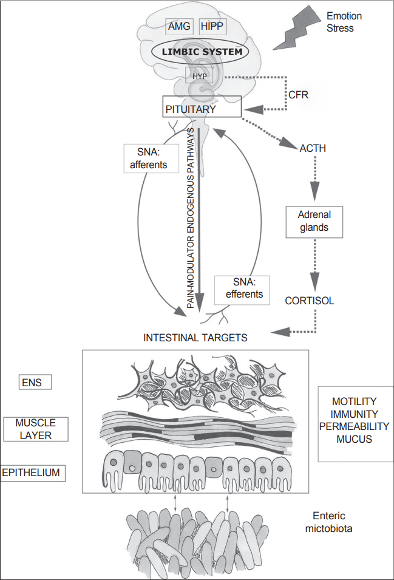

# 제14장 고급 유전체학 기법들

유전체학 분야는 개별 생물체의 유전체 해독과 분석에서 시작되어 현재는 복합 미생물 군집 분석, 작물의 유전적 개량, 그리고 유전체의 정밀 편집에 이르기까지 광범위한 영역으로 발전하였다. 본 장에서는 이러한 발전 과정을 반영하여 군유전체학(metagenomics), 식물 유전체학, 그리고 CRISPR/Cas9 유전체 편집 기술이라는 세 가지 분야를 다룬다.

군유전체학은 환경 및 임상 샘플에서 미생물 군집 전체의 유전 정보를 분석하여 배양이 어려운 미생물을 포함한 생태계를 이해하는 기법이다. 식물 유전체학에서는 배수성(polyploidy)이 식물의 진화와 농업적 개량에 미치는 영향을 살펴보며, 특히 밀, 딸기, 감자 등 주요 작물이 어떻게 배수화를 통해 수확량과 품질이 향상되었는지를 다룬다. 마지막으로 유전체 편집 기술은 단순히 유전체를 읽고 분석하는 차원을 넘어서 유전체를 정밀하게 수정할 수 있는 혁신적 도구로, CRISPR/Cas9 시스템을 중심으로 그 원리와 응용을 다룬다.

이러한 기술들은 인간 마이크로바이옴 연구, 작물 개량, 그리고 유전 질환 치료에서 실제 응용되고 있으며, 현대 생명과학과 의학 발전의 핵심 도구로 자리잡고 있다.

## 14.1 군유전체학(Metagenomics)

### 14.1.1 군유전체학의 정의와 의의

전통적인 미생물학 연구는 단일 균주를 순수 배양하여 분석하는 방법에 의존해왔다. 그러나 자연 환경에 존재하는 미생물의 99% 이상이 현재까지 실험실 조건에서 배양되지 않는다는 사실이 밝혀지면서, 배양에 의존하지 않는 새로운 접근법이 필요하게 되었다.

군유전체학(Metagenomics)은 환경이나 임상 샘플에서 추출한 모든 미생물의 유전 물질을 배양 과정 없이 직접 분석하는 학문 분야이다. 이 접근법은 샘플 내에 존재하는 전체 미생물 군집의 집합적 유전체를 의미하는 메타유전체(metagenome)를 대상으로 한다. 군유전체학을 통해 배양 불가능한 미생물을 포함한 전체 미생물 생태계의 구조와 기능을 파악할 수 있으며, 개별 미생물이 아닌 군집 수준에서의 대사 경로와 생태학적 상호작용을 이해할 수 있다.

**Figure 14.1** 군유전체학 - 환경 샘플에서 미생물 군집 전체의 유전 정보를 분석하는 군유전체학 개념도

이 분야의 발전은 차세대 시퀀싱(NGS) 기술의 급속한 발전과 생물정보학 분석 도구의 개발에 크게 의존한다. 고처리량 시퀀싱을 통해 대용량의 메타유전체 데이터를 생산할 수 있게 되었으며, 복잡한 미생물 군집 데이터를 분석할 수 있는 알고리즘과 소프트웨어가 지속적으로 개발되고 있다. 또한 미생물 유전자와 기능에 대한 포괄적인 참조 데이터베이스의 확장과 대용량 데이터 처리를 위한 컴퓨팅 인프라의 발달도 군유전체학 연구의 활성화에 기여하고 있다.

### 14.1.2 군유전체학 연구 접근법

군유전체학 연구는 크게 두 가지 주요 접근법으로 구분된다. 첫 번째는 16S rRNA 유전자에 기반한 분석 방법이고, 두 번째는 전체 메타유전체를 대상으로 하는 샷건 메타유전체학이다.

#### 16S rRNA 유전자 기반 분석

16S rRNA 유전자 기반 분석은 분류학적 마커를 이용하여 미생물 군집의 구성을 파악하는 방법이다. 이 접근법은 비교적 비용이 적게 들고 분석이 간단하여 대규모 코호트 연구에 적합하다. 16S rRNA 유전자는 모든 세균과 고세균에 존재하면서도 종 특이적 차이를 보이는 영역을 포함하고 있어 미생물 군집 분석의 표준 마커로 사용된다.

이 방법을 통해 미생물 군집의 분류학적 구성, 다양성 지수, 그리고 군집 간 유사성을 비교할 수 있다. 그러나 기능적 정보는 제한적이며, 유전자 복사본 수의 차이로 인한 정량적 편향이 존재할 수 있다는 한계가 있다.

#### 샷건 메타유전체학

샷건 메타유전체학은 샘플 내 모든 미생물의 전체 DNA를 무작위로 시퀀싱하는 방법이다. 이 접근법은 분류학적 정보뿐만 아니라 기능적 유전자의 존재와 풍부도를 동시에 파악할 수 있어 미생물 군집의 대사적 잠재력을 이해하는 데 유용하다.

샷건 메타유전체학을 통해 항생제 저항성 유전자, 독성 인자, 대사 경로 등을 직접 분석할 수 있으며, 메타유전체 조립 유전체(Metagenome-Assembled Genomes, MAGs)를 구성하여 배양되지 않은 미생물의 유전체 정보를 얻을 수도 있다. 과거에는 높은 비용이 단점이었으나, 최근 시퀀싱 비용의 급격한 감소로 이 방법의 활용이 크게 증가하고 있다.

### 14.1.3 16S rRNA 유전자 분석

16S ribosomal RNA 유전자는 16S rRNA 유전자 기반 분석 방법의 핵심 도구로, 미생물 군집의 분류학적 구성을 파악하는 데 가장 널리 사용되는 마커이다. 이 유전자는 세균과 고세균의 작은 리보솜 소단위체(30S)에 위치하며, 단백질 합성에서 중요한 기능을 담당한다.

**Figure 14.2** 리보솜 구조 - 16S rRNA가 위치한 리보솜의 3차원 구조와 단백질 합성 과정

16S rRNA 유전자가 미생물 분류의 표준 마커로 사용되는 이유는 몇 가지 독특한 특성 때문이다. 먼저 이 유전자는 모든 세균과 고세균에 보편적으로 존재하면서도, 리보솜 기능의 중요성으로 인해 진화 과정에서 비교적 보존되어 있다. 동시에 약 1,500 염기쌍의 적절한 길이를 가지고 있어 PCR 증폭과 시퀀싱 분석에 적합하다.

특히 중요한 것은 16S rRNA 유전자 내에 보존 영역과 가변 영역이 교대로 나타나는 구조이다. 9개의 가변 영역(V1-V9)은 종 특이적 차이를 보이면서도, 그 사이의 보존 영역은 프라이머 설계의 기준점을 제공한다. 현재 대부분의 연구에서는 V3-V4 또는 V4 영역을 표적으로 하는 시퀀싱이 주로 사용되며, 이를 통해 속 수준에서 종 수준까지의 분류학적 구분이 가능하다.

분석 과정에서는 먼저 환경 샘플에서 추출한 DNA를 대상으로 16S rRNA 유전자 특이적 프라이머를 이용한 PCR 증폭을 수행한다. 증폭된 산물은 차세대 시퀀싱을 통해 분석되며, 얻어진 서열 데이터는 참조 데이터베이스와 비교하여 분류군을 할당한다.

**RNA World 가설**

DNA와 단백질이 등장하기 이전의 원시 생명체는 RNA만으로 자기복제와 대사를 수행했을 것으로 추정된다. 리보솜 RNA는 현재도 펩타이드 결합 형성에 직접 관여하는 리보자임(ribozyme) 활성을 가지고 있어 이 가설을 뒷받침한다. 특히 16S rRNA는 진화적으로 고도로 보존된 영역과 가변 영역을 모두 포함하고 있어, 이러한 진화적 역사를 간직한 분자로서 계통분류학적 연구에 핵심적인 역할을 한다.

**Figure 14.3** RNA World 가설 - DNA와 단백질 이전의 원시 생명체에서 RNA의 중심적 역할

### 14.1.4 미생물 다양성 지표

미생물 군집의 다양성은 생태학적 관점에서 세 가지 계층적 수준으로 평가된다. 이러한 다양성 개념은 1960년대 생태학자 Robert Whittaker에 의해 제안된 것으로, 현재 군유전체학 연구에서 미생물 군집의 특성을 이해하는 핵심 도구로 활용된다.

#### 알파 다양성 (α-diversity)

알파 다양성은 단일 샘플 또는 특정 서식지 내에서 관찰되는 미생물의 다양성을 의미한다. 이는 해당 환경에 서식하는 미생물 종의 수와 그들의 상대적 풍부도를 종합적으로 반영하는 지표이다. 알파 다양성이 높다는 것은 그 환경에 많은 종류의 미생물이 비교적 균등하게 분포하고 있음을 의미하며, 일반적으로 생태계의 안정성과 건강성을 나타내는 지표로 해석된다.

#### 베타 다양성 (β-diversity)

베타 다양성은 서로 다른 샘플이나 서식지 간의 미생물 군집 구성의 차이를 나타내는 지표이다. 이는 공간적 또는 시간적으로 분리된 환경들 사이에서 미생물 군집이 얼마나 다른지를 정량화한다. 베타 다양성이 높다는 것은 비교하는 샘플들 간에 미생물 군집 구성이 크게 다르다는 것을 의미하며, 환경 변화나 지리적 거리에 따른 미생물 군집의 분화 정도를 이해하는 데 중요하다.

#### 감마 다양성 (γ-diversity)

감마 다양성은 연구 대상 전체 지역이나 생태계에서 관찰되는 총 다양성을 의미한다. 이는 개별 서식지의 알파 다양성과 서식지 간 베타 다양성을 통합한 개념으로, 전체 연구 영역에서 발견되는 모든 미생물 종의 총합을 나타낸다. 감마 다양성은 대규모 생태계나 지리적 영역에서의 미생물 다양성 패턴을 이해하고, 보전 전략을 수립하는 데 중요한 정보를 제공한다.

### 14.1.5 군유전체학의 응용 사례

군유전체학은 다양한 환경과 임상 분야에서 활용되고 있다. 대표적인 예로 인간 마이크로바이옴 연구에서는 장내 미생물 군집 분석을 통해 소화기 질환과의 연관성을 밝히고 있으며, 구강 미생물 분석으로는 치주염과 심혈관 질환의 관계를 발견하였다. 특히 폐에서는 과거 무균 장기로 여겨졌던 것과 달리 Prevotella, Streptococcus 등의 미생물이 발견되어 호흡기 질환 연구에 새로운 관점을 제시하고 있다.

**Figure 14.4** 폐 마이크로바이옴 - 과거 무균 장기로 여겨졌던 폐에서 발견된 미생물 군집

#### 장-뇌 축 (Gut-Brain Axis)

장-뇌 축은 장내 미생물군집과 중추신경계 간의 복잡한 양방향 소통 네트워크를 의미한다. 이 축은 신경계, 내분비계, 면역계를 통해 작동하며, 장내 미생물이 뇌 기능과 행동에 직접적인 영향을 미칠 수 있음을 보여준다. 장내 미생물은 세로토닌, 도파민, GABA 등의 신경전달물질을 생산하여 기분과 인지 기능을 조절한다. 특히 장내 세로토닌의 90% 이상이 장크롬친화세포에서 생산되며, 이는 미생물 대사산물의 영향을 받는다.

미생물이 생산하는 단쇄지방산, 특히 부티레이트는 혈뇌장벽을 통과하여 미세아교세포의 활성을 조절하고 신경염증을 억제한다. 또한 미주신경을 통한 직접적인 신호전달과 시상하부-뇌하수체-부신피질 축(HPA axis)의 조절을 통해 스트레스 반응과 감정 상태에 영향을 미친다. 이러한 메커니즘을 통해 장내 미생물 불균형은 우울증, 불안장애, 자폐스펙트럼장애, 심지어 알츠하이머병과 파킨슨병 등의 신경퇴행성 질환과도 연관성이 보고되고 있다.

**Figure 14.5** 장-뇌 축 - 장내 미생물과 중추신경계 간의 양방향 소통 네트워크

**Figure 14.6** 장-뇌 축 상세 - 미생물 대사산물이 뇌 기능에 미치는 영향의 분자적 메커니즘

환경 분야에서는 해양의 극한 환경에서 새로운 항생물질 생산 미생물을 발견하거나, 토양 미생물 분석을 통해 탄소 순환과 기후 변화의 관계를 이해하고 있다. 또한 식품 발효 과정의 미생물 군집 변화를 추적하여 발효 품질을 개선하고, 농업에서는 식물 근권 미생물이 식물 생장에 미치는 긍정적 효과를 규명하여 친환경 농법 개발에 기여하고 있다.

#### 분변 미생물 이식술 (Fecal Microbiota Transplantation, FMT)

분변 미생물 이식술은 건강한 공여자의 분변에서 추출한 미생물 군집을 환자에게 이식하여 장내 미생물 생태계를 복원하는 치료법이다. 이는 항생제 사용으로 인한 장내 미생물 불균형이나 병원성 미생물의 과증식을 치료하는 데 활용된다.

**Figure 14.7** 분변 미생물 이식술 개요 - 건강한 공여자의 장내 미생물을 환자에게 이식하는 FMT 과정

최근 연구에서는 FMT가 암 치료 분야에서도 주목받고 있다. 특히 면역관문억제제(immune checkpoint inhibitor) 치료에 반응하지 않는 암 환자들에게서 FMT를 통한 장내 미생물 개선이 항암 면역반응을 증강시킬 수 있다는 연구 결과들이 보고되고 있다. 특정 미생물 종들이 T세포 활성화와 사이토카인 생산을 조절하여 PD-1/PD-L1 억제제의 효능을 향상시키는 것으로 밝혀지고 있다.

**Figure 14.8** 분변 이식술 응용 - FMT를 통한 장내 미생물 생태계 복원과 다양한 임상 응용 분야

그러나 공여자 선별의 까다로움, 전파 감염의 위험성, 그리고 아직 완전히 규명되지 않은 장기적 안전성 등의 한계가 존재한다.

**Figure 14.9** 분변 이식술 위험성 - FMT 치료 과정에서 발생할 수 있는 감염 위험과 안전성 문제

## 14.2 식물 유전체학

식물 유전체학은 식물의 유전체 구조와 기능을 연구하는 분야로, 동물과는 다른 독특한 특성들을 다룬다. 식물은 동물에 비해 훨씬 높은 빈도로 배수성을 나타내며, 이는 식물의 진화와 농업적 개량에 중요한 역할을 한다. 또한 식물은 고정된 위치에서 다양한 환경 변화에 적응해야 하므로, 유전체 수준에서 유연성과 다양성을 유지하는 독특한 전략을 발달시켰다. 본 절에서는 식물 유전체학의 핵심 개념인 배수성을 중심으로, 이것이 식물의 진화와 농업에 미치는 영향을 살펴본다.

### 14.2.1 배수성

**배수성(Polyploidy)**은 식물에서 매우 흔하게 관찰되는 현상으로, 정상적인 2배체보다 많은 염색체 세트를 가지는 상태를 의미한다. 식물에서 배수성은 진화, 육종, 그리고 농업적 개선에 핵심적인 역할을 한다.

#### 주요 작물의 배수성 사례

**곡물류**:
- **밀 (Triticum aestivum)**: 6배체 (2n = 6x = 42)
- **귀리 (Avena sativa)**: 6배체 (2n = 6x = 42)
- **기장 (Setaria italica)**: 4배체 (2n = 4x = 36)

**과일류**:
- **딸기 (Fragaria × ananassa)**: 8배체 (2n = 8x = 56)
- **바나나 (Musa spp.)**: 3배체 (2n = 3x = 33)
- **키위 (Actinidia deliciosa)**: 6배체 (2n = 6x = 174)

**채소류**:
- **감자 (Solanum tuberosum)**: 4배체 (2n = 4x = 48)
- **고구마 (Ipomoea batatas)**: 6배체 (2n = 6x = 90)

**기호품**:
- **커피 (Coffea arabica)**: 4배체 (2n = 4x = 44)
- **담배 (Nicotiana tabacum)**: 4배체 (2n = 4x = 48)

### 14.2.2 배수성의 진화적 의의

배수성은 식물이 환경 변화에 적응하고 진화하는 데 중요한 역할을 한다. 동일한 유전자의 여러 복사본을 보유함으로써 식물은 유전적 유연성을 확보하게 된다. 예를 들어 하나의 유전자에 해로운 돌연변이가 발생하더라도 다른 복사본들이 정상 기능을 유지할 수 있어, 치명적인 변이의 영향을 완화하는 완충 역할을 한다.

또한 배수성은 식물의 환경 스트레스 내성을 향상시킨다. 가뭄, 염분, 극한 온도와 같은 무생물학적 스트레스뿐만 아니라 병원체와 해충 같은 생물학적 스트레스에 대한 저항성도 증가한다. 이는 다양한 대립유전자 조합이 환경 변화에 대한 다양한 반응을 가능하게 하기 때문이다.

배수성은 종분화에도 중요한 기여를 한다. 특히 홀수 배수체의 경우 감수분열 과정에서 염색체 분리에 문제가 생겨 생식적 격리가 일어나며, 이는 새로운 종의 형성으로 이어질 수 있다. 서로 다른 종 간의 교배로 생긴 잡종이 배수화를 통해 생식 능력을 회복하는 경우도 있어, 식물 진화에서 배수성은 핵심적인 메커니즘으로 작용한다.

### 14.2.3 재배종과 야생종의 비교: 딸기의 사례

딸기는 배수성이 농작물 개량에 어떤 혁신적 변화를 가져올 수 있는지를 보여주는 훌륭한 사례이다. 우리가 마트에서 구입하는 큰 딸기와 산에서 자라는 작은 야생 딸기의 차이는 단순히 품종의 차이가 아니라, 염색체 수의 근본적인 차이에서 비롯된다.

야생 딸기는 이배체(2n = 2x = 14)로, 인간과 같이 각 염색체가 2개씩 존재하는 일반적인 형태로, 이들의 열매는 지름이 5-10mm 정도로 매우 작은 편이다. 야생 딸기는 종자로도 번식하고 러너(runner)라는 줄기를 통해서도 번식할 수 있어, 자연 환경에서의 생존과 확산에 유리한 특성을 가지고 있다.

현재 우리가 먹는 재배 딸기는 8배체(2n = 8x = 56)로, 야생 딸기보다 4배나 많은 염색체를 가지고 있다. 이러한 배수화의 결과로 딸기의 크기는 직경 20-40mm로 야생 딸기의 3-4배가 되었다. 더 놀라운 것은 개체당 수확량이 10-20배나 증가했다는 점이다. 또한 과실의 품질이 균일해져서 상업적 재배와 유통에 적합하게 되었으며, 단단한 과육으로 인해 운송과 저장이 용이해졌다.

**Figure 14.10** 재배종과 야생종 딸기 - 8배체 재배 딸기와 2배체 야생 딸기의 크기와 특성 비교

**Figure 14.11** 딸기 재배 역사 - 딸기의 배수화 과정과 농업적 개량을 통한 품종 발전 역사

딸기의 8배체화는 단순히 크기만 키운 것이 아니다. 염색체 수가 증가하면서 유전자의 복사본이 많아져, 환경 변화에 대한 적응력이 향상되었다. 이로 인해 다양한 기후 조건에서도 안정적으로 재배할 수 있게 되었고, 병해충에 대한 저항성도 증가했다. 또한 잼이나 주스 등 가공품 제조에도 적합한 특성을 갖게 되어, 딸기 산업 전체의 발전을 이끌었다. 이는 배수성이 어떻게 하나의 작물을 완전히 변화시켜 현대 농업의 핵심 작물로 만들 수 있는지를 보여주는 대표적인 예라고 할 수 있다.

### 14.2.4 배수성과 현대 농업

배수성은 자연에서 자발적으로 일어나기도 하지만, 현대에는 인위적으로 유도하여 새로운 품종을 개발하는 데 활용되고 있다. 자연적으로 발생한 배수성 식물들은 오랜 진화 과정을 거쳐 안정화되어 있어 특정 환경에 잘 적응된 특성을 보인다. 반면 인위적으로 유도된 배수성은 빠른 시간 내에 원하는 특성을 얻을 수 있다는 장점이 있다.

인위적 배수성 유도의 대표적인 방법은 콜히친(colchicine)이라는 화학물질을 사용하는 것이다. 콜히친은 세포 분열 과정에서 방추사 형성을 억제하여 염색체가 두 배로 복제되도록 유도한다. 이 방법은 1930년대부터 사용되어 왔으며, 현재도 많은 배수성 품종 개발에 활용되고 있다. 또한 조직 배양 기술을 통해서도 배수성 식물을 얻을 수 있는데, 이는 콜히친 처리보다 안전하고 효율적인 방법으로 평가받고 있다.

배수성의 농업적 활용은 매우 다양하다. 가장 잘 알려진 것은 씨 없는 과일 생산이다. 홀수 배수체는 감수분열 과정에서 정상적인 생식 세포를 만들 수 없어 씨가 생기지 않는데, 이를 이용해 씨 없는 수박, 포도 등을 만들 수 있다. 또한 배수성 식물은 일반적으로 환경 스트레스에 강하고 수확량이 많아, 기후 변화에 대응하는 새로운 품종 개발에도 중요한 역할을 하고 있다.

**Figure 14.12** 재배종과 야생종 감자 - 4배체 재배 감자와 2배체 야생 감자의 수확량과 품질 차이

**Figure 14.13** 야생 바나나 - 3배체 재배 바나나와 2배체 야생 바나나의 씨았 유무와 과실 특성 비교

## 14.3 유전체 편집 기술

유전체 편집 기술은 살아있는 세포에서 DNA를 정밀하게 수정할 수 있는 분자 도구들을 의미한다. 이 기술은 유전 질환 치료와 작물 개량 분야에서 혁신적인 변화를 가져오고 있다. 임상 분야에서는 겸상적혈구병, 베타지중해빈혈과 같은 단일 유전자 질환의 치료에 성공적으로 적용되고 있으며, 유전성 실명, 면역결핍증 등의 치료에도 활발히 연구되고 있다. 농업 분야에서는 병해충 저항성, 가뭄 내성, 영양 성분 강화 등의 특성을 가진 새로운 품종 개발에 활용되어, 기후 변화와 인구 증가에 대응하는 지속 가능한 농업 기술로 주목받고 있다.

**Figure 14.14** CRISPR 희귀질환 치료 - CRISPR 기술을 이용한 다양한 희귀 유전 질환의 치료 사례들

**Figure 14.15** CRISPR 항암 치료 - CRISPR 기술을 활용한 암 치료의 다양한 접근법과 임상 시험 현황

### 14.3.1 유전체 편집 기술의 발전사

첫 번째 세대인 아연 핑거 Nuclease(ZFN, Zinc Finger Nuclease)는 1990년대에 개발되었다. ZFN은 특정 DNA 서열을 인식하는 아연 핑거 단백질과 DNA를 절단하는 FokI Nuclease를 결합한 형태이다. 그러나 원하는 DNA 서열을 표적으로 하는 아연 핑거 단백질을 설계하고 제작하는 과정이 복잡하고 비용이 많이 들어 널리 사용되지 못했다.

두 번째 세대인 TALEN(Transcription Activator-Like Effector Nuclease)은 2010년경에 등장했다. TALEN은 식물 병원균에서 발견된 TAL 이펙터 단백질을 이용하여 DNA를 인식하며, ZFN보다 설계가 쉽고 정확도가 높았다. 하지만 여전히 각 표적마다 새로운 단백질을 만들어야 한다는 한계가 있었다.

세 번째 세대인 CRISPR/Cas 시스템은 2012-2013년에 혁신적인 변화를 가져왔다. 이 시스템의 특징은 DNA 결합 단백질 대신 작은 가이드 RNA가 표적 특이성을 결정한다는 점이다.

**Figure 14.16** CRISPR 유전체 편집 - CRISPR/Cas9 시스템의 기본 구성 요소와 DNA 절단 메커니즘

### 14.3.2 CRISPR/Cas 시스템의 구조와 원리

CRISPR/Cas 시스템은 CRISPR 연관 단백질 9(Cas9), CRISPR RNA(crRNA), 그리고 트랜스 활성화 crRNA(tracrRNA)로 구성된다. 또는 crRNA와 tracrRNA를 하나로 합친 단일 가이드 RNA(sgRNA)와 Cas9 단백질로 구성될 수도 있다. 가이드 RNA의 가이드 서열은 프로토스페이서라고 불리는 20염기쌍의 표적 DNA 서열과 상보적이며, 이 표적 서열은 프로토스페이서 인접 모티프(PAM, Protospacer Adjacent Motif) 바로 옆에 위치해야 한다.

CRISPR 시스템에서 사용되는 다양한 Cas 단백질들은 각각 고유한 PAM 서열을 인식한다:

- SpCas9 (Streptococcus pyogenes): 5'-NGG-3'
- SaCas9 (Staphylococcus aureus): 5'-NNGRRT-3'
- NmCas9 (Neisseria meningitidis): 5'-NNNNGMTT-3'
- Cas12a (AsCpf1/LbCpf1): 5'-TTTV-3'
- Cas12f1: 5'-TTTR-3'
- CasX: 5'-TTCN-3'

Cas9 단백질은 HNH와 RuvC라는 두 개의 Nuclease 도메인을 가지고 있어 DNA 이중나선을 모두 절단한다. 그러나 이를 변형하여 특별한 용도로 사용할 수도 있다. Cas9 Nickase는 두 Nuclease 도메인 중 하나를 불활성화시켜 DNA의 한 가닥만 절단하는 변형 단백질이다. 이는 오프타겟 효과를 줄이고 더 정밀한 편집을 가능하게 한다. 또한 dead Cas9(dCas9)은 두 Nuclease 도메인을 모두 불활성화시켜 DNA를 절단하지 않고 특정 부위에만 결합하는 형태로, 전사 조절이나 후성유전학적 변형에 활용된다.

이러한 다양한 Cas 단백질들은 자연에서 발견되거나 단백질 공학을 통해 개발되었으며, 서로 다른 PAM 서열을 인식하여 유전체 편집의 표적 범위를 대폭 확장시켰다. 이를 통해 연구자들이 원하는 유전체 부위를 보다 유연하게 편집할 수 있게 되었다.

**Figure 14.17** CRISPR PAM과 sgRNA - PAM 서열 인식과 단일 가이드 RNA의 표적 특이성 결정 메커니즘

### 14.3.3 염기 편집 기술

CRISPR/Cas9 기술의 발전과 함께 보다 정밀하고 안전한 유전체 편집을 위한 차세대 기술들이 개발되고 있다. 그 중에서도 염기 편집 기술은 DNA 이중나선을 절단하지 않고도 단일 염기를 정밀하게 치환할 수 있는 혁신적인 도구이다.

염기 편집기(Base Editor)는 Cas9 Nickase와 염기 탈아미노화 효소를 결합한 구조로, 표적 부위에서 한 가닥의 DNA만을 절단하여 편집 창을 형성한다. 사이토신 염기 편집기(CBE)는 사이토신 탈아미노화 효소를 이용해 C를 U로 변환한 후 세포의 DNA 복구 과정을 통해 최종적으로 C를 T로 바꾼다. 아데닌 염기 편집기(ABE)는 아데닌 탈아미노화 효소를 사용하여 A를 이노신으로 변환하고, 이것이 복제 과정에서 G로 인식되어 결과적으로 A를 G로 치환한다. 이 기술은 이중나선 절단으로 인한 원치 않는 삽입이나 결실(indel) 생성을 피할 수 있어 더욱 안전한 편집이 가능하다.

### 14.3.4 프라임 편집 기술

프라임 편집기(Prime Editor)는 더욱 진보된 기술로, 최대 80염기쌍까지의 정밀한 삽입, 결실, 치환을 동시에 수행할 수 있다. 이 시스템은 Cas9 Nickase와 역전사효소를 결합한 형태로, 프라임 편집 가이드 RNA(pegRNA)가 원하는 편집 정보를 담고 있어 매우 정확한 편집이 가능하다. 프라임 편집기는 기존 CRISPR로는 어려웠던 복잡한 편집을 가능하게 하여 유전자 치료의 새로운 지평을 열고 있다.

**Figure 14.18** 프라임 편집기 - 정밀한 삽입, 결실, 치환을 가능하게 하는 차세대 유전체 편집 기술

### 14.3.5 CRISPR 기반 진단 기술

CRISPR 기술은 편집뿐만 아니라 진단 분야에서도 혁신을 가져왔다. SHERLOCK(Specific High-sensitivity Enzymatic Reporter unLOCKing)은 Cas13 단백질을 이용한 핵산 검출 시스템으로, 바이러스나 세균의 유전 물질을 매우 민감하게 탐지할 수 있다. 이 기술은 COVID-19와 같은 감염병 진단에서 PCR과 유사한 민감도를 보이면서도 더 빠르고 간편한 검사를 가능하게 한다. 또한 DETECTR(DNA Endonuclease-Targeted CRISPR Trans Reporter)과 같은 유사한 시스템들도 개발되어 현장 진단(point-of-care) 도구로 활용되고 있다.

### 14.3.6 오프타겟 효과와 예측 도구

CRISPR/Cas 시스템의 가장 큰 도전 과제 중 하나는 오프타겟(off-target) 효과이다. 이는 가이드 RNA가 의도한 표적 부위가 아닌 다른 DNA 서열을 인식하여 원치 않는 편집이 일어나는 현상을 말한다. 오프타겟 효과는 임상 응용에서 심각한 부작용을 초래할 수 있기 때문에, 이를 예측하고 최소화하는 것이 매우 중요하다.

오프타겟이 발생하는 주요 원인은 가이드 RNA와 표적 DNA 간의 불완전한 상보적 결합이다. 가이드 RNA의 20염기쌍 서열 중 일부가 다른 유전체 부위와 유사할 경우, Cas 단백질이 그 부위를 잘못 인식하여 절단할 수 있다. 특히 PAM 서열 근처의 시드(seed) 영역에서의 미스매치는 오프타겟 가능성을 크게 높인다.

**Figure 14.19** CRISPR 오프타겟 - CRISPR 시스템에서 발생할 수 있는 오프타겟 효과

이러한 문제를 해결하기 위해 다양한 계산 도구들이 개발되었다. 현재 가장 널리 활용되는 도구 중 하나는 Cas-OFFinder로, 이는 GPU 가속을 이용하여 전체 유전체에서 잠재적 오프타겟 부위를 빠르게 검색하는 도구이다. 이 프로그램은 사용자가 지정한 미스매치 허용 범위 내에서 모든 가능한 오프타겟 부위를 찾아 점수를 매겨 위험도를 평가한다.

**Figure 14.20** Cas-OFFinder 알고리즘 - GPU 가속을 이용한 빠른 오프타겟 검색 알고리즘의 동작 원리

Cas-OFFinder를 포함한 CRISPR RGEN Tools (http://rgenome.net)는 국내에서 개발된 통합 설계 플랫폼으로, 가이드 RNA 설계부터 오프타겟 예측까지 전 과정을 지원한다. 이 도구는 다양한 Cas 단백질(Cas9, Cas12a 등)에 대응하며, 실험적으로 검증된 오프타겟 데이터를 바탕으로 예측 정확도를 높이고 정확한 유전체 편집을 가능하게 한다.

**Figure 14.21** CRISPR RGEN Tools - 가이드 RNA 설계부터 오프타겟 예측까지 지원하는 통합 CRISPR 설계 플랫폼

최근에는 머신러닝과 딥러닝 기술을 활용한 오프타겟 예측 모델들도 등장하고 있다. 이들은 대량의 실험 데이터를 학습하여 기존의 규칙 기반 방법보다 정확한 예측을 가능하게 한다.

### 14.3.7 세포 내 소기관 유전체 편집

유전체 편집 기술이 발전하면서, 세포 내 소기관인 미토콘드리아와 엽록체의 유전체 편집에도 관심이 높아지고 있다. 그러나 미토콘드리아와 엽록체는 세포 내에서 이중막으로 둘러싸여 있어 편집 도구의 전달이 어려운 편이며, 따라서 이들에 대한 유전체 편집은 기술적 도전에 직면해 왔다.

최근에 개발된 미토콘드리아 유전체 편집은 미토콘드리아 질환 치료에 새로운 가능성을 제시한다. 근래 등장한 미토콘드리아 특이적 염기 편집 기술은 미토콘드리아 DNA에 직접 작용하여 점 돌연변이를 교정할 수 있다. 이는 미토콘드리아 유전 질환의 근본적 치료법 개발에 중요한 진전을 의미한다.

또한 식물의 엽록체 유전체 편집은 농업 분야에서 새로운 돌파구를 마련하고 있다. 엽록체는 광합성의 핵심 장소로, 이곳의 유전자를 편집하면 광합성 효율 향상, 제초제 저항성 부여, 그리고 고부가가치 물질 생산이 가능하다. 특히 엽록체 유전체는 모계 유전되는 특성이 있어 유전자 확산에 대한 우려를 줄일 수 있다는 장점이 있다.

### 14.3.8 CRISPR를 이용한 이종장기이식

이종장기이식(xenotransplantation)은 다른 종의 동물에서 인간에게 장기를 이식하는 기술로, 만성적인 장기 부족 문제를 해결할 수 있는 혁신적인 대안으로 주목받고 있다. 특히 돼지는 인간과 장기 크기와 생리학적 기능이 유사하여 이종장기이식의 가장 유망한 공여 동물로 여겨지고 있다.

그러나 이종장기이식은 몇 가지 중대한 도전 과제를 가지고 있다. 가장 큰 문제는 면역 거부 반응이다. 인간의 면역 시스템은 다른 종의 장기를 외부 침입자로 인식하여 강력한 면역 공격을 가하게 된다. 또한 이종 감염의 위험도 존재한다. 돼지의 내인성 레트로바이러스(PERV)  같은 동물 특이적 병원체가 인간에게 전파될 가능성이 있어 심각한 안전성 문제를 야기할 수 있다.

CRISPR 기술의 등장은 이러한 문제들을 해결할 수 있는 도구를 제공하였다. 첫째, 면역 거부 반응을 줄이기 위해 돼지의 면역 관련 유전자들을 인간형으로 교체할 수 있다. 대표적으로 주조직적합성복합체(MHC) 유전자들을 인간의 HLA 유전자로 교체하여 면역 인식성을 향상시킬 수 있다. 둘째, 이종 감염 위험을 제거하기 위해 돼지 유전체에 내재된 모든 PERV 서열을 비활성화할 수 있다.

**Figure 14.22** CRISPR와 이종장기이식 - CRISPR 기술을 이용한 이종장기이식용 돼지 개발 관련 뉴스 및 규제로 인한 국내의 현황

2022년 미국 메리랜드 대학교 의료진은 CRISPR로 편집된 돼지의 신장을 뇌사한 환자에게 이식하는 세계 최초의 이종장기이식 수술을 성공적으로 수행하였다. 이 수술에 사용된 돼지는 10개의 유전자가 CRISPR로 편집되었다: 3개의 유전자가 끄기고(노크아웃), 6개의 인간 유전자가 삽입되었으며, 1개의 돼지 유전자가 수정되었다. 비록 환자는 2개월 후 사망하였지만, 이는 이식된 신장의 문제가 아니라 기존의 심장 질환 때문이었다. 이식된 돼지 신장은 수술 후 정상적으로 기능하였으며, 이는 CRISPR 기반 이종장기이식의 가능성을 입증하는 중요한 이정표가 되었다.

현재 여러 연구기관에서는 더욱 안전하고 효과적인 이종장기이식용 돼지 개발을 위한 연구가 진행되고 있다. 여기에는 더 많은 면역 관련 유전자의 편집, PERV 완전 제거, 그리고 인간 대사에 최적화된 장기 기능 개선 등이 포함된다. 이러한 연구들이 성공한다면, CRISPR 기반 이종장기이식은 전 세계적인 장기 부족 문제를 해결하는 혁신적인 치료법이 될 것으로 기대된다.

## 14.4 결론

첨단 유전체학 분야는 군유전체학을 통한 미생물 생태계의 이해, 식물 유전체학에서의 배수성 활용, CRISPR/Cas 시스템을 이용한 정밀 유전체 편집, 그리고 유전체 역학을 통한 질병의 분자적 이해 등을 통해 의학과 농업 분야에 혁신적 변화를 가져오고 있다.

분자 역학의 발전은 감염병의 전파 과정을 분자 수준에서 추적하고 예측할 수 있게 하였으며, 다층 오믹스 데이터의 통합은 개인 맞춤형 정밀 의학의 실현을 가능하게 하고 있다. RNA-seq 기술의 발전은 전사체 연구를 혁신적으로 변화시켰으며, GWAS와 로지스틱 회귀를 통한 유전적 위험 요인 분석은 질병 예방과 치료 전략 수립에 핵심적인 역할을 하고 있다.

이러한 첨단 기술들은 각각 독립적으로 발전하면서도 서로 융합하여 더욱 강력한 도구로 발전하고 있으며, 앞으로도 인류의 건강과 복지 향상, 그리고 지속가능한 미래 사회 구축에 중요한 역할을 할 것으로 기대된다.