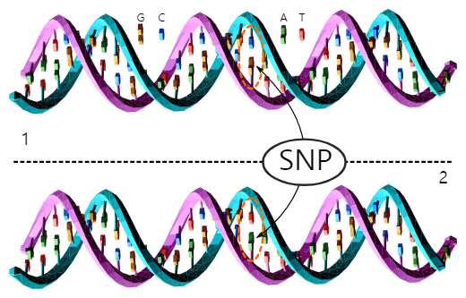
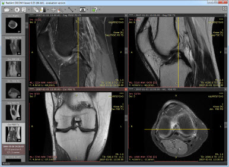
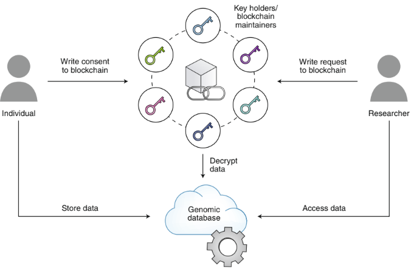

# 제15장 유전체 데이터 보안

## 15.1 유전체 데이터 보안의 필요성과 윤리적 고려사항

개인정보 중에서도 유전체 정보는 특별한 보호가 필요한 영역이다. 과연 유전체 데이터는 일반적인 개인정보와 무엇이 다를까? 왜 우리는 유전체 데이터에 대해 더 신중한 접근이 필요할까? 본 장에서는 이러한 질문들에 답하기 위해 유전체 정보가 갖는 고유한 특성들을 살펴보고, 이것이 개인과 사회에 미치는 영향에 대해 알아본다.

#### 15.1.1 SNP 기반 개인 식별

유전체 데이터의 가장 중요한 특성 중 하나는 개인을 고유하게 식별할 수 있다는 점이다. DNA에 존재하는 단일염기다형성(SNP, Single Nucleotide Polymorphism)은 각 개인마다 다른 패턴을 나타내며, 이는 익명화가 매우 어려운 이유가 된다.

SNP는 개인 간에 DNA 서열에서 단일 염기(A, T, G, C)가 다른 위치를 말한다. 예를 들어, 어떤 사람은 특정 위치에서 'A'를 가지고 있지만, 다른 사람은 같은 위치에 'G'를 가질 수 있다. 인간 유전체에는 약 300만 개의 SNP가 존재하며, 이들의 조합은 각 개인마다 고유한 유전적 지문을 형성한다.

**Figure 15.1** 단일염기다형성(SNP)의 개념. 개인 간 유전체에서 단일 염기가 다른 위치를 보여주며, 이러한 변이들의 조합이 각 개인만의 고유한 유전적 지문을 형성한다.

수만 개의 SNP 데이터를 조합하면 개인을 특정할 수 있는 고유한 패턴이 나타난다. 이는 다른 개인정보와 달리 유전체 데이터가 본질적으로 익명화에 한계가 있음을 의미한다. 심지어 여러 사람의 DNA가 혼재된 데이터베이스에서도 개별 기여자를 구별해낼 수 있으며, 소량의 데이터만으로도 개인 재식별이 가능하다는 보안상 우려가 존재한다.

**Figure 15.2** SNP 데이터를 활용한 개인 식별 과정. 수만 개의 SNP 조합을 통해 개인을 고유하게 구별할 수 있는 패턴이 형성되며, 이는 유전체 데이터의 익명화가 어려운 이유를 보여준다.

이러한 재식별 위험성은 2008년 발표된 연구에서 실증적으로 확인되었다:
- "Resolving Individuals Contributing Trace Amounts of DNA to Highly Complex Mixtures Using High-Density SNP Genotyping Microarrays" (2008)

이 연구는 고밀도 SNP 분석을 통해 복잡한 DNA 혼합물에서도 개별 기여자를 구별해낼 수 있음을 보여주었다.

#### 15.1.2 STR 분석과 가족 관계 추론

단일염기반복서열(STR, Short Tandem Repeat)은 또 다른 형태의 개인 식별 가능한 유전체 정보이다. STR은 DNA 내에서 짧은 서열이 연속적으로 반복되는 영역으로, 개인마다 반복 횟수가 다르다. 이러한 반복 횟수의 개인차는 체세포 분열 과정에서도 안정적으로 유지되며, 집단 내에서 높은 다형성을 보인다. 이런 특징을 기반으로 한 STR 분석은 법의학 분야에서도 개인 식별 목적으로 널리 활용되고 있다.

**Figure 15.3** 단일염기반복서열(STR)의 구조. DNA 내에서 짧은 서열이 연속적으로 반복되는 영역으로, 개인마다 반복 횟수가 달라 개인 식별에 활용된다.

**Figure 15.4** 법의학 분야에서의 STR 분석 활용. STR 마커들의 조합을 통해 개인 식별과 친자 확인이 가능하며, 높은 정확도로 개인을 구별할 수 있다.

최근 연구에서는 Y염색체 STR 분석을 통한 실제 개인 식별 사례가 보고되었다. Gymrek 등은 GenBank에 공개된 개인의 Y염색체 서열에서 STR을 추출하고, 이를 공개 계보 웹사이트의 정보와 비교하여 가장 가능성 높은 성씨를 찾아낸 후, 나이와 거주 주 정보를 결합하여 특정 개인을 식별해냈다. 911명의 개인을 대상으로 한 분석에서는 미국 백인 남성 인구 내에서 12%의 성공률을 보였으며, 공개 저장소에 유전체 정보가 있는 개인들의 가족까지 높은 확률로 식별 가능함을 보여주었다 (Gymrek et al., Science, 2013).

**Figure 15.5** Y염색체 STR을 이용한 성씨 추론 과정. 공개된 계보 데이터베이스와 Y-STR 정보를 연계하여 개인의 성씨를 추론하고, 추가 정보와 결합하여 특정 개인을 식별하는 과정을 보여준다.

즉, STR 역시 개인 식별에 활용될 수 있다는 점에서 유전체 데이터 보안상 중요한 고려사항이 된다.

### 15.1.3 개인 유전체 공개로 인한 위험성

특히 유전체 데이터의 경우 질병 위험 예측이 가능하다는 특성으로 인해 위험이 존재한다. 가령, TP53 변이는 높은 암 발생 위험을, BRCA1/2 변이는 유방암 및 난소암에 대한 높은 감수성을 나타낸다. CHRNA5/A3/B4 유전자군 변이는 니코틴 중독 및 흡연 관련 질환 위험과 연관되며, 다유전자 위험 점수(PRS)를 통해서는 여러 유전적 변이를 종합한 질병 위험 예측이 가능하다. 이러한 예측 정보는 개인의 미래 건강 상태에 대한 정보를 제공하지만, 부적절하게 사용될 경우 개인에게 불이익을 초래할 수 있다.

이러한 개인 유전체 데이터가 부적절하게 노출될 경우 개인이 직면할 수 있는 위험들이 존재한다:

- 보험 가입 거절: 유전적 질병 위험이 높은 개인에 대한 보험사의 차별적 대우
- 고용 차별: 특정 질병에 대한 감수성이 높은 지원자에 대한 고용 배제
- 사회적 낙인: 정신질환이나 유전질환과 관련된 사회적 편견
- 범죄 악용: 개인정보를 이용한 금융 사기나 신원 도용, 협박 등

## 15.2 유전체 데이터 익명화 기술

### 15.2.1 메타데이터 개요

의생명정보학 데이터 분석에서 유전체 데이터는 종종 환자의 다양한 메타데이터와 함께 취급된다. 1장에서 학습한 의료정보학적 데이터의 범주를 기반으로, 유전체 연구에서 활용되는 메타데이터는 다음과 같이 분류할 수 있다.

**전자의무기록(EMR) 기반 메타데이터:**
전자의무기록에서 추출되는 정보는 유전체 연구의 핵심 메타데이터를 구성한다:
- 진찰 기록: 임상 증상, 신체 검사 소견, 의사의 평가 및 진단
- 환자 이력: 가족력, 과거 병력, 처방력, 알레르기 정보, 생활습관(술/담배 이력 등)
- 정량적 데이터: 키, 몸무게, 혈압, 맥박 등의 생체 지표
- 검사 결과: 혈액 검사, 소변 검사, 생화학 검사 수치

**Figure 15.6** 전자의무기록(EMR) 시스템. 환자의 진찰 기록, 검사 결과, 처방 정보 등이 디지털 형태로 저장되며, 유전체 연구에서 중요한 메타데이터를 제공한다.

**표준화된 진단 코드:**
국제질병분류(ICD) 시스템을 통해 표준화된 진단 정보가 메타데이터로 활용된다:
- 세계보건기구(WHO)에서 관리하는 ICD-11을 기반으로 한 진단 코드
- 한국에서는 한국표준질병사인분류(KCD)를 사용
- 이러한 표준화된 코드는 국제적인 유전체 연구 협력과 데이터 통합을 가능하게 함

**Figure 15.7** 국제질병분류(ICD) 시스템. WHO에서 관리하는 표준화된 진단 코드 체계로, 유전체 연구에서 표준화된 진단 정보를 제공하여 국제적인 연구 협력을 가능하게 한다.

**DICOM 기반 의료영상 메타데이터:**
의료영상 및 통신 표준(DICOM, Digital Imaging and Communications in Medicine)은 유전체 연구에서 중요한 영상 메타데이터를 제공한다:

DICOM 표준의 특징:
- 거의 모든 현대 의료영상(X-ray, CT, MRI, PET, 초음파 등)이 DICOM 포맷으로 저장됨
- 병원 내 PACS(Picture Archive and Communication System)를 통해 관리
- 영상 데이터뿐만 아니라 촬영 조건, 환자 정보, 장비 정보 등의 메타데이터도 포함

DICOM 메타데이터의 구성 요소:
- Patient Information: 환자 ID, 나이, 성별, 체중 등
- Study Information: 검사 날짜, 검사 목적, 임상 정보
- Series Information: 촬영 프로토콜, 영상 파라미터
- Equipment Information: 장비 제조사, 모델명, 소프트웨어 버전
- Image Information: 픽셀 데이터, 영상 크기, 해상도

**Figure 15.8** DICOM 표준 기반 의료영상 데이터. 의료영상과 함께 촬영 조건, 환자 정보, 장비 정보 등의 메타데이터가 표준화된 형태로 저장되어 유전체 연구에 활용된다.

**비디지털 데이터의 처리:**
1장에서 언급했듯이, 모든 의료 데이터가 디지털 포맷으로 저장되어 있지는 않다. 수기 기록이나 필름 데이터가 여전히 존재하며, 이를 유전체 연구에 활용하기 위해서는:
- 영상처리 및 필기인식 기술을 통한 디지털 변환
- 자연어 처리 기술을 활용한 텍스트 데이터 추출 및 구조화
- 이러한 과정에서 개인정보 보호를 위한 추가적인 익명화 처리

이러한 다양한 메타데이터는 유전체 데이터와 결합되어 개인의 건강 상태와 질병 위험에 대한 포괄적인 정보를 제공하지만, 동시에 개인 식별 위험을 증가시키는 요소이기도 하다.

### 15.2.2 메타데이터 보안 처리

유전체 데이터의 메타데이터 처리는 데이터의 과학적 가치를 유지하면서도 개인 식별 위험을 최소화하는 방향으로 이루어진다. 샘플 식별자는 원본 정보와 완전히 분리된 랜덤 코드로 대체되며, 이때 비가역적 해시 함수를 사용하여 원본 정보로의 역추적을 방지한다.

유전적 변이 정보의 경우 개별 변이보다는 집단 수준의 통계적 정보로 변환하여 제공하는 경우가 많다. 희귀 변이나 개인 고유의 변이 패턴은 별도의 보안 처리를 거쳐 연구 목적에 필요한 범위 내에서만 제한적으로 공개된다.

지리적 정보나 인구학적 정보는 광범위한 지역 단위나 인구 집단 단위로 일반화된다. 시간 정보는 정확한 날짜 대신 연도나 분기 단위로 제공되며, 기술적 세부사항은 연구 재현성에 필요한 최소한의 정보만 포함한다.

### 15.2.3 메타데이터 기반 재식별 위험

유전체 데이터에서 메타데이터는 재식별 위험을 증가시킬 수 있는 요소로 작용한다. 유전체 정보가 개인 고유의 특성을 가지고 있어, 메타데이터와 결합될 경우 개인 식별 가능성이 존재한다.

희귀 유전적 변이와 관련된 메타데이터의 경우 특별한 주의가 필요하다. 낮은 빈도로 나타나는 변이를 가진 개인의 경우, 해당 변이 정보와 인구학적 메타데이터의 조합을 통해 개인 식별이 이루어질 수 있다. 가족력이나 유전적 계보 정보가 메타데이터에 포함된 경우에는 공개된 계보 데이터베이스와의 연계 분석을 통한 개인 특정 가능성이 있다.

따라서 유전체 메타데이터 보안은 개인정보 제거뿐만 아니라 유전체 데이터의 고유한 특성을 고려한 조심스러운 접근이 요구된다.

## 15.3 통제 접근 저장 시스템

유전체 데이터의 익명화 기술만으로는 완전한 개인정보 보호를 보장하기 어렵다는 한계가 인식되면서, 데이터 접근 자체를 통제하는 방식의 보안 시스템이 개발되었다. 통제 접근 저장 시스템은 데이터를 공개하지 않고 승인된 연구자에게만 제한적으로 접근을 허용함으로써 보안을 강화하면서도, 연구의 효율성을 유지할 수 있도록 설계된 시스템이다.

### 15.3.1 dbGaP (Database of Genotypes and Phenotypes)

dbGaP는 미국 국립생물정보센터(NCBI)가 운영하는 대표적인 통제 접근형 유전체 데이터베이스로, 연구자들이 대규모 유전체 연구 데이터에 접근할 수 있도록 하면서도 개인정보 보호를 위한 엄격한 통제 시스템을 적용하고 있다.

dbGaP의 접근 통제 과정은 다단계로 이루어진다:

- 연구자 자격 검증: 소속 기관 확인 및 연구 경력 심사
- 연구 계획 심사: 데이터 사용 목적과 방법에 대한 상세한 검토
- 제한적 사용 권한: 승인된 연구 목적에 한정된 데이터 접근
- 사용 추적: 모든 데이터 접근 및 사용 내역의 로깅과 모니터링

이러한 체계적인 과정을 통해 데이터의 오남용을 방지하면서도 연구자들이 필요한 데이터에 접근할 수 있도록 한다.

데이터 보안 측면에서 dbGaP는 연구자의 소속 기관이 데이터 보안 정책 준수를 확약하도록 요구한다. 또한 암호화된 데이터 전송 및 저장을 통한 기술적 보안과 승인된 장소에서만 데이터 접근을 허용하는 물리적 보안 조치를 동시에 적용한다. 이러한 다층적 보안 체계를 통해 연구 데이터의 활용성과 개인정보 보호를 동시에 달성하고 있다.

### 15.3.2 EGA (European Genome-phenome Archive)

EGA는 유럽연합의 엄격한 개인정보보호 규정(GDPR)을 준수하는 유전체 데이터 저장소로, 유럽의 법적 프레임워크와 문화적 특성을 반영한 독특한 데이터 거버넌스 체계를 갖추고 있다.

**Figure 15.9** 유럽 유전체-표현형 아카이브(EGA). 유럽의 GDPR 규정을 준수하는 통제 접근형 유전체 데이터베이스로, 독립적인 데이터 접근 위원회를 통한 엄격한 보안 체계를 갖추고 있다.

EGA의 데이터 거버넌스는 유럽식 접근법을 기반으로 한다:

- GDPR 준수: 유럽연합의 일반개인정보보호규정에 따른 엄격한 보호
- 데이터 접근 위원회: 독립적인 전문가 위원회를 통한 접근 승인
- 명확한 승인 범위: 접근 가능한 데이터 범위와 사용 기간의 명시적 규정
- 표준화된 메타데이터: 국제적 호환성을 위한 표준화된 데이터 기술

이러한 체계는 개인정보 보호를 최우선으로 하면서도 연구의 투명성과 재현성을 보장한다.

또한 EGA는 국제 공동연구를 적극 지원한다. 다른 국제 데이터베이스와의 상호 운용성을 확보하고, 국경을 넘나드는 대규모 연구 프로젝트를 지원하며, 각국의 문화적 차이와 법적 요구사항을 고려한 유연한 접근 방식을 채택하고 있다.

## 15.4 기타 보안 강화 기술

유전체 데이터 보안 분야에서는 암호화와 접근 제어 외에도 다양한 기술들이 개발되고 있다. 데이터의 상호 운용성을 확보하면서도 보안 기술을 융합하여 보다 포괄적인 보안 체계를 구축하는 접근법들이 활용되고 있다.

### 15.4.1 표준화 기반 보안 강화 기술

**OMOP-CDM (Observational Medical Outcomes Partnership - Common Data Model):**
OMOP-CDM은 서로 다른 의료 기관과 연구소 간의 데이터 통합을 위한 표준 데이터 모델이다. 이 표준은 유전체 데이터 보안에 다음과 같은 이점을 제공한다:

- **표준화된 데이터 구조**: 다양한 소스의 의료 데이터를 일관된 형태로 변환하여 통합 분석 가능
- **개인정보 보호 강화**: 표준화 과정에서 자동적인 식별자 제거 및 데이터 정규화
- **연구 협력 촉진**: 기관 간 데이터 공유 시 개인 식별 위험 최소화
- **품질 관리**: 표준화된 검증 절차를 통한 데이터 품질 보장

**폐쇄망 환경에서의 안전한 데이터 접근:**
OMOP-CDM의 가장 중요한 보안 장점 중 하나는 폐쇄망(closed network) 환경에서의 안전한 데이터 접근을 가능하게 한다는 점이다. CDM 기반 시스템에서는 다음과 같은 방식으로 보안이 강화된다:

- **네트워크 격리**: 의료 데이터가 외부 인터넷과 완전히 분리된 폐쇄망 내에서만 처리
- **표준화된 쿼리 인터페이스**: 연구자들이 직접 원본 데이터에 접근하지 않고도 표준화된 쿼리를 통해 필요한 분석 수행
- **중앙집중식 접근 제어**: 모든 데이터 접근이 중앙 시스템을 통해 로깅되고 모니터링됨
- **분산 분석 환경**: 각 기관이 자체 폐쇄망에서 동일한 CDM 구조를 사용하여 분석 결과만 공유

이러한 폐쇄망 기반 접근 방식은 특히 민감한 유전체 데이터의 경우 다음과 같은 추가적인 보안 이점을 제공한다:

- **물리적 보안**: 데이터가 외부 네트워크에 노출될 위험 원천 차단
- **감사 추적**: 모든 데이터 접근과 분석 활동의 완전한 기록 유지
- **연구 재현성**: 표준화된 환경에서 동일한 분석을 다른 기관에서도 재현 가능
- **규제 준수**: 각국의 의료 데이터 보호 규정을 준수하면서도 국제 협력 연구 가능

### 15.4.2 블록체인 기반 보안 기술

**Nebula Genomics의 블록체인 기반 데이터 주권:**
Nebula Genomics는 블록체인 기술을 활용하여 개인이 자신의 유전체 데이터를 직접 통제하고 연구자에게 판매할 수 있는 플랫폼을 구현한 대표적인 사례이다. 이 시스템의 핵심 원리는 다음과 같다:

**Figure 15.10** Nebula Genomics의 블록체인 기반 데이터 주권 시스템. 개인이 블록체인과 스마트 계약을 통해 자신의 유전체 데이터를 직접 통제하고 연구자에게 판매할 수 있는 플랫폼의 구조를 보여준다.

**기술적 구조:**
- **암호화 키 저장**: 개인의 유전체 데이터 암호화 키가 블록체인에 안전하게 저장됨
- **스마트 계약 기반 자동화**: 미리 정의된 조건이 충족되면 스마트 계약을 통해 자동으로 암호화 키가 발급됨
- **분산 원장**: 모든 데이터 접근과 거래 기록이 변조 불가능한 분산 원장에 기록됨
- **개인 통제권**: 개인이 직접 자신의 유전체 데이터에 대한 접근 권한과 사용 조건을 설정

**개인-연구자 직접 거래 모델:**
이 시스템은 개인이 연구자에게 직접 유전체 데이터를 판매할 수 있는 플랫폼을 제공한다:
- 개인이 데이터 사용 목적, 기간, 범위를 직접 설정
- 연구자가 조건에 동의하면 스마트 계약이 자동 실행
- 데이터 사용료가 블록체인을 통해 투명하게 지급
- 모든 거래 내역이 공개적으로 검증 가능
- 개인이 자신의 유전체 데이터에 대한 완전한 통제권 보유
- 데이터 사용 내역의 투명한 기록과 활용 수익의 공정한 분배

## 15.5 윤리적 고려사항과 미래 전망

### 15.5.1 현대의 유전체 데이터 보안 기술

유전체 데이터의 고유한 특성을 고려한 보안 기술들이 지속적으로 개발되고 있다. 이러한 기술들은 유전체 데이터의 민감성과 복잡성을 다루면서도 연구의 과학적 가치를 유지하는 것을 목표로 한다.

동형암호화(Homomorphic Encryption)는 데이터를 암호화된 상태로 유지하면서도 연산을 가능하게 하는 기술이다. 유전체 연구 분야에서는 암호화된 서열 데이터에서 직접 변이 검출과 유전자 발현 분석을 수행할 수 있다. GWAS 연구에서는 개인 유전체 정보를 노출하지 않고 집단 수준의 통계 분석이 가능하며, 여러 기관이 각자의 데이터를 공개하지 않으면서도 공동 연구를 수행할 수 있게 한다. 또한 클라우드 환경에서 민감한 유전체 데이터를 안전하게 처리할 수 있어, 연구자들이 실제 유전체 서열에 직접 접근하지 않고도 필요한 분석을 수행할 수 있다.

딥러닝 기반 메타데이터 익명화 기술은 유전체 데이터와 함께 수집되는 복잡한 메타데이터의 패턴을 학습하는 방법이다. 이 기술은 임상 정보, 인구학적 정보, 생활 양식 정보 등의 복합적 패턴을 분석하여 개인 식별 위험이 높은 메타데이터 조합을 자동으로 탐지한다. 기존의 규칙 기반 익명화 방법과 달리, 딥러닝 모델은 연구 목적에 필요한 정보는 유지하면서 재식별 위험을 최소화하는 더욱 정교한 개인정보 보호를 제공할 수 있다.

## 15.5 결론

유전체 데이터 보안은 현대 의생명정보학의 핵심 영역으로, 과학적 발전과 개인정보 보호 사이의 균형을 요구한다. 유전체 데이터는 개인의 생물학적 지문과 같은 고유성을 가지며, 한 번 공개되면 되돌릴 수 없는 특성을 가진다. 따라서 전통적인 익명화 기법만으로는 충분하지 않으며, 동형암호화, 블록체인, 딥러닝 기반 익명화 등의 혁신적 기술을 통한 보안 강화가 필수적이다.

기술적 진보가 사회적 혜택으로 이어지기 위해서는 윤리적 고려사항이 기술 개발과 함께 발전해야 한다. 개인의 자율성 존중, 사회적 이익과 개인 권리의 균형, 그리고 다학제적 협력을 통한 지속적인 정책 개선이 필요하다. 유전체 데이터 보안 분야의 발전은 단순히 기술적 성취를 넘어서, 인류가 직면한 보건 의료 문제의 해결과 더 나은 미래 사회 구축에 기여할 수 있는 잠재력을 가지고 있다.
