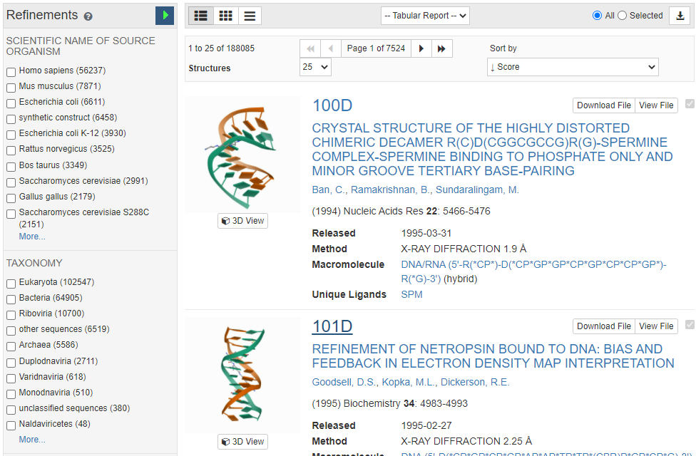
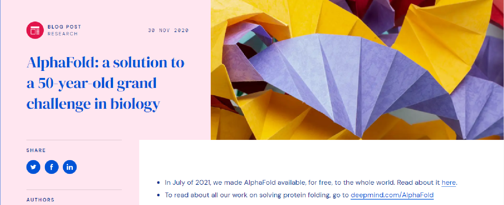
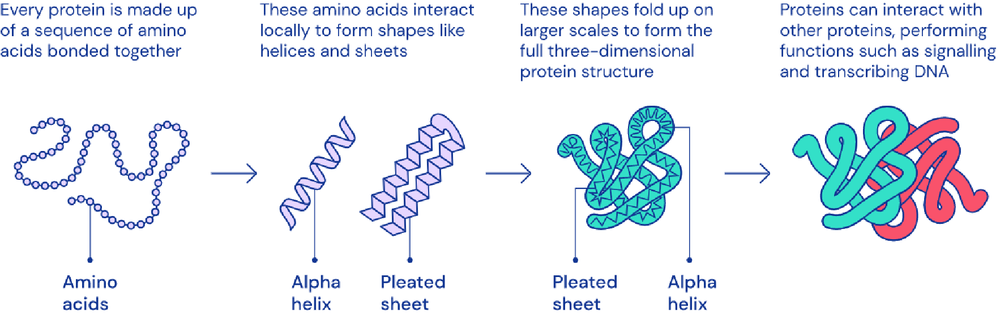

# 제16장 인공지능과 의생명정보학의 미래

현대 의생명정보학은 인공지능과 기계학습의 발전과 함께 새로운 전환점을 맞고 있다. 지금까지 우리는 유전체학, NGS, GWAS, 암 연구, 신약 개발, 후성유전체학 등 다양한 분야를 살펴보았다. 이 모든 영역에서 생성되는 대용량 데이터를 효과적으로 분석하고 의미 있는 정보를 추출하는 것이 현대 의생명정보학의 핵심 과제가 되었다.

인공지능은 단순히 데이터를 처리하는 도구를 넘어서, 복잡한 생물학적 패턴을 발견하고 새로운 가설을 제시하며, 심지어 치료법을 제안하는 역할까지 담당하고 있다. 본 장에서는 의생명정보학에서 활용되는 주요 인공지능 기술들을 살펴보고, 이들이 어떻게 질병 진단, 치료, 신약 개발 등에 혁신을 가져오고 있는지 알아본다. 또한 앞으로 의생명정보학이 나아가야 할 방향과 인공지능 기술의 발전이 인류의 건강에 미칠 영향에 대해서도 논의한다.

**Figure 16.1** 기계학습과 딥러닝의 개요. 인공지능의 하위 분야로서 기계학습과 딥러닝의 관계를 보여주며, 의생명정보학에서 활용되는 다양한 AI 기술들의 전체적인 구조를 나타낸다.

## 16.1 인공지능과 기계학습의 의생명정보학 응용

### 16.1.1 딥러닝의 기본 원리와 의생명정보학에서의 역할

인공지능에서 학습은 최적화의 과정으로 이해할 수 있다. 모델은 훈련 과정에서 중요하지 않은 정보는 망각하고, 문제 해결에 핵심적인 패턴만을 학습하여 일반화 능력을 획득한다. 이러한 원리는 복잡하고 고차원적인 생명과학 데이터에서 의미 있는 신호를 추출하는 데 활용된다.

**Figure 16.2** 딥러닝의 기본 구조. 다층 신경망을 통해 복잡한 패턴을 학습하는 딥러닝의 원리를 보여주며, 입력층에서 출력층까지의 정보 흐름과 각 층에서의 특징 추출 과정을 나타낸다.

현대 의생명정보학에서 인공지능의 주요 역할 중 하나는 이질적인 데이터 유형들을 통합하여 분석하는 것이다. DNA 서열, 단백질 구조, 유전자 발현 프로파일, 의료 영상, 그래프 네트워크, 시계열 데이터, 자연어 형태의 임상 기록, 전자의무기록 등 서로 다른 형태와 크기를 가진 데이터들을 "잠재 공간(latent space)" 라고 불리는 공통된 수학적 표현으로 변환한다. 이러한 통합된 표현을 통해 분류, 클러스터링, 시각화, 생성 모델링 등 다양한 분석 작업을 수행할 수 있으며, 단일 데이터 유형만으로는 얻을 수 없는 정보를 제공한다.

### 16.1.2 차원 축소와 잠재 공간 모델링

생명과학 데이터는 일반적으로 고차원성을 가지고 있다. 단일세포 RNA-seq 데이터는 수만 개의 유전자 차원을 가지며, 의료 영상은 수백만 개의 픽셀로 구성된다. 이러한 고차원 데이터를 직접 분석하는 것은 계산적으로 비효율적일 뿐만 아니라, 차원의 저주 문제로 인해 통계적 분석의 정확성도 떨어뜨린다.

잠재 공간(latent space)은 고차원 데이터의 핵심적인 특징을 저차원으로 압축하여 표현하는 추상적 공간이다. 이 공간에서는 유사한 특성을 가진 데이터들이 가까이 위치하게 되며, 데이터 간의 관계가 더욱 명확하게 드러난다. 예를 들어, 수만 개의 유전자 발현 값을 가진 세포들을 2차원이나 3차원의 잠재 공간으로 매핑하면, 세포 유형이나 발달 단계에 따른 클러스터를 시각적으로 관찰할 수 있다.

**Figure 16.3** 잠재 공간의 개념. 고차원 데이터를 저차원의 잠재 공간으로 매핑하는 과정을 시각화하여, 유사한 특성을 가진 데이터들이 잠재 공간에서 가까이 위치하는 원리를 보여준다.

11장에서 다룬 전통적인 차원 축소 방법들과 최신 딥러닝 기법들은 잠재 공간을 구성하는 방식에서 중요한 차이를 보인다. 주성분 분석(PCA), 비음수 행렬 분해(NMF) 등의 전통적인 방법들은 선형 변환을 기반으로 한다. PCA는 분산을 최대화하는 선형 조합을 찾고, NMF는 비음수 제약을 통해 부분-전체 관계를 모델링한다.

반면 딥러닝 기반의 차원 축소 기법들은 비선형 변환을 통해 더욱 복잡하고 유연한 잠재 공간을 구성할 수 있다. 오토인코더, 변분 오토인코더(VAE), 적대적 생성 신경망(GAN) 등은 다층 신경망을 통해 비선형 매핑을 학습한다. 이를 통해 전통적 방법으로는 포착하기 어려운 복잡한 데이터 구조와 패턴을 잠재 공간에 효과적으로 표현할 수 있다. 특히 생명과학 데이터의 경우, 유전자 간의 상호작용이나 세포 상태의 연속적 변화와 같은 비선형적 관계를 더 잘 모델링할 수 있다는 장점이 있다.

### 16.1.3 베이지안 접근법과 딥러닝의 확률적 원리

딥러닝의 핵심 원리는 베이지안 확률론에 기반한다. 베이지안 확률은 확률을 "믿음의 정도"로 해석하며, 새로운 데이터가 들어올 때마다 기존의 믿음을 업데이트하는 과정이다. 이는 딥러닝 모델이 학습하는 방식과 본질적으로 동일하다.

**Figure 16.4** 베이지안 추론의 원리. 사전 확률에서 시작하여 새로운 증거를 통해 사후 확률을 업데이트하는 베이지안 학습 과정을 도식화하여, 딥러닝의 확률적 기초를 설명한다.

베이지안 정리는 다음과 같이 표현된다:

P(H|E) = P(E|H) × P(H) / P(E)

여기서 P(H|E)는 증거 E가 주어졌을 때 가설 H의 사후 확률, P(E|H)는 가설 H가 참일 때 증거 E가 관찰될 우도, P(H)는 사전 확률, P(E)는 증거의 주변 확률이다.

딥러닝 모델은 본질적으로 확률 분포를 학습한다. 신경망의 가중치는 확률 분포로 표현될 수 있으며, 새로운 훈련 데이터가 입력될 때마다 이 분포가 조금씩 업데이트된다. 각 층의 뉴런은 입력에 대한 확률적 변환을 수행하고, 전체 네트워크는 복잡한 확률 분포를 근사하게 된다. 따라서, 딥 러닝 모델은 많은 경우 확률분포로 나타내어진다. 이러한 확률적 접근은 모델이 불확실성을 표현하고, 예측의 신뢰도를 제공할 수 있게 한다.

### 16.1.4 딥러닝 모델의 학습 원리와 손실 함수

딥러닝 모델의 학습, 즉 확률 분포를 업데이트하기 위해서는 공통적으로 손실 함수(loss function)를 최소화하는 방향으로 학습을 진행한다. 손실 함수는 모델의 예측과 실제 정답 간의 차이를 수치화한 지표로, 모델이 얼마나 잘못 예측하고 있는지를 나타낸다. 학습 과정에서는 역전파(backpropagation) 알고리즘을 통해 손실 함수의 기울기를 계산하고, 경사하강법(gradient descent)을 사용하여 손실을 줄이는 방향으로 모델의 가중치를 업데이트한다.

대표적인 손실 함수들은 다음과 같다. 분류 문제에서는 교차 엔트로피 손실(cross-entropy loss)이 주로 사용되며, 회귀 문제에서는 평균 제곱 오차(mean squared error)나 평균 절댓값 오차(mean absolute error)가 활용된다. 특히 생물학적 서열 분석이나 단백질 구조 예측과 같은 복잡한 문제에서는 문제의 특성에 맞는 맞춤형 손실 함수가 설계되기도 한다.

손실 함수: L(θ) = f(y_pred, y_true)
경사하강법: θ ← θ - α∇L(θ)

여기서 θ는 모델의 매개변수, α는 학습률, ∇L(θ)는 손실 함수의 기울기를 의미한다.

## 16.2 딥러닝 기반 의생명 데이터 분석

### 16.2.1 오토인코더

오토인코더는 인코더와 디코더로 구성된 신경망 구조로, 입력 데이터를 저차원의 잠재 공간으로 압축한 후 다시 원본과 유사한 출력으로 복원하는 과정을 학습한다. 이 과정에서 잠재 공간은 입력 데이터의 핵심적인 특징을 압축된 형태로 표현하게 된다. 인코더는 입력 데이터를 잠재 표현으로 변환하고, 디코더는 잠재 표현을 다시 원본 공간으로 복원한다.

E(x) → z
D(z) → x'
훈련 목표: ||x - x'|| 최소화

여기서 E는 인코더 함수, D는 디코더 함수, x는 입력 데이터, z는 잠재 표현, x'는 복원된 출력을 의미한다.

기본 오토인코더의 확장으로 변분 오토인코더(VAE)와 적대적 오토인코더(AAE) 등의 생성 모델들이 개발되기도 하였으며,
이들은 의생명 데이터 분석에 널리 활용되고 있다.

**Figure 16.5** 적대적 오토인코더의 구조. 인코더-디코더 구조에 적대적 네트워크를 결합하여 더 나은 잠재 표현을 학습하는 과정을 보여주며, 생성 모델로서의 활용 가능성을 나타낸다.

### 16.2.2 합성곱 신경망(CNN)

합성곱 신경망(CNN)은 의료 영상 분석에서 가장 성공적인 딥러닝 아키텍처 중 하나이다. CNN은 이미지의 지역적 특징을 효과적으로 추출하는 합성곱 연산과 공간적 차원을 축소하는 풀링 연산을 결합하여 영상의 계층적 특징을 학습한다.

이 중 핵심이 되는 합성곱 연산은 작은 크기의 필터(커널)를 입력 이미지 위에서 슬라이딩하면서 각 위치에서 필터와 이미지 픽셀 값들의 내적을 계산하는 과정을 말한다.

**Figure 16.6** 합성곱 연산의 원리. 필터(커널)가 입력 이미지 위에서 슬라이딩하면서 지역적 특징을 추출하는 합성곱 연산의 과정을 단계별로 보여준다.

이를 포함한 일반적인 CNN의 핵심 구성 요소는 다음과 같다:

- 합성곱 층(Convolution Layer): 필터(커널)를 이용해 이미지의 지역적 특징을 추출
- 활성화 함수(Activation Function): 비선형성을 도입하여 복잡한 패턴 학습 가능
- 풀링 층(Pooling Layer): 특징 맵의 크기를 줄이고 중요한 정보만 선별
- 완전 연결 층(Fully Connected Layer): 추출된 특징을 최종 분류 결과로 변환

의료 영상에서 CNN은 계층적 특징 추출 과정을 통해 작동한다. 초기 층에서는 가장자리나 텍스처 같은 저수준 특징을 추출하고, 중간 층에서는 해부학적 구조의 부분적 패턴을 학습하며, 최종 층에서는 질병의 특이적 패턴이나 병변의 전체적 형태를 인식한다.

**Figure 16.7** 합성곱 신경망의 전체 구조. 합성곱층, 활성화 함수, 풀링층, 완전연결층으로 구성된 CNN의 전체 아키텍처와 의료 영상 분석에서의 계층적 특징 추출 과정을 나타낸다.

CNN은 다양한 의료 영상 분야에 활용되고 있다. X-ray 영상에서는 폐렴, 폐결핵, 골절 등을 진단하고, CT 스캔에서는 종양 탐지, 뇌출혈 진단, 폐렴 분석 등을 수행할 수 있다. MRI에서는 뇌종양, 치매, 다발성 경화증 등의 신경계 질환을 진단하며, 병리 슬라이드에서는 암세포 분류와 조직학적 등급 결정 등에 사용된다.

한국의 의료 AI 분야는 세계적 수준의 기술력을 보유하고 있다. 뷰노(VUNO), 루닛(Lunit), 딥노이드(Deepnoid), 제이엘케이(JLK), 삼성전자 등의 기업들이 의료 영상 분석 분야에서 혁신적인 솔루션을 개발하고 있으며, 이들 기업들은 다양한 의료 영상 모달리티와 질병 진단 영역에서 경쟁력 있는 기술을 선보이고 있다.

### 16.2.3 확산 모델(Diffusion Models)

확산 모델은 최근 생성형 AI 분야에서 주목받고 있는 새로운 패러다임이다. 이 모델은 노이즈를 점진적으로 추가하는 순방향 과정과 노이즈를 제거하는 역방향 과정을 학습하여 고품질의 데이터를 생성한다. 의생명정보학 분야에서는 다음과 같은 응용이 가능하다.

분자 설계 분야에서 확산 모델은 새로운 약물 후보 분자를 생성하는 데 활용된다. 기존의 알려진 분자 구조에서 시작하여 점진적으로 변형을 가해 새로운 특성을 가진 분자를 설계할 수 있다. 또한 단백질 구조 예측에서도 아미노산 서열로부터 3차원 단백질 구조를 생성하는 데 사용되고 있다.

**Figure 16.8** RFdiffusion을 이용한 단백질 설계. 확산 모델을 활용하여 노이즈에서 시작해 점진적으로 새로운 단백질 구조를 생성하는 과정을 보여주며, 합성 생물학에서의 응용 가능성을 나타낸다.

의료 영상 분야에서는 부족한 의료 데이터를 보완하기 위한 합성 데이터 생성에 활용된다. 예를 들어, 희귀 질병의 영상 데이터가 부족할 때 확산 모델을 통해 현실적인 합성 영상을 생성하여 진단 모델의 성능을 향상시킬 수 있다. 이는 의료 AI 모델의 훈련 데이터 부족 문제를 해결하는 중요한 접근법으로 주목받고 있다.

### 16.2.4 순환 신경망(RNN)

순환 신경망(RNN)은 시간적 의존성을 가진 데이터를 처리하는 데 특화된 신경망이다. 일반적인 신경망과 달리 RNN은 이전 시점의 정보를 기억하여 현재 시점의 예측에 활용할 수 있다. 특히 LSTM(Long Short-Term Memory)은 장기 의존성 문제를 해결하여 긴 시퀀스의 패턴을 효과적으로 학습할 수 있다.

**Figure 16.9** 순환 신경망의 기본 구조. 시간적 의존성을 가진 데이터를 처리하기 위해 이전 시점의 정보를 현재 시점으로 전달하는 RNN의 기본 원리를 보여준다.

**Figure 16.10** LSTM의 구조. 장기 의존성 문제를 해결하기 위한 LSTM의 게이트 메커니즘(forget gate, input gate, output gate)과 셀 상태의 흐름을 나타낸다.

**Figure 16.11** LSTM의 상세 동작 원리. 각 게이트(forget, input, output)의 상세한 작동 메커니즘과 셀 상태와 숨겨진 상태의 업데이트 과정을 단계별로 보여준다.

의료 분야에서 RNN은 다양한 시계열 데이터 분석에 활용되고 있다. 생체 신호 모니터링에서는 심전도(ECG), 뇌전도(EEG), 혈압 변화 등의 실시간 분석을 통해 이상 신호를 감지한다. 임상 기록 분석에서는 환자의 진료 기록, 투약 이력, 검사 결과의 시간적 패턴을 분석하여 의미 있는 정보를 추출한다. 또한 만성 질환의 경과 예측이나 합병증 발생 위험도 평가, 약물 치료나 수술 후 회복 과정의 추적 등에도 사용된다.

### 16.2.5 트랜스포머와 대규모 언어 모델

지금까지 우리는 CNN을 통한 의료 영상 분석, 확산 모델을 통한 분자 설계, RNN을 통한 시계열 데이터 분석을 살펴보았다. 이제 현재 AI 분야에서 가장 주목받고 있는 트랜스포머 아키텍처와 그 의생명정보학 응용에 대해 알아보자.

앞서 다룬 RNN과 LSTM이 순차적 데이터 처리에 강점을 보였지만, 긴 시퀀스에서는 여전히 한계가 있었다. 이를 해결하기 위해 등장한 것이 seq2seq(sequence-to-sequence) 모델이다. seq2seq는 인코더-디코더 구조로 구성되며, 인코더에서 입력 시퀀스를 압축된 표현으로 변환하고, 디코더에서 이를 출력 시퀀스로 변환한다. 초기 seq2seq 모델은 LSTM을 기본 블록으로 사용했지만, 긴 시퀀스에서 정보 손실 문제가 발생했다.

이 문제를 해결하기 위해 seq2seq에 어텐션 메커니즘이 도입되었다. 어텐션은 간단히 말해 "주의를 기울이는" 기능으로, 모델이 출력을 생성할 때 입력 데이터의 어느 부분에 집중해야 하는지를 결정한다. 예를 들어, 긴 DNA 서열을 분석할 때 전체 서열 중에서 현재 분석하고 있는 부분과 관련된 중요한 위치들에 더 많은 주의를 기울이는 것이다.

트랜스포머(Transformer)는 이러한 발전의 정점으로, LSTM 구조를 완전히 제거하고 어텐션 메커니즘만으로 구성된 아키텍처를 제시했다. 트랜스포머는 LSTM의 순차적 처리 방식과 달리 병렬 처리가 가능하여 학습 속도가 빠르고, 더 긴 시퀀스를 처리할 수 있어 자연어 처리 분야를 혁명적으로 변화시켰다.

**Figure 16.12** 트랜스포머 아키텍처. 어텐션 메커니즘을 기반으로 한 인코더-디코더 구조와 멀티-헤드 어텐션, 피드포워드 네트워크로 구성된 트랜스포머의 전체 구조를 나타낸다.

GPT(Generative Pre-trained Transformer)는 트랜스포머 아키텍처를 기반으로 한 생성형 언어 모델의 일반적인 명칭이다. GPT는 "생성형(Generative)" "사전 훈련된(Pre-trained)" "트랜스포머(Transformer)"의 줄임말로, 대량의 텍스트 데이터로 사전 훈련되어 텍스트를 생성할 수 있는 모델을 의미한다. 우리가 잘 아는 ChatGPT는 OpenAI에서 개발한 GPT 시리즈 중 하나이며, GPT라는 용어 자체는 ChatGPT만을 지칭하는 것이 아니라 이러한 구조를 가진 모든 모델을 포괄하는 용어이다. GPT 모델들은 사전 훈련 후 특정 작업에 맞게 미세 조정되어 인간과 자연스러운 대화가 가능한 수준까지 발전했다.

트랜스포머 기술은 생명과학 분야에서도 다양하게 활용되고 있다. DNA 서열을 분석하는 DNABERT, 단백질 기능을 예측하는 ProteinBERT, 화학 분자의 특성을 예측하는 ChemBERTa, 단일세포 데이터를 분석하는 scBERT와 scGPT, 공간 전사체학 분석을 위한 Nicheformer 등이 개발되어 각각의 전문 분야에서 성과를 보이고 있다. 이들 모델은 모두 자연어를 처리하는 것처럼 생물학적 서열이나 데이터를 "언어"로 취급하여 분석한다.

**Figure 16.13** DNA 언어 모델의 개념. DNA 서열을 자연어처럼 처리하는 대규모 언어 모델의 원리를 보여주며, 생물학적 서열 데이터를 토큰화하여 분석하는 과정을 나타낸다.

**Figure 16.14** scGPT 단일세포 분석 모델. 단일세포 RNA-seq 데이터를 GPT 아키텍처로 분석하는 scGPT 모델의 구조와 세포 유형 분류, 유전자 발현 예측 등의 응용 분야를 보여준다.

이러한 기술들은 실제 연구와 임상에서 다양하게 응용되고 있다. 유전체 연구에서는 DNA의 기능이 알려지지 않은 부분을 분석하고, 새로운 단백질을 설계하며, 신약 개발에서는 약물과 질병 표적 간의 상호작용을 예측한다. 또한 서로 다른 종류의 오믹스 데이터를 통합하여 분석하거나, 조직 내에서 유전자가 어떻게 발현되는지 공간적 패턴을 분석하는 데도 활용된다.

우리가 일상에서 사용하는 ChatGPT와 같은 생성형 AI도 의료 분야에서 활용되고 있다. 의료진이 복잡한 의학 문헌을 빠르게 요약하거나, 진단을 보조하거나, 환자와의 상담을 도와주는 역할을 한다. 실제로 부산대학교병원에서는 의사가 작성하는 진료 기록의 오타를 자동으로 수정하고, 의학 용어를 표준화하며, 진단 코드를 자동으로 매핑하는 AI 시스템을 도입하여 의료진의 업무 효율성을 높이고 있다.

### 16.2.6 트랜스포머를 넘어선 새로운 아키텍처

최근에는 트랜스포머 아키텍처의 한계를 극복하기 위한 새로운 모델들이 등장하고 있다. 특히 생물학적 서열 분석에서는 기존 트랜스포머보다 효율적이고 강력한 성능을 보이는 차세대 아키텍처들이 주목받고 있다.

Evo2는 이러한 차세대 모델의 대표적인 예시로, Arc Institute에서 개발한 대규모 DNA 기반 모델이다. Evo2는 기존 트랜스포머의 계산 복잡도 문제를 해결하기 위해 새로운 아키텍처를 채택했으며, 최대 131만 개의 토큰까지 처리할 수 있는 긴 컨텍스트 처리 능력을 갖추고 있다. 이는 전체 박테리아 유전체나 인간 염색체의 큰 부분까지 한 번에 분석할 수 있는 수준이다. Evo2는 생성 모델로서 새로운 DNA 서열을 설계할 수 있는 능력도 갖추고 있어, 합성 생물학 분야에서의 활용 가능성도 크다.

## 16.3 인공지능을 이용한 단백질 구조 예측

### 16.3.1 단백질 구조 예측의 중요성과 역사

단백질의 3차원 구조는 그 기능을 결정하는 핵심 요소이다. 단백질은 아미노산이 일차원적으로 연결된 서열로 시작하지만, 이들이 접혀서 만드는 3차원 구조가 실제 생물학적 기능을 수행한다. 따라서 단백질의 구조를 정확히 예측할 수 있다면 신약 개발, 질병 이해, 효소 설계 등 다양한 분야에 혁신적인 변화를 가져올 수 있다.

**Figure 16.15** COVID-19 스파이크 단백질 구조. SARS-CoV-2 바이러스의 스파이크 단백질 3차원 구조를 보여주며, 단백질 구조 예측의 중요성과 신약 개발에서의 활용 가능성을 나타낸다.

그동안 단백질 구조를 실험적으로 결정하는 방법으로는 X선 결정학, 핵자기공명분광법(NMR), 전자현미경 등이 사용되어 왔지만, 이들 방법은 많은 시간과 비용이 소요되며 모든 단백질에 적용하기 어렵다는 한계가 있었다. 이러한 배경에서 컴퓨터를 이용한 단백질 구조 예측 연구가 수십 년간 진행되어 왔으며, 2024년 노벨 화학상은 바로 이 분야의 혁신적 성과를 인정받은 것이다.

2024년 노벨 화학상은 데이비드 베이커(David Baker)와 구글 딥마인드의 데미스 하사비스(Demis Hassabis), 존 점퍼(John Jumper)에게 수여되었다. 베이커는 단백질 설계 분야의 선구자로서 Rosetta 소프트웨어를 개발하여 새로운 단백질을 설계하는 기반을 마련했고, 하사비스와 점퍼는 AlphaFold를 개발하여 단백질 구조 예측 문제를 혁신적으로 해결했다.

**단백질 데이터 뱅크(PDB)의 역할:**
현대 단백질 구조 예측의 혁신은 단백질 데이터 뱅크(Protein Data Bank, PDB)라는 중요한 기반 데이터베이스가 있었기 때문에 가능했다. PDB는 1971년에 설립된 세계 최초의 생체분자 구조 데이터베이스로, 실험적으로 결정된 단백질, 핵산, 복합체의 3차원 구조 정보를 수집하고 공유하는 글로벌 저장소이다.

**Figure 16.16** 단백질 데이터 뱅크(PDB). 전 세계 단백질 구조 정보를 수집하고 공유하는 PDB 데이터베이스의 인터페이스를 보여주며, AI 단백질 구조 예측 모델의 훈련 데이터로서의 역할을 나타낸다.

PDB는 X선 결정학, 핵자기공명분광법(NMR), 전자현미경 등을 통해 결정된 수십만 개의 단백질 구조를 보유하고 있으며, 이러한 방대한 실험 데이터가 AlphaFold와 같은 AI 모델의 훈련 데이터로 활용되었다. 특히 AlphaFold는 PDB에 축적된 구조 정보와 진화적 관련성을 가진 단백질들의 서열 정보를 결합하여 학습함으로써 혁신적인 성과를 달성할 수 있었다. 즉, 지난 50여 년간 과학자들이 실험을 통해 축적한 PDB의 구조 데이터가 AI 기반 단백질 구조 예측 혁명의 토대가 된 것이다.

### 16.3.2 AlphaFold의 혁신

AlphaFold는 구글 딥마인드에서 개발한 딥러닝 기반 단백질 구조 예측 시스템으로, 2020년 CASP14(Critical Assessment of protein Structure Prediction) 경진대회에서 기존 방법들을 압도적으로 앞서는 성과를 보여주었다. AlphaFold는 아미노산 서열만을 입력으로 받아 단백질의 3차원 구조를 예측하며, 실험적으로 결정된 구조와 거의 동일한 수준의 정확도를 달성했다.

**Figure 16.17** AlphaFold 시스템. 구글 딥마인드에서 개발한 AlphaFold의 주요 기능과 인터페이스를 보여주며, 아미노산 서열로부터 3차원 단백질 구조를 예측하는 혁신적인 AI 시스템을 나타낸다.

**Figure 16.18** AlphaFold의 작동 원리. 어텐션 메커니즘을 활용하여 아미노산 간의 관계를 분석하고 3차원 공간에서의 근접성을 예측하는 AlphaFold의 핵심 기술적 원리를 단계별로 보여준다.

**Figure 16.19** CASP에서의 AlphaFold 성과. 단백질 구조 예측 경진대회인 CASP14에서 AlphaFold가 달성한 혁신적인 성과를 보여주며, 기존 방법들을 압도적으로 앞지르는 정확도를 나타낸다.

**Figure 16.20** CASP 다른 참가들의 성과. CASP14에서 AlphaFold 외에 참가한 다른 단백질 구조 예측 모델들의 성능을 비교하여, AlphaFold의 압도적인 우수성을 명확하게 보여준다.

AlphaFold의 핵심 기술은 어텐션 메커니즘을 활용한 트랜스포머 아키텍처이다. 이 모델은 아미노산 간의 관계를 분석하여 어떤 아미노산들이 3차원 공간에서 가까이 위치할지를 예측한다. 또한 진화 정보를 활용하여 유사한 서열을 가진 단백질들의 정보를 통합적으로 분석한다. AlphaFold는 현재 2억 개 이상의 단백질 구조를 예측하여 무료로 공개하고 있으며, 이는 전 세계 연구자들에게 혁신적인 자원을 제공하고 있다.

### 16.3.3 최신 단백질 구조 예측 모델들

AlphaFold 외에도 다양한 최신 단백질 구조 예측 모델들이 개발되고 있다. RoseTTAfold는 데이비드 베이커 연구팀에서 개발한 모델로, AlphaFold와 유사한 성능을 보이면서도 더 빠른 속도로 구조를 예측할 수 있다. 이 모델은 3개의 서로 다른 네트워크가 협력하여 서열, 거리, 구조 정보를 동시에 처리하는 독특한 아키텍처를 가지고 있다.

RFdiffusion은 확산 모델을 단백질 설계에 적용한 혁신적인 접근법이다. 기존의 구조 예측과 달리, RFdiffusion은 원하는 기능을 가진 전혀 새로운 단백질을 설계할 수 있다. 이 모델은 노이즈에서 시작하여 점진적으로 단백질 구조를 생성하는 확산 과정을 학습하여, 자연에 존재하지 않는 새로운 단백질을 창조할 수 있다.

ESMfold는 메타(Meta, 구 페이스북)에서 개발한 모델로, 대규모 언어 모델의 원리를 단백질 서열에 적용했다. ESM(Evolutionary Scale Modeling) 언어 모델을 기반으로 하여 단백질 서열의 패턴을 학습하고, 이를 통해 구조를 예측한다. 특히 ESMfold는 다른 모델들에 비해 계산 속도가 빠르면서도 높은 정확도를 유지한다는 장점이 있다.

### 16.3.4 단백질 구조 예측의 응용과 미래

이러한 AI 기반 단백질 구조 예측 기술들은 다양한 분야에서 활용되고 있다. 신약 개발에서는 질병 관련 단백질의 구조를 예측하여 약물 표적을 발견하고, 기존 약물의 작용 메커니즘을 이해하는 데 활용된다. 또한 새로운 치료용 단백질이나 백신을 설계하는 데도 중요한 역할을 하고 있다.

환경 문제 해결에도 기여하고 있다. 플라스틱을 분해하는 효소나 이산화탄소를 포집하는 단백질 등을 설계하여 지속가능한 기술 개발에 활용되고 있다. 농업 분야에서도 작물의 수확량을 높이거나 병해충에 저항성을 가진 새로운 단백질을 설계하는 연구가 진행되고 있다.

앞으로는 단일 단백질 구조 예측을 넘어서 단백질 복합체, 단백질-DNA 상호작용, 단백질의 동적 변화 등을 예측하는 기술로 발전할 것으로 예상된다. 또한 예측된 구조의 신뢰도를 정확히 평가하고, 실험 데이터와 통합하여 더욱 정확한 예측을 하는 방향으로 연구가 진행될 것이다.

## 16.4 AI 에이전트의 등장과 의생명정보학 데이터 분석

최근 의생명정보학 분야에서는 복잡한 데이터 분석 과정을 자동화하고 지능화하기 위한 AI 에이전트들이 등장하고 있다. 특히 단일세포 분석과 공간전사체학 분석을 위한 차원 축소와 데이터 분석 기법들의 복잡성을 극복하기 위해, AI 에이전트는 연구자가 복잡한 분석 파이프라인을 직접 구성하지 않아도 자동으로 적절한 분석 방법을 선택하고 실행할 수 있도록 도와주는 역할을 한다.

단일세포 RNA 시퀀싱과 공간전사체학 데이터 분석에서는 세포 유형 분류, 발달 궤적 추적, 세포 간 상호작용 분석, 공간적 패턴 인식 등 다양한 분석 단계가 필요하다. 각 단계마다 적절한 알고리즘과 매개변수를 선택해야 하며, 분석 결과를 해석하고 다음 단계로 연결하는 과정에서 전문적인 지식이 요구된다. AI 에이전트는 이러한 복잡한 의사결정 과정을 자동화하여, 연구자가 생물학적 질문에 더 집중할 수 있도록 지원한다.

### 16.4.1 AI 에이전트의 구조와 작동 원리

AI 에이전트는 단순한 AI 모델과 달리 자율적으로 작업을 수행하고 환경과 상호작용할 수 있는 지능형 시스템이다. 이러한 에이전트들은 크게 세 가지 핵심 구성 요소로 이루어져 있다.

첫째, 중앙 처리 장치 역할을 하는 대화형 AI 모델이 있다. 이는 일반적으로 GPT나 Claude와 같은 대규모 언어 모델을 기반으로 하며, 사용자의 요청을 이해하고 적절한 응답을 생성한다. 둘째, 다양한 외부 도구와 연결할 수 있는 인터페이스가 있다. 이를 통해 에이전트는 데이터베이스 검색, 계산 수행, 파일 처리, 웹 검색 등의 작업을 실행할 수 있다. 셋째, 과거의 대화 내용과 작업 결과를 저장하고 참조할 수 있는 메모리 시스템이 있다.

최근에는 MCP(Model Context Protocol)라는 표준화된 프로토콜이 개발되어, 서로 다른 AI 에이전트들이 일관된 방식으로 외부 도구와 상호작용할 수 있게 되었다. 이는 마치 컴퓨터에서 서로 다른 소프트웨어들이 공통된 운영체제를 통해 하드웨어에 접근하는 것과 유사하다. MCP를 통해 AI 에이전트는 데이터 분석 도구, 시각화 프로그램, 데이터베이스 등을 표준화된 방식으로 활용할 수 있다.

또한 A2A(Agent-to-Agent) 통신이라는 개념도 등장하고 있다. 이는 여러 개의 전문화된 AI 에이전트들이 서로 협력하여 복잡한 작업을 수행하는 방식이다. 예를 들어, 하나의 에이전트가 데이터 전처리를 담당하고, 다른 에이전트가 통계 분석을 수행하며, 또 다른 에이전트가 결과를 시각화하는 식으로 분업할 수 있다. 이러한 협력적 접근법은 각각의 에이전트가 특정 영역에 특화되어 더 높은 성능을 발휘할 수 있게 해준다.

### 16.4.2 의생명정보학 분야의 AI 에이전트 활용 사례

SpatialAgent는 이러한 AI 에이전트의 대표적인 예시로, 공간전사체학 데이터 분석을 위해 개발된 지능형 시스템이다. 이 시스템은 사용자가 제공한 데이터와 연구 질문을 바탕으로 적절한 분석 방법을 자동으로 선택하고, 결과를 해석하여 생물학적 통찰을 제공한다. 또한 다양한 데이터베이스와 연동하여 추가적인 정보를 자동으로 수집하고, 분석 결과를 시각화하여 연구자가 쉽게 이해할 수 있도록 돕는다.

**Figure 16.21** SpatialAgent AI 에이전트. 공간전사체학 데이터 분석을 위한 지능형 AI 에이전트의 구조와 기능을 보여주며, 사용자의 요청을 자동으로 분석하고 적절한 분석 방법을 선택하는 과정을 나타낸다.

이러한 AI 에이전트들은 자동 요약 및 보고서 생성, 생명과학 지식의 체계적 관리, 단계별 추론 과정 수행, 결과의 자기 검증 등의 기능을 통해 연구자를 지원한다. 현재 Google Colab과 같은 클라우드 플랫폼을 통해 접근할 수 있으며, 연구의 민주화를 이끌어 고도의 계산 자원이나 전문 지식이 부족한 연구자들도 최신 기술을 활용할 수 있게 해주고 있다.

## 16.5 인공지능과 의생명정보학의 미래

### 16.5.1 기술 발전의 방향

인공지능 기술은 의생명정보학 분야에서 점점 더 정교하고 실용적인 형태로 발전하고 있다. 앞서 살펴본 딥러닝 모델들과 AI 에이전트 시스템은 단순히 데이터를 분석하는 도구를 넘어서, 생물학적 현상을 이해하고 예측할 수 있는 지능형 연구 동반자로 진화하고 있다. 이러한 발전은 개별 기술의 성능 향상뿐만 아니라, 서로 다른 기술들 간의 융합을 통해 이루어지고 있다.

특히 멀티모달 AI의 발전은 주목할 만하다. 텍스트, 이미지, 유전체 데이터, 공간 정보 등 다양한 형태의 생명과학 데이터를 동시에 처리하고 통합할 수 있는 AI 시스템들이 개발되고 있다. 이는 기존에 분리되어 있던 여러 분석 과정을 하나의 통합된 시스템으로 연결하여, 더욱 포괄적인 생물학적 이해를 가능하게 한다.

또한 설명 가능한 AI(Explainable AI) 기술의 발전도 의생명정보학 분야에서 중요한 의미를 가진다. AI가 도출한 결과에 대한 근거와 추론 과정을 명확히 제시할 수 있게 되면서, 연구자들이 AI의 분석 결과를 더욱 신뢰하고 활용할 수 있게 되었다. 이는 특히 의료 분야에서 AI 기술의 임상 적용을 위한 필수 요건이기도 하다.

### 16.5.2 실용화와 접근성

AI 기술의 실용화 측면에서도 괄목할 만한 진전이 이루어지고 있다. 과거에는 고도의 전문 지식과 막대한 계산 자원이 필요했던 복잡한 분석들이 이제는 일반 연구자들도 쉽게 접근할 수 있는 도구로 변화하고 있다. 클라우드 기반의 플랫폼들과 사용자 친화적인 인터페이스의 개발로 인해, 프로그래밍 지식이 부족한 연구자들도 최신 AI 기술을 활용할 수 있게 되었다.

이러한 접근성의 향상은 연구의 민주화를 이끌고 있다. 대형 연구기관이나 자원이 풍부한 조직에서만 가능했던 고급 분석 기법들이 이제는 소규모 연구팀이나 개별 연구자들도 활용할 수 있게 되면서, 더 다양하고 창의적인 연구들이 진행될 수 있는 환경이 조성되고 있다.

### 16.5.3 도전 과제와 해결 방향

하지만 이러한 기술적 진보와 함께 해결해야 할 과제들도 존재한다. 가장 중요한 것은 데이터의 품질과 표준화 문제이다. AI 모델의 성능은 입력 데이터의 품질에 크게 의존하므로, 정확하고 일관성 있는 데이터의 확보가 필수적이다. 이를 위해서는 국제적 수준의 데이터 표준화 노력과 품질 관리 체계의 구축이 필요하다.

개인정보 보호와 데이터 보안 역시 중요한 고려사항이다. 의생명정보학 데이터는 개인의 민감한 유전 정보와 의료 기록을 포함하고 있어, 이를 안전하게 보호하면서도 연구 목적으로 활용할 수 있는 기술적, 법적 체계가 필요하다. 연합 학습이나 차등 프라이버시와 같은 기술들이 이러한 문제 해결에 기여할 수 있을 것으로 기대된다.

또한 AI 기술의 임상 적용을 위해서는 엄격한 검증 과정과 규제 체계가 필요하다. 연구 환경에서 개발된 AI 모델이 실제 의료 현장에서 안전하고 효과적으로 작동할 수 있도록 하는 검증 프로토콜의 정립이 중요하다.

## 16.6 결론

인공지능은 의생명정보학의 패러다임을 근본적으로 변화시키고 있다. 딥러닝 모델들은 유전체 분석부터 의료 영상 진단, 신약 개발에 이르기까지 다양한 분야에서 혁신적인 성과를 보여주고 있으며, 멀티모달 AI의 발전으로 서로 다른 오믹스 데이터를 통합 분석하여 생물학적 시스템의 전체적 이해가 가능해졌다. 특히 AI 에이전트 시스템의 등장은 연구 과정 자체를 자동화하고 지능화하여, 연구자들이 더 높은 수준의 생물학적 질문에 집중할 수 있게 해주고 있다. 이러한 기술들은 연구의 접근성을 대폭 향상시켜 의생명정보학 연구의 민주화를 이끌고 있으며, 앞으로 개인맞춤 의학과 정밀 의료의 실현에 핵심적인 역할을 할 것으로 기대된다.
