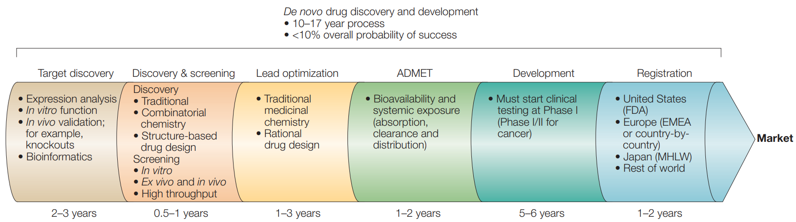
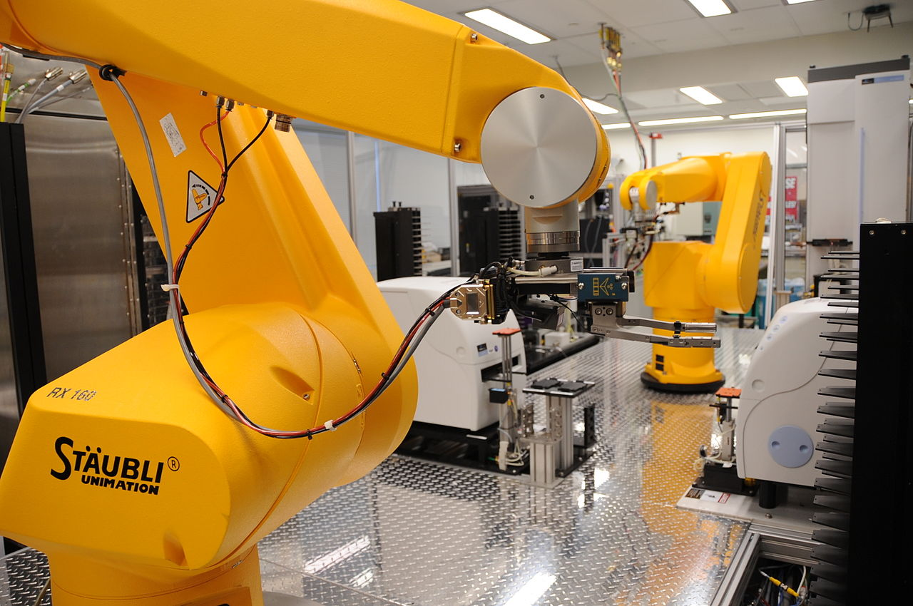

# 제17장 컴퓨터 기반 신약 개발과 임상시험

## 17.1 서론

지금까지 학습한 생명정보학 지식들은 궁극적으로 인간의 질병을 이해하고 치료하는 데 활용된다. 유전체학을 통해 질병의 유전적 원인을 파악하고, 차세대 염기서열 분석(NGS)으로 개인의 유전적 변이를 확인하며, 유전체 전장 연관성 분석(GWAS)을 통해 질병과 연관된 유전자를 발견하고, 암 유전체학을 통해 종양의 분자적 특성을 규명하는 모든 과정은 결국 효과적인 치료법 개발로 이어진다. 이러한 생명정보학적 발견들을 실제 환자의 치료에 적용하기 위해서는 결국 새로운 의약품의 개발이 필수적이다.

신약 개발은 현대 의학과 생명과학에서 가장 중요하면서도 도전적인 분야 중 하나이다. 전통적인 신약 개발 과정은 10-17년의 긴 시간과 약 13억 달러의 막대한 비용이 소요되며, 성공률은 10% 미만에 그치는 매우 복잡하고 어려운 과정이다. 그러나 앞서 학습한 생명정보학 기술들의 발전과 함께 컴퓨터 기반 신약 설계(Computer-Aided Drug Design, CADD)와 인공지능 기술이 신약 개발 과정에 도입되어 혁신적인 변화를 가져오고 있다.

생명정보학에서 축적된 방대한 유전체 데이터, 단백질 구조 정보, 그리고 질병-유전자 연관성 데이터는 신약 표적 발견의 핵심 자원이 되고 있다. 예를 들어, GWAS를 통해 발견된 질병 연관 유전자는 새로운 약물 표적이 될 수 있으며, NGS를 통해 밝혀진 암의 돌연변이 패턴은 정밀 의료용 표적 치료제 개발의 기초가 된다. 컴퓨터 기반 신약 설계는 이러한 생명정보학적 지식과 계산 화학, 분자 모델링 기술을 융합하여 표적 발견(target discovery), 리드 화합물 발굴(lead identification), 리드 최적화(lead optimization), 그리고 ADMET(Absorption, Distribution, Metabolism, Excretion, Toxicity) 예측 등의 단계에서 중요한 역할을 수행한다.

또한 컴퓨터 기반으로 개발된 신약 후보물질이 실제 환자에게 사용되기까지는 엄격한 임상시험 과정을 거쳐야 한다. 임상시험은 새로운 치료법의 안전성과 효능을 체계적으로 평가하는 과정으로, 전임상 연구부터 4상 임상시험까지 단계적으로 진행된다. 이 과정에서는 무작위 대조 임상시험, 맹검법, 통계적 분석 등 엄격한 과학적 방법론을 적용하여 치료법의 인과관계를 확립하고 근거 기반 의학의 토대를 마련한다. 특히 상관관계와 인과관계를 구분하는 것은 임상시험의 핵심이며, 이를 통해 환자에게 안전하고 효과적인 치료법을 제공할 수 있게 된다.

## 17.2 신약 개발 과정의 개요

### 17.2.1 전통적인 신약 개발 파이프라인

신약 개발 과정은 크게 전임상 단계와 임상시험 단계로 구분되며, 각 단계마다 엄격한 평가 기준을 통과해야만 다음 단계로 진행할 수 있는 체계적이고 순차적인 과정이다. 전체 과정은 다음과 같은 단계들로 구성된다:

**Figure 17.1** 신약 개발 과정 - 표적 발견부터 시장 출시까지의 파이프라인

**표적 발견 단계 (2-3년):**
이 단계는 질병과 관련된 분자적 표적을 식별하고 그 타당성을 검증하는 것이 핵심이며, 다양한 오믹스 기술이 활용된다:
- 발현 분석(expression analysis)
- 시험관 내 기능 연구(in vitro function)
- 생체 내 검증(in vivo validation)
- 유전자 제거 실험(knockouts)
- 생명정보학적 분석

**발견 및 스크리닝 단계 (0.5-1년):**
확인된 표적에 대해 활성을 나타내는 화합물을 찾아내는 것이 목표이며, 수만에서 수백만 개의 화합물을 체계적으로 검사하는 과정이 포함된다:
- 전통적 방법(traditional methods)
- 조합화학(combinatorial chemistry)
- 구조 기반 신약 설계(structure-based drug design)
- 시험관 내 스크리닝(in vitro screening)
- 생체 내 및 동물 실험(ex vivo and in vivo studies)
- 고처리량 스크리닝(high throughput screening)

**리드 최적화 단계 (1-3년):**
초기에 발견된 활성 화합물의 효능을 향상시키고 부작용을 최소화하는 과정으로, 의약화학자들이 화합물의 구조를 체계적으로 변형하여 더 나은 특성을 가진 후보물질을 개발한다:
- 전통적 의약화학(traditional medicinal chemistry)
- 합리적 신약 설계(rational drug design)

**ADMET 단계 (1-2년):**
개발된 화합물이 실제 생체 내에서 어떻게 작용하는지를 평가하며, 독성 여부를 확인하는 단계로 후보물질이 인체에 투여되기 전에 안전성을 사전에 평가하는 중요한 과정이다:
- 생체 이용률 및 전신 노출(bioavailability and systemic exposure)
- 흡수, 청소율 및 분포(absorption, clearance and distribution)

**개발 단계 (5-6년):**
전임상 연구와 임상시험을 포함하는 가장 긴 단계로, 동물 실험을 통한 안전성과 효능 확인 후 인간을 대상으로 한 임상시험이 1상부터 3상까지 순차적으로 진행된다:
- 1상 임상시험에서 시작하는 임상시험 (암 대상)

**등록 단계 (1-2년):**
각국의 규제 기관에 신약 승인을 신청하고 심사를 받는 과정을 거치며, 승인을 받은 후에야 시장에서 환자들에게 처방될 수 있다:
- 미국(FDA), 유럽(EMEA 또는 국가별), 일본(MHLW), 기타 지역에서의 승인

## 17.3 컴퓨터 기반 신약 설계 (CADD)

### 17.3.1 표적 발견 기술

표적 발견은 신약 개발의 첫 번째 단계로서, 질병의 원인이 되는 분자적 표적을 식별하고 그 타당성을 검증하는 과정이다. 현대 신약 개발에서는 전통적인 생화학적 접근법에서 벗어나 다양한 오믹스 기술을 활용한 체계적이고 포괄적인 접근이 이루어지고 있다.

**오믹스 기반 신약 발견:**
현대 신약 개발에서는 오믹스(omics) 기술들이 통합적으로 활용되어 포괄적이고 체계적인 신약 발견을 가능하게 한다. 이러한 다중 오믹스 접근법은 유전체학(genomics), 전사체학(transcriptomics), 단백체학(proteomics), 대사체학(metabolomics) 등을 통합하여 질병의 분자적 메커니즘을 종합적으로 이해하고 새로운 치료 표적을 발견하는 데 활용된다.

**Figure 17.2** 신약 발견을 위한 오믹스 기술

### 17.3.2 스크리닝 방법

스크리닝은 확인된 표적에 대해 활성을 나타내는 화합물을 발굴하는 과정으로, 전통적인 실험적 방법과 컴퓨터 기반 방법이 상호 보완적으로 활용되고 있다.

**고처리량 스크리닝 (High-Throughput Screening, HTS):**
고처리량 스크리닝은 로봇 자동화 시스템을 이용하여 수십만에서 수백만 개의 화합물을 빠르게 테스트하는 기술로, 현대 신약 개발에서 필수적인 도구가 되었다. 이 방법의 주요 목표는:
- "히트(hits)" 화합물의 발견
- "오프타겟(off-targets)" 효과의 최소화

HTS는 현재 완전 자동화된 로봇 시스템을 통해 수행되며, 이를 통해 동시에 많은 수의 화합물을 테스트할 수 있다. 이러한 자동화 시스템은 인간의 개입을 최소화하여 실험의 일관성을 보장하고, 대용량 스크리닝을 가능하게 한다.

**Figure 17.3** 고처리량 스크리닝 시스템

**Figure 17.4** HTS 로봇 자동화 시스템

**가상 스크리닝 (Virtual Screening, VS):**
가상 스크리닝은 컴퓨터 기반 계산 방법을 통해 히트 화합물을 찾는 기술로, 실험적 스크리닝에 앞서 후보 화합물을 사전에 선별하여 효율성을 크게 향상시킨다. 이 방법은 다음을 기반으로 한다:
- 표적 구조 (예: PDB 데이터베이스)
- 리간드 구조 (예: ChEMBL 데이터베이스)

가상 스크리닝의 핵심은 방대한 화학 데이터베이스를 활용하는 것이다. ChEMBL은 약물 유사 특성을 가진 생물활성 분자들의 수동 큐레이션된 데이터베이스로, 화학적 생물활성과 유전체 데이터를 결합하여 유전체 정보를 효과적인 새로운 약물로 변환하는 데 도움을 준다. ChEMBL 데이터베이스는 수백만 개의 화합물과 활성도 정보를 포함하고 있어, 이를 기반으로 가상으로 새로운 약물 후보를 체계적으로 탐색할 수 있다.

**Figure 17.5** ChEMBL 약물 데이터베이스

### 17.3.3 분자 도킹 (Molecular Docking)

분자 도킹은 컴퓨터 기반 신약 설계의 핵심 기술 중 하나로, 표적 단백질과 리간드 분자 간의 최적 결합 방식을 예측하는 계산 기법이다. 이 기술은 물리화학적 원리에 기반하여 분자 간 상호작용을 모델링하고, 가장 안정한 결합 구조를 예측한다.

**Figure 17.6** 분자 도킹

### 17.3.4 리드 최적화

리드 최적화는 신약 개발 과정에서 가장 중요하고 도전적인 단계 중 하나로, 초기 스크리닝에서 발견된 히트 화합물을 실제 치료제로 발전시키기 위한 체계적인 분자 설계 과정이다.

**Figure 17.7** 리드 최적화

**히트에서 리드로의 전환:**
초기 스크리닝에서 발견된 히트 화합물을 약물로 개발하기 위해서는 다방면의 특성을 동시에 개선해야 하는 체계적인 최적화 과정이 필요하다. 이 과정에서는 구조적 단순화와 리드 최적화를 통해 복잡한 구조를 더 간단하고 합성하기 쉬운 형태로 변환하면서도, 생물학적 활성은 유지하거나 향상시켜야 한다. 의약화학자들은 구조-활성 관계(Structure-Activity Relationship, SAR) 연구를 통해 분자의 어떤 부분이 활성에 필수적인지, 어떤 부분을 변형할 수 있는지를 체계적으로 파악한다.

리드 최적화 과정에서는 효능(potency), 선택성(selectivity), 약동학적 특성(pharmacokinetics), 독성(toxicity), 합성 용이성(synthetic accessibility) 등 다양한 요소를 고려하여 화합물의 구조를 개선하는 과정이다.

이러한 최적화 과정은 수백 개에서 수천 개의 유사체 화합물을 합성하고 평가하는 반복적인 과정을 통해 이루어진다.

**Figure 17.8** 히트에서 리드로의 전환 - 복잡한 구조를 간단하고 합성하기 쉬운 형태로 변환

### 17.3.5 ADMET 예측

ADMET는 약물의 흡수(Absorption), 분포(Distribution), 대사(Metabolism), 배설(Excretion), 독성(Toxicity)을 의미하며, 이러한 특성들은 약물의 효능과 안전성을 결정하는 핵심 요소들이다. 전통적으로 ADMET 특성은 개발 후반부에 평가되었지만, 현재는 신약 개발 초기 단계에서부터 예측하고 최적화하는 것이 일반적이다.

**ADME 특성:**
각 ADME 특성은 약물이 체내에서 겪는 일련의 과정을 나타낸다:
- **흡수**: 위장관에서의 약물 흡수 과정으로, 생체이용률과 직접적으로 연관된다. 흡수율은 약물의 용해도, 투과성, 안정성에 의해 결정된다.
- **분포**: 혈류를 통한 조직 분포 및 혈장 단백질 결합으로, 약물이 표적 조직에 도달하는 정도를 결정한다. 분포 용적과 단백질 결합률이 주요 지표이다.
- **대사**: 간에서의 효소에 의한 대사 과정으로, 약물의 반감기와 활성 지속 시간에 영향을 미친다. 주로 간의 사이토크롬 P450 효소군이 관여한다.
- **배설**: 신장을 통한 배설 및 장벽 통과로, 약물의 체내 축적을 방지하고 청소율을 결정한다.

**Figure 17.9** ADME 특성

**독성 예측:**
ADMET 과정에서 독성 예측은 특히 중요한 부분으로, 약물 개발 실패의 주요 원인 중 하나가 예상치 못한 독성 때문이다. 최근 연구에 따르면, 기계학습 소프트웨어가 화학물질의 독성 예측에서 동물 실험보다 우수한 성능을 보이는 것으로 나타났다. 이는 동물 실험의 한계를 극복하고 더 효율적인 안전성 평가를 가능하게 한다. 현대의 독성 예측 모델은 다양한 독성 종류(간독성, 심독성, 신독성 등)를 개별적으로 예측할 수 있으며, 구조-독성 관계(Structure-Toxicity Relationship)를 기반으로 한다.

**Figure 17.10** 동물실험을 능가하는 성능을 보인 기계학습

## 17.4 현대적 치료제 및 신약 개발 기술

### 17.4.1 항체-약물 접합체(ADC)

항체-약물 접합체(Antibody-Drug Conjugate, ADC)는 표적 단백질에 특이적으로 결합하는 단클론 항체와 강력한 세포독성 약물을 연결한 혁신적인 표적 치료제이다. ADC는 항체의 특이성과 세포독성 약물의 효능을 결합하여, 정상 세포에는 영향을 최소화하면서 암세포만을 선택적으로 제거할 수 있다.

**Figure 17.11** 항체-약물 접합체(ADC) 기술 - 단클론 항체와 세포독성 약물을 연결한 선택적 암 치료제

ADC 기술의 발전 역사는 지난 20여 년간 지속적인 혁신을 통해 이루어져 왔다. 초기 ADC들은 안정성과 효능 면에서 한계가 있었지만, 링커 기술의 발전과 새로운 세포독성 약물의 개발로 많은 개선이 이루어졌다.

**Figure 17.12** ADC 발전 역사 - 지난 20여 년간 초기 ADC에서 현대적 고효능 ADC로의 발전

### 17.4.2 CAR-T 세포 치료

CAR-T(Chimeric Antigen Receptor T-cell) 세포 치료는 환자의 T 세포를 추출하여 유전적으로 개조한 후 다시 환자에게 주입하는 개인맞춤형 면역 치료법이다. 이 기술은 특정 암 세포를 인식하고 공격할 수 있도록 설계된 인공 수용체를 T 세포에 도입하여, 자체 면역 시스템이 암을 보다 효과적으로 인식하고 제거할 수 있도록 한다. CAR-T 세포 치료의 효능과 안전성을 향상시키기 위해서 유전자 편집 기술이 적극적으로 활용되고 있다.

**Figure 17.13** CAR-T 세포 구조

### 17.4.3 PROTAC 기술

PROTAC(PROteolysis TArgeting Chimera)는 대상 단백질을 단백질 분해 시스템으로 유도하여 선택적으로 분해시키는 혁신적인 약물 개발 기술이다. 이 기술은 전통적인 단백질 억제와는 다른 접근 방식으로, 대상 단백질을 아예 제거하여 보다 지속적이고 강력한 치료 효과를 달성할 수 있다.

**Figure 17.14** PROTAC 발전 역사

### 17.4.4 면역 체크포인트 억제제

면역 체크포인트 억제제는 암 세포가 면역 시스템의 공격을 피하기 위해 사용하는 체크포인트 단백질을 차단하여, 면역 세포가 암 세포를 다시 인식하고 공격할 수 있도록 하는 혁신적인 치료법이다. PD-1/PD-L1 경로는 이러한 체크포인트 메커니즘의 대표적인 예시이다.

**Figure 17.15** PD-L1 체크포인트 억제제

## 17.5 인공지능 기반 신약 발견

인공지능과 기계학습 기술의 급속한 발전은 신약 발견 분야에 혁명적인 변화를 가져오고 있다. 전통적인 신약 개발이 직면한 높은 비용, 긴 개발 기간, 낮은 성공률 등의 문제를 해결하기 위해 AI 기술이 신약 개발의 모든 단계에 도입되고 있으며, 이는 패러다임의 근본적인 전환을 의미한다.

### 17.5.1 AI 기반 신약 발견 워크플로우

현대 신약 발견에서 인공지능은 전통적인 순차적 접근법을 대체하여 통합되고 순환적인 워크플로우를 제공한다. AI 시스템은 대용량 데이터를 동시에 처리하고 다중 목표를 최적화할 수 있어, 기존 방법론보다 훨씬 효율적인 신약 개발이 가능하다.

실제 사례를 보면, 인공지능 기반 접근법은 150만 개 이상의 화합물 라이브러리에서 시작하여 가상 스크리닝과 고처리량 스크리닝을 거쳐 각각 1,478개, 58,371개의 화합물 후보군으로부터 1,901개의 화합물을 선별하고, 최적화를 거쳐 최종적으로 10개의 화합물을 도출하는 효율적인 과정을 보여준다. 이는 전통적인 방법 대비 수백 배의 효율성 향상을 의미한다.

**Figure 17.16** AI 기반 신약 발견 워크플로우 예시

### 17.5.2 최신 AI 기법의 활용

신약 발견 분야에서는 다양한 최신 AI 기법들이 혁신적인 결과를 창출하고 있으며, 각각의 기술은 신약 개발의 특정 병목 지점을 해결하는 데 특화되어 있다.

**기계학습 기반 접근법:**
분자 도킹과 결합된 기계학습 접근법에서는 랜덤 포레스트(Random Forests) 알고리즘을 활용한 사례가 있다:
- 알려진 리간드 데이터를 이용한 모델 훈련
- 여러 리간드 형태(conformations)에 대한 분자 도킹 수행
- 미지의 화합물 라이브러리에 대한 가상 스크리닝 실시

**Figure 17.17** 랜덤 포레스트 알고리즘 예시 - 알려진 리간드 데이터로 모델 훈련 후 미지 화합물 가상 스크리닝

**딥러닝과 신경망 기법:**
최근에는 딥러닝 기법이 신약 발견의 핵심 도구로 부상하고 있다. 특히 다음과 같은 영역에서 혁신적인 성과를 보이고 있다:
- **분자 생성 모델**: VAE(Variational Autoencoder), GAN(Generative Adversarial Networks), Transformer 기반 모델들이 새로운 약물 분자를 생성한다.
- **분자 특성 예측**: 그래프 신경망(Graph Neural Networks)이 분자의 3차원 구조 정보를 활용하여 생물학적 활성을 예측한다.
- **약물-표적 상호작용 예측**: 멀티모달 딥러닝 모델이 단백질과 화합물의 상호작용을 정확하게 예측한다.

**단백질 구조 예측과 설계:**
AlphaFold의 성공 이후 단백질 구조 예측 분야에서 AI의 활용이 폭발적으로 증가했다. RFdiffusion과 같은 최신 AI 모델들은 단백질 구조 생성과 설계에 혁신적인 발전을 가져왔으며, 다음과 같은 응용이 가능하다:
- 새로운 표적 단백질의 구조 예측
- 기존 구조의 개선 및 최적화
- 완전히 새로운 기능을 가진 단백질 설계
- 단백질-단백질 상호작용 설계

이러한 기술들은 기존에 약물 디자인이 불가능하다고 여겨졌던 (undruggable) 표적들에 대한 새로운 접근 방법을 제시하고 있다.

### 17.5.3 AI 기반 신약 발견의 성공 사례

최근 몇 년간 AI 기반 신약 발견 분야에서 주목할 만한 성공 사례들이 등장하고 있어, 이 기술의 실용성과 잠재력을 입증하고 있다.

**COVID-19 치료제 개발:**
팬데믹 상황에서 AI 기술은 신속한 치료제 발굴에 중요한 역할을 했다. 기존 약물의 재사용(drug repurposing)을 위한 AI 모델들이 개발되어, 수개월 내에 유력한 후보 물질들을 식별했다. 예를 들어, 렘데시비르와 같은 기존 약물들이 AI 기반 스크리닝을 통해 COVID-19 치료제로 재용도화되었다 (https://www.sciencedirect.com/science/article/pii/S2949747724000290).

**알츠하이머병 치료제 개발:**
복잡한 신경퇴행성 질환인 알츠하이머병에 대해서도 AI 기반 접근법이 새로운 가능성을 제시하고 있다. 멀티오믹스 데이터를 활용한 AI 모델들이 새로운 표적을 발굴하고, 기존에 실패했던 접근법들의 한계를 극복하는 새로운 전략을 제시하고 있다.

**항생제 내성 문제 해결:**
AI 기술은 항생제 내성 문제 해결에도 기여하고 있다. 새로운 작용 기전을 가진 항생제 후보 물질들이 AI 기반 스크리닝을 통해 발굴되고 있으며, 기존 항생제의 효과를 증진시키는 조합 요법도 AI를 통해 개발되고 있다.

## 17.6 임상시험의 설계와 방법론

### 17.6.1 임상시험의 개요

임상시험은 새로운 약물의 안전성과 효능을 평가하기 위해 인간을 대상으로 수행되는 체계적인 연구이다. 임상시험은 엄격한 과학적 방법론과 윤리적 기준에 따라 설계되고 수행되어야 한다. 이러한 연구는 환자의 안전을 최우선으로 하면서도, 과학적으로 신뢰할 수 있는 결과를 도출하여 **근거 기반 의학**의 토대를 제공한다.

**Figure 17.18** 임상시험 과정

**근거 기반 의학과 근거의 위계:**
근거 기반 의학(Evidence-Based Medicine)은 현재 이용 가능한 최선의 과학적 근거를 통합하여 의학적 결정을 내리는 접근법이다. 모든 과학적 근거가 동등한 가치를 갖는 것이 아니라, 연구 설계의 엄격성과 방법론에 따라 질적 차이가 있다. 의학 연구에서 근거의 질은 피라미드 구조로 표현되며, 위에서부터 아래로 갈수록 근거의 질이 낮아진다:

**Figure 17.19** 근거의 피라미드

1. **체계적 고찰 및 메타분석 (Systematic Reviews & Meta-analyses)**: 최고 수준의 근거
2. **무작위 대조 임상시험 (Randomized Controlled Trials, RCT)**: 높은 수준의 근거
3. **코호트 연구 (Cohort Studies)**: 중간 수준의 근거
4. **사례-대조 연구 (Case-Control Studies)**: 낮은 수준의 근거
5. **사례 보고서 (Case Reports)**: 더 낮은 수준의 근거
6. **전문가 의견 (Expert Opinion)**: 가장 낮은 수준의 근거

사례 보고서와 전문가 의견은 근거 위계에서 가장 낮은 단계에 위치하지만, 새로운 의학 지식의 출발점이 되거나 다른 근거가 부족한 상황에서 의학 발전의 초기 단계에서 중요한 역할을 한다.

그러나 전문가 의견은 개인의 경험과 주관적 판단에 의존하는 특성상 체계적 편견이나 오류의 가능성이 높다. 역사적으로 많은 의학적 관행들이 전문가의 권위에 의존하여 오랫동안 유지되었지만, 후에 엄격한 과학적 연구를 통해 효과가 없거나 오히려 해로운 것으로 밝혀진 사례들이 있다. 따라서 근거 기반 의학에서는 전문가의 판단을 맹신하기보다는 객관적이고 재현 가능한 과학적 증거를 우선시하며, 전문가 의견은 다른 근거가 부족한 상황에서만 보조적으로 활용해야 한다.

**Figure 17.20** 권위에 대한 맹신의 위험성

**상관관계와 인과관계의 구분:**
임상시험의 관점에서 가장 중요한 개념 중 하나는 상관관계와 인과관계를 정확히 구분하는 것이다. 상관관계는 두 변수 간의 연관성을 의미하지만, 반드시 인과관계를 의미하지는 않는다. 많은 경우 강한 상관관계가 있어도 실제로는 제3의 변수(혼동 요인, confounding factor)나 우연의 일치에 의한 것일 수 있다.

진정한 인과관계를 확립하기 위해서는 다음과 같은 조건들이 충족되어야 한다:
- 시간적 순서의 확립 (원인이 결과보다 선행해야 함)
- 혼동 요인의 제거 (제3의 변수를 통제)
- 생물학적 개연성 (생물학적으로 합리적인 메커니즘)
- 용량-반응 관계 (노출량이 늘수록 효과 증가)

이러한 이유로 임상시험에서는 무작위 배정과 대조군 설정을 통해 인과관계를 확립하려고 한다. 무작위 배정은 알려진 및 알려지지 않은 모든 혼동 요인을 실험군과 대조군에 균등하게 분포시켜, 치료법의 순수한 효과만을 분리하여 평가할 수 있게 한다.

### 17.6.2 혼동 요인과 임상시험에서의 통제

혼동 요인(confounding factor)은 노출 변수(치료법)와 결과 변수(치료 결과) 모두에 영향을 미치는 제3의 변수로, 진정한 인과관계를 왜곡할 수 있는 요소를 말한다.

대표적인 예로 초콜릿 소비량과 노벨상 수상자 수 간의 상관관계를 들 수 있다. 한 연구에서는 국가별 1인당 초콜릿 소비량과 인구 1천만 명당 노벨상 수상자 수 사이에 강한 양의 상관관계(r=0.791, p<0.0001)가 발견되었다. 그러나 이는 명백한 가성 상관관계의 사례이다. 초콜릿은 일종의 사치품으로 볼 수 있고, 부유한 국가일수록 초콜릿 소비가 높은 편이다. 따라서 실제로는 국내총생산(GDP)이라는 혼동 요인이 존재한다고 볼 수 있으며, GDP가 초콜릿 소비량과 노벨상 수상자 수 모두에 인과적 영향을 미치는 진짜 원인일 수 있는 것이다.

**Figure 17.22** 초콜릿과 노벨상의 상관관계

**Figure 17.23** 혼동 요인

혼동 요인을 인식하는 것은 주장의 타당성에 대한 사전 믿음에 따라 달라질 수 있다. 상식적으로 받아들이기 어려운 주장("초콜릿을 먹기만 해도 뇌 기능이 좋아진다")에 대해서는 혼동 요인을 쉽게 의심하지만, 믿고 싶거나 그럴듯해 보이는 주장일수록 혼동 요인의 존재를 간과하기 쉽다. 예를 들어, 유럽연합 집행위원회가 발표한 "백신 접종률이 높을수록 사망률이 낮다"는 데이터는 많은 사람들이 사실로 받아들이기 쉽다. 그러나 이 경우에도 **국가별 소득 수준**이라는 중요한 혼동 요인이 존재한다. 경제적으로 발달한 국가일수록 백신 접종과 무관하게 우수한 의료 시스템으로 인해 사망률이 낮을 수 있는 것이다.

**Figure 17.21** 혼동 요인의 예시 - 백신 접종률과 사망률의 상관관계에서 국가별 경제 수준이 혼동 요인으로 작용함

**임상시험에서의 혼동 요인 통제:**
임상시험에서 흔히 접하는 혼동 요인들은 다음과 같다:
- **인구학적 요인**: 나이, 성별, 인종, 사회경제적 상태
- **질병 관련 요인**: 질병의 중증도, 유병 기간, 동반 질환
- **생활습관 요인**: 흡연, 음주, 운동, 식습관
- **치료 관련 요인**: 이전 치료 경험, 동반 약물 사용, 치료 순응도

**무작위 배정의 중요성:**
임상시험에서 혼동 요인을 통제하는 가장 일반적인 방법은 **무작위 배정(randomization)**이다. 무작위 배정은 알려진 혼동 요인뿐만 아니라 알려지지 않은 혼동 요인까지도 치료군과 대조군에 균등하게 분배한다. 이를 통해 두 군 간의 차이가 순수하게 치료법에 의한 것임을 보장할 수 있다.

무작위 배정의 핵심 장점은 연구자가 미처 고려하지 못한 혼동 요인들까지도 자동으로 통제된다는 점이다. 이러한 이유로 무작위 대조 임상시험은 근거 기반 의학에서 높은 수준의 근거로 평가받으며, 새로운 치료법의 효과를 입증하는 표준이 되고 있다.

### 17.6.3 임상시험의 단계

임상시험은 안전성과 효능을 체계적으로 평가하기 위해 단계적으로 진행된다. 각 단계는 특정한 목적과 방법론을 가지고 있으며, 이전 단계에서 얻은 결과를 바탕으로 다음 단계로 진행할지 결정한다.

**전임상 단계 (Preclinical):**
전임상 단계는 인간에게 적용하기 전에 실험실과 동물 모델에서 기본적인 안전성과 효능을 평가하는 단계이다. 이 단계에서는 다음과 같은 연구가 수행된다:
- 시험관 내 실험 (in vitro)
- 생체 내 실험 (in vivo)
- 기본적인 안전성 및 효능 평가

**1상 임상시험 (Phase I):**
1상 임상시험은 새로운 치료법의 첫 번째 인간 적용 단계로, 주로 안전성 평가에 중점을 둔다. 이 단계에서는 소수의 참여자를 대상으로 조심스럽게 용량을 증가시키면서 안전한 투여 범위를 찾는다:
- 참여자: 10-100명의 지원자
- 기간: 수개월
- 목적: 주로 안전성 평가, 적정 용량 결정
- 건강한 지원자 또는 환자를 대상으로 실시

**2상 임상시험 (Phase II):**
2상 임상시험은 1상에서 확인된 안전한 용량 범위 내에서 치료법의 효능을 평가하는 단계이다. 이 시점에서 연구자들은 치료법이 실제로 질병에 대해 치료 효과를 나타내는지 확인하고, 최적의 용량을 결정하기 위한 보다 정교한 분석을 수행한다:
- 참여자: 100-1,000명의 지원자
- 기간: 수개월에서 수년
- 목적: 안전성, 부작용, 그리고 효능 평가
- 특정 질환을 가진 환자를 대상으로 실시

**3상 임상시험 (Phase III):**
3상 임상시험은 임상개발의 마지막 단계로, 새로운 치료법이 기존 표준 치료법보다 우수하거나 최소한 동등한 효과를 보이는지 확인하는 결정적인 단계이다. 이 단계의 결과는 규제 당국의 승인 결정에 직접적인 영향을 미치며, 따라서 가장 엄격한 과학적 기준을 적용한다. 3상 임상시험에서 안전성과 효능이 성공적으로 입증되면, 해당 약물은 규제 당국(FDA, EMA 등)의 최종 승인을 받아 시장에 출시될 수 있다:
- 참여자: 100-10,000명의 지원자
- 기간: 2-10년
- 목적: 장기간 안전성과 확실한 효능 입증
- 대규모 다기관 연구로 진행

**4상 임상시험 (Phase IV):**
4상 임상시험은 시판 후 감시(post-marketing surveillance) 단계로, 치료법이 실제 임상 환경에서 사용될 때의 장기적인 안전성과 효능을 지속적으로 모니터링한다. 이 단계는 임상시험 환경에서는 발견하기 어려운 드문 부작용이나 특정 인구 집단에서의 특별한 반응을 탐지하는 데 중요한 역할을 한다:
- 시장 승인 후 무제한 지속적인 데이터 수집
- 대중에게 공개된 후 장기간 안전성 모니터링
- 드물게 나타나는 부작용 탐지

**Figure 17.24** 4상 임상시험 과정

**Figure 17.25** 4상 임상시험 결과 예시

### 17.6.4 임상시험 설계 원칙

임상시험의 가장 중요한 목적은 단순한 상관관계를 넘어서 진정한 인과관계를 확립하는 것이다. 앞서 논의한 바와 같이, 두 변수 간의 연관성만으로는 한 변수가 다른 변수를 직접적으로 유발한다고 결론내릴 수 없다. 임상시험의 설계 원칙들은 모두 이러한 인과관계 확립을 위해 혼동 요인을 통제하고 편견을 제거하는 데 초점을 맞추고 있다.

**무작위 배정 (Randomization)**
무작위 배정은 상관관계와 인과관계를 구분하는 가장 강력한 도구이다. 치료군과 대조군을 무작위로 배정함으로써, 치료법 이외의 모든 요인들이 두 군에 균등하게 분포되도록 한다. 이를 통해 관찰되는 결과의 차이가 순수하게 치료법에 의한 것임을 보장할 수 있다:
- **혼동 요인의 균등한 분포**: 알려진 요인(나이, 성별, 질병 중증도 등)과 알려지지 않은 요인 모두를 두 군에 고르게 분배
- **선택 편견의 제거**: 연구자나 환자의 주관적 판단이 군 배정에 영향을 미치지 않도록 방지
- **제3의 변수 효과 최소화**: 치료법과 결과 사이에 개입할 수 있는 다른 변수들의 영향을 통제

**맹검법 (Blinding)**
맹검법은 인과관계 확립에서 중요한 심리적 혼동 요인들을 통제하는 방법이다. 환자나 의료진이 치료법을 알고 있을 경우, 이러한 지식 자체가 결과에 영향을 미칠 수 있어 진정한 치료 효과와 심리적 효과를 구분하기 어려워진다. 맹검법을 통해 다음과 같은 편견을 제거할 수 있다:
- **위약 효과 통제**: 환자의 기대감이 실제 치료 효과와 분리되어 측정됨
- **관찰자 편견 제거**: 의료진의 선입견이 결과 평가에 미치는 영향 차단
- **행동 변화 방지**: 치료법 인지로 인한 환자나 의료진의 행동 변화 최소화

맹검법의 유형:
- **단일맹검 (Single-blind)**: 환자만 치료법을 모르는 경우
- **이중맹검 (Double-blind)**: 환자와 의료진 모두 치료법을 모르는 경우
- **삼중맹검 (Triple-blind)**: 환자, 의료진, 분석자 모두 치료법을 모르는 경우

### 17.6.5 통계적 분석 방법

임상시험 데이터의 적절한 통계적 분석은 연구 결과의 과학적 신뢰성을 확보하는 데 필수적이다. 다양한 연구 설계에 따라 적절한 통계적 지표를 선택하고 해석하는 것이 중요하며, 이를 통해 치료의 효과를 정량적으로 평가할 수 있다.

**위험비 (Risk Ratio, RR):**
위험비는 코호트 연구나 무작위 대조 임상시험에서 주로 사용되는 지표로, 노출군과 비노출군 간의 사건 발생 위험을 비교한다. RR이 1보다 클 경우 위험 증가를, 1보다 작을 경우 위험 감소를 의미한다:

RR = (실험군에서의 발생률) / (대조군에서의 발생률)

**오즈비 (Odds Ratio, OR):**
오즈비는 사례-대조 연구에서 주로 사용되는 지표로, 특정 노출이 있는 경우와 없는 경우의 오즈비를 비교한다. OR이 1보다 클 경우 양의 연관성을, 1보다 작을 경우 음의 연관성을 의미한다. 이 지표는 교차표 분석을 통해 계산된다:

OR = (a × d) / (b × c)

여기서 a, b, c, d는 2×2 교차표의 각 셀 값이다.

**백신 효능 (Vaccine Efficacy):**
백신 효능은 백신이 질병을 예방하는 능력을 나타내는 지표로, 전체 인구에서 백신 접종으로 인해 예방될 수 있는 질병 사례의 비율을 나타낸다. 100%에 가까울수록 높은 예방 효과를 의미한다:

VE = [1 - (백신 접종자에서의 사례 수 / 미접종자에서의 사례 수)] × 100%

### 17.6.6 COVID-19 백신 임상시험 사례

COVID-19 팬데믹 상황에서 신속하게 개발된 백신들의 임상시험은 현대적인 임상시험 방법론의 우수성과 효율성을 입증하는 대표적인 사례이다. 이러한 임상시험들은 전 세계적인 위기 상황에서도 과학적 엄격성을 유지하면서 신뢰할 수 있는 결과를 도출한 성공적인 사례로 평가된다.

**Pfizer/BNT162b2 백신 임상시험:**
Pfizer/BNT162b2 백신의 3상 임상시험은 대규모 무작위 대조 임상시험의 모범 사례로 여겨진다. 이 연구는 엄격한 과학적 기준과 계획된 국제적 협력을 통해 단기간에 신뢰할 수 있는 결과를 도출했다:
- 총 참여자: 44,320명
- 다국가 연구: 아르헨티나, 브라질, 독일, 남아프리카, 터키, 미국
- 인구학적 다양성 확보
- 백신 효능: 94.6% (2차 접종 후)
- 포괄적인 안전성 모니터링
- 다양한 평가 지표에서 백신군과 대조군 비교

**Figure 17.29** COVID-19 3상 임상시험 포함 기준 예시 - 다양한 인구학적 배경을 포함하여 연구 결과의 대표성 확보

**Figure 17.30** COVID-19 3상 임상시험 과정 예시

**Figure 17.31** COVID-19 3상 임상시험 결과 예시

이 연구는 대규모 무작위 대조 임상시험의 전형적인 예시로, 엄격한 방법론과 다양한 인구 집단을 포함한 포괄적인 평가를 보여준다.

### 17.6.7 임상시험 연구 설계의 중요성

연구 설계는 연구 결과의 신뢰성과 유용성을 결정하는 가장 중요한 요소이다. 잘 설계된 연구는 편견을 최소화하고 신뢰할 수 있는 결과를 도출하는 반면, 부실한 연구 설계는 아무리 정교한 통계 분석을 수행해도 의미 있는 결론을 도출하기 어렵다.

대표성 있는 연구 집단의 중요성을 위해서는 연구 대상이 전체 인구를 적절히 대표해야 한다. 만약 연구 대상이 특정 인구 집단에만 편중되어 있다면, 그 결과를 다른 인구 집단에 적용하기 어려울 수 있다. 편향된 연구 집단은 잘못된 결론으로 이어질 수 있다.

낙하산 임상시험 (Parachute Study)는 연구 설계의 중요성을 강조하기 위해 제시된 예시이다. 이 연구는 낙하산의 효능을 무작위 대조 임상시험으로 검증하자고 제안하면서, 자명한 사실에 대해서도 잘못된 연구 설계가 잘못된 과학적 결론으로 이어질 수 있음을 풍자적으로 보여주었다. 이 예시는 부적절한 연구 설계가 어떻게 잘못된 결론으로 이어질 수 있는지를 보여주는 예시이다. 이를 통해 대표성 있는 연구 집단의 중요성과 적절한 연구 방법론의 필요성을 보여준다.

**Figure 17.32** 낙하산의 치명률 RCT 연구 개요

**Figure 17.33** 낙하산의 치명률 RCT 연구 포함 기준

**Figure 17.34** 낙하산의 치명률 RCT 연구 결과

**Figure 17.35** 낙하산의 치명률 RCT 연구 각주 - 저자들의 재치를 볼 수 있음

### 17.6.8 멘델리안 무작위배정

멘델리안 무작위배정(Mendelian Randomization, MR)은 전통적인 관찰 연구에서 피할 수 없는 혼동 요인과 역인과관계의 문제를 해결하기 위해 개발된 혁신적인 연구 방법이다. 이 방법은 유전의 기본 원리인 멘델의 법칙을 활용하여, 유전적 변이가 자연적인 무작위 배정 도구 역할을 할 수 있다는 점에 착안하였다. 특히 GWAS(유전체 전장 연관성 분석) 데이터의 축적과 함께 최근 10년간 급속히 발전하고 있는 분야이다.

**기본 개념과 원리:**
멘델리안 무작위배정은 유전적 변이를 도구변수(instrumental variable)로 사용하여 인과관계를 추론하는 방법이다. 이 방법의 핵심은 부모로부터 자녀에게 유전자가 전달되는 과정이 본질적으로 무작위적이라는 멘델의 독립 분리 법칙에 기반한다. 즉, 개인이 특정 유전적 변이를 가지게 되는 것은 태생적으로 결정되며, 이후의 환경적 요인이나 생활 습관과는 독립적이다. 이러한 특성으로 인해 유전적 변이는 수정불가능하고 무작위로 배정되는 특성을 가지고 있어, 전통적인 무작위 대조 임상시험에서 달성하고자 하는 무작위 배정의 효과를 자연스럽게 만들어낸다.

MR 연구가 유효하기 위해서는 세 가지 핵심 가정이 충족되어야 한다: (1) 관련성 가정(relevance assumption) - 유전적 변이가 노출 변수와 강하게 연관되어야 함, (2) 독립성 가정(independence assumption) - 유전적 변이가 알려진 또는 알려지지 않은 혼동 요인과 연관되지 않아야 함, (3) 배제 제약 가정(exclusion restriction assumption) - 유전적 변이가 노출 변수를 통해서만 결과 변수에 영향을 미쳐야 함.

**적용 분야와 활용 사례:**
MR은 다양한 의학 연구 분야에서 활용되고 있다. 대표적인 예로는 혈중 콜레스테롤 수치와 심혈관 질환의 인과관계 규명, 비만과 당뇨병의 관계 분석, 알코올 섭취와 간질환의 연관성 평가 등이 있다. 특히 흡연과 폐암의 관계처럼 윤리적으로 무작위 대조 임상시험을 수행하기 어려운 경우나, 비타민 D 수치와 다양한 질병의 관계처럼 장기간의 노출 효과를 평가해야 하는 경우에 매우 유용하다.

**Figure 17.36** 멘델리안 무작위배정 - 유전적 변이를 도구변수로 사용하여 흡연과 폐암 사이의 인과관계 추론 

최근에는 약물 표적 발굴에도 활용되고 있는데, 특정 단백질의 기능을 모방하는 약물의 효과를 예측하기 위해 해당 단백질을 코딩하는 유전자의 변이를 분석하는 방식으로 사용되고 있다. 이를 통해 임상시험 전에 약물의 효능과 부작용을 미리 예측할 수 있어 신약 개발의 효율성을 높이는 데 기여하고 있다.

이러한 방법론적 발전과 함께 MR은 근거 기반 의학에서 중요한 도구로 자리잡고 있으며, 특히 관찰 연구의 한계를 보완하고 임상시험 설계에 중요한 정보를 제공하는 역할을 하고 있다.

## 17.7 결론

컴퓨터 기반 신약 설계와 임상시험은 현대 의학 발전의 핵심 동력이다. 인공지능과 기계학습 기술의 발전은 전통적인 신약 개발 과정을 혁신하고 있으며, 보다 효율적이고 비용 효과적인 신약 발견을 가능하게 하고 있다. 가상 스크리닝, 분자 도킹, ADMET 예측 등의 계산 기법들은 실험적 접근법과 상호 보완적으로 작용하여 신약 개발의 성공률을 높이고 개발 기간을 단축시키고 있다. 임상시험 분야에서도 엄격한 과학적 방법론과 통계적 분석을 통해 새로운 치료법의 안전성과 효능을 입증하는 체계가 지속적으로 발전하고 있다. 무작위 대조 임상시험을 비롯한 다양한 연구 설계 방법론들은 근거 기반 의학의 토대를 제공하며, 환자에게 최선의 치료를 제공하기 위한 과학적 근거를 마련한다. 앞으로 AI 기술과 디지털 헬스 기술의 발전, 실세계 증거의 활용, 개인 맞춤형 의학의 구현 등이 신약 개발과 임상시험 분야에 더욱 혁신적인 변화를 가져올 것으로 기대된다. 이러한 기술적 진보와 함께 국제적 협력과 데이터 공유를 통해 인류의 건강 증진에 기여하는 보다 효과적이고 안전한 의약품 개발이 가능할 것이다.