# 제2장 유전체학 기초

## 2.1 유전체와 유전체학의 기본 개념

### 2.1.1 유전체의 정의와 표준 유전체

유전체(Genome)는 한 생물체가 가지고 있는 모든 유전 정보의 총체이다. 생명정보학 연구에서는 개별 생물체의 유전체를 분석하기 위한 기준으로 표준 유전체(Reference Genome)를 사용한다. 표준 유전체는 한 종의 대표적인 유전체 서열로, 국제적인 협력을 통해 구축되고 지속적으로 개선된다.

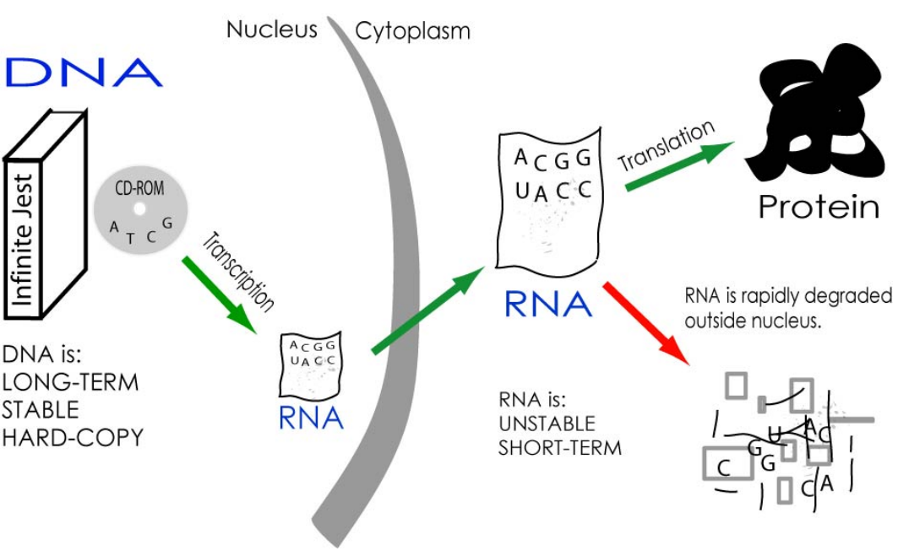

**Figure 2.1** Central Dogma의 기본 원리 - DNA에서 RNA, 단백질로 이어지는 유전정보의 흐름

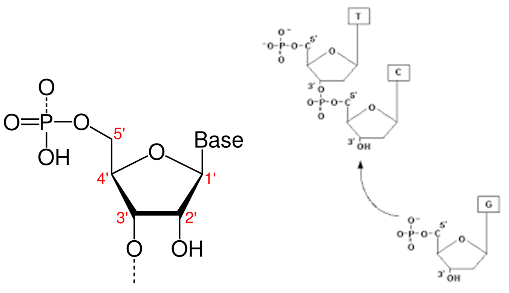

**Figure 2.2** DNA의 방향성 - 5'에서 3' 방향으로의 정보 흐름

유전체 참조 컨소시엄(Genome Reference Consortium, GRC)은 표준 유전체의 구축과 관리를 담당하는 국제 조직으로, 다음과 같은 기관들로 구성되어 있다:
- 미국 국립생물정보센터(The National Center for Biotechnology Information, NCBI)
- 워싱턴 대학교 맥도넬 유전체 연구소(The McDonnell Genome Institute at Washington University, MGI)
- 유럽 생명정보학 연구소(The European Bioinformatics Institute, EBI)
- 웰컴 생거 연구소(The Wellcome Sanger Institute)
- 제브라피시 모델 생물 데이터베이스(The Zebrafish Model Organism Database)
- 시궁쥐 유전체 데이터베이스(The Rat Genome Database)

GRC에서 관리하는 주요 생물종의 표준 유전체는 다음과 같다:
- 인간(Homo Sapiens): GRCh38.p14
- 생쥐(Mus Musculus): GRCm39
- 제브라피시(Danio Rerio): GRCz11
- 닭(Gallus Gallus): GRCg6a
- 시궁쥐(Rattus Norvegicus): GRCr8

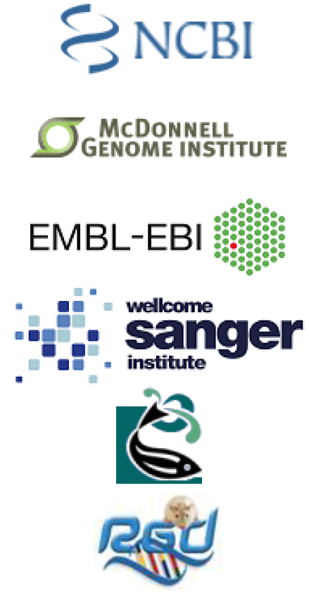

### 2.1.2 모델 생물

생명과학 연구에서는 다양한 모델 생물이 사용되며, 각 모델 생물에 대한 전문 데이터베이스가 존재한다:
- WormBase: 예쁜꼬마선충(C. Elegans) 관련 데이터베이스
- FlyBase: 초파리(Drosophila Melanogaster) 관련 데이터베이스
- The Arabidopsis Information Resource (TAIR): 애기장대(Arabidopsis Thaliana) 관련 데이터베이스
- Xenbase: 개구리(Xenopus Laevis) 관련 데이터베이스
- Saccharomyces Genome Database (SGD): 효모(Saccharomyces Cerevisiae) 관련 데이터베이스

위에서 언급한 생쥐와 제브라피시도 중요한 모델 생물이다.

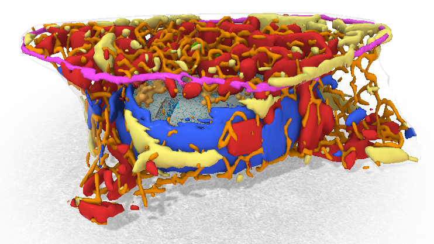

**Figure 2.3** 세포 구조 - 진핵세포와 원핵세포의 기본 구조

### 2.1.3 유전체 브라우저

유전체 데이터를 시각화하고 분석하기 위한 도구로 유전체 브라우저가 사용된다. 대표적인 유전체 브라우저는 다음과 같다:

- Ensembl Genome Browser: 유럽 생명정보학 연구소(EBI)에서 개발한 브라우저

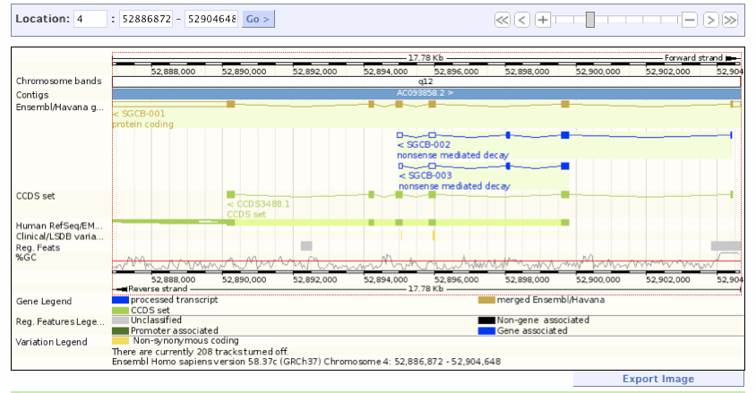

**Figure 2.4** Ensembl Genome Browser - 유전체 데이터 시각화 인터페이스

- UCSC Genome Browser: 미국 캘리포니아 산타크루즈 대학에서 개발한 브라우저

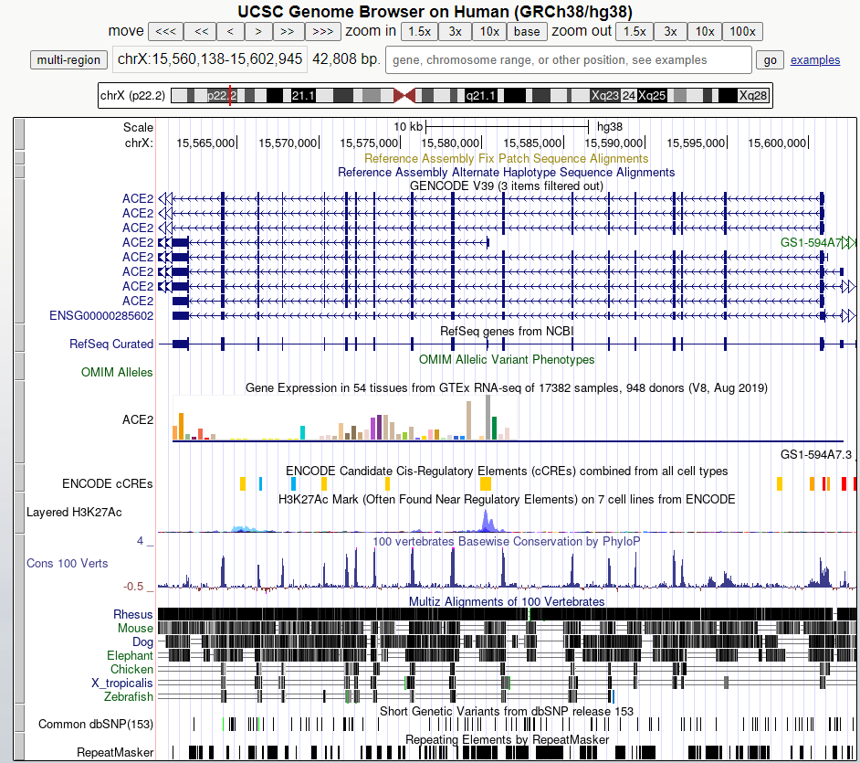

**Figure 2.5** UCSC Genome Browser - 통합 유전체 정보 시스템

## 2.2 유전적 다양성과 변이

### 2.2.1 핵형과 배수성

핵형(Karyotype)은 개체가 가지고 있는 염색체의 집합을 의미한다. 염색체의 수, 크기, 모양 등을 포함한다.

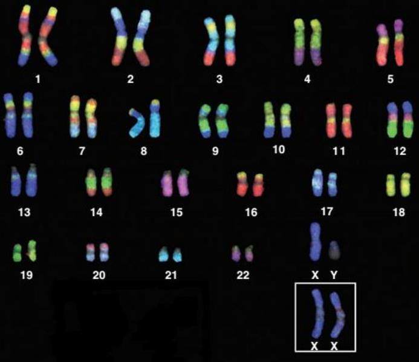

**Figure 2.6** 핵형 분석 - 인간 염색체 핵형 분석 결과

배수성(Ploidy)은 세포 내 염색체 세트의 수를 나타낸다:

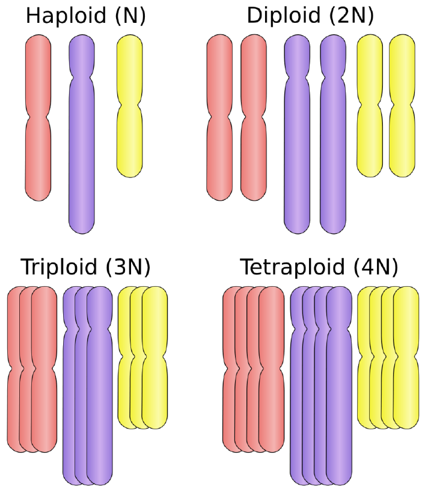

**Figure 2.7** 배수성 - 염색체 세트 수에 따른 분류
- 단배체(Haploid): 1개의 염색체 세트
- 이배체(Diploid): 2개의 염색체 세트
- 삼배체(Triploid): 3개의 염색체 세트
- 사배체(Tetraploid): 4개의 염색체 세트

예를 들어, 인간 세포는 이배체로, 각 염색체의 2개 복사본(부모로부터 각각 하나씩)을 가지고 있다.

### 2.2.2 유전형과 표현형

유전형(Genotype)과 표현형(Phenotype)은 유전학의 기본 개념이다:

- 표현형: 관찰 가능한 특성의 집합(예: 키, 몸무게, 색상 등)
- 유전형: 표현형에 기여하는 유전자 그룹
  - 대립유전자(Allele): 특정 유전자의 대안적 형태

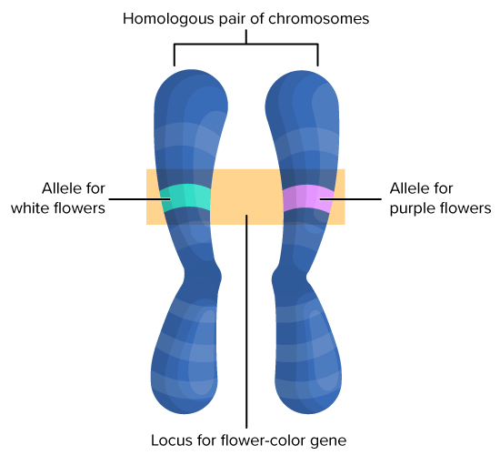

**Figure 2.8** 대립유전자 - 같은 유전자의 다른 형태

만약 우리가 유전형으로부터 표현형을 완벽하게 예측해낼 수 있다면, 이는 곧 데이터로부터 생명이라는 현상을 완전히 이해하게 되는 것으로 이해할 수 있다.
이는 사실상 생명정보학이 달성하고자 하는 궁극적인 목표라고도 볼 수 있을 것이다.

### 2.2.3 유전적 변이

유전적 변이(Variation)는 개체 간의 유전적 차이를 의미한다. 주요 유전적 변이 유형은 다음과 같다:

- 단일 염기 변이(Single Nucleotide Variations, SNVs): 단일 염기의 변화

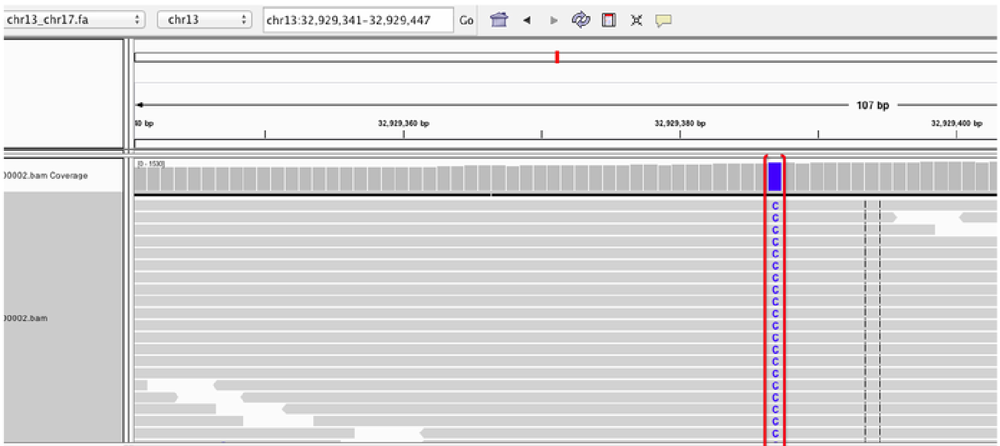

**Figure 2.9** 단일염기변이(SNV) - 단일 염기의 치환

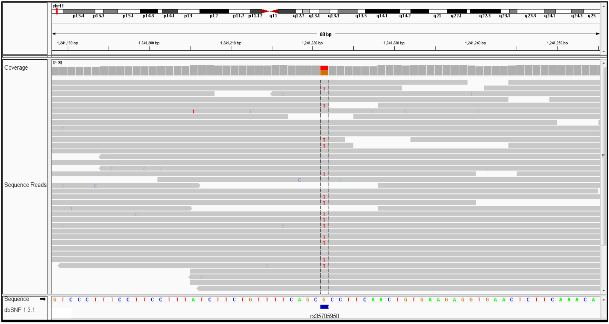

**Figure 2.10** 이형접합자 SNV - 두 개의 다른 대립유전자를 가진 단일염기변이

- 삽입 및 결실(Insertions and Deletions, INDELs): DNA 서열의 삽입 또는 결실

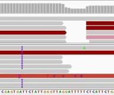

**Figure 2.11** 삽입결실변이(INDEL) - 작은 서열의 삽입 또는 결실

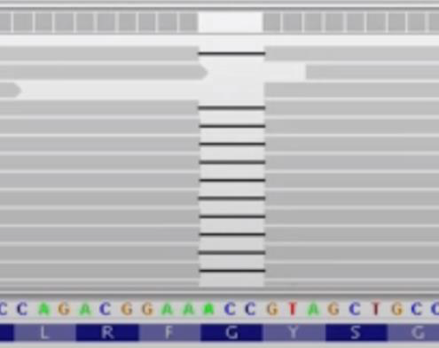

**Figure 2.12** 결실변이 - DNA 서열의 결실

- 구조적 변이(Structural Variations, SVs):
  - 복제수 변이(Copy Number Variations, CNVs): DNA 서열의 복사 수 변화
  - 대규모 삽입 및 결실

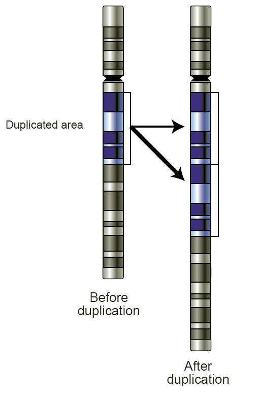

**Figure 2.13** 대규모 중복 - 큰 DNA 서열의 복사수 증가

  - 전위(Translocations), 역위(Inversions) 등

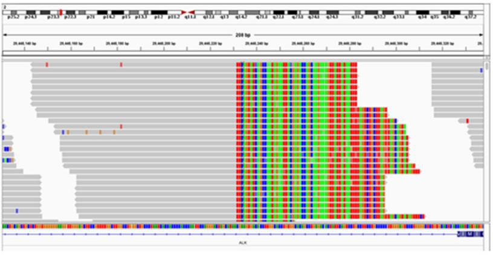

**Figure 2.14** 염색체 전좌 - 염색체 간 서열 이동

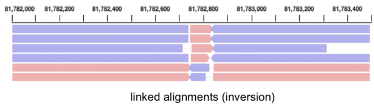

**Figure 2.15** 염색체 역위 - 염색체 내 서열 방향 뒤바뀜

유전적 변이는 발생 위치에 따라 다음과 같이 분류할 수 있다:

- 생식계 변이(Germline variants): 생식세포에 존재하는 변이로, 전체 유기체에서 발견됨
- 체세포 변이(Somatic variants): 특정 부위에만 영향을 미치는 변이

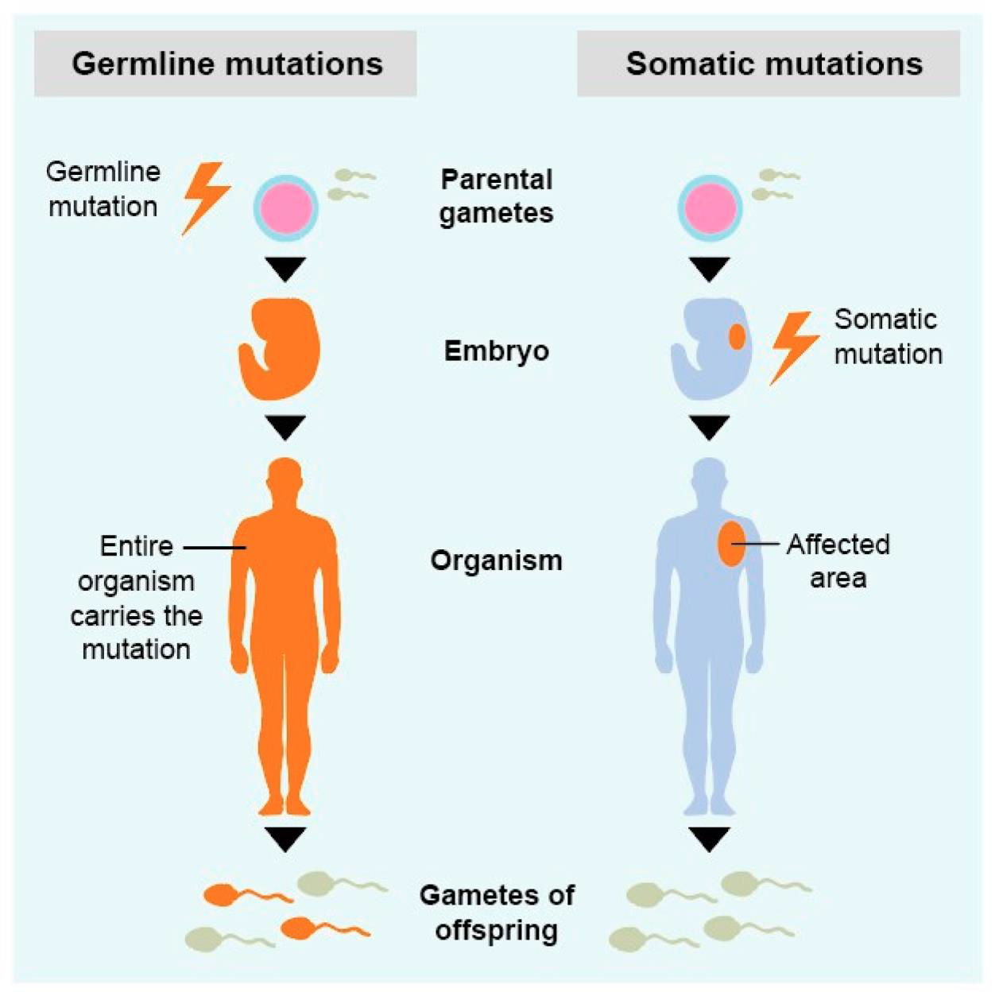

**Figure 2.16** 체세포변이와 생식계변이 - 변이 발생 위치에 따른 분류

단일 염기 다형성(Single Nucleotide Polymorphism, SNPs)은 인구 집단에서 흔하게 발견되는 생식계 SNV를 의미한다. 이와 관련된 중요한
개념으로 소수 대립유전자 빈도(Minor Allele Frequency, MAF)가 있으며, 이는 인구 집단 내에서 소수 변이 대립유전자의 빈도를 나타낸다.

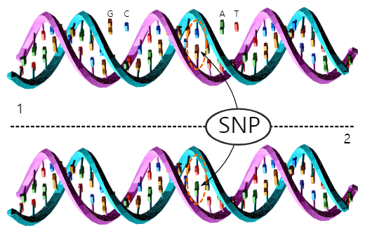

**Figure 2.17** 단일염기다형성(SNP) - 집단에서 흔한 유전적 변이

#### 변이 표기법

유전적 변이는 표준화된 표기법을 사용하여 기술된다:

**DNA 수준의 변이 표기:**
- 단일 염기 치환: C>T (시토신이 티민으로 변화)
- 삽입: A>ATCG (아데닌 다음에 TCG 서열 삽입)
- 결실: ATCG>A (TCG 서열이 결실되어 A만 남음)

**단백질 수준의 변이 표기:**
DNA 변이가 단백질 코딩 영역에 발생하면 아미노산 변화를 일으킬 수 있으며, 이는 다음과 같이 표기된다:

- p.Arg47His (47번째 위치의 아르지닌이 히스티딘으로 변화)
- p.Trp24* (24번째 위치의 트립토판이 정지코돈으로 변화, *는 정지코돈)
- p.Met1? (1번째 위치의 메티오닌에 변화가 있으나 정확한 결과 불명)

변이의 기능적 영향에 따른 분류:
- 동의 변이(Synonymous variant): 아미노산 변화 없음
- 비동의 변이(Missense variant): 다른 아미노산으로 변화
- 무의미 변이(Nonsense variant): 정지코돈으로 변화
- 프레임시프트 변이(Frameshift variant): 삽입/결실로 인한 읽기틀 변화

**코돈**

코돈(Codon)은 하나의 아미노산을 지정하는 3개의 연속된 염기서열을 말한다. 64개의 가능한 코돈 중 61개는 아미노산을 암호화하고, 3개는 번역 종료를 나타내는 정지코돈이다. DNA 변이는 코돈의 변화를 유발할 수 있다.

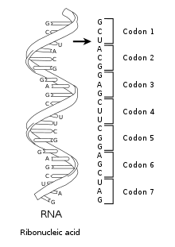

**Figure 2.18** 코돈 - 코돈의 개념

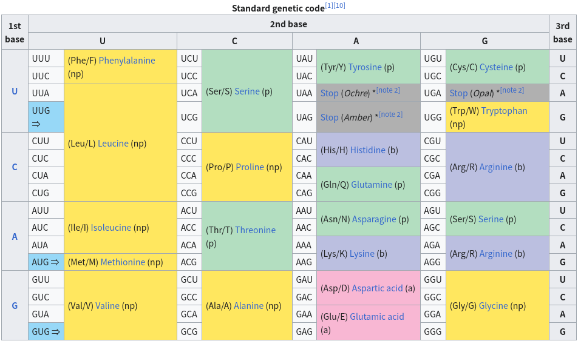

**Figure 2.19** 유전 코돈표 - 유전 암호와 아미노산 대응

## 2.3 인구집단 유전학 연구와 데이터베이스

### 2.3.1 1000 지놈 프로젝트(1000 Genome Project)

1000 지놈 프로젝트는 2008년 1월 미국, 영국, 중국의 협력으로 시작되었다. 초기에는 14개 인구집단에서 약 1,000명의 개인 유전체를 시퀀싱했으며(https://www.nature.com/articles/nature11632), 현재는 25개 인구집단에서 약 13,000명의 유전체가 시퀀싱되었다(https://www.internationalgenome.org/data-portal/sample). 이 프로젝트를 통해 변이 호출 포맷(Variant Call Format, VCF)이 탄생했다.

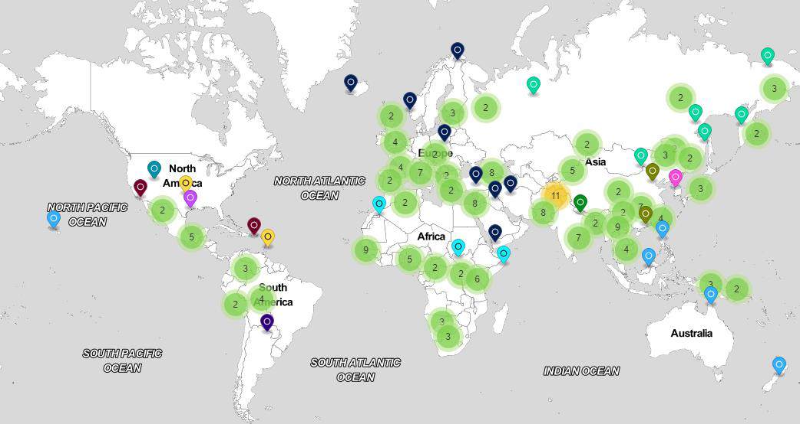

**Figure 2.24** 1000 Genomes Project - 인구집단 유전체 다양성 연구

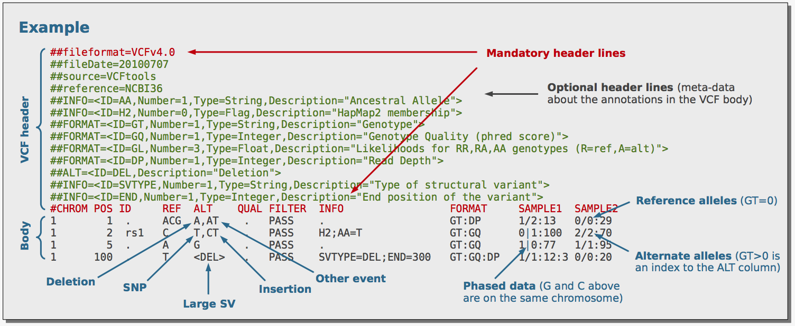

**Figure 2.25** VCF 형식 - 변이 정보 표준 포맷

### 2.3.2 유전체 통합 데이터베이스(gnomAD)

유전체 통합 데이터베이스(Genome Aggregation Database, gnomAD)는 이전에 "엑솜 통합 컨소시엄(Exome Aggregation Consortium, ExAC)"으로 알려졌으며, 엑손(단백질 코딩 영역)의 변이 데이터베이스이다. 현재 76,156명의 개인 유전체로부터 얻은 변이 데이터를 제공하고 있다.

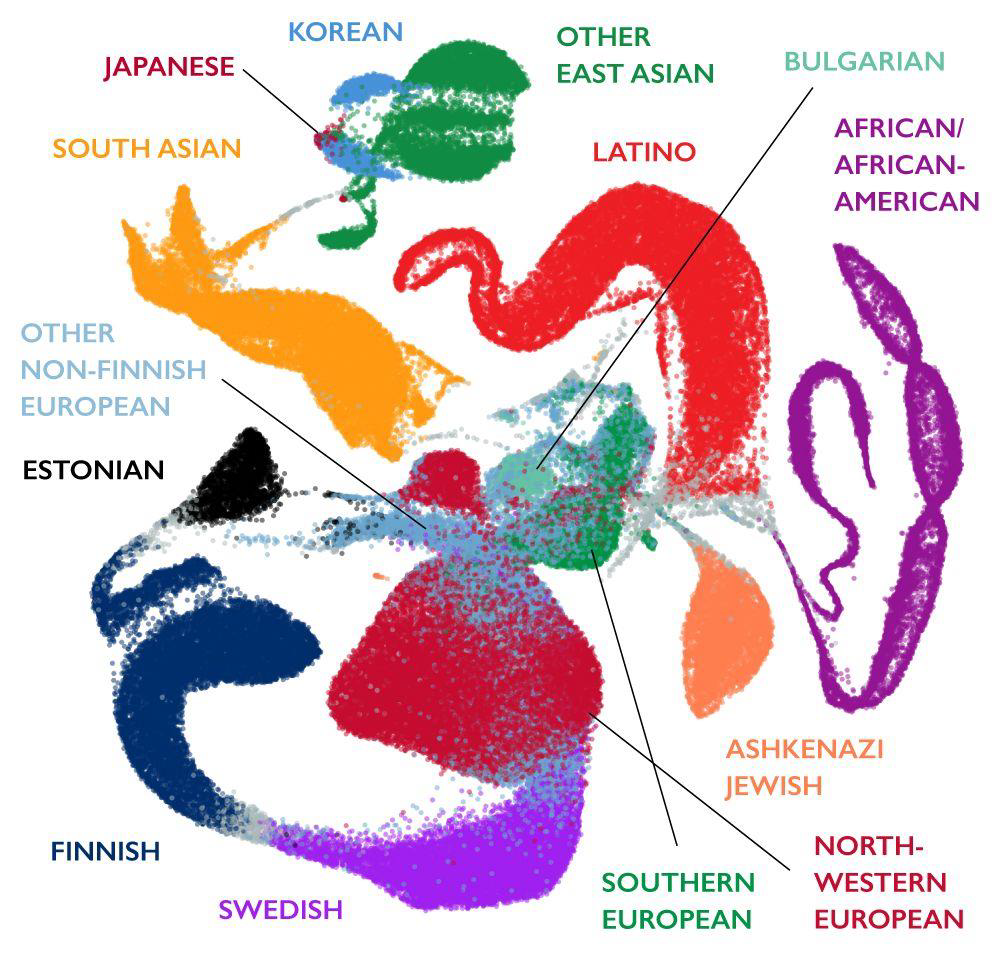

**Figure 2.26** gnomAD UMAP - 인구집단별 유전적 구조 시각화

### 2.3.3 dbSNP

dbSNP는 SNP를 포함한 소규모 변이의 무료 공개 데이터베이스로, 이미 1000 지놈 프로젝트, gnomAD 등의 데이터를 포함하고 있으며, 대립유전자 빈도도 제공한다. 이 데이터베이스는 미국 국립생물정보센터(NCBI)와 국립 인간 유전체 연구소(National Human Genome Research Institute, NHGRI)에서 관리한다.

### 2.3.4 유전적 질환 관련 데이터베이스

유전적 질환과 관련된 중요한 데이터베이스는 다음과 같다:
- Online Mendelian Inheritance in Man (OMIM): 멘델의 법칙을 따르는 유전질환 데이터베이스

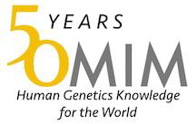

**Figure 2.27** OMIM 데이터베이스 - 멘델성 유전질환 정보

- ClinVar: NCBI에서 관리하는 유전변이와 질병 관계 데이터베이스

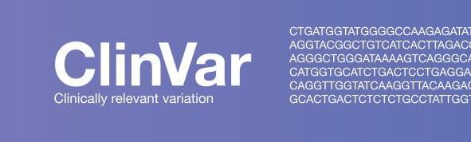

**Figure 2.28** ClinVar 데이터베이스 - 유전변이의 임상적 의미

### 2.3.5 희귀 변이 및 국가별 연구

희귀 변이에 대한 연구로는 영국의 UK10K 프로젝트가 있다.

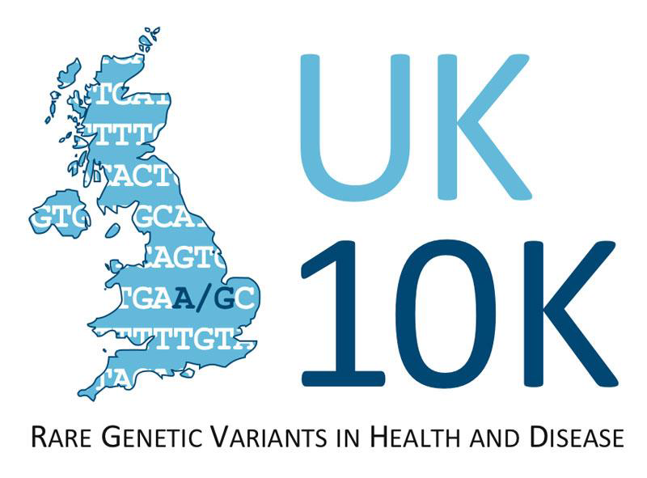

**Figure 2.29** UK10K 프로젝트 - 영국 인구집단 희귀변이 연구

한국에서는 울산 10K 프로젝트가 진행되고 있다.

**Figure 2.30** 울산 10K 프로젝트 - 한국인 유전체 연구

## 2.4 생물학적 경로와 단백질 구조

### 2.4.1 생물학적 경로

생물학적 경로(Pathway)는 표현형 변화를 일으키는 유전자 간의 상호작용 그룹을 의미한다. 중요한 생물학적 경로로는 다음과 같은 것들이 있다:
- 세포사멸(apoptosis) 경로
- DNA 복구 경로
- 암 관련 경로(예: Ras-Raf-MEK-ERK 경로)

### 2.4.2 유전자 집합 농축 분석

유전자 집합 농축 분석(Gene Set Enrichment Analysis, GSEA)은 쿼리 유전자를 기반으로 농축된 유전자 집합을 찾는 분석 방법이다. 관련 데이터베이스와 도구는 다음과 같다:
- GSEA: https://www.gseamsigdb.org/gsea/index.jsp

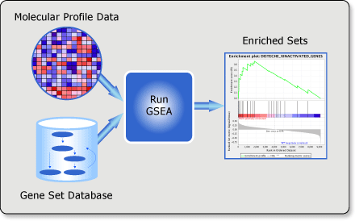

**Figure 2.31** GSEA 분석 - 유전자 집합 농축 분석 결과

### 2.4.3 단백질 구조 데이터베이스

단백질 데이터 은행(Protein Data Bank, PDB)은 세계 최대의 단백질 구조 데이터베이스로, 현재 188,085개의 단백질 구조 정보를 제공하고 있다. PDB 웹사이트는 다음과 같다:
- PDB: https://www.rcsb.org/

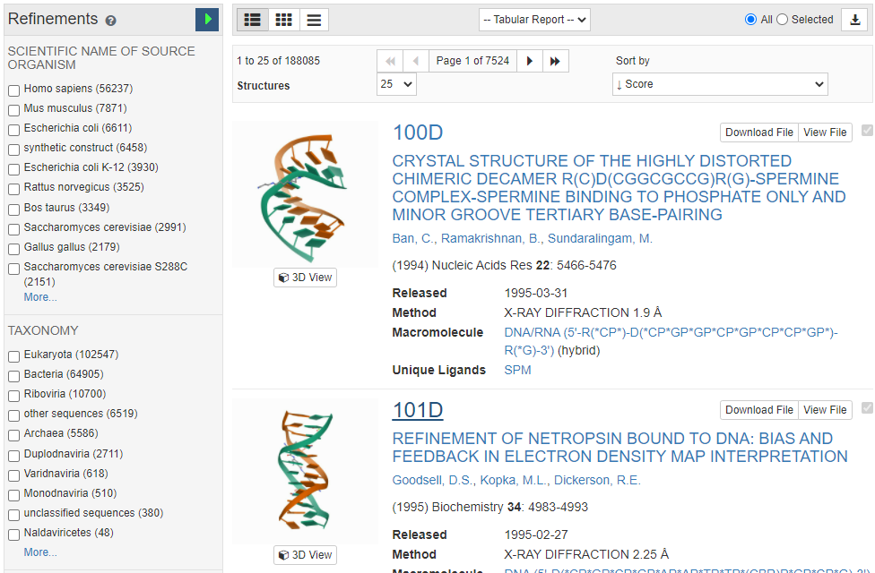

**Figure 2.32** PDB 데이터베이스 - 단백질 구조 정보 저장소

## 2.5 생명정보학 종합 리소스: NCBI

미국 국립생물정보센터(National Center for Biotechnology Information, NCBI)는 생명과학/생명공학과 관련된 모든 정보를 제공하는 종합적인 리소스이다.

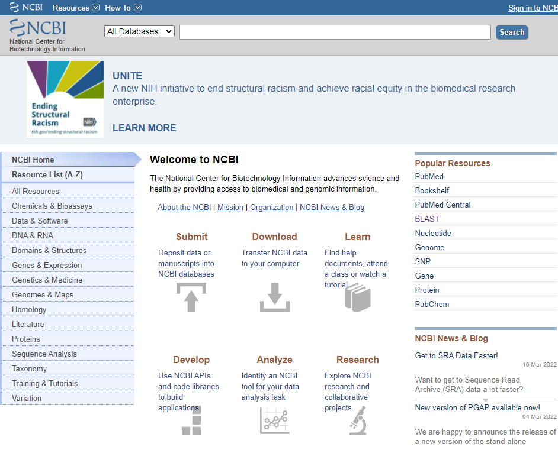

**Figure 2.33** NCBI 웹사이트 - 종합 생명정보학 리소스

NCBI 웹사이트는 다음과 같다:
- NCBI: https://www.ncbi.nlm.nih.gov/

NCBI에서 제공하는 중요한 서비스 중 하나로 PubMed가 있다. PubMed는 생명과학 및 의학 분야의 논문 데이터베이스로, 다음 웹사이트에서 접근할 수 있다:
- NCBI PubMed: https://pubmed.ncbi.nlm.nih.gov/

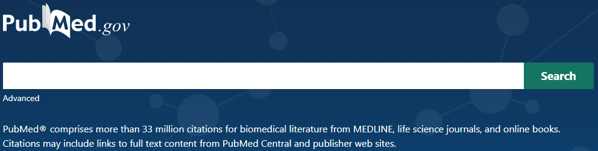

**Figure 2.34** PubMed - 생명과학 및 의학 논문 데이터베이스

## 2.6 생명정보학 데이터베이스의 활용

생명정보학 연구에서는 여러 데이터베이스를 통합적으로 활용하는 것이 중요하다. 유전체 데이터, 변이 정보, 표현형 정보, 단백질 구조, 생물학적 경로 등 다양한 데이터를 종합적으로 분석함으로써
생명 현상의 복잡한 메커니즘을 이해할 수 있으며, 이는 질환 연구를 할 때에 있어 특히 유용하다.

예를 들어, 특정 질환과 관련된 연구를 수행할 때, 다음과 같은 단계로 여러 데이터베이스를 활용할 수 있다:
1. NCBI나 Ensembl에서 관심 유전자의 기본 정보 확인
2. dbSNP이나 gnomAD에서 해당 유전자의 변이 정보 조사
3. OMIM이나 ClinVar에서 관련 질환 정보 확인
4. KEGG나 Reactome에서 해당 유전자가 관여하는 생물학적 경로 분석
5. PDB에서 관련 단백질의 구조 정보 확인
6. PubMed에서 관련 연구 논문 검색
