# 제3장 차세대 시퀀싱

## 3.1 차세대 시퀀싱의 개요

차세대 시퀀싱(Next Generation Sequencing, NGS)은 기존의 Sanger 시퀀싱 방법을 대체하는 고속 대용량 DNA 시퀀싱 기술이다. NGS 기술은 대량의 DNA 또는 RNA 단편을 병렬적으로 처리하여 단시간에 대용량의 시퀀스 정보를 생산할 수 있다. 이 기술의 등장으로 전체 유전체 시퀀싱(Whole Genome Sequencing, WGS)이 효율적으로 가능해졌으며, 이는 유전체학, 의학, 농업 및 생명과학 전반에 혁명적인 변화를 가져왔다.

## 3.2 주요 NGS 플랫폼의 이해

### 3.2.1 Illumina 시퀀싱 기술

Illumina는 현재 NGS 시장에서 가장 널리 사용되는 플랫폼으로, 높은 정확도와 광범위한 응용 프로그램을 제공한다.

Illumina 시퀀싱의 첫 단계는 Bridge PCR이라는 과정이다. 이 과정에서는:

1. DNA 단편이 어댑터가 부착된 상태로 플로우 셀(flow cell) 표면에 결합한다.
2. 각 DNA 단편이 구부러져 근처의 상보적인 어댑터와 결합한다(bridge 형성).
3. 중합효소가 상보적인 가닥을 합성한다.
4. 두 가닥이 변성되어 분리된다.
5. 이 과정이 반복되어 각 원본 DNA 단편으로부터 클러스터(cluster)가 형성된다.

Bridge PCR을 통해 동일한 DNA 단편의 수천~수백만 개의 복사본이 생성되어 시퀀싱 과정에서 신호를 증폭시키는 역할을 한다.

Illumina의 핵심 기술은 합성에 의한 시퀀싱(Sequencing by Synthesis, SBS)이다. 이 방법의 특징은:

1. 형광 표지된 가역성 종결자(reversible terminator) 뉴클레오티드를 사용한다.
2. 각 뉴클레오티드(A, T, G, C)는 서로 다른 색의 형광 물질로 표지되어 있다.
3. DNA 중합효소가 상보적인 뉴클레오티드를 하나씩 추가한다.
4. 각 주기마다 형광 신호를 이미징하여 추가된 뉴클레오티드를 식별한다.
5. 형광 표지와 종결자가 제거되어 다음 주기가 진행될 수 있도록 한다.

이 과정을 통해 클러스터 내의 모든 DNA 단편이 동시에 시퀀싱되며, 각 주기마다 한 개의 염기가 결정된다.


**Figure 3.1** Illumina 시퀀싱 원리 - Bridge PCR 및 SBS 과정

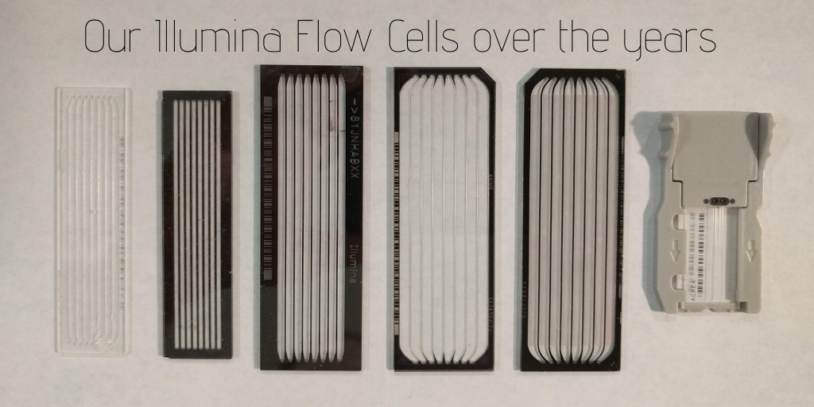

**Figure 3.2** Illumina 플로우 셀 - DNA 클러스터 생성을 위한 유리 슬라이드 표면

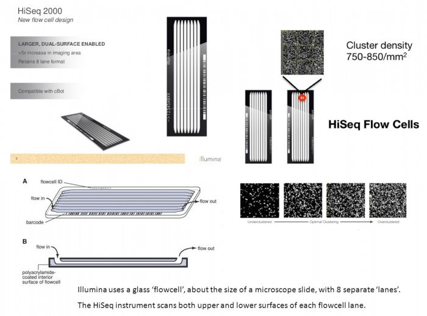

**Figure 3.3** Illumina 플로우 셀 세부사항 - 레인과 클러스터 구조

Illumina 기술의 특징 중 하나는 짧은 리드(Short Read)를 생성한다는 점이다. 일반적으로 리드 길이는 75bp에서 300bp까지 다양하며, 높은 정확도(99.9% 이상)를 가진다. 그러나 Short Read는 반복 서열이나 구조적 변이를 해석하는 데 제한이 있다. 이러한 Short Read는 참조 유전체(reference genome)가 있는 경우 변이 분석에 적합하지만, 새로운 유전체를 조립하는 데는 한계가 있다.

### 3.2.2 Long Read 시퀀싱 기술: Nanopore와 PacBio

#### 3.2.2.1 Nanopore 시퀀싱

Oxford Nanopore Technologies에서 개발한 Nanopore 시퀀싱은 전혀 다른 접근 방식을 사용한다. 나노포어 시퀀싱의 원리는 다음과 같다:

1. 단백질 나노포어(nanopore)가 전기적으로 저항성인 막에 삽입된다.
2. 전류가 나노포어를 통해 흐르게 된다.
3. DNA 또는 RNA가 나노포어를 통과할 때, 각 뉴클레오티드는 특정한 전류 차단 패턴을 생성한다.
4. 이 전류 변화를 모니터링하고 해석하여 염기 서열을 결정한다.

이 방법은 DNA 분자를 직접 읽기 때문에 PCR 증폭이나 화학적 표지가 필요하지 않다.

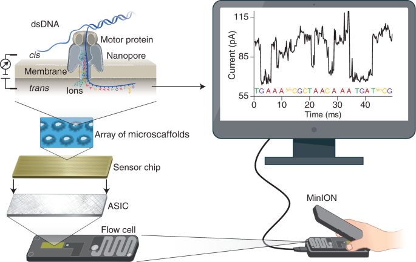

**Figure 3.4** Nanopore 시퀀싱 - 나노포어를 통한 전류 변화 감지

Nanopore의 가장 큰 장점은 Long Read를 생성할 수 있다는 점이다. 리드 길이에 이론적 제한이 없으며, 수백 kb 또는 그 이상의 리드가 가능하다. 실제로는 수십 kb의 평균 리드 길이가 일반적이다. 이러한 Long Read는 복잡한 유전체 영역, 구조적 변이, 반복 서열을 분석하는 데 매우 유용하다. 그러나 Nanopore 시퀀싱은 Illumina에 비해 단일 염기 정확도가 낮은 편(95-98%)이지만, 최근 기술 발전으로 정확도가 지속적으로 향상되고 있다.

#### 3.2.2.2 PacBio 시퀀싱

Pacific Biosciences에서 개발한 PacBio 시퀀싱은 단일 분자 실시간(Single-Molecule Real-Time, SMRT) 시퀀싱 기술을 사용한다. PacBio의 HiFi Sequencing은 고리 모양 DNA를 시퀀싱하는 방식으로 작동한다:

1. DNA가 SMRTbell이라고 부르는 고리 모양 구조로 준비된다.
2. SMRTbell은 샘플 DNA의 양쪽 끝에 어댑터가 부착되어 형성된다.
3. 이 고리 모양 구조로 인해 DNA 단편이 여러 번 반복적으로 시퀀싱된다.
4. 같은 DNA 단편을 여러 번 읽음으로써 컨센서스(consensus) 서열을 생성하여 정확도를 크게 향상시킨다.

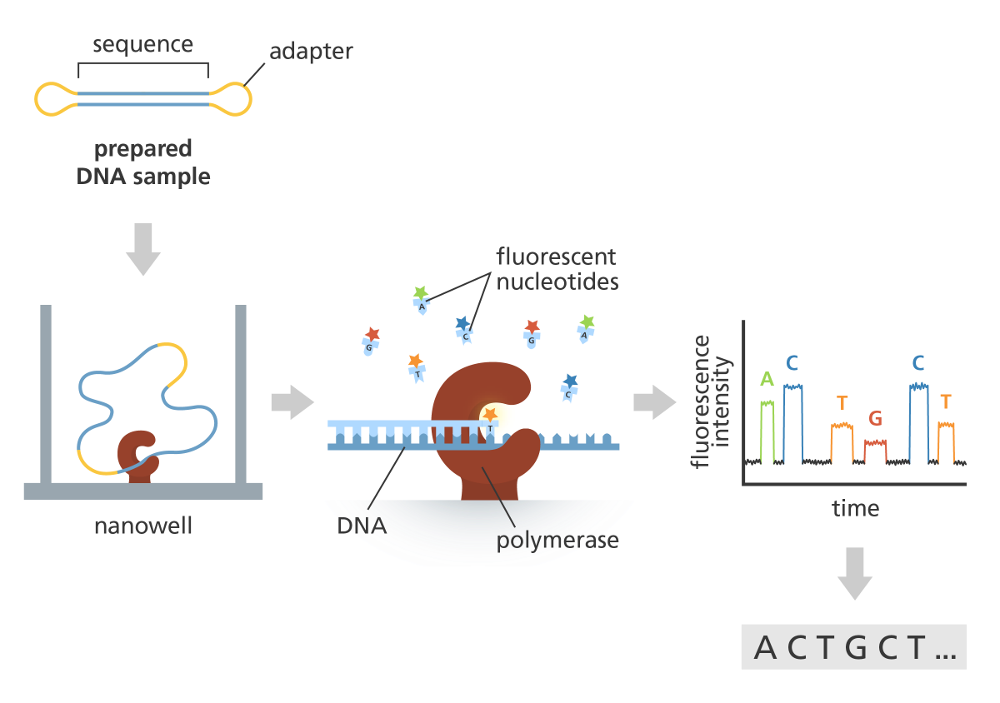

**Figure 3.5** PacBio HiFi 시퀀싱 - SMRTbell 구조와 반복 시퀀싱

HiFi 시퀀싱은 Long Read 기술임에도 불구하고 Illumina에 필적하는 높은 정확도(99.9% 이상)를 제공한다. PacBio 시퀀싱은 Nanopore와 마찬가지로 Long Read를 생성하는데, HiFi 리드는 일반적으로 10-25kb 길이이다. 이러한 Long Read 길이와 높은 정확도의 조합으로 유전체 조립(genome assembly)과 구조적 변이 분석에 이상적이다. 그러나 처리량(throughput)이 Illumina보다 낮고 비용이 높은 편이다.

**유전체 조립**

유전체 조립은 시퀀싱으로 생성된 짧은 DNA 단편들을 원래의 긴 염색체 서열로 재구성하는 과정이다. 현재는 Short Read와 Long Read를 혼합하여 사용하는 하이브리드 조립 방법이 주로 사용되고 있다. Short Read는 높은 정확도를 제공하고, Long Read는 반복 서열과 구조적 변이 해결에 유리하여, 두 기술을 조합하면 더욱 완전하고 정확한 유전체 조립이 가능하다.

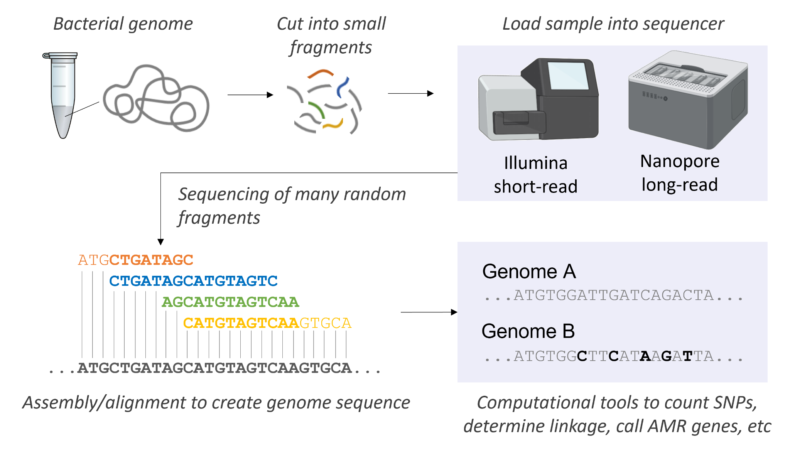

**Figure 3.6** 유전체 조립 - DNA 단편들을 원래의 염색체 서열로 재구성

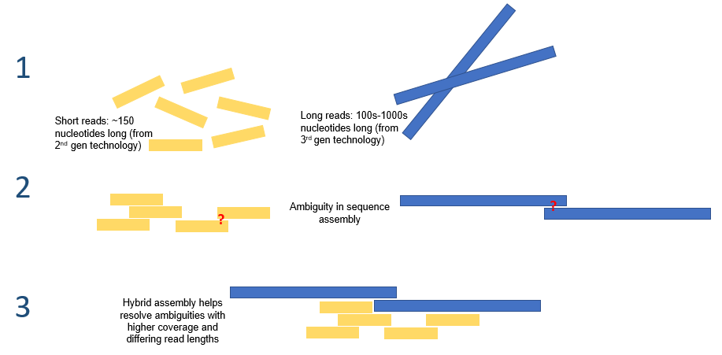

**Figure 3.7** Long Read와 Short Read 하이브리드 조립 - 두 기술의 장점을 결합한 조립 방법


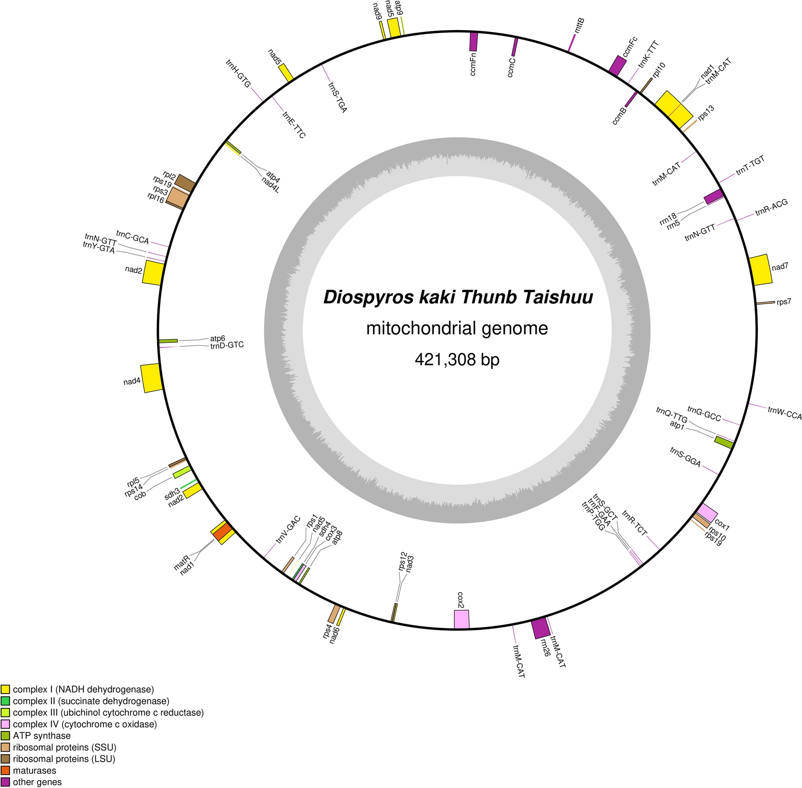

**Figure 3.8** 미토콘드리아 유전체 조립 - 미토콘드리아 유전체의 원형 구조와 유전자 배치를 보여주는 원형 플롯

## 3.3 Illumina 시퀀싱 시스템의 구조

### 3.3.1 플로우 셀과 시퀀싱 칩의 이해

Illumina 시퀀싱의 핵심 구성 요소인 플로우 셀(flow cell)은 유리 슬라이드 기반의 표면으로, DNA 클러스터가 생성되는 장소이다. 표면에는 DNA 라이브러리와 결합하는 올리고뉴클레오티드가 고밀도로 부착되어 있으며, 여러 개의 레인(lane)으로 나누어져 있어 여러 샘플을 동시에 처리할 수 있다. 또한 시약이 흐르는 미세유체 채널 네트워크를 포함하고 있다.

시퀀싱 칩과 플로우 셀의 설계는 Illumina 시퀀서의 모델에 따라 다르며, 처리량과 리드 길이 간의 균형을 최적화하도록 설계되어 있다.

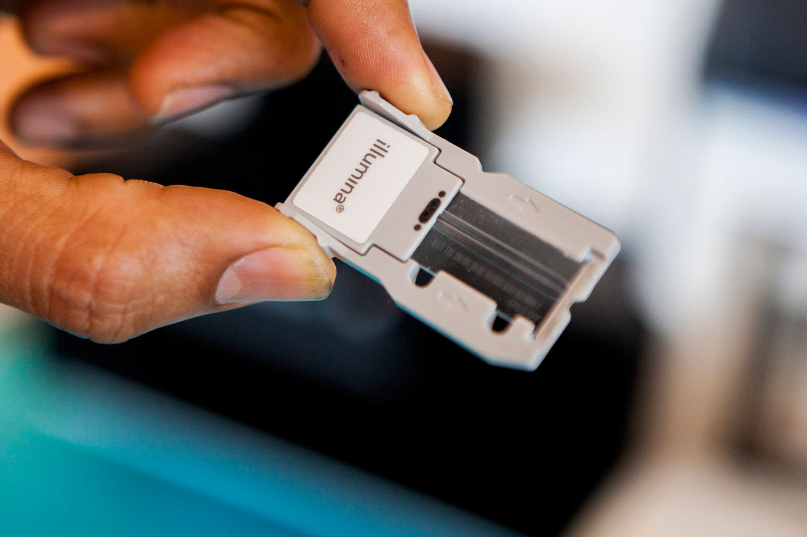

**Figure 3.9** Illumina 시퀀싱 칩 - 플로우 셀의 물리적 구조

## 3.4 NGS 시퀀싱 라이브러리의 구조

NGS 분석을 위해서는 DNA 또는 RNA 샘플을 시퀀싱 라이브러리로 변환해야 한다. 시퀀싱 라이브러리는 다양한 기능적 요소를 포함하는 어댑터 시퀀스로 둘러싸인 DNA 단편들로 구성된다.


**Figure 3.10** Illumina 라이브러리 구조와 시퀀싱 - 어댑터 시퀀스와 기능적 요소들

### 3.4.1 라이브러리 어댑터 구성요소

#### 3.4.1.1 P5 및 P7 어댑터 시퀀스

Illumina 라이브러리에서 P5와 P7 시퀀스는 DNA 단편의 양쪽 끝에 부착되는 어댑터의 핵심 부분이다:
- P5와 P7 시퀀스는 플로우 셀 표면에 결합하여 Bridge PCR을 가능하게 한다.
- 이 시퀀스들은 각각 다른 올리고뉴클레오티드와 상보적으로 결합하여 DNA 라이브러리가 플로우 셀에 올바른 방향으로 부착되도록 한다.
- P5는 일반적으로 Forward 리드에 연결되며, P7은 Reverse 리드에 연결된다.

#### 3.4.1.2 인덱스 시퀀스 (바코드)

인덱스(Index, 또는 바코드라고도 함)는 다음과 같은 특성을 가진다:
- 동일한 시퀀싱 런에서 여러 샘플을 구분하는 데 사용되는 고유한 시퀀스이다.
- 일반적으로 6-12bp 길이의 시퀀스이다.
- Index 1은 보통 P7 어댑터 가까이에, Index 2는 P5 어댑터 가까이에 위치한다.
- 듀얼 인덱싱(dual indexing)은 두 개의 인덱스를 사용하여 더 많은 샘플 조합을 가능하게 한다.
- 이러한 멀티플렉싱(multiplexing)을 통해 하나의 시퀀싱 런에서 여러 샘플을 동시에 처리함으로써 비용 효율성을 크게 향상시킨다.

#### 3.4.1.3 시퀀싱 프라이머 결합 부위

시퀀싱 프라이머 결합 부위는 실제 시퀀싱 반응이 시작되는 위치를 제공한다:
- Read1 시퀀싱 프라이머 결합 부위는 P5 어댑터 영역 내에 위치한다.
- Read2 시퀀싱 프라이머 결합 부위는 P7 어댑터 영역 내에 위치한다.
- 이 프라이머 결합 부위들은 시퀀싱 반응이 샘플 DNA 삽입물(insert)의 양 끝단에서 시퀀싱이 진행되도록 한다.


**Figure 3.11** 시퀀싱 프라이머 요구사항 - 시퀀싱 반응 시작을 위한 프라이머 결합 부위

## 3.5 시퀀싱 리드의 특성과 유형

Illumina 시퀀싱에서 Read 1과 Read 2는 각각 다른 시퀀싱 프라이머 다음부터 시작된다. Read 1은 Read1 시퀀싱 프라이머 다음에서, Read 2는 Read2 시퀀싱 프라이머 다음에서 시작되며, 두 리드는 DNA 단편의 반대 말단에서 시작된다.

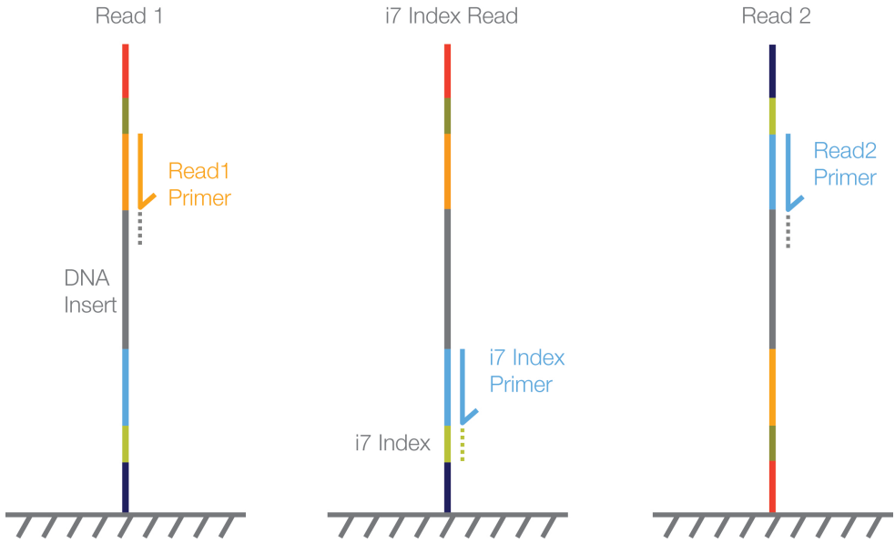

**Figure 3.12** Read1과 Read2 - DNA 단편 양쪽 끝에서의 시퀀싱 방향

일반적인 Illumina 시퀀싱은 각 방향에서 75bp, 100bp, 150bp 또는 250bp를 읽는다. 리드 길이는 시퀀서 모델과 키트에 따라 달라지며, 더 긴 리드는 더 많은 정보를 제공하지만 시퀀싱 비용이 증가한다.

DNA 삽입물(insert)이 리드 길이보다 짧은 경우, 리드가 반대쪽 어댑터 시퀀스를 포함할 수 있다. 이를 "리드 스루(read-through)"라고 하며, 분석 전에 어댑터 시퀀스를 트리밍(trimming)해야 한다. 이는 중복 정보를 제공하므로 시퀀싱 정확도를 향상시킬 수 있다.

### 3.5.1 페어드 엔드와 싱글 엔드 시퀀싱

페어드 엔드 시퀀싱(Paired-end sequencing)은 같은 DNA 단편의 양쪽 끝에서 시퀀싱하는 방식이다. Read 1과 Read 2 사이의 거리(insert size)를 알고 있기 때문에 정렬 정확도가 향상되며, 구조적 변이 감지, 유전체 조립, 반복 영역 해석에 유용하다. 다만 데이터 용량이 더 크고, 시퀀싱 시간과 비용이 더 많이 든다.

싱글 엔드 시퀀싱(Single-end sequencing)은 DNA 단편의 한쪽 끝만 시퀀싱하는 방식이다. 더 빠르고 비용이 적게 들지만, 정보량이 적다. 단순한 유전자 발현 분석이나 작은 변이 검출과 같은 응용에 적합하다.

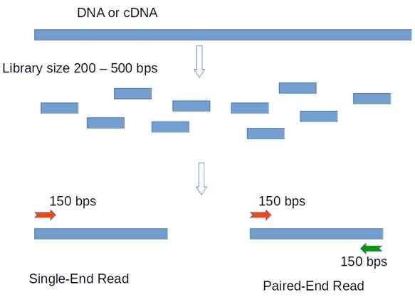

**Figure 3.13** 싱글 엔드와 페어드 엔드 시퀀싱 - 두 방식의 차이점과 특징

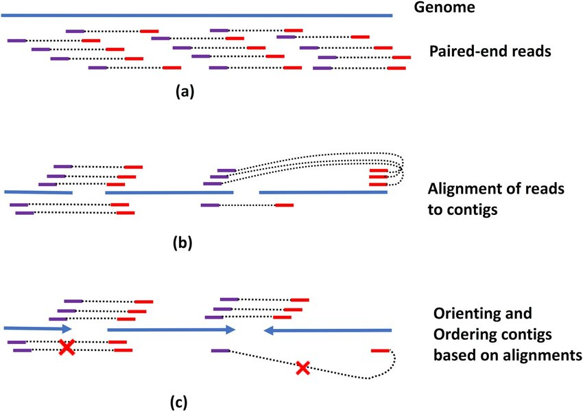

**Figure 3.14** 페어드 엔드 시퀀싱 세부 - 구조적 변이 감지를 위한 리드 쌍 분석

## 3.6 Fastq 파일 형식과 구조

Fastq는 시퀀싱 데이터를 저장하는 표준 파일 형식으로, 시퀀스와 품질 정보를 모두 포함한다. 첫 번째 줄은 '@' 문자로 시작하고 리드 식별자를 포함한다:
```
@M04695:276:000000000-J9Y5P:1:1101:9698:1015 1:N:0:1
```

이 식별자는 기기 ID, 런 번호, 플로우셀 ID, 레인 번호, 타일 번호, X 좌표, Y 좌표, 리드 번호, 필터 플래그, 컨트롤 번호, 인덱스 번호 등의 정보를 포함한다.

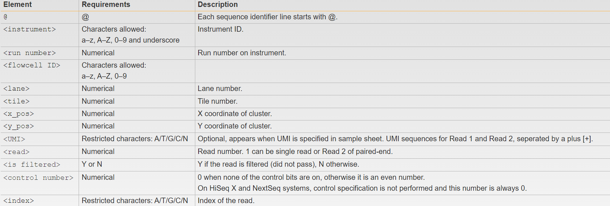

**Figure 3.15** Fastq Illumina 형식 - 시퀀싱 데이터의 표준 파일 형식과 구조

두 번째 줄은 시퀀싱된 염기 서열을 포함하며, 세 번째 줄은 '+' 문자로 시작한다. 네 번째 줄은 두 번째 줄의 각 염기에 대한 품질 점수를 ASCII 문자로 인코딩하여 포함한다.

Fastq 파일의 예제:
```
@M04695:276:000000000-J9Y5P:1:1101:9698:1015 1:N:0:1
NAGACGACTCTCCCCGCTATAGATN
+
#8ACCGGGGGGEF@CFGGGGFGGG#
@M04695:276:000000000-J9Y5P:1:1101:8957:1016 1:N:0:1
NTCAGCAAGAAGCCCCATCGAGATN
+
#8ACCGEGGGGGCFFGGGGGGGGG#
@M04695:276:000000000-J9Y5P:1:1101:12031:1016 1:N:0:1
NTAATCAATACGCCGCGGTTAGATN
+
#8ACCGGGGGGGGGGGGGGGGFGG#
```

페어드 엔드 시퀀싱에서는 두 개의 별도 Fastq 파일이 생성되며(예: sample_R1.fastq, sample_R2.fastq), 첫 번째 파일은 Read 1 시퀀스를, 두 번째 파일은 Read 2 시퀀스를 포함한다. 두 파일의 리드 순서는 일치하여, 각 파일의 n번째 리드는 서로 대응된다. 두 Fastq 파일은 정확히 같은 수의 리드를 포함하며, 리드 식별자는 리드 번호(1 또는 2)를 제외하고 동일하다.

### 3.6.1 시퀀싱 품질 정보의 이해

품질 정보는 Phred 품질 점수를 사용하여 인코딩된다. Phred 점수(Q)는 염기 호출 오류 확률(P)과 로그 관계가 있다: Q = -10 * log₁₀(P). 예를 들어, Q10은 10% 오류 확률, Q20은 1% 오류 확률, Q30은 0.1% 오류 확률(일반적으로 '고품질'로 간주됨), Q40은 0.01% 오류 확률을 의미한다.


**Figure 3.16** Phred 점수 - 염기 호출 품질을 나타내는 지표

ASCII 문자는 Phred 점수를 나타내는 데 사용되며, 현재 표준인 Illumina 1.8+ 형식은 ASCII 33 오프셋(! = Q0, " = Q1, ... J = Q41, ...)을 사용한다. 이러한 품질 점수는 다운스트림 분석에서 필터링, 트리밍, 변이 호출 신뢰도 측정에 사용된다.


**Figure 3.17** ASCII 코드와 Phred 점수 - 품질 점수의 ASCII 문자 인코딩

## 3.7 NGS 데이터의 정렬과 알고리즘

시퀀싱된 리드는 참조 유전체(reference genome)에 정렬하여 리드의 유전체 내 위치를 결정한다. 정렬기(aligner)는 각 리드의 가장 가능성 높은 유전체 위치를 찾는 소프트웨어 도구로, 여러 가능한 위치 중에서 최상의 일치 항목을 식별하고 불일치(mismatch)와 갭(gap)을 허용한다.

서열 유사성 검색에는 BLAST (Basic Local Alignment Search Tool)와 같은 도구도 중요하게 사용된다:


**Figure 3.18** BLAST 알고리즘 - 서열 유사성 검색을 위한 휴리스틱 접근법

다양한 정렬 도구가 사용 가능하며, 각각 특정 사용 사례에 최적화되어 있다:
- BWA-MEM2: 전체 유전체 정렬에 널리 사용되는 도구로, BWA-MEM의 더 빠른 버전이다.
- Diamond: 단백질 및 번역된 핵산 서열의 빠른 정렬에 특화되어 있다.
- Isaac: Illumina에서 개발한 고속 정렬기로, 빠른 처리 시간이 특징이다.
- Bowtie2: 짧은 리드에 최적화된 정렬기로, 전사체 분석에 자주 사용된다.
- STAR: RNA-seq 데이터 정렬에 널리 사용되는 도구로, 스플라이싱을 효율적으로 처리한다.

### 3.7.1 주요 정렬 알고리즘의 원리

여러 알고리즘이 시퀀스 정렬에 사용되며, 각각 특정 용도에 장단점이 있다.

#### 3.7.1.1 편집 거리와 기본 정렬 알고리즘

편집 거리(Edit Distance)는 한 문자열을 다른 문자열로 변환하는 데 필요한 최소 작업 수를 측정한다. 여기에는 삽입(insertion, 문자 추가), 삭제(deletion, 문자 제거), 대체(substitution, 문자 변경)와 같은 작업이 포함된다. 편집 거리는 두 시퀀스 간의 유사성을 정량화하는 간단한 방법으로, 편집 거리가 작을수록 시퀀스가 더 유사하다.

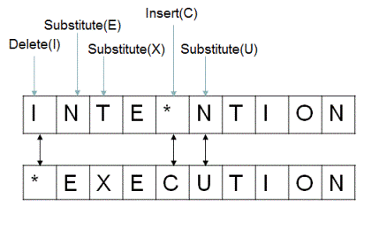

**Figure 3.19** 해밍 거리 - 두 문자열 간의 차이를 측정하는 방법

Needleman-Wunsch(NW) 알고리즘은 전역 정렬(global alignment)을 위한 동적 프로그래밍 접근 방식이다. 이 알고리즘은 두 시퀀스의 처음부터 끝까지 모두 정렬하며, 길이가 유사한 두 시퀀스를 비교할 때 적합하다.

##### 3.7.1.1.1 Needleman-Wunsch 알고리즘 예시: "ATTGC"와 "ATGG" 정렬

NW 알고리즘을 사용하여 두 서열 "ATTGC"와 "ATGG"를 정렬하는 과정을 단계별로 살펴보자:

**1단계: 빈 행렬 만들기**

정렬하고자 하는 두 문자열의 길이를 각각 M, N이라 할 때, (0, 0)이 0인 (M+1)×(N+1) 행렬을 만든다.

| | | A | T | T | G | C |
|-|-|-|-|-|-|-|
| | 0 | | | | | |
| A | | | | | | |
| T | | | | | | |
| G | | | | | | |
| G | | | | | | |

**2단계: 스코어 정의**

문자가 일치하는 경우 +1, 일치하지 않으면 -1, 삽입/삭제(Indel)인 경우 -2로 스코어를 정의한다.

**3단계: 행렬 채우기**

다음 세 값 중 가장 큰 값으로 빈 칸을 채운다:
- 두 문자가 일치할 경우 왼쪽 위 값에서 +1을, 그렇지 않을 경우 -1을 더한다
- 왼쪽 값에서 -2만큼 더한다 (insertion)
- 위쪽 값에서 -2만큼 더한다 (deletion)

완성된 행렬:

| | | A | T | T | G | C |
|-|-|-|-|-|-|-|
| | 0 | -2 | -4 | -6 | -8 | -10 |
| A | -2 | 1 | -1 | -3 | -5 | -7 |
| T | -4 | -1 | 2 | 0 | -2 | -4 |
| G | -6 | -3 | 0 | 1 | 1 | -1 |
| G | -8 | -5 | -2 | -1 | 2 | 0 |

**4단계: 트레이스백**

맨 오른쪽 아래부터 해당 원소의 값을 계산하는데 쓰였던 원소를 찾아 트레이싱한다.

**결과 정렬:**
```
ATTGC
AT-GG
```

이 정렬의 최종 점수는 0이다.

Smith-Waterman(SW) 알고리즘은 지역 정렬(local alignment)을 위한 동적 프로그래밍 접근 방식이다. 이 알고리즘은 더 큰 시퀀스 내에서 유사한 영역을 찾는 데 적합하며, NGS에서는 참조 유전체 내에서 짧은 리드를 정렬하는 데 유용하다.

##### 3.7.1.1.2 Smith-Waterman 알고리즘 예시: "AATGC"와 "ATGG" 정렬

SW 알고리즘을 사용하여 두 서열 "AATGC"와 "ATGG"를 정렬하는 과정을 단계별로 살펴보자:

**1단계: 빈 행렬 만들기**

정렬하고자 하는 두 문자열의 길이를 각각 M, N이라 할 때, 첫 열과 첫 행이 0으로 채워진 (M+1)×(N+1) 행렬을 만든다.

| | | A | A | T | G | C |
|-|-|-|-|-|-|-|
| | 0 | 0 | 0 | 0 | 0 | 0 |
| A | 0 | | | | | |
| T | 0 | | | | | |
| G | 0 | | | | | |
| G | 0 | | | | | |

**2단계: 스코어 정의**

매치할 경우 +3, 매치하지 않을 경우 -3, 삽입/삭제(Indel)는 -2로 정의한다.

**3단계: 행렬 채우기**

다음 세 값 중 가장 큰 값으로 빈 칸을 채운다. 단, 음수이면 0으로 한다:
- 두 문자가 일치할 경우 왼쪽 위 값에서 +3을, 그렇지 않을 경우 -3을 더한다
- 왼쪽 값에서 -2만큼 더한다 (insertion)
- 위쪽 값에서 -2만큼 더한다 (deletion)

완성된 행렬:

| | | A | A | T | G | C |
|-|-|-|-|-|-|-|
| | 0 | 0 | 0 | 0 | 0 | 0 |
| A | 0 | 3 | 3 | 1 | 0 | 0 |
| T | 0 | 1 | 1 | 6 | 4 | 2 |
| G | 0 | 0 | 0 | 4 | 9 | 7 |
| G | 0 | 0 | 0 | 2 | 7 | 6 |

**4단계: 트레이스백**

가장 큰 값(9)부터 좌측, 좌상단, 상단의 원소를 따라서 가장 큰 점수를 찾으며 올라온다. 이때 0을 발견하면 멈춘다.

**결과 정렬:**
```
ATG
ATG
```

이 지역 정렬의 최고 점수는 9이며, 두 서열에서 공통으로 존재하는 "ATG" 부분이 일치하는 것으로 식별되었다.

#### 3.7.1.2 BLAST와 고급 정렬 기법

BLAST(Basic Local Alignment Search Tool)는 데이터베이스에서 유사한 시퀀스를 빠르게 검색하는 휴리스틱 알고리즘이다. 이 알고리즘은 주어진 문자열에서 "복잡한" 부분을 찾아 k-mer의 목록을 만들고, 이를 데이터베이스와 매치시킨 후 Smith-Waterman 알고리즘을 활용해 확장하여 정렬한다. BLAST는 대용량 데이터베이스에서 신속한 검색을 위해 정확도와 속도 간의 균형을 맞추기 위한 휴리스틱 접근 방식을 사용한다.

BLAST 결과에서 중요한 통계적 지표 중 하나가 E-value(Expectation value)이다. E-value는 해당 정렬 점수 이상의 결과가 우연히 나타날 것으로 예상되는 횟수를 의미한다. 예를 들어, E-value가 0.01이라면 같은 검색을 100번 수행했을 때 우연히 1번 정도는 이와 같거나 더 좋은 점수의 정렬이 나타날 것으로 예상된다는 의미이다. E-value가 낮을수록(일반적으로 10⁻⁵ 이하) 더 유의미한 유사성을 나타낸다. E-value는 데이터베이스 크기와 쿼리 시퀀스 길이에 따라 조정되므로, 서로 다른 검색 조건에서도 비교 가능한 신뢰도 지표를 제공한다.


##### 3.7.1.2.1 k-mer 기반 검색 예시

k-mer는 DNA 서열에서 길이가 k인 모든 가능한 부분 문자열을 의미한다. 예를 들어, 시퀀스 "ATGTAC"에서 다양한 길이의 k-mer를 추출하면 다음과 같다:

**k=3 (3-mer 또는 트라이머):**
- ATG (위치 1-3)
- TGT (위치 2-4)
- GTA (위치 3-5)
- TAC (위치 4-6)

총 4개의 3-mer가 생성된다.

**k=4 (4-mer 또는 테트라머):**
- ATGT (위치 1-4)
- TGTA (위치 2-5)
- GTAC (위치 3-6)

총 3개의 4-mer가 생성된다.

**k=5 (5-mer 또는 펜타머):**
- ATGTA (위치 1-5)
- TGTAC (위치 2-6)

총 2개의 5-mer가 생성된다.

이러한 k-mer 방식은 특히 BLAST와 같은 알고리즘에서 "시드(seed)" 역할을 하여 초기 일치점을 빠르게 찾는 데 사용된다. 일반적으로 k 값이 클수록 특이성은 높아지지만 민감도는 낮아지는 특성이 있다. NGS 분석에서는 주로 k=21~31 범위의 값이 많이 사용된다.

### 3.7.2 유전체 정렬 기술

전체 유전체 정렬에는 특수한 알고리즘이 필요하다. 현대 유전체 정렬기는 일반적으로 Burrows-Wheeler Transform 이라는 알고리즘을 사용하여 정렬 후보 위치를 찾고, 후보 위치에서 Smith-Waterman과 유사한 알고리즘으로 정밀한 정렬을 수행한다.

#### 3.7.2.1 Burrows-Wheeler Transform과 FM Index

문자열 "BANANA"에서 Burrows-Wheeler Transform를 수행한 후 FM Index를 구성하여 패턴을 검색하는 과정을 살펴보자.

##### Burrows-Wheeler Transform (BWT)

**1단계: 원본 문자열에 종결 문자 추가**
```
BANANA$
```

**2단계: 모든 순환 이동(rotation) 생성**
```
BANANA$
ANANA$B
NANA$BA
ANA$BAN
NA$BANA
A$BANAN
$BANANA
```

**3단계: 사전순으로 정렬**
```
$BANANA (1)
A$BANAN (2)
ANA$BAN (3)
ANANA$B (4)
BANANA$ (5)
NA$BANA (6)
NANA$BA (7)
```

이때 마지막 열의 문자들을 순서대로 읽으면 `A$ANNB`가 되는데, 이것이 바로 **Burrows-Wheeler Transform(BWT)**의 결과이다.

##### FM Index

BWT 결과를 바탕으로 **FM Index**를 구성한다:
- 첫 열(F): 정렬된 회전의 첫 문자: `$AABNN`
- 마지막 열(L): 정렬된 회전의 마지막 문자: `A$ANNB`

| 인덱스 | F | 회전된 문자열 | L |
|:-----:|:-:|:----------:|:-:|
| 1 | $ | $BANANA | A |
| 2 | A | A$BANAN | N |
| 3 | A | ANA$BAN | N |
| 4 | A | ANANA$B | B |
| 5 | B | BANANA$ | $ |
| 6 | N | NA$BANA | A |
| 7 | N | NANA$BA | A |

##### 패턴 검색: FM Index를 이용한 "ANA" 검색

FM 인덱스를 사용한 역방향 검색:
1. 마지막 문자 'A'로 시작:
   - L 열에서 'A'는 인덱스 1, 6, 7에 있다.
   
2. 다음 문자 'N'을 찾기 위해, L 열에서 'A'의 위치를 F 열에서의 'A' 위치로 매핑:
   - 'A'는 F 열에서 인덱스 2, 3, 4에 있다.
   - L 열의 'A'(인덱스 1)는 F 열의 첫 번째 'A'(인덱스 2)에 매핑된다.
   - L 열의 'A'(인덱스 6)는 F 열의 두 번째 'A'(인덱스 3)에 매핑된다.
   - L 열의 'A'(인덱스 7)는 F 열의 세 번째 'A'(인덱스 4)에 매핑된다.

3. 'A' 다음에 'N'이 나오는지 확인:
   - F 열의 인덱스 2, 3, 4에 해당하는 L 열의 문자는 각각 'N', 'N', 'B'이다.
   - 'B'는 'N'이 아니므로 인덱스 4는 제외된다.
   - 인덱스 2와 3이 유효하므로, 이들 위치에서 계속 검색한다.

4. 마지막으로 'A'를 찾기 위해, L 열에서 'N'의 위치를 F 열에서의 'N' 위치로 매핑:
   - 'N'은 F 열에서 인덱스 6, 7에 있다.
   - L 열의 'N'(인덱스 2)는 F 열의 첫 번째 'N'(인덱스 6)에 매핑된다.
   - L 열의 'N'(인덱스 3)는 F 열의 두 번째 'N'(인덱스 7)에 매핑된다.

5. 'N' 다음에 'A'가 나오는지 확인:
   - F 열의 인덱스 6, 7에 해당하는 L 열의 문자는 모두 'A'이다.
   - 두 위치 모두 유효하므로, 패턴 "ANA"는 원본 문자열에서 두 번 발견된다.

패턴 "ANA"는 "BANANA"에서 다음 위치에서 발견된다:
- 인덱스 1에서 시작 (BANANA)
- 인덱스 3에서 시작 (BANANA)

따라서 패턴 "ANA"의 존재가 확인된다. 패턴의 위치를 검색하는 알고리즘은 조금 더 복잡하며, 이는 독자의 과제로 남겨둔다.

이처럼 BWT를 활용한 FM 인덱스는 BWT를 사용하여 패턴을 효율적으로 검색할 수 있게 해준다. 이 방법은 대용량 참조 유전체에서 짧은 NGS 리드를 정렬하는 데 매우 효과적이다.

이를 활용한 도구인 BWA-MEM2 는 다양한 길이의 리드를 처리할 수 있으며, 높은 정확도와 빠른 속도로 인해 전체 유전체 시퀀싱 데이터 정렬에 널리 사용된다.

### 3.7.3 SAM 파일 형식과 구조

SAM(Sequence Alignment/Map) 포맷은 정렬된 시퀀스 데이터를 저장하기 위한 표준 텍스트 형식이다. SAM 파일은 헤더 섹션과 정렬 섹션으로 구성되며, 헤더 라인은 `@`로 시작하고 참조 시퀀스 정보와 정렬 메타데이터를 포함한다. 정렬 라인은 탭으로 구분된 필드를 포함하며, 각 리드의 정렬 정보를 나타낸다.

주요 SAM 필드는 다음과 같다:
- QNAME: 쿼리 템플릿 이름으로, Fastq 파일의 리드 식별자와 일치한다.
- RNAME, POS: 참조 시퀀스 이름(일반적으로 염색체 이름)과 참조 시퀀스에서 정렬의 왼쪽 끝 위치(1-기반 좌표계)
- MAPQ: 매핑 품질 값으로, 정렬의 신뢰도를 나타낸다(0-255, 높을수록 더 신뢰할 수 있음).
- SEQ: 리드의 염기 서열을 포함한다.
- CIGAR: 리드가 참조 시퀀스에 어떻게 정렬되는지를 설명하는 문자열이다.

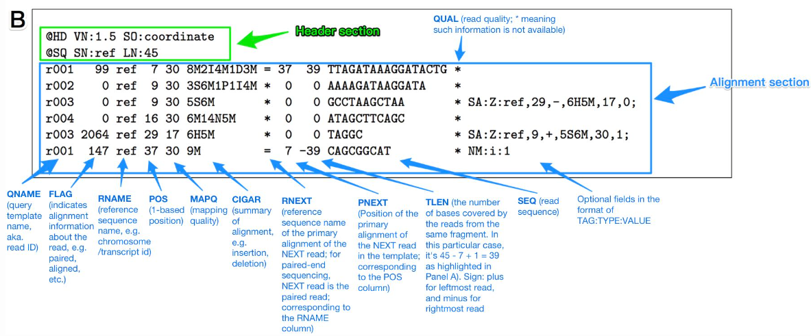

**Figure 3.20** SAM 파일 형식 - 정렬된 시퀀스 데이터의 표준 텍스트 형식

CIGAR 문자열은 일련의 작업과 길이 쌍으로 구성되며, 예를 들어 "2S5M2I4M1D5M6S"는 첫 2개 염기가 소프트 클리핑되고, 다음 5개 염기가 참조 시퀀스와 정렬되며, 2개 염기가 삽입되고, 다음 4개 염기가 참조 시퀀스와 정렬되고, 참조 시퀀스에서 1개 염기가 삭제되고, 다음 5개 염기가 참조 시퀀스와 정렬되며, 마지막 6개 염기가 소프트 클리핑됨을 나타낸다.

CIGAR 문자열은 참조 시퀀스와 리드 간의 정확한 정렬 관계를 이해하는 데 중요하며, 변이 호출 및 구조적 변이 감지와 같은 다운스트림 분석에 필수적이다.


**Figure 3.21** CIGAR 문자열 - 리드와 참조 시퀀스 간의 정렬 관계 표현