# 제4장 변이와 진화

## 4.1 변이 찾기 (Variant Calling)

변이 찾기는 주로 BAM 파일로부터 변이를 찾아주는 소프트웨어(variant caller)를 활용하는 과정이다. 이 과정은 개인의 유전체에서 참조 유전체과 다른 부분을 식별하는 중요한 단계이다. 현재 수십 개의 다양한 variant caller가 개발되어 있으며, 각각은 특정한 장단점과 적용 분야를 가지고 있어 연구 목적과 데이터 특성에 따라 적절한 도구를 선택해야 한다.

그 중 몇 가지 예시를 들면 다음과 같다:

- **GATK (Genome Analysis Toolkit)**: Broad Institute에서 개발한 도구로 인간 유전체 프로젝트에서 광범위하게 사용되어 왔으며 높은 정확도로 알려져 있다
- **SAMtools**: 시퀀싱 데이터 처리를 위한 포괄적인 도구 모음으로 변이 호출 기능을 포함하고 있다
- **FreeBayes**: 베이지안 통계 접근법을 사용하여 변이를 탐지하는 도구이다
- **DeepVariant**: 구글에서 개발한 딥러닝 기반 도구로 최근 높은 정확도를 보여주고 있다
- **Octopus**: 복잡한 변이 패턴도 효과적으로 탐지할 수 있는 새로운 접근 방식을 제공한다

이들 외에도 다양한 특화된 variant caller들이 계속 개발되고 있어, 특정 변이 유형이나 데이터 조건에 최적화된 도구를 선택할 수 있다.

## 4.2 VCF 포맷

VCF는 Variant Call Format의 약자로, 변이 정보를 저장하는 표준 파일 형식이다. 이 포맷은 유전체 위치, 참조 서열, 변이 서열 등 변이에 관한 중요 정보를 포함하고 있다.

VCF 파일의 주요 필드는 다음과 같다:
- CHROM, POS: 유전체 상의 위치(Genomic Locus, 또는 복수형으로 Genomic Loci)를 나타낸다. CHROM은 염색체 번호, POS는 해당 염색체 내 위치를 의미한다.
- ID: dbSNP와 같은 데이터베이스에 등록된 경우, 그 ID를 표시한다.
- REF: 참조 유전체(Reference Genome) 상의 염기 서열이다.
- ALT: 시퀀싱 데이터에서 얻은 변이된 염기 서열이다.
  - REF보다 ALT가 길면 삽입(insertion), 짧으면 결실(deletion)로, 이 둘을 합쳐 Indel이라 부른다. 길이가 같으면 단일 염기 변이(SNV, Single Nucleotide Variant)이다.
  - ALT가 쉼표로 구분되는 경우는 다중대립유전자 변이(Multiallelic Nucleotide Variant, MNV)이다.
- FILTER: 변이 호출 과정에서 문제가 있는 경우 표시되며, 문제가 없으면 "PASS"로 표시된다.

**Figure 4.1** VCF 파일 형식 - 변이 정보를 저장하는 표준 파일 형식

VCF 파일은 또한 INFO 필드에 변이에 대한 추가 정보와 FORMAT 필드에 각 샘플의 유전형(genotype) 정보를 포함한다. 이러한 구조로 인해 VCF는 다양한 유전체 분석 도구와 호환되며, 변이 정보를 효율적으로 저장하고 공유할 수 있다.

## 4.3 Phasing

Phasing은 찾아낸 유전 변이(variant)가 포함된 대립유전자(allele)가 부계에서 왔는지 모계에서 왔는지 알아내는 과정이다. 이는 유전적 변이의 기원을 추적하고, 질병 연관성 등을 연구하는 데 중요한 정보이다.

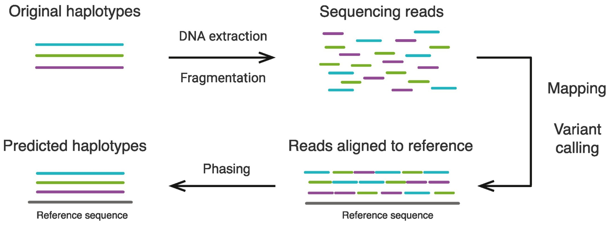

**Figure 4.2** Phasing - 대립유전자의 부모 기원 결정 과정

Phasing을 수행하는 두 가지 주요 방법이 있다:
1. 부모의 시퀀싱 데이터를 기반으로 부계인지 모계인지를 결정하는 방법
2. 알고리즘을 통한 통계적 추정 방법 (이 경우 부계/모계 유전인지 정확하게 파악하는 것은 어렵다)

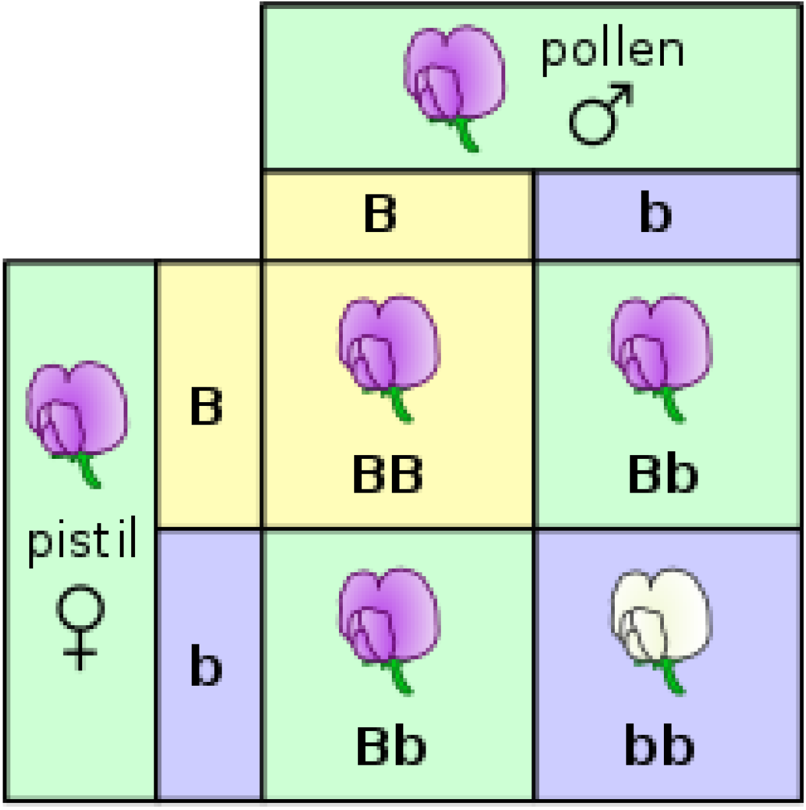

**Figure 4.3** 대립유전자 교배 - 부모로부터의 대립유전자 전달 과정

5장에서 더 자세히 다루겠지만, Phasing과 관련해 중요한 개념으로 Haplotype이 있다. Haplotype은 함께 유전되는 경향이 있는 유전자나 변이의 그룹을 의미한다. 이러한 haplotype 정보는 질병 연관성 연구, 집단 유전학, 진화 연구 등에서 중요하게 활용된다.

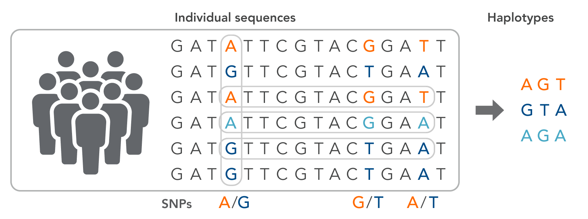

**Figure 4.4** Haplotype - 함께 유전되는 유전자나 변이의 그룹

## 4.4 Contamination

Contamination(오염)은 variant calling 과정에서 반드시 고려해야 할 중요한 요소이다. 시퀀싱 샘플에 다른 개체의 DNA가 섞여 있거나, 실험 과정에서 오염이 발생할 수 있기 때문이다.

오염은 다양한 원인으로 발생할 수 있다:
- 샘플 채취 과정에서의 오염
- 실험실 작업 중 교차 오염
- 시퀀싱 기기 자체의 오염
- 시약 오염

오염된 샘플은 잘못된 변이 호출로 이어질 수 있으며, 이는 연구 결과의 신뢰성에 심각한 영향을 미친다. 따라서 variant calling 전에 오염 여부를 확인하고, 오염된 경우 적절한 보정 방법을 적용하는 것이 중요하다.

## 4.5 개인 유전체 분석 과정

개인 유전체 분석은 일련의 단계를 거쳐 진행되는데, 이를 파이프라인이라고 부른다. 주요 단계는 다음과 같다:

1. Sequencing(시퀀싱): 개인의 DNA 샘플을 읽어 염기 서열 데이터를 생성한다.
2. Alignment(정렬): 생성된 시퀀스를 참조 유전체에 맞추어 정렬한다.
3. Variant Calling(변이 호출): 정렬된 데이터에서 참조 유전체과 다른 변이를 찾아낸다.
4. Gene set or Pathway analysis(유전자 세트 또는 경로 분석): 찾아낸 변이가 어떤 유전자나 생물학적 경로에 영향을 미치는지 분석한다.

이러한 파이프라인은 자동화되어 대량의 데이터를 효율적으로 처리할 수 있도록 설계된다. 각 단계마다 다양한 도구와 알고리즘이 사용되며, 연구 목적이나 대상 생물체에 따라 파이프라인을 조정할 수 있다.

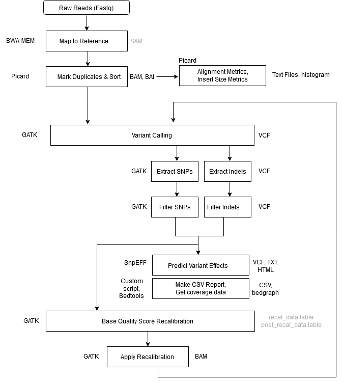

**Figure 4.5** 전형적인 변이 호출 파이프라인 - 시퀀싱부터 변이 분석까지의 과정

## 4.6 Hardy-Weinberg Equilibrium

우리는 2장에서 다양한 변이 데이터베이스에 대해 배웠다. 그러나 각 변이의 빈도는 시간에 따라 일정한가? 만약 그렇지 않다면, 변이 데이터베이스는 지속적으로 갱신되어야 한다는 의미가 된다.

이때 등장하는 것이 Hardy-Weinberg Equilibrium(하디-바인베르크 평형) 이다. 이것은 집단 유전학의 기본 원리 중 하나로, 특정 조건 하에서 대립유전자 빈도가 세대를 거쳐도 변하지 않는다는 이론이다.

하디-바인베르크 평형이 성립하려면 다음 조건이 필요하다:
1. 무작위 교배
2. 돌연변이 없음
3. 자연선택 없음
4. 유전적 부동 없음
5. 무한한 집단 크기

당연히도 이런 조건들은 실제적으로 모두 충족되기 어렵다. 비록 상대적으로 짧은 세대에 걸쳐서는 하디-바인베르크 법칙이 어느정도 유지되는 상황들이 관찰되지만, **유전적 부동** 같은 현상으로 인해 하디-바인베르크 평형은 쉽게 깨질 수 있다.

## 4.7 Genetic Drift

Genetic Drift(유전적 부동)는 무작위적 과정에 의해 집단 내 대립유전자 빈도가 변화하는 현상이다. 특히 작은 집단에서 그 영향이 크게 나타난다.

라이트-피셔 모델(Wright-Fisher Model)은 유전적 부동을 설명하는 기본 모델이다:
- 두 개의 대립유전자 A와 a의 빈도가 각각 p와 q인 N 크기의 집단을 고려해보자.
- 총 대립유전자 수는 2N이 된다.
- 모델의 단순화를 위해 다음을 가정한다:
  - 한 세대는 번식 후 완전히 소멸한다.
  - 교배는 완전히 무작위적이다.
  - 집단의 크기는 2N으로 고정되어 있다.

다음 세대에서 특정 대립유전자가 k개 존재할 확률은 복원 추출이므로 이항 분포를 따르게 된다.

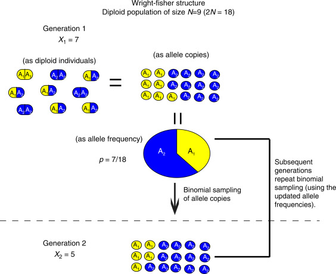

**Figure 4.6** Wright-Fisher 모델 - 유전적 부동을 설명하는 기본 모델

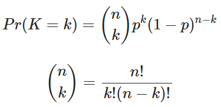

**Figure 4.7** Wright-Fisher 방정식 - 대립유전자 빈도 변화의 수학적 모델

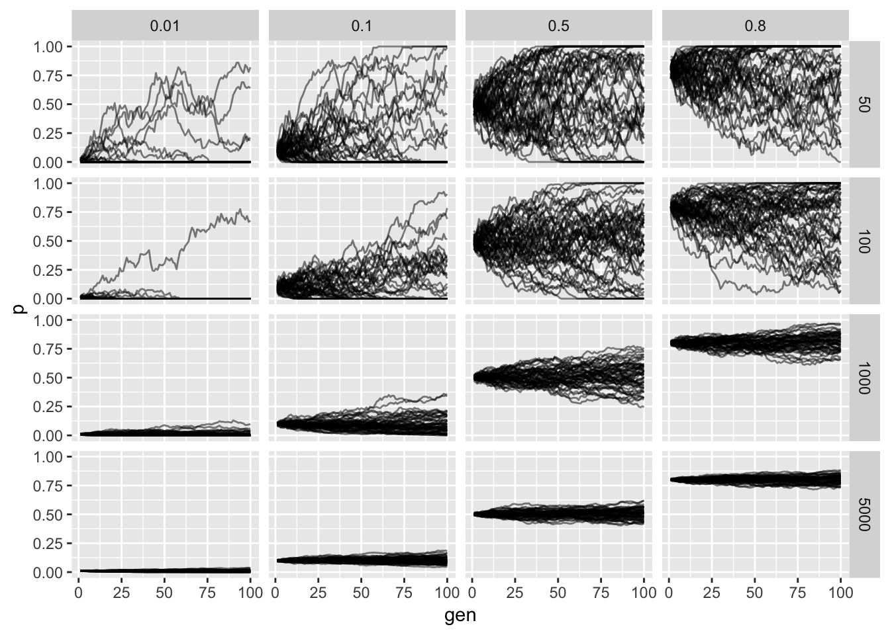

**Figure 4.8** Wright-Fisher 모델 결과 - 시간에 따른 대립유전자 빈도 변화

이렇듯 유전은 무작위적 과정이므로, 유전적 부동을 통해 일부 대립유전자는 완전히 사라지거나 집단 내에서 우세해질 수 있다. 이는 하디-바인베르크 평형을 크게 깨뜨리는 요인이 된다.

우리는 하디-바인베르크 평형이 깨지는 현상을 "진화(Evolution)"라고 부른다. 유전적 부동은 진화를 이끄는 기본적인 힘 중 하나이다.

## 4.8 진화

진화(Evolution)는 생물 집단이 세대를 거치며 변화하는 과정이다. 찰스 다윈(Charles Darwin)은 이 개념을 체계화한 선구자로, HMS 비글호 항해와 다윈의 핀치 연구는 진화론 발전에 중요한 역할을 했다.

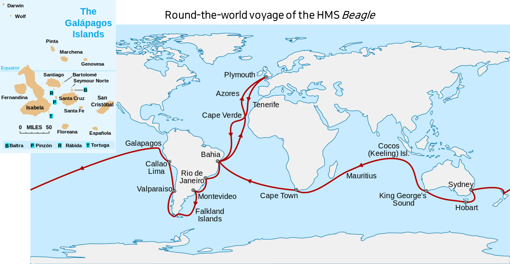

**Figure 4.9** 다윈의 경로 - HMS 비글호 항해와 진화론 발전

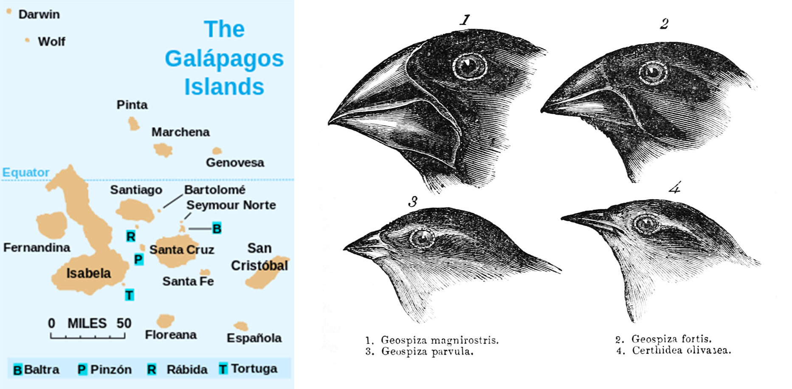

**Figure 4.10** 다윈의 핀치 - 자연선택과 적응 진화의 대표적 사례

또한 고대 DNA 연구는 진화 연구에 새로운 관점을 제공했다. 특히 스반테 페보(Svante Pääbo)는 네안데르탈인과 데니소바인의 게놈을 성공적으로 해독하여 현대 인류와의 교배 증거를 발견했으며, 이 공로로 2022년 노벨생리의학상을 수상했다.

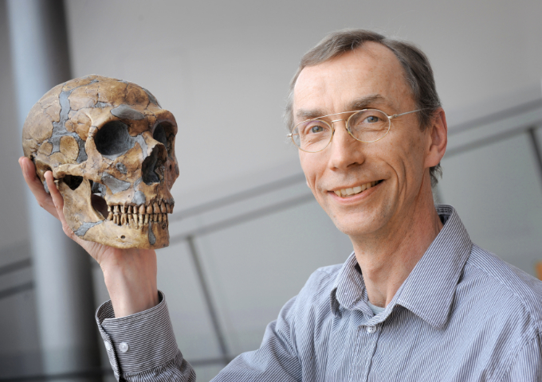

**Figure 4.11** 스반테 페보 - 2022년 노벨생리의학상 수상자, 고유전학의 아버지

선택압(Selection Pressure)은 "진화적 압력(Evolutionary Pressure)"이라고도 불리며, 다음과 같은 요인들이 있다:
- 환경(기후, 지리 등)
- 다른 종과의 관계
- 교배를 촉진하거나 방해하는 기타 요인

진화의 세 가지 기본 메커니즘은 다음과 같다:
1. 무작위 돌연변이(Random Mutation)
2. 자연선택(Natural Selection)
3. 유전적 부동(Genetic Drift)

따라서 진화란 특정한 방향성을 가지지 않는 무작위적 돌연변이와 환경 변화에 기초하는 현상이며, 이러한 무작위적 과정 속에서 각 개체가 처한 환경에 맞는 선택압이 작용하는 방향으로 조금씩 적응해 가는 과정으로 이해할 수 있다.

계통학(Phylogeny)은 종과 생물 그룹이 시간에 따라 어떻게 진화했는지 연구하는 학문이다. 이는 비슷한 생물이 공통 조상을 공유한다는 개념에 기초한다. 계통학은 생물 간의 자연적 관계를 반영하는 분류체계를 만드는 데 사용된다.

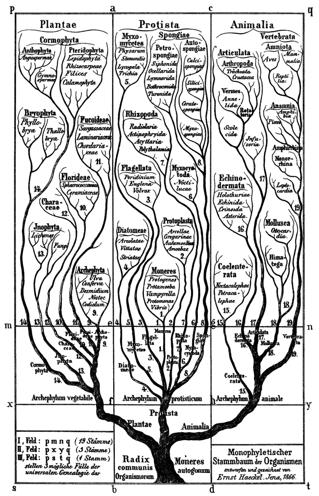

**Figure 4.12** 생명의 나무 - 모든 생물의 진화적 관계를 나타내는 계통수

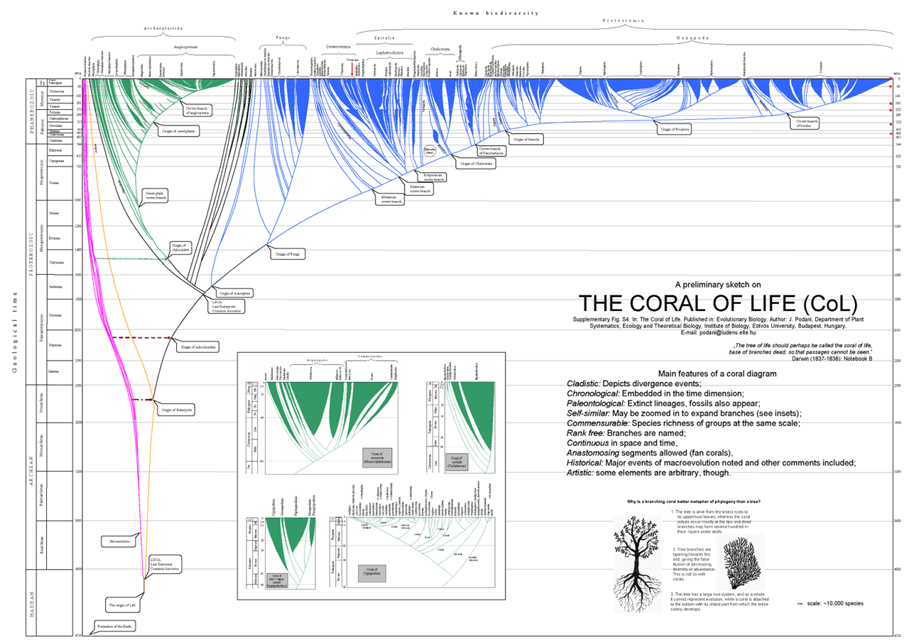

**Figure 4.13** 생명의 산호 - 생물 다양성의 또 다른 시각화 접근법

## 4.9 다중서열정렬과 분자 진화

다중서열정렬(Multiple Sequence Alignment, MSA)은 3개 이상의 DNA, RNA 또는 단백질 서열을 동시에 비교하여 진화적 관계를 파악하는 생명정보학의 기본 기법이다. MSA는 병원체의 진화 추적과 계통분류학적 분석에 활용된다.

MSA에서는 보존 영역과 가변 영역을 구분할 수 있다. 보존 영역은 진화 과정에서 변화가 적은 중요한 부위이며, 가변 영역은 종간 또는 개체간 차이가 나타나는 부위이다. 정렬 과정에서 삽입이나 결실 변이는 갭으로 표시되며, 서열 간 유사성을 통해 진화적 거리를 측정할 수 있다.

### 4.9.1 병원체 진화 추적

바이러스는 빠른 복제와 높은 변이율로 인해 실시간 진화 관찰이 가능한 대표적인 병원체이다. RNA 바이러스는 높은 변이율을 보이며, 숙주 면역계와 백신에 의한 선택압을 받는다. 또한 서로 다른 바이러스 간의 유전자 재조합과 유전적 부동도 바이러스 진화에 중요한 역할을 한다.

MSA 결과를 바탕으로 계통수를 구축하여 바이러스의 진화 관계를 시각화할 수 있다. 이를 통해 바이러스가 언제, 어떻게 진화했는지 추적할 수 있다.

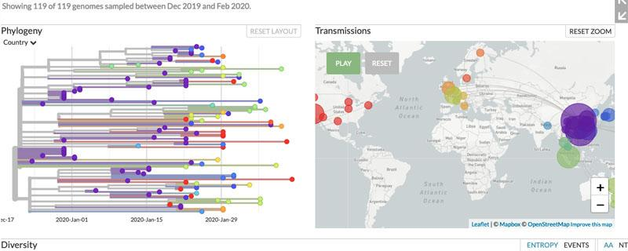

**Figure 4.14** GISAID COVID-19 계통발생 개요 - 전 세계 SARS-CoV-2 변이 추적

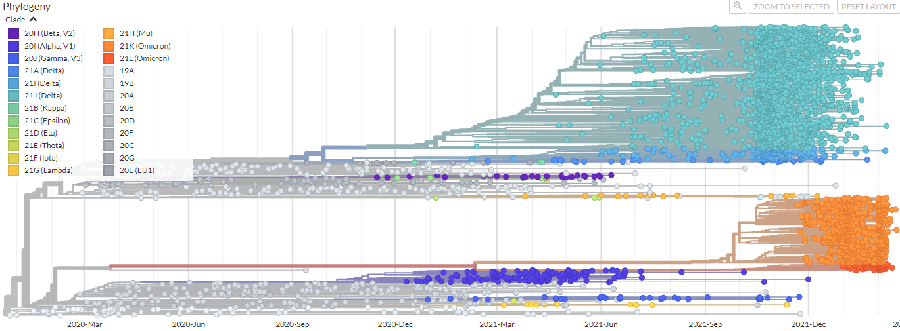

**Figure 4.15** GISAID COVID-19 계통발생 세부 - 다양한 변이주의 출현과 전파

### 4.9.2 COVID-19 사례를 통한 감염병 전파 추적

코로나19 팬데믹은 MSA와 계통발생학적 분석의 실질적 중요성을 보여준 대표적 사례이다. SARS-CoV-2 바이러스의 유전체 분석을 통해 다양한 변이주의 출현과 전파 과정을 실시간으로 추적할 수 있었다. 이러한 성과는 전 세계 의생명정보학자들이 GISAID(Global Initiative on Sharing All Influenza Data)와 같은 플랫폼을 통해 바이러스 서열 데이터를 신속하게 공유하고 분석한 결과이다.

MSA를 통한 실시간 바이러스 감시는 새로운 변이주의 출현을 조기에 탐지하고, 바이러스의 전파 경로를 추적할 수 있게 한다. 특히 팬데믹 기간 동안 의생명정보학자들의 헌신적인 노력과 국제적 협력을 통해 바이러스 진화를 실시간으로 모니터링할 수 있었으며, 이러한 정보는 백신 개발, 치료제 연구, 방역 정책 수립에 중요한 근거를 제공했다.

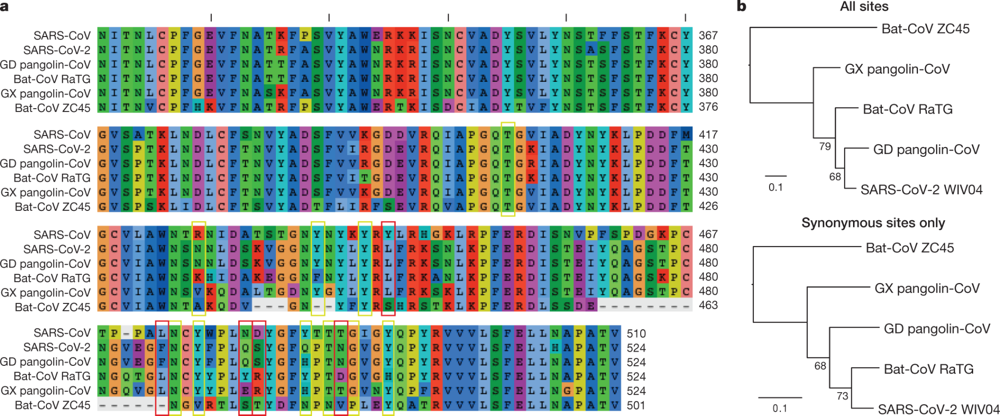

**Figure 4.16** 다중샘플 정렬 COVID-19 계통수 - MSA를 통한 바이러스 진화 분석

## 4.10 고유전학

고유전학(Paleogenetics)은 고대 샘플에서 DNA를 시퀀싱하여 과거 생물의 유전 정보를 분석하는 연구 분야이다. 화석이나 고고학적 유물에서 추출한 DNA를 통해 멸종된 종이나 과거 생물집단의 유전적 특성을 연구할 수 있다.

스반테 페보(Svante Päabo)는 이 분야의 선구자로 2022년 노벨생리의학상을 수상했다. 스반테 페보와 그의 팀은 네안데르탈인의 완전한 유전체 시퀀싱과 데니소바인의 발견을 통해 인류 진화 연구에 혁신적인 기여를 했으며, 특히 현생인류와 네안데르탈인 사이의 유전자 교류를 밝혀내어 인류 진화의 복잡성을 보여주었다.

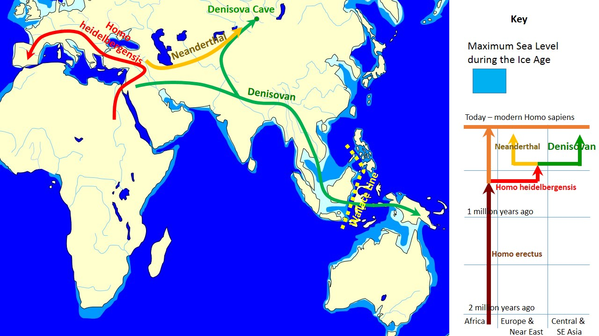

**Figure 4.17** 데니소바인 - 고유전학으로 발견된 새로운 인류 종

### 4.10.1 고유전학의 기술적 도전

고대 DNA 연구는 여러 기술적 어려움을 극복해야 한다. 시간이 지나면서 DNA는 분해되고 단편화되어 매우 짧은 조각들만 남게 된다. 또한 현대 DNA의 오염 가능성이 높아 정확한 분석을 위해 엄격한 실험 조건과 검증 절차가 필요하다. 이러한 문제들을 해결하기 위해 차세대 시퀀싱 기술과 특수한 DNA 추출 및 증폭 기법이 개발되었다.

### 4.10.2 고유전학의 응용 분야

고유전학은 인류학, 고고학, 진화생물학 등 다양한 분야에 응용된다. 고대 인류의 이주 경로와 집단 구조를 밝히고, 농작물과 가축의 기원과 진화 과정을 추적하며, 멸종 동물의 생태와 진화 역사를 연구하는 데 활용된다. 또한 기후 변화가 과거 생물집단에 미친 영향을 분석하여 현재의 생태계 변화를 이해하는 데에도 기여한다.

이러한 연구들은 인류의 진화 역사와 다른 종과의 관계를 더 정확하게 이해할 수 있게 해준다. 최신 유전체 분석 기술의 발전으로 고유전학 연구는 더욱 정밀해지고 있으며, 생물의 다양성과 적응 메커니즘에 대한 새로운 발견을 계속해서 제공하고 있다.

## 4.11 결론

변이와 진화는 생명체의 다양성을 만들어내는 핵심 메커니즘이며, 의생명정보학은 이러한 복잡한 과정을 이해하는 데 필수적인 도구를 제공한다. 변이 찾기 기술을 통해 개인의 유전적 특성을 파악하고, VCF 형식으로 표준화된 변이 정보를 효율적으로 관리할 수 있다. Phasing과 오염 검출 같은 정교한 분석 방법은 변이 호출의 정확성을 높여준다.

Hardy-Weinberg 평형과 유전적 부동의 개념은 집단 내 유전자 빈도 변화를 설명하며, 이는 진화의 기본 원리를 이해하는 바탕이 된다. 진화의 세 가지 기본 메커니즘인 무작위 돌연변이, 자연선택, 유전적 부동은 생물의 적응과 다양성을 만들어내는 핵심 요소이다.

다중서열정렬과 계통발생학적 분석은 병원체의 진화를 실시간으로 추적할 수 있게 해준다. 특히 COVID-19 팬데믹에서 보여준 것처럼, 전 세계 의생명정보학자들의 협력을 통해 바이러스 변이를 신속하게 분석하고 공중보건 정책에 활용할 수 있었다. 고유전학 분야는 과거와 현재를 연결하여 인류와 다른 생물종의 진화 역사를 밝혀내고 있다.

이러한 의생명정보학 기술들은 단순히 과거를 이해하는 것을 넘어서 미래의 질병 예방, 치료법 개발, 생태계 보전에 중요한 기여를 하고 있다. 변이와 진화에 대한 이해는 정밀의학, 감염병 대응, 생물다양성 보전 등 현대 사회가 직면한 다양한 문제 해결의 열쇠가 되고 있다.

