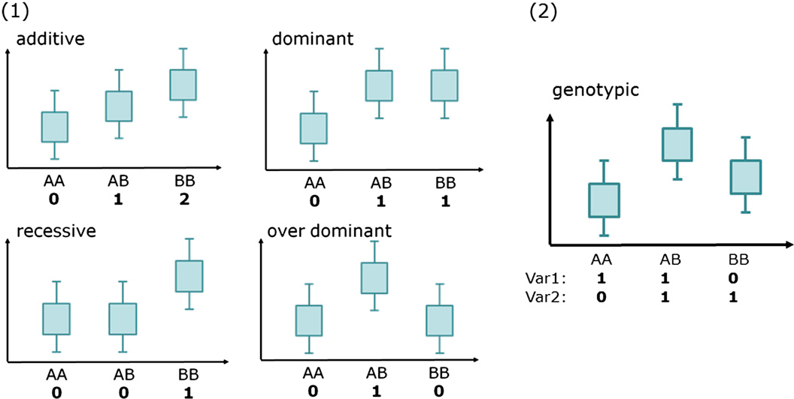
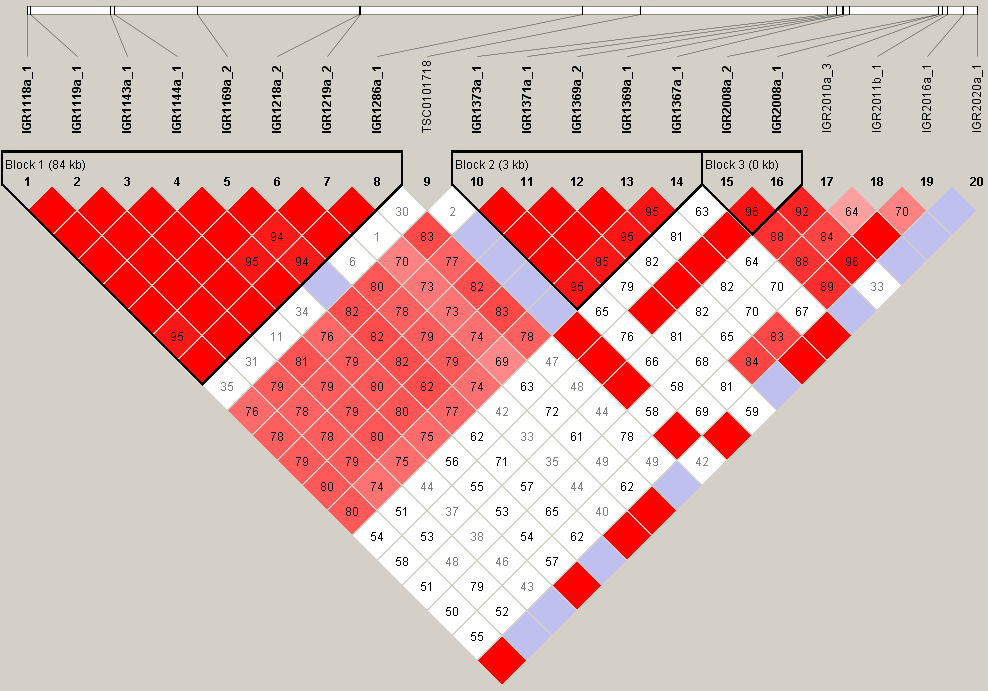

# 제5장 유전질환과 GWAS

## 5.1 유전질환

유전질환은 유전적 변이에 의해 발생하는 질병이다. 이러한 변이는 인구 집단 내에서 유전되는 경우가 많다. 유전질환은 단일 유전자의 돌연변이에 의한 단일 유전자 질환(멘델 질환)과 여러 유전자의 복합적 작용에 의한 다유전자 질환으로 크게 나눌 수 있다.

유전질환은 일반적으로 DNA 서열의 변화, 염색체 구조 이상, 또는 유전자 발현 조절 메커니즘의 문제로 인해 발생한다. 이러한 유전적 이상은 부모로부터 자녀에게 전달되거나 새롭게 발생할 수 있다. 유전질환의 심각도는 경미한 증상부터 생명을 위협하는 수준까지 다양하게 나타난다.

## 5.2 유전질환의 유형

### 5.2.1 멘델 질환(Mendelian diseases)

멘델 질환은 단일 유전자의 돌연변이에 의해 발생하는 질병이다. 이러한 질환은 대개 희귀하지만, 발생 시 그 영향은 심각할 수 있다. 멘델 유전 방식을 따르기 때문에 가족 내 발생 패턴이 예측 가능하다.

멘델 질환의 몇 가지 예시는 다음과 같다:

1. 혈우병(Hemophilia): F8, F9, F11 유전자 중 하나의 돌연변이로 인해 발생하는 혈액 응고 장애 질환이다. 주로 X 연관 열성 유전을 보인다.

2. 판코니 빈혈(Fanconi Anemia): Fancm, Fancd 등의 유전자 돌연변이로 발생하는 골수 기능 부전 증후군이다. 상염색체 열성 유전을 보인다.

3. 낭포성 섬유증(Cystic Fibrosis): CFTR 유전자의 돌연변이로 인해 발생하며, 폐와 소화기계에 영향을 미치는 질환이다.

4. 헌팅턴병(Huntington's Disease): HTT 유전자의 돌연변이로 인한 신경퇴행성 질환으로, 상염색체 우성 유전을 보인다.

5. 겸상적혈구 빈혈(Sickle Cell Anemia): HBB 유전자의 돌연변이로 인해 발생하는 혈액 질환이다.

멘델 질환은 유전 방식에 따라 상염색체 우성, 상염색체 열성, X 연관 우성, X 연관 열성 등으로 분류할 수 있다. 이러한 질환은 단일 유전자의 문제로 발생하기 때문에, 특정 유전자 검사를 통해 진단이 가능하다.

### 5.2.2 다유전자 질환(Polygenic diseases)

다유전자 질환은 여러 유전자의 변이와 환경적 요인의 복합적 상호작용으로 발생한다. 이러한 질환은 멘델 질환보다 훨씬 흔하며, 현대 사회에서 가장 많이 발생하는 질병 대부분이 이 범주에 속한다.

다유전자 질환의 몇 가지 예시는 다음과 같다:

1. 치매(Dementia): 알츠하이머병 등 여러 유형의 치매는 다양한 유전적 요인과 환경적 요인의 영향을 받는다.

2. 고혈압(Hypertension): 혈압 조절에 관여하는 여러 유전자들의 변이와 생활 습관 요인이 복합적으로 작용한다.

3. 당뇨병(Diabetes): 특히 제2형 당뇨병은 여러 유전자와 생활 습관의 상호작용으로 발생한다.

4. 심혈관 질환(Cardiovascular Disease): 심장병, 뇌졸중 등은 다양한 유전적 요인과 환경적 요인에 의해 영향을 받는다.

5. 자가면역 질환(Autoimmune Diseases): 류마티스 관절염, 루푸스, 다발성 경화증 등은 여러 유전자와 환경적 요인의 복합 작용으로 발생한다.

다유전자 질환은 가족력을 보이지만, 멘델 유전처럼 명확한 패턴을 따르지 않는다. 이러한 질환의 발생 위험은 여러 유전자 변이의 조합과 환경적 요인에 의해 결정된다.

## 5.3 다유전자 형질(Polygenic Traits)

다유전자 형질은 여러 유전자가 함께 작용하여 결정되는 특성이다. 단일 유전자에 의해 결정되는 멘델 형질과 달리, 다유전자 형질은 많은 유전자들이 각각 작은 효과를 발휘하여 전체적인 표현형을 만들어낸다. 이러한 형질은 연속적인 분포를 보이며, 키, 체중, 피부색, 지능, 혈압 등이 대표적인 예이다.

예를 들어, 키의 경우 단순히 "키가 크다" 또는 "키가 작다"로 구분되지 않고 다양한 높이로 연속적으로 분포한다. 이는 키에 영향을 미치는 수백 개의 유전자들이 각각 작은 효과를 발휘하기 때문이다. 또한 여기에는 환경적 요인(영양 상태, 운동 등)도 함께 작용하여 최종적인 키를 결정한다.

이때 중요한 질문이 제기된다: "각 효과 대립유전자(effect allele)의 효과 크기를 어떻게 알 수 있는가?" 즉, 특정 유전자 변이가 키를 몇 센티미터 증가시키는지, 혈압을 얼마나 상승시키는지 정량적으로 측정할 수 있을까?

이는 단순하지 않은 문제이다. 유전적 효과와 환경적 요인의 영향을 구분해야 하고, 수많은 유전자들의 복합적 작용에서 개별 유전자의 기여도를 분리해내야 하기 때문이다. 이러한 복잡한 문제를 해결하기 위해 대규모 집단을 대상으로 하는 정교한 통계적 기법이 필요하다. 이에 대한 답을 찾기 위해 전장유전체 연관분석(GWAS)이 개발되었다.

## 5.4 전장유전체 연관분석(Genome-wide Association Study, GWAS)

GWAS는 특정 형질이나 질병에 영향을 미치는 SNP(단일염기다형성)의 효과 크기를 찾아내는 강력한 통계적 도구이다. 대규모 인구 집단에서 수백만 개의 SNP를 동시에 분석하여 유전적 변이와 질병 또는 형질 간의 연관성을 체계적으로 탐색한다.

**Figure 5.1** GWAS 개요 - 전장유전체 연관분석의 기본 개념과 절차

### 5.4.1 GWAS 설계 예시

GWAS의 기본 원리를 이해하기 위해 혈압에 관한 간단한 예시를 살펴보자. 어떤 특정 SNP가 혈압에 영향을 미치는지 알아보고 싶다고 가정해보자.

연구 설계의 주요 요소들은 다음과 같다:
- **샘플**: 다양한 혈압을 가진 혼합 인구 집단 100명
- **형질**: 수축기 혈압이 표준값(120mmHg)에서 얼마나 차이나는지
- **분석 방법**: 특정 SNP에 집중한 단변량 분석

분석 과정에서는 전체 집단을 해당 SNP의 효과 대립유전자를 몇 개 가지고 있는지에 따라 세 그룹으로 나눈다: 0개(AA), 1개(Aa), 2개(aa) 보유자. 가산적 모델(additive model)을 가정하면, 효과 대립유전자를 한 개 더 가질 때마다 혈압이 일정하게 증가한다고 본다. 이를 통해 유전자 수와 혈압 변화 간의 선형 관계를 분석할 수 있다.

선형 회귀 분석을 통해 기울기(효과 크기)와 그 표준오차를 구한 후, T-통계량을 계산한다: T = 기울기 / 표준오차. 이 T-통계량은 자유도가 (n-2)인 t-분포를 따르며, 이를 바탕으로 P-값을 계산한다.

P-값은 t-분포에서 관찰된 T-값보다 극단적인 값(양쪽 꼬리 부분)이 나타날 확률의 합이다. 즉, P = P(|T| > |관찰된 T-값|)으로 계산된다. 만약 계산된 T-값이 2.5라면, P-값은 t-분포에서 T < -2.5 또는 T > 2.5인 영역의 면적을 모두 더한 값이다. P-값이 낮을수록 해당 SNP가 형질에 진짜 영향을 미칠 가능성이 높다는 의미이다.

**Figure 5.2** T값을 이용한 선형 적합 - 회귀 분석에서 T-통계량 계산 과정

**Figure 5.3** T분포 P값 계산 - 통계적 유의성 평가를 위한 P값 계산 과정

**Figure 5.4** P값 개념 - 통계적 가설 검정에서 P값의 의미

GWAS에서 P-값을 로그 변환하는 이유는 여러 가지가 있다. 첫째, P-값은 0과 1 사이의 값으로 매우 작은 값들(예: 10⁻⁸)이 자주 나타나는데, 이를 그대로 시각화하면 차이를 구별하기 어렵다. -log₁₀(P-값)으로 변환하면 작은 P-값일수록 더 큰 값이 되어 시각적으로 구분하기 쉬워진다. 둘째, 맨해튼 플롯에서 유의수준 5×10⁻⁸은 -log₁₀(5×10⁻⁸) ≈ 7.3이 되어 명확한 기준선을 제공한다. 셋째, 로그 변환을 통해 넓은 범위의 P-값을 효과적으로 표현할 수 있어 전체 유전체에서의 연관성 패턴을 한눈에 파악할 수 있다.

**Figure 5.5** 맨해튼 플롯 예시 - GWAS 결과를 시각화한 대표적인 맨해튼 플롯

**Figure 5.6** P값 로그 변환 - GWAS에서 P값을 로그 변환하는 이유와 효과

가산적 모델 외에도 다른 유전 모델들이 사용될 수 있다. 우성 모델(dominant model)에서는 효과 대립유전자를 1개 이상 가지면 동일한 효과를 보인다고 가정하고, 열성 모델(recessive model)에서는 효과 대립유전자를 2개 가져야만 효과가 나타난다고 가정한다. 실제 GWAS에서는 주로 가산적 모델이 사용되지만, 연구 목적에 따라 다른 모델들도 고려될 수 있다.

**Figure 5.7** GWAS 모델 - 가산적, 우성, 열성 모델의 비교

### 5.4.2 P-값의 의미

GWAS에서 P-값은 관찰된 연관성이 단순히 우연의 산물일 확률을 나타낸다. 즉, P-값이 낮을수록 우리가 발견한 연관성이 진짜일 가능성이 높다는 의미이다.

P-값의 크기를 결정하는 주요 요인들은 다음과 같다:

- **효과 크기(기울기)**: SNP가 형질에 미치는 영향이 클수록 T-통계량이 높아지고 P-값은 낮아진다
- **측정 오차**: 데이터의 변동성이 클수록 T-통계량은 낮아지고 P-값은 높아진다
- **샘플 크기**: 더 많은 샘플을 사용할수록 통계적 검정력이 높아진다

**Figure 5.8** 다유전자 위험 점수 개념 - 여러 유전자 변이의 종합적 효과 평가

예를 들어, 어떤 SNP는 혈압에 큰 영향을 미치지만 데이터의 변동이 작아 낮은 P-값을 보이고, 다른 SNP는 비슷한 효과를 가지지만 데이터의 변동이 커서 상대적으로 높은 P-값을 나타낼 수 있다.

**Figure 5.9** GWAS 유의한 SNV - 통계적으로 유의한 연관성을 보이는 SNP 예시

**Figure 5.10** GWAS 비유의한 SNV - 통계적으로 유의하지 않은 연관성을 보이는 SNP 예시

### 5.4.3 맨해튼 플롯(Manhattan plot)

실제 GWAS에서는 단일 SNP가 아니라 수백만 개의 SNP를 동시에 분석한다. 각 SNP에 대해 위와 같은 통계 분석을 수행하면 수백만 개의 P-값을 얻게 된다. 이러한 방대한 데이터를 효과적으로 시각화하기 위해 맨해튼 플롯이 사용된다.

**Figure 5.11** 맨해튼 플롯 - 전체 유전체에서 SNP들의 연관성을 시각화한 맨해튼 플롯

맨해튼 플롯의 구성 요소들은 다음과 같다:
- **X축**: 염색체 별로 정렬된 전체 유전체 상의 SNP 위치
- **Y축**: -log10(P-값)으로, 값이 클수록 더 유의미한 연관성을 의미
- **피크**: 형질과 강한 연관성을 보이는 SNP들이 높은 타워처럼 나타남

이 플롯을 '맨해튼 플롯'이라고 부르는 이유는 수많은 지점들이 만들어내는 높낮이가 마치 맨해튼의 빌딩 스카이라인을 연상시키기 때문이다. 연관성이 강한 지역은 마치 고층 빌딩처럼 높이 솟아오르고, 연관성이 약한 지역은 낮은 기준선을 이룬다.

## 5.5 연관 불균형(Linkage Disequilibrium, LD)

GWAS를 수행할 때 직면하는 실질적인 문제 중 하나는 분석해야 할 SNP의 개수가 너무 많다는 것이다. 인간 유전체에는 수백만 개의 SNP가 존재하며, 모든 SNP에 대해 개별적으로 통계 분석을 수행하는 것은 엄청난 계산 비용과 시간을 요구한다. 하지만 유전학자들은 유전체 연구를 통해 SNP들이 독립적으로 존재하지 않는다는 중요한 사실을 발견했다. 즉, 특정 SNP들이 서로 연관되어 함께 유전되는 패턴이 있다는 것이다. 이러한 패턴들을 LD 블록이라고 부른다.

**Figure 5.12** 연관 불균형 블록 - 함께 유전되는 SNP들의 블록 구조

**Figure 5.13** 연관 불균형 구조 - SNP 간의 연관 불균형 패턴과 상관관계

### 5.5.1 해플로타입(Haplotype)

유전체 상에서 서로 인접한 SNP들은 독립적으로 유전되지 않는다. 대신 특정 SNP들이 함께 묶여서 하나의 단위로 유전되는 경향을 보인다. 이러한 함께 유전되는 변이들의 그룹을 해플로타입(Haplotype)이라고 한다.

예를 들어, 염색체의 특정 구간에서 SNP A, B, C가 있다고 가정해보자. 만약 이 세 SNP가 해플로타입을 형성한다면, A에서 특정 변이를 가진 사람은 B와 C에서도 특정한 변이 패턴을 가질 가능성이 높다. 이는 진화 과정에서 재조합이 일어나지 않은 구간에서 나타나는 현상이다.

중요한 점은 해플로타입 패턴이 인구 집단마다 다르게 나타난다는 것이다. 동아시아인, 유럽인, 아프리카인 등 각 인구 집단은 서로 다른 진화 역사를 가지고 있어서 해플로타입 구조가 상이하다. 따라서 GWAS를 수행할 때는 연구 대상 인구 집단에 맞는 해플로타입 정보를 사용해야 정확한 결과를 얻을 수 있다. 이는 개인 맞춤 의학에서 인구 집단별 유전적 차이를 고려해야 하는 이유이기도 하다.

**Figure 5.14** 한중일 연관 불균형 구조 - 동아시아 인구 집단에서의 연관 불균형 패턴 비교

### 5.5.2 HapMap 프로젝트와 연관 불균형

이러한 해플로타입 패턴을 체계적으로 분석하기 위해 국제적인 HapMap 프로젝트가 수행되었다. 이 프로젝트는 다양한 인구 집단에서 SNP들 간의 연관 불균형(Linkage Disequilibrium, LD) 패턴을 지도화했다. LD란 두 개 이상의 유전적 변이가 독립적으로 분포하지 않고 함께 나타나는 경향을 의미한다.

**Figure 5.15** HapMap 프로젝트 - 인간 해플로타입 지도 작성을 위한 국제 공동 연구

HapMap 프로젝트의 성과 덕분에 우리는 어떤 SNP들이 함께 유전되는지, 즉 어떤 SNP를 분석하면 주변의 다른 SNP들의 정보도 함께 얻을 수 있는지를 알게 되었다. 이를 통해 GWAS의 효율성을 크게 향상시킬 수 있게 되었다.

### 5.5.3 태그 SNP를 이용한 효율적 분석

LD 정보를 활용하면 모든 SNP를 분석할 필요가 없어진다. 각 LD 블록(함께 유전되는 SNP들의 집합)에서 대표적인 "태그(tag) SNP" 또는 "마커(marker) SNP" 몇 개만 분석하면 해당 블록 전체의 정보를 얻을 수 있다. 이는 분석해야 할 SNP의 수를 수십 분의 일로 줄여주어 계산 비용과 시간을 대폭 절약할 수 있게 해준다.

하지만 이 접근법에는 한계도 있다. 태그 SNP에서 연관성이 발견되더라도, 실제로 형질에 영향을 미치는 진짜 원인 변이(causal variant)가 그 태그 SNP인지, 아니면 같은 LD 블록 내의 다른 SNP인지 구분하기 어렵다는 점이다. 따라서 GWAS 결과를 해석할 때는 이러한 한계를 염두에 두어야 한다.

## 5.6 다유전자 위험 점수(Polygenic Risk Score, PRS)

GWAS를 통해 질병이나 형질과 연관된 수많은 SNP들을 발견한 후, 이 정보를 어떻게 실용적으로 활용할 수 있을까? 개인의 유전적 위험을 평가하기 위한 도구로 다유전자 위험 점수(Polygenic Risk Score, PRS)가 개발되었다.

### 5.6.1 PRS의 기본 개념

PRS는 개인이 가지고 있는 여러 위험 변이들의 효과를 종합하여 하나의 점수로 나타낸 지표이다.

**Figure 5.16** PRS 소개 - 다유전자 위험 점수 계산 과정과 개인별 위험도 평가 예시

위 표는 가산적 모델(additive model)을 가정한 PRS 계산의 실제 사례를 보여준다. Fred, Alice, Greg 세 명의 개인에 대해 8개의 SNP(rs12395, rs44346, rs72557 등)의 유전자형과 효과 크기를 바탕으로 PRS를 계산한 예이다. 각 SNP마다 효과 대립유전자(Effect allele)와 효과 크기(Effect size)가 정해져 있으며, 가산적 모델에 따라 효과 대립유전자의 개수에 비례하여 효과가 결정된다.

예를 들어, rs12395에서 효과 대립유전자는 A이고 효과 크기는 0.02이다. Fred는 AA 유전자형을 가지므로 A 대립유전자를 2개 보유하여 0.02 × 2 = 0.04의 효과를 받는다. Alice는 TT 유전자형으로 A 대립유전자가 없으므로 이 SNP로부터 0의 효과를 받는다. Greg는 AT 유전자형으로 A 대립유전자를 1개 보유하여 0.02 × 1 = 0.02의 효과를 받는다.

이런 식으로 모든 SNP에 대해 계산한 후 합산하면, Fred의 PRS는 0.048, Alice의 PRS는 -0.0245, Greg의 PRS는 0.014가 된다. 이 결과에 따르면 Fred가 가장 높은 위험도를, Alice가 가장 낮은 위험도를 가지는 것으로 예측된다.

### 5.6.2 PRS의 활용과 한계

PRS는 개인 맞춤 의학에서 질병 예방과 조기 진단에 활용될 수 있다. 높은 PRS를 가진 사람은 해당 질병에 대한 유전적 소인이 크므로 더 주의 깊은 모니터링이나 예방 조치가 필요할 수 있다.

**Figure 5.17** 다유전자 위험 점수 분포 - 인구 집단에서 PRS의 분포와 질병 위험도 관계

하지만 PRS에는 중요한 한계들이 있다. 첫째, 유전자-유전자 상호작용이나 유전자-환경 상호작용 같은 복잡한 요인들을 충분히 반영하지 못한다. 둘째, 대부분의 GWAS가 유럽계 인구를 대상으로 수행되어 다른 인구 집단에서는 정확도가 떨어질 수 있다. 셋째, 환경적 요인이나 생활 습관의 영향은 고려되지 않는다.

### 5.6.3 PRS 계산 도구

PRS 계산을 위해서는 전문적인 생명정보학 도구들이 사용된다. 대표적으로 Plink(https://www.cog-genomics.org/plink/) 가 있다. 이러한 도구들은 GWAS 결과를 바탕으로 개인의 유전형 데이터에서 자동으로 PRS를 계산해준다.

## 5.7 과잉 표현 분석(Over-Representation Analysis, ORA)

GWAS 이후에는 결과를 검증해야 한다. 이를 위해 과잉 표현 분석 (Over-Representation Analysis, ORA), 경로 분석 (Pathway Analysis), 유전자 세트 농축 분석(Gene Set Enrichment Analysis, GWAS) 등의 방법과 실험을 통한 표현형 검증 등이 수행될 수 있다.

이 중 ORA는 관심 있는 유전자 세트가 특정 기능적 범주에 통계적으로 유의미하게 과잉 표현되어 있는지 평가하는 방법으로, 매우 널리 활용된다. 이는 실험에서 얻은 유전자 목록의 생물학적 의미를 해석하는 데 사용된다. 유전자 발현 데이터, 단백질체 데이터, GWAS 결과 등을 분석하는 데 활용될 수 있다.

ORA는 주로 GO(Gene Ontology) 용어(특히 생물학적 과정)와 경로 데이터베이스를 기반으로 한다.

### 5.7.1 유전자 온톨로지(Gene Ontology, GO)

GO는 분자 수준부터 생물체 수준까지 생물학적 시스템을 모델링하는 포괄적인 용어 목록이다. GO는 다음 세 가지 주요 영역으로 구성된다:

1. 분자 기능(Molecular Function): 단백질이나 RNA와 같은 유전자 산물이 수행하는 분자 수준의 활동
2. 세포 구성 요소(Cellular Component): 유전자 산물이 활성화되는 세포 내 위치
3. 생물학적 과정(Biological Process): 여러 분자 기능이 함께 작용하여 완성되는 더 큰 프로세스

각 GO 용어에는 해당 용어와 관련된 유전자 목록이 있다. GO는 https://geneontology.org/에서 확인할 수 있다.

**Figure 5.18** 유전자 온톨로지 - GO 용어의 계층 구조와 세 가지 주요 영역

**Figure 5.19** GO 용어 상세 - 특정 GO 용어에 대한 상세 정보와 관련 유전자 목록

### 5.7.2 다양한 경로 데이터베이스

생물학적 경로 관련 주요 데이터베이스는 다음과 같다:

- KEGG Pathway Database: https://www.genome.jp/kegg/pathway.html

**Figure 5.20** KEGG 경로 - KEGG 데이터베이스의 생물학적 경로 예시

- Reactome Database: https://reactome.org/

**Figure 5.21** Reactome 경로 - Reactome 데이터베이스의 생물학적 반응 네트워크

**Figure 5.22** Reactome 데이터베이스 - 생물학적 경로와 반응을 체계적으로 정리한 데이터베이스

- QIAGEN Ingenuity Pathway Analysis (IPA): https://digitalinsights.qiagen.com/products-overview/discovery-insightsportfolio/analysis-and-visualization/qiagen-ipa/

**Figure 5.23** Ingenuity Pathway Analysis (IPA) - 유전자 네트워크와 경로 분석을 위한 상용 도구

- WikiPathways: https://www.wikipathways.org/

**Figure 5.24** WikiPathways 플랫폼 - 커뮤니티 기반 생물학적 경로 큐레이션 플랫폼

### 5.7.3 초기하 분포(Hypergeometric Distribution)

ORA에서 통계적 유의성을 평가하기 위해 초기하 분포가 사용된다. 이 분포는 "비복원 추출"에서 나타나는 확률을 계산하는 데 사용되며, ORA의 핵심 통계적 기반이 된다.

#### 5.7.3.1 초기하 분포의 개념

초기하 분포는 다음과 같은 상황에서 사용된다:
- **전체 유전자 집합(N)**: 분석에 포함된 모든 유전자의 수
- **특정 경로의 유전자(M)**: 관심 있는 생물학적 경로나 기능에 속하는 유전자의 수
- **관심 유전자 목록(n)**: GWAS에서 발견된 유의미한 유전자들의 수
- **겹치는 유전자(k)**: 관심 유전자 목록과 특정 경로 모두에 속하는 유전자의 수

#### 5.7.3.2 실제 적용 예시

구체적인 예를 들어보자. 전체 인간 유전체에 20,000개의 유전자가 있고(N=20,000), "당뇨병 관련 경로"에 100개의 유전자가 속한다고 하자(M=100). GWAS 연구에서 50개의 유의미한 유전자를 발견했는데(n=50), 이 중 10개가 당뇨병 관련 경로에 속한다면(k=10), 이것이 우연의 일치인지 통계적으로 유의미한 농축인지를 초기하 분포로 평가할 수 있다.

초기하 분포 확률 공식:
P(X = k) = C(M,k) × C(N-M,n-k) / C(N,n)

여기서 C(a,b)는 조합(combination)을 의미한다.

#### 5.7.3.3 P-값 계산과 해석

ORA에서는 관찰된 겹치는 유전자 수 이상의 겹침이 일어날 확률을 계산한다:
P-값 = P(X ≥ k) = Σ P(X = i) (i=k부터 min(n,M)까지)

P-값이 낮을수록(일반적으로 0.05 미만) 해당 생물학적 경로나 기능이 우연이 아닌 진짜 연관성을 가질 가능성이 높다고 해석한다.

#### 5.7.3.4 다중 검정 보정

ORA에서는 수백 개의 생물학적 경로를 동시에 검정하므로 다중 검정 문제가 발생한다. 이는 많은 검정을 동시에 수행할 때 우연히 유의한 결과를 얻을 확률이 크게 증가하는 현상이다.

예를 들어, 500개의 생물학적 경로를 검정한다고 가정해보자. 각 검정에서 α = 0.05의 유의수준을 사용한다면, 실제로는 연관성이 없음에도 불구하고 우연히 유의한 결과를 얻을 확률이 각 검정마다 5%씩 존재한다. 500개 검정을 수행하면 전체적으로 약 25개의 거짓 양성 결과를 얻게 될 것이다.

이 문제를 해결하기 위해 여러 보정 방법이 사용된다. Bonferroni 보정은 가장 보수적인 방법으로 각 검정의 유의수준을 전체 검정 수로 나누어 조정한다. 예를 들어 500개 검정 시 α = 0.05/500 = 0.0001을 기준으로 사용한다. 이 방법은 가족별 오류율을 엄격히 통제하지만 너무 보수적이어서 진짜 유의한 결과도 놓칠 수 있다.

FDR(False Discovery Rate) 보정은 Benjamini-Hochberg 방법이 가장 널리 사용되며, 거짓 발견율을 일정 수준 이하로 유지하면서 검정력을 높인다. Bonferroni보다 덜 보수적이면서도 효과적으로 거짓 양성을 통제한다.

q-value는 FDR의 개념을 확장한 것으로, 각 가설에 대한 개별적인 FDR 추정치이다. q-value는 "해당 P-값 이하의 모든 검정을 유의하다고 판단할 때 예상되는 FDR"을 의미한다. 예를 들어 q-value = 0.1이면, 해당 P-값 기준으로 유의하다고 판단한 결과 중 10%가 거짓 양성일 것으로 예상됨을 뜻한다. 실무에서는 q < 0.05 또는 q < 0.1을 기준으로 많이 사용되며, 각 개별 검정에 대한 직관적인 해석이 가능하다는 장점이 있다.

ORA 결과표에서는 일반적으로 원래 P-값, 보정된 P-값, q-value 등의 정보가 제공되며, 연구자는 연구 목적에 따라 적절한 기준을 선택하여 결과를 해석한다.

#### 5.7.3.5 ORA 분석 도구

이러한 복잡한 계산을 수행하기 위해 다양한 도구들이 개발되었다:
- **Enrichr**(https://maayanlab.cloud/Enrichr/): 웹 기반 도구로 다양한 데이터베이스 지원
- **DAVID**(https://david.ncifcrf.gov/): 포괄적인 기능 주석 도구
- **g:Profiler**(https://biit.cs.ut.ee/gprofiler/): 다중 종을 지원하는 농축 분석 도구
- **clusterProfiler**: R 기반 패키지로 프로그래밍 환경에서 사용

이러한 도구들은 사용자가 제공한 유전자 목록에 대해 자동으로 초기하 분포 기반 통계 검정을 수행하고, 결과를 시각화해준다.

**Figure 5.25** Enrichr 도구 - 과잉 표현 분석을 위한 웹 기반 도구 인터페이스

## 5.8 결론

전장유전체 연관분석(GWAS)은 현대 의생명정보학에서 가장 중요한 연구 방법 중 하나로, 유전적 변이와 질병 또는 형질 간의 연관성을 체계적으로 탐색할 수 있게 해준다. 단일 유전자 질환인 멘델 질환과 달리, 현대 사회의 주요 질병들은 대부분 다유전자 질환으로 여러 유전자의 복합적 작용에 의해 발생한다.

GWAS는 수백만 개의 SNP를 동시에 분석하여 각 변이의 효과 크기를 통계적으로 추정한다. 이 과정에서 P-값과 맨해튼 플롯을 통해 결과를 시각화하고, 연관 불균형과 해플로타입 개념을 활용하여 분석 효율성을 높인다. 중요한 점은 해플로타입 패턴이 인구 집단마다 다르므로, 연구 대상에 맞는 적절한 참조 데이터를 사용해야 한다는 것이다.

GWAS 결과는 다유전자 위험 점수(PRS)를 통해 개인의 유전적 위험도 평가에 활용될 수 있다. 하지만 PRS는 유전자 간 상호작용이나 환경 요인을 충분히 반영하지 못하는 한계가 있으며, 특히 유럽계 인구 중심의 연구 결과를 다른 인구 집단에 적용할 때는 주의가 필요하다.

GWAS 이후의 기능적 해석을 위해서는 과잉 표현 분석(ORA)과 같은 후속 분석이 필수적이다. ORA는 초기하 분포를 기반으로 하여 발견된 유전자들이 특정 생물학적 경로에 농축되어 있는지 평가한다. 이 과정에서 다중 검정 보정 등의 방법을 통해 통계적 신뢰성을 확보해야 한다.

GWAS는 정밀의학의 기반이 되는 중요한 도구이지만, 결과 해석 시에는 통계적 한계와 생물학적 복잡성을 함께 고려해야 한다. 향후 더 다양한 인구 집단을 포함한 연구와 환경 요인을 통합한 분석 방법의 발전이 필요하며, 이를 통해 개인 맞춤 의학의 실현에 한 걸음 더 다가갈 수 있을 것이다.
