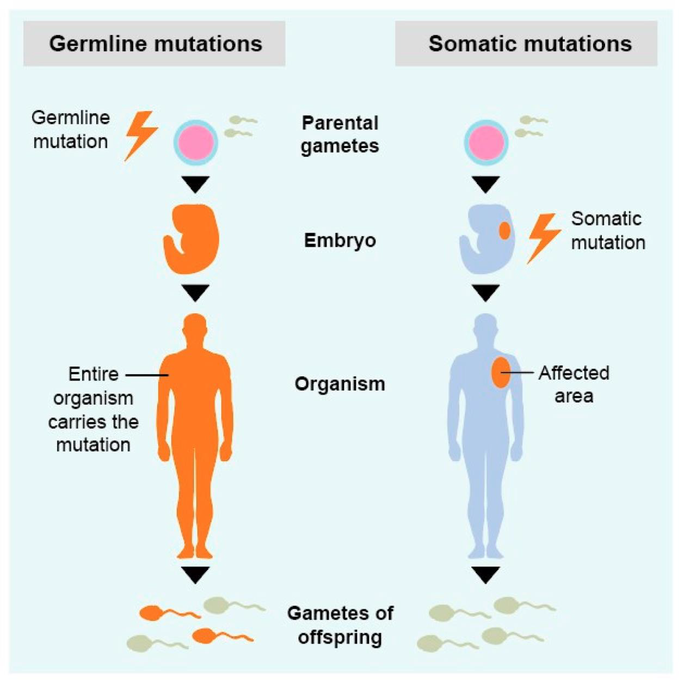
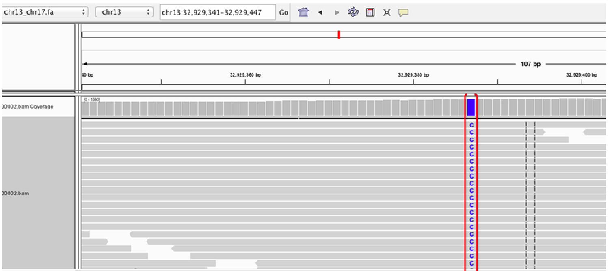
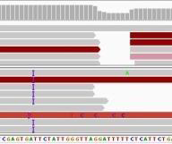
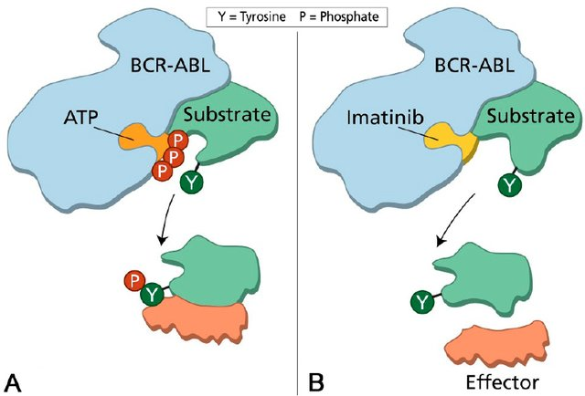
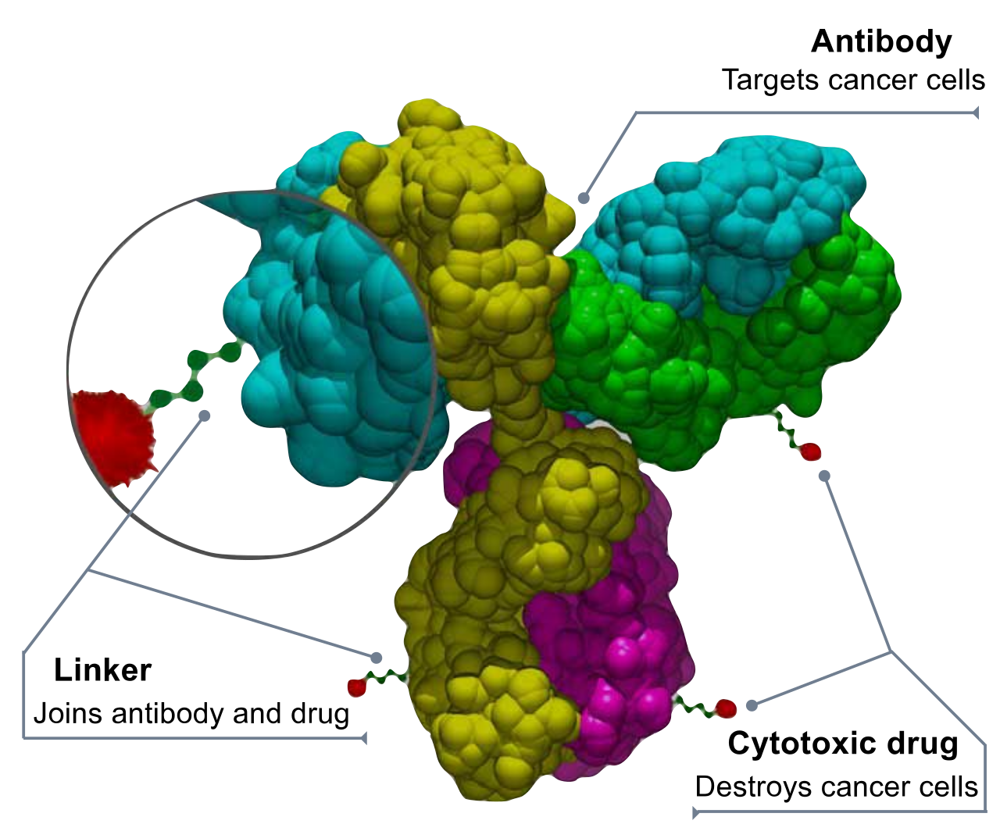

# 제6장 암

## 6.1 암이란 무엇인가?

암은 신체의 일부 세포가 통제 불능으로 성장하여 몸의 다른 부분으로 퍼지는 질병이다(https://www.cancer.gov/about-cancer/understanding/what-is-cancer). '통제 불능'이라는 표현은 이러한 세포들이 몸의 면역 체계를 회피한다는 의미를 포함한다.

암은 인간뿐만 아니라 다른 동물에서도 발생한다. 한국인의 경우, 평생 동안 약 38%가 암에 걸리는 것으로 알려져 있다(2019년 국가암등록통계). 생활 습관 중 특히 흡연은 모든 암의 약 30%를 유발하는 주요 원인이다(국민건강보험공단). 흡연자는 비흡연자에 비해 폐암 발생 위험이 15~30배 높다(https://www.cdc.gov/cancer/lung/basic_info/risk_factors.htm).

## 6.2 암은 왜 발생하는가?

### 6.2.1 단세포 생물의 유전자 유산

단세포 생물의 생존 전략은 '증식하거나 소멸하거나(Proliferate or perish)'이다. 흥미롭게도, 우리 인간은 단세포 생물이었던 시절부터 물려받은 유전자들을 여전히 가지고 있다! 이러한 유전자들은 암을 유발할 잠재력을 가지고 있으며, 이를 '**암유전자(Oncogenes)**'라고 부른다.

### 6.2.2 종양 억제자(Tumor suppressors)

한편, 이러한 암유전자들의 활성을 '억제'하는 유전자들도 존재한다. 이를 '**항암유전자(Anti-oncogenes)**' 또는 '**종양 억제 유전자(Tumor Suppressor Genes)**'라고 한다. 이러한 유전자들은 세포 주기 조절, DNA 복구, 세포 사멸(apoptosis) 등의 과정에 관여하여 암세포의 발생을 방지한다.

## 6.3 암 관련 신호 전달 경로(Pathways)

이전 장에서 살펴보았듯 세포 내에서는 다양한 신호 전달 경로가 존재하는데, 이 중 일부는 암 발생과 밀접한 관련이 있다.

### 6.3.1 MAPK-ERK 경로

MAPK-ERK 경로는 세포 성장, 분화, 생존 등에 중요한 역할을 하는 신호 전달 체계로, 암 발생과 연관된 대표적인 경로이다. 이 경로의 비정상적인 활성화는 다양한 암 유형에서 관찰된다. 

**Figure 6.1** RAS 경로 - MAPK-ERK 신호 전달 경로와 암 발생에서의 역할

### 6.3.2 RAS 유전자의 종간 보존

RAS 유전자는 MAPK-ERK 경로에서 중요한 역할을 하는 유전자로, 다양한 생물 종에서 매우 보존되어 있다. 이는 이 유전자의 기능이 진화적으로 매우 중요하다는 것을 의미한다.

이러한 유전자 보존성을 이해하기 위해서는 유전자들 간의 진화적 관계를 알아야 한다. **상동유전자(Homologs)**는 공통 조상으로부터 유래된 유전자들을 의미한다. 이 중에서 **직교유전자(Orthologs)**는 서로 다른 종에서 유사한 기능을 하는 상동유전자들이다. 예를 들어, 인간의 RAS 유전자와 생쥐의 RAS 유전자는 직교유전자 관계에 있다. 반면 **준동유전자(Paralogs)**는 같은 종 내에서 유전자 중복을 통해 유래된 상동유전자들로, 인간에게는 KRAS, NRAS, HRAS라는 세 가지 RAS 준동유전자가 존재한다. **유사유전자(Analogs)**는 서로 다른 조상에서 유래되었지만 유사한 기능을 수행하는 유전자들을 말한다.

**Figure 6.2** 상동유전자 관계 - 직교유전자, 준동유전자, 유사유전자 간의 진화적 관계

RAS 유전자가 효모부터 인간까지 광범위한 생물 종에서 보존되어 있다는 사실은 세포 성장과 분화에서 이 유전자가 얼마나 필수적인 역할을 하는지를 보여준다. 동시에 이것이 RAS 유전자의 변이가 암 발생에 중요한 영향을 미치는 이유이기도 하다.

**Figure 6.3** 인간 RAS 경로 - 인간에서의 RAS 신호 전달 경로와 연관된 단백질들

**Figure 6.4** 다른 생물의 RAS 경로 - 다양한 생물 종에서 RAS 경로의 보존성

## 6.4 원암유전자와 암유전자

정상 세포에서는 세포 증식, 분화, 생존 등에 관여하는 유전자를 '**원암유전자(Proto-oncogene)**'라고 한다. 이러한 원암유전자가 돌연변이를 통해 비정상적으로 활성화되면 '**암유전자(Oncogene)**'가 된다. 암유전자는 세포의 비정상적인 증식을 촉진하여 암 발생에 기여한다.

**Figure 6.5** 원암유전자 - 원암유전자에서 암유전자로의 변환 과정과 주요 예시들

## 6.5 돌연변이

### 6.5.1 BCR-ABL

BCR-ABL은 9번 염색체의 ABL 유전자와 22번 염색체의 BCR 유전자가 상호 전위(translocation)되어 형성된 융합 유전자이다. 이 융합 유전자는 만성 골수성 백혈병(CML)의 주요 원인으로 알려져 있다.

**Figure 6.6** 전위 예시 - 염색체 간 전위에 의한 융합 유전자 형성

**Figure 6.7** 전위 IGV 뷰 - IGV에서 관찰된 염색체 전위 브레이크포인트

**Figure 6.8** 대규모 복제 - 유전자 또는 염색체 영역의 대규모 복제 현상

**Figure 6.9** 대규모 삽입/결실 - 대규모 DNA 삽입 및 결실 변이의 예시

**Figure 6.10** BCR-ABL 융합 유전자 - 9번과 22번 염색체 전위에 의한 BCR-ABL 융합 유전자 형성

**Figure 6.11** BCR-ABL과 RAS 경로 - BCR-ABL 융합 단백질이 RAS 경로에 미치는 영향

### 6.5.2 복제수 변이(Copy Number Variation, CNV)

CNV는 DNA 세그먼트가 정상보다 많거나 적게 반복되는 유전적 변이이다. 암에서는 종양 유전자가 증폭되거나 종양 억제 유전자가 소실되는 형태로 CNV가 관찰될 수 있다.

## 6.6 대표적인 암유전자와 종양 억제자

### 종양 억제자

1. **TP53**: 
   - 많은 암 유형에서 흔히 돌연변이가 발견되는 유전자이다.
   - 'genome guardian'으로 불리며, DNA 손상 시 세포 주기 정지, DNA 복구, 세포 사멸 등을 조절한다.

2. **BRCA1/2**:
   - 일명 "유방암 유전자"로 불린다.
   - 돌연변이가 있으면 유방암/난소암 발생 위험이 크게 증가한다.
   - DNA 이중 가닥 복구에 중요한 역할을 한다.

**Figure 6.12** BRCA와 유방암 - BRCA1/2 유전자 변이와 유방암/난소암 발생 위험도

## 6.7 드라이버 돌연변이와 패신저 돌연변이

### 6.7.1 드라이버 돌연변이(Driver mutations)
암을 유발하는 돌연변이로, 주로 암유전자나 종양 억제자에서 발생한다. 이러한 돌연변이는 세포의 성장, 생존, 증식에 직접적인 영향을 미친다.

### 6.7.2 패신저 돌연변이(Passenger mutations)
암 발생에 직접적인 영향을 미치지 않는 양성 돌연변이이다. 암세포에서는 다음과 같은 이유로 이러한 돌연변이가 축적되는 경향이 있다:
- 암은 빠르게 증식하기 때문에 돌연변이가 더 많이 발생한다.
- DNA 복구 기작이 손상된 경우, 암은 더욱 공격적으로 변할 수 있다.

## 6.8 체세포 돌연변이(Somatic mutations)

체세포 돌연변이는 암세포에서 발견되는 유전적 변화로, 정상 세포에서는 관찰되지 않는 특징을 가진다. 이러한 돌연변이는 크기와 복잡성에 따라 여러 유형으로 분류할 수 있으며, 각각이 암의 발생과 진행에 서로 다른 방식으로 기여한다.

**Figure 6.13** 체세포와 생식세포 변이 - 체세포 변이와 생식세포 변이의 차이점과 유전 패턴

### 6.8.1 작은(또는 단순한) 돌연변이: SNV, Indel

가장 기본적인 형태의 체세포 돌연변이는 다음과 같다:

- **SNV(Single Nucleotide Variant)**: DNA 서열에서 하나의 염기가 다른 염기로 바뀌는 현상으로, 예를 들어 A가 T로 변하는 경우를 말한다. 이러한 변화는 단백질의 아미노산 서열을 바꾸어 단백질 기능에 영향을 미칠 수 있다.

**Figure 6.14** SNV 예시 - 단일 염기 변이의 다양한 유형과 단백질에 미치는 영향

- **Indel**: 작은 규모의 삽입(insertion)이나 결실(deletion)로, 일반적으로 수십 염기 이하의 크기를 가진다. 이들은 유전자의 읽기틀을 변경하여 완전히 다른 단백질을 만들어낼 수 있다.

**Figure 6.15** Indel 예시 - 작은 삽입 및 결실 변이와 읽기틀 변화에 의한 영향

### 6.8.2 Rainfall plot

**Rainfall plot**은 변이들 간의 거리를 시각화하여 특정 영역에 변이가 집중되는 현상인 kataegis를 식별하는 그래프이다. Kataegis는 특정 DNA 복구 기전의 오작동으로 인해 발생하는 현상으로, 암의 발생 과정을 이해하는 중요한 단서를 제공한다.

**Figure 6.16** Rainfall plot - 변이 간 거리를 시각화하여 kataegis 현상을 식별하는 그래프

### 6.8.3 CNV(Copy Number Variation)

복제수 변이는 특정 DNA 영역이 정상보다 많거나 적게 존재하는 현상이다. 암에서는 종양억제유전자가 있는 영역이 결실되거나, 암유전자가 있는 영역이 증폭되는 경우가 흔히 관찰된다.

- **Focal gain/loss**: 특정 유전자나 작은 영역에 국한된 복제수 변화를 의미하며, 이는 해당 유전자의 발현량에 직접적인 영향을 미친다.

- **LOH(Loss of Heterozygosity)**: 정상적으로 두 개의 서로 다른 대립유전자를 가져야 하는 부위에서 하나의 대립유전자가 소실되는 현상이다. 이는 특히 종양억제유전자에서 중요한데, 한 개의 대립유전자만으로는 정상적인 기능을 수행하기 어려워 암 발생에 기여할 수 있다.

**Figure 6.17** 국소 증폭과 LOH - 국소적 복제수 증가와 이형접합자 소실의 예시

### 6.8.4 큰(또는 복잡한) 돌연변이: 대규모 Indel, 구조적 변이(SV)

가장 복잡한 형태의 체세포 돌연변이는 다음과 같다:

- **대규모 Indel**: 수천에서 수백만 염기에 이르는 큰 DNA 조각이 삽입되거나 결실되는 현상이다.

- **구조적 변이**: 염색체의 구조가 근본적으로 바뀌는 변화로, CNV, 역위(inversion), 전위(translocation) 등이 포함된다.

**Figure 6.18** 복제수 이상 - 다양한 복제수 변이와 ecDNA 형성

- **ecDNA(Extrachromosomal DNA)**: 염색체에서 분리되어 독립적으로 존재하는 원형 DNA 구조로, 주로 암유전자가 고도로 증폭된 형태로 나타난다. ecDNA는 염색체보다 더 불안정하고 빠르게 진화할 수 있어 암의 진행과 치료 저항성에 중요한 역할을 한다.

이러한 대규모 변이들은 여러 유전자에 동시에 영향을 미칠 수 있어 암세포의 특성을 크게 바꿀 수 있다. 또한 이들은 종종 염색체 불안정성과 연관되어 있어, 암의 진행과 전이에 중요한 역할을 한다.

## 6.9 암 변이 데이터베이스

암 연구에서는 대규모 유전체 데이터를 체계적으로 수집하고 분석하기 위해 다양한 데이터베이스와 도구가 개발되었다. 이러한 자원들은 암의 분자적 특성을 이해하고 치료 전략을 개발하는 데 필수적인 역할을 한다.

### 6.9.1 주요 암 데이터베이스

- **COSMIC(Catalogue of Somatic Mutations in Cancer)**: 전 세계에서 수집된 암의 체세포 돌연변이에 관한 가장 포괄적인 정보를 제공하는 데이터베이스이다. 수백만 개의 변이 정보와 함께 변이 시그니처, 약물 저항성 정보 등을 포함한다.

- **ICGC(International Cancer Genome Consortium)**: 다양한 암 유형의 유전적, 후성유전적, 전사체적 특성을 연구하는 국제 협력 프로젝트로, 50개 이상의 암 유형에 대한 포괄적인 분자 정보를 제공한다.

**Figure 6.19** ICGC 주요 결과 - 국제 암 유전체 컸소시엄의 주요 연구 성과

- **TCGA(The Cancer Genome Atlas)**: 33개 암 유형에 대해 11,000명 이상의 환자 샘플을 분석한 대규모 연구 프로젝트로, 유전체, 전사체, 후성유전체, 단백체 데이터를 통합적으로 제공한다.

### 6.9.2 데이터 시각화 도구

**cBioPortal**(https://www.cbioportal.org/)은 암 유전체 데이터를 시각화하고 분석할 수 있는 웹 기반 플랫폼이다. 사용자는 특정 유전자나 암 유형에 대한 변이 패턴을 쉽게 검색하고 분석할 수 있다.

### 6.9.3 Oncoprint

**Oncoprint**는 여러 환자 샘플에서 다양한 유전적 변이를 시각적으로 표현하는 히트맵 형태의 그래프이다. 각 행은 유전자를, 각 열은 환자 샘플을 나타내며, 색상과 패턴을 통해 변이 유형을 구분한다. 이를 통해 특정 암 유형에서 어떤 유전자가 빈번하게 변이되는지, 그리고 여러 유전자의 변이가 어떻게 함께 나타나는지를 쉽게 파악할 수 있다.

**Figure 6.20** Oncoprint - 여러 환자 샘플에서 다양한 유전적 변이를 시각화한 히트맵

## 6.10 변이 주석(Variant Annotation)

변이 호출(variant calling) 후, dbSNP, Clinvar, 1000 Genomes, gnomAD 등의 데이터베이스를 참조하여 변이에 주석을 달 수 있다. ANNOVAR는 이러한 변이 주석 작업을 수행하는 도구 중 하나이다.

## 6.11 종양 순도(Tumor Purity)

종양 순도는 샘플 내 종양 세포의 비율을 의미한다. 체세포 변이 호출 시 종양 순도를 고려하는 것이 중요하다. 순도가 낮을수록 변이 검출이 어려워지므로, 분석 결과 해석 시 이를 고려해야 한다.

**Figure 6.21** 종양 순도 - 종양 샘플 내 종양 세포의 비율과 변이 검출에 미치는 영향

## 6.12 암 치료를 위한 정밀 의학

정밀 의학 접근법을 통한 암 치료 과정은 다음과 같다:

1. 대조군(정상 조직)과 종양 조직의 시퀀싱
2. 참조 유전체에 대한 정렬
3. 두 샘플의 변이 호출
4. 변이 제거: (종양 변이) - (대조군 변이) - (dbSNP의 일반적인 변이) = (체세포 돌연변이)
5. 돌연변이 유전자 세트 찾기(특히 rainfall plot에서)
6. 암유전자 조사 및 경로 분석 수행

**Figure 6.22** 전형적인 암 유전체학 파이프라인 - 정밀 의학을 위한 암 유전체 분석 과정

## 6.13 암 유전체의 특성

### 6.13.1 종양 이질성(Tumor Heterogeneity)

종양 이질성은 암 조직 내에서 세포들이 서로 다른 유전적, 후성유전적 특성을 보이는 현상이다. 이는 암 치료의 효과를 제한하는 주요 요인 중 하나이다. 종양 이질성은 크게 두 가지 유형으로 나뉜다.

종양간 이질성(Inter-tumor heterogeneity)은 같은 암 유형이라도 환자마다 다른 유전적 변이 패턴을 보이는 현상이다. 예를 들어, 폐암 환자 A와 B는 모두 폐암이지만 서로 다른 드라이버 돌연변이를 가질 수 있다. 종양내 이질성(Intra-tumor heterogeneity)은 같은 종양 내에서도 부위별로 다른 세포 집단이 존재하는 현상이다. 이로 인해 조직검사로 얻은 일부 샘플만으로는 전체 종양의 특성을 완전히 파악하기 어렵다.

### 6.13.2 클론 진화(Clonal Evolution)

클론 진화는 암이 발생하고 진행되는 과정에서 암세포들이 계속해서 새로운 변이를 획득하며 진화하는 현상이다. 이는 다윈의 자연선택 이론과 유사한 메커니즘으로 작동한다.

정상 세포에서 시작하여 첫 번째 드라이버 돌연변이가 발생하면 전암 병변이 형성된다. 추가적인 돌연변이가 축적되면서 암세포로 변환되고, 치료 과정에서 저항성을 가진 클론이 선택되어 살아남는다. 이 과정은 암의 재발과 전이의 주요 원인이 되며, 정밀의학에서 지속적인 모니터링이 필요한 이유이기도 하다.

### 6.13.3 변이 시그니처(Mutational Signatures)

변이 시그니처은 특정한 변이 유발 요인이 DNA에 남기는 고유한 변이 패턴을 의미한다. 각각의 변이 유발 요인은 특정한 염기 변화 패턴을 만들어내며, 이를 통해 암의 원인을 추정할 수 있다.

**COSMIC(Catalogue of Somatic Mutations in Cancer)** 데이터베이스는 암에서 발견되는 체세포 돌연변이들을 체계적으로 분류하고 분석한 결과를 제공한다. 돌연변이 시그니처는 특정한 돌연변이 패턴을 나타내며, 각각은 특정한 돌연변이 유발 과정과 연관되어 있다.

대표적인 변이 시그니처으로는 흡연에 의한 G>T 변이 증가, 자외선에 의한 C>T 변이 증가, APOBEC 효소에 의한 C>G 변이 증가 등이 있다. COSMIC 데이터베이스에서는 현재까지 약 60여 개의 서로 다른 변이 시그니처이 정의되어 있으며, 이는 암의 병인을 이해하고 치료 전략을 수립하는 데 중요한 정보를 제공한다.

**Figure 6.23** 변이 시그니처 - 특정 변이 유발 요인이 남기는 고유한 변이 패턴

돌연변이 시그니처 분석은 단순히 돌연변이 패턴을 파악하는 것을 넘어 임상적으로 매우 중요한 정보를 제공한다. 특정 화학물질이나 DNA 수선 기전의 결함과 연관된 고유한 시그니처를 통해 암의 근본 원인을 추정할 수 있다. 이러한 분석 결과는 치료에도 활용된다. DNA 수선 결함의 종류에 따라 특정 표적치료제의 효과가 다를 수 있어, 시그니처 분석을 통해 개인 맞춤형 치료 전략을 수립할 수 있다. 또한 환자의 돌연변이 부담 정도와 시그니처 패턴을 분석하여 치료 반응성이나 예후를 예측할 수 있다. 환경적 요인들도 특징적인 시그니처를 남기므로, 과거의 환경 노출 이력을 추정하고 예방 전략을 세우는 데 활용할 수 있다.

### 6.13.4 마이크로위성체 불안정성(Microsatellite Instability, MSI)

마이크로위성체 불안정성은 DNA 복구 시스템의 결함으로 인해 마이크로위성체 서열에서 반복적인 삽입/결실이 발생하는 현상이다. MSI는 주로 mismatch repair (MMR) 유전자의 기능 상실로 인해 발생한다.

MSI-High (MSI-H) 종양은 면역치료에 대한 반응성이 높은 것으로 알려져 있다. 이는 MMR 결함으로 인해 비정상적인 단백질이 많이 생성되어 면역계가 이를 외부 항원으로 인식하기 때문이다. 대장암의 약 15%, 자궁내막암의 약 30%에서 MSI-H가 관찰되며, 이러한 환자들은 PD-1/PD-L1 억제제와 같은 면역치료제에 좋은 반응을 보인다.

**Figure 6.24** 마이크로위성체 - 마이크로위성체 서열의 구조와 반복 단위

**Figure 6.25** 마이크로위성체 불안정성 - MSI 현상과 DNA 복구 결함에 의한 영향

### 6.13.5 종양 변이 부담(Tumor Mutational Burden, TMB)

종양 변이 부담은 암 유전체에서 관찰되는 체세포 변이의 총 개수를 의미한다. 일반적으로 백만 염기쌍당 변이 개수로 표현된다. TMB는 면역치료 효과를 예측하는 중요한 바이오마커로 여겨진다.

TMB가 높은 종양일수록 더 많은 신항원(neoantigen)을 생성할 가능성이 높아 면역계의 인식과 공격을 받기 쉽다. 흑색종, 폐암, 방광암 등은 일반적으로 높은 TMB를 보이며, 이러한 암종에서 면역치료의 효과가 좋은 것으로 알려져 있다. 반면 소아암이나 일부 혈액암은 상대적으로 낮은 TMB를 보인다.

## 6.14 액체생검과 순환종양DNA

### 6.14.1 액체생검(Liquid Biopsy)의 개념

액체생검은 혈액, 소변, 타액 등의 체액에서 순환하는 종양 유래 물질을 분석하여 암을 진단하고 모니터링하는 기술이다. 기존의 조직생검이 침습적이고 제한적인 정보만 제공하는 반면, 액체생검은 비침습적이며 종양 전체의 정보를 반영할 수 있다.

액체생검의 주요 분석 대상에는 순환종양DNA(circulating tumor DNA, ctDNA), 순환종양세포(circulating tumor cells, CTCs), 엑소좀(exosomes) 등이 있다. 이 중에서도 ctDNA가 가장 활발히 연구되고 있으며 임상 적용이 확대되고 있다.

### 6.14.2 순환종양DNA(Circulating Tumor DNA, ctDNA)

ctDNA는 종양세포가 죽으면서 혈액으로 방출되는 짧은 DNA 조각들이다. 이는 종양의 유전적 특성을 반영하므로 암의 진단, 치료 모니터링, 재발 감시 등에 활용될 수 있다.

ctDNA의 양은 일반적으로 전체 순환 DNA의 0.1-10% 정도로 매우 적어 검출에 고감도 기술이 필요하다. 종양의 크기, 위치, 혈관성, 전이 여부 등에 따라 ctDNA의 농도가 달라지며, 일반적으로 전이성 암에서 더 높은 농도로 검출된다.

### 6.14.3 액체생검의 임상 적용

액체생검은 여러 영역에서 임상적으로 활용되고 있다. 조기 진단 영역에서는 무증상 고위험군에서 암을 조기에 발견하기 위한 스크리닝 도구로 연구되고 있다. 치료 선택에서는 표적치료제의 적응증을 판단하기 위한 동반진단으로 사용된다.

치료 모니터링에서는 치료 중 ctDNA 농도 변화를 통해 치료 효과를 실시간으로 평가할 수 있다. 재발 감시에서는 수술 후 잔존 질병이나 재발을 조기에 탐지하는 데 활용된다. 또한 치료 저항성 획득 과정을 모니터링하여 치료 전략을 조정하는 데도 도움이 된다.

액체생검은 비침습적이고 반복적인 검사가 가능하여 종양의 시간적 변화를 추적할 수 있다는 장점이 있다. 그러나 아직 기술적 한계와 표준화 문제가 있어 지속적인 연구와 개발이 필요한 상황이다.

## 6.15 유전체학 기반 정밀의학

전통적인 암 치료는 주로 세포독성 항암제에 의존했다. 플라틴 계열 항암제(카보플라틴, 시스플라틴)는 DNA에 손상을 가해 빠르게 분열하는 암세포를 공격하지만, 동시에 정상 세포도 손상시켜 심각한 부작용을 야기했다. 그러나 암 유전체학의 발전은 이러한 "모든 암에 동일한 치료" 접근법에서 벗어나 "암의 분자적 특성에 맞춘 정밀치료"로의 혁명적 전환을 가능하게 했다.

**Figure 6.26** 플라티늄 화학요법 - 전통적인 세포독성 항암제의 작용 메커니즘

**Figure 6.27** 정밀 의학 - 개인 맞춤형 암 치료를 위한 유전체 기반 접근법

### 6.15.1 표적치료

암 유전체 시퀀싱을 통해 각 암의 고유한 유전적 변화가 밝혀지면서, 이러한 변화를 특이적으로 표적하는 치료법이 개발되었다. 이마티닙의 성공은 이러한 접근법의 가능성을 극명하게 보여준다. BCR-ABL 융합 단백질만을 선택적으로 차단하는 이 약물은 만성 골수성 백혈병 환자의 5년 생존율을 30%에서 90% 이상으로 끌어올렸으며, 동시에 기존 화학요법의 심각한 부작용은 크게 줄였다.

**Figure 6.28** BCR-ABL과 이마티닙 - 표적치료제 이마티닙의 BCR-ABL 단백질 선택적 차단

이러한 성공에 힘입어 EGFR 변이를 표적하는 게피티닙, HER2 증폭을 겨냥하는 트라스투주맙, BRAF 변이를 차단하는 베무라페닙 등 다양한 표적치료제가 개발되었다. 각각은 특정 유전적 변화를 가진 환자에게만 효과적이지만, 해당 환자들에게는 기존 치료법보다 훨씬 우수한 결과를 보여준다.

### 6.15.2 면역치료

암 유전체학의 또 다른 혁명적 발견은 면역치료의 토대를 마련했다. DNA 복구 결함으로 인해 높은 돌연변이 부담(TMB)을 가지거나 마이크로위성체 불안정성(MSI-H)을 보이는 종양은 수많은 신항원을 생성한다. 이러한 신항원은 면역계가 암세포를 "외부 침입자"로 인식할 수 있는 표지가 되며, 이는 면역관문 억제제의 효과를 극대화한다.

펨브롤리주맙과 같은 PD-1 억제제는 특히 MSI-H 대장암이나 높은 TMB를 가진 흑색종에서 놀라운 효과를 보인다. 일부 환자에서는 완전관해가 수년간 지속되는 결과를 보여주어, "암 완치"라는 희망을 현실로 만들고 있다.

**Figure 6.29** PD-L1 기적 - 면역관문 억제제의 혈색종 치료 성과

이와 함께 CAR-T 세포 치료법과 같은 세포 치료법도 혈액암 치료에서 혁신적인 결과를 보이고 있다. CRISPR 기술을 이용한 유전자 편집 치료법도 암 치료의 새로운 가능성을 열어주고 있다.

**Figure 6.30** CAR-T 세포 치료 - 유전자 조작된 T세포를 이용한 맞춤형 면역치료

**Figure 6.31** CRISPR 항암 치료 - CRISPR 기술을 이용한 유전자 편집 치료법

### 6.15.3 차세대 치료 기술

암 유전체학의 발전은 전통적인 약물 개발의 한계를 뛰어넘는 혁신적 기술들을 탄생시켰다. 항체-약물 접합체(ADC)는 암세포 표면의 특정 항원을 인식하는 항체에 강력한 세포독성 약물을 연결한 "스마트 미사일"이다. 이는 정상 세포에는 영향을 주지 않으면서 암세포만을 선택적으로 공격할 수 있게 한다.

**Figure 6.32** ADC 구조 - 항체-약물 접합체의 구조와 작용 메커니즘

환자별 종양 엑솜 시퀀싱을 통해 개인화된 신항원을 예측하고 맞춤형 암 백신을 제작하는 기술도 주목할 만한 발전이다. 각 환자의 고유한 변이 패턴을 분석하여 해당 환자만의 신항원 펩타이드를 합성하고, 이를 백신으로 활용하여 특이적인 T세포 반응을 유도한다. 이는 암 유전체학이 개인 맞춤형 치료의 구체적인 현실로 구현되는 과정을 보여주며, 임상시험에서 유망한 결과를 보이고 있다.

**Figure 6.33** 신항원 백신 - 개인 맞춤형 신항원 백신의 제작과 작용 원리

단백질 분해 표적 키메라(PROTAC) 기술은 또 다른 혁신적 접근법을 제시한다. 기존의 억제제가 문제 단백질의 활성만을 차단했다면, PROTAC은 해당 단백질을 세포 내에서 완전히 제거한다. 이는 기존에 "타겟하기 어려운(undruggable)" 단백질들도 치료 표적으로 만들 수 있는 가능성을 열어주었다. 특히 전사인자나 구조 단백질처럼 전통적인 약물로는 접근하기 어려웠던 표적들이 이제 치료 가능한 영역으로 들어오고 있다.

**Figure 6.34** PROTAC 기술 - 단백질 분해 표적 키메라 기술의 원리

**Figure 6.35** 다양한 TAC 기술 - PROTAC 외에 개발된 다양한 표적 단백질 분해 기술들

## 6.15 암과 노화

암 연구와 노화 연구는 놀라운 유사성을 보인다. 두 분야 모두 DNA 손상과 복구 메커니즘, 세포 주기 조절, 후성유전학적 변화, 텔로미어 역학 등의 공통된 분자 기전을 탐구한다.

**Figure 6.36** 노화와 암 - 노화와 암 연구의 많은 공통점과 분자적 메커니즘

세포노화는 암과 많은 분자 기전을 공유한다. 두 현상 모두 DNA 손상, p53 활성화, 텔로미어 단축 등의 동일한 경로를 거친다.

**Figure 6.37** 세포 노화

## 6.16 결론

암은 복잡하고 다면적인 질병으로, 단일 유전자의 변이가 아닌 다수의 유전적 변이가 축적되어 발생하는 질환이다. 암유전자와 종양억제유전자의 균형이 깨지면서 세포의 정상적인 성장 조절 메커니즘이 무너지고, 이는 결국 악성 종양으로 발전한다.

현대 암 연구는 차세대 시퀀싱 기술의 발전과 함께 급속도로 발전하고 있다. 종양 이질성, 클론 진화, 변이 시그니처 등의 개념을 통해 암의 발생과 진행 과정을 보다 정확하게 이해할 수 있게 되었다. MSI와 TMB 같은 바이오마커는 면역치료의 효과를 예측하는 중요한 지표로 활용되고 있다.

치료 측면에서는 전통적인 세포독성 항암제에서 정밀의학 기반 치료로 패러다임이 변화하고 있다. 환자의 종양을 유전체 분석하여 특정 변이나 바이오마커를 확인하고, 이에 맞는 표적치료제나 면역치료제를 선택하는 것이 표준 진료가 되었다. 표적치료제, 면역치료제, ADC, PROTAC 등 다양한 치료법이 개발되어 암을 "불치병"에서 "관리 가능한 만성질환" 또는 "완치 가능한 질병"으로 인식을 전환시키고 있다. 또한, 액체생검과 ctDNA 분석 기술은 비침습적으로 암을 진단하고 모니터링할 수 있는 새로운 가능성을 제시하고 있다. 이는 특히 치료 효과 모니터링과 재발 감시에서 중요한 역할을 할 것으로 기대된다.

의생명정보학은 이러한 모든 과정에서 핵심적인 역할을 담당하고 있다. 대용량 유전체 데이터의 분석, 변이의 기능적 해석, 치료 표적의 발굴, 바이오마커의 개발 등 모든 영역에서 의생명정보학적 접근이 필수적이다. 앞으로도 의생명정보학의 발전은 암 정복을 위한 중요한 열쇠가 될 것이다.
