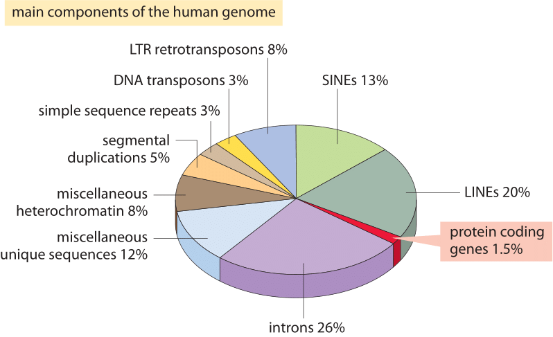
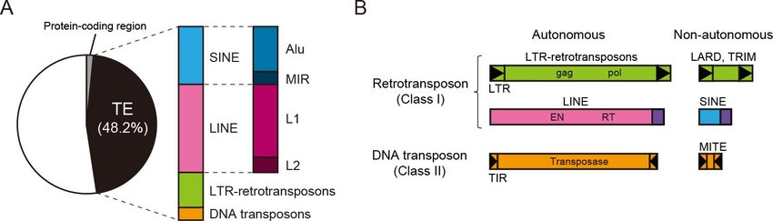
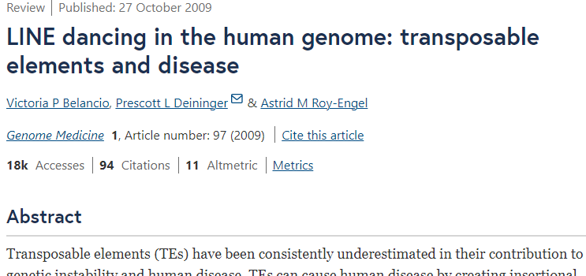
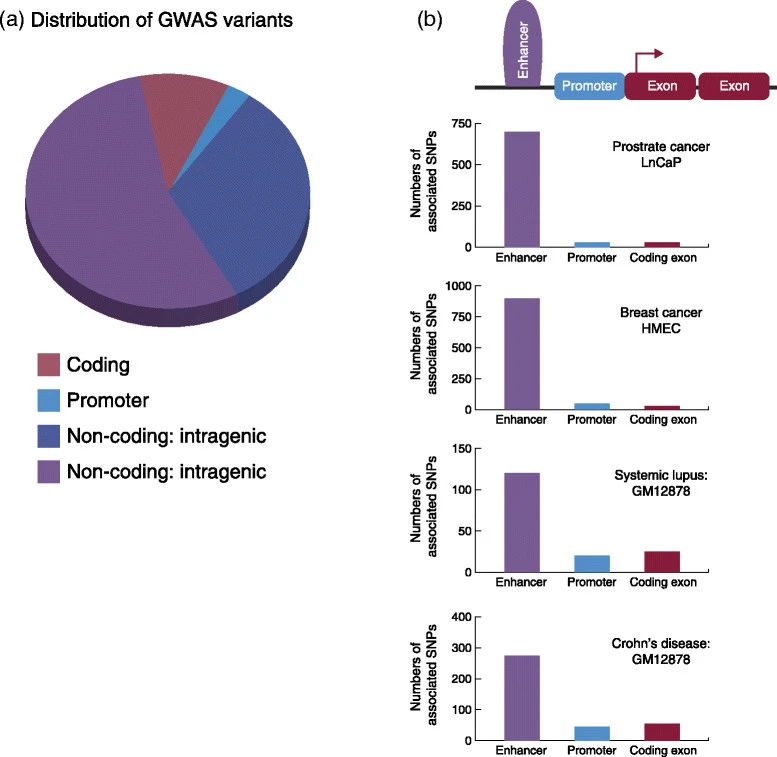
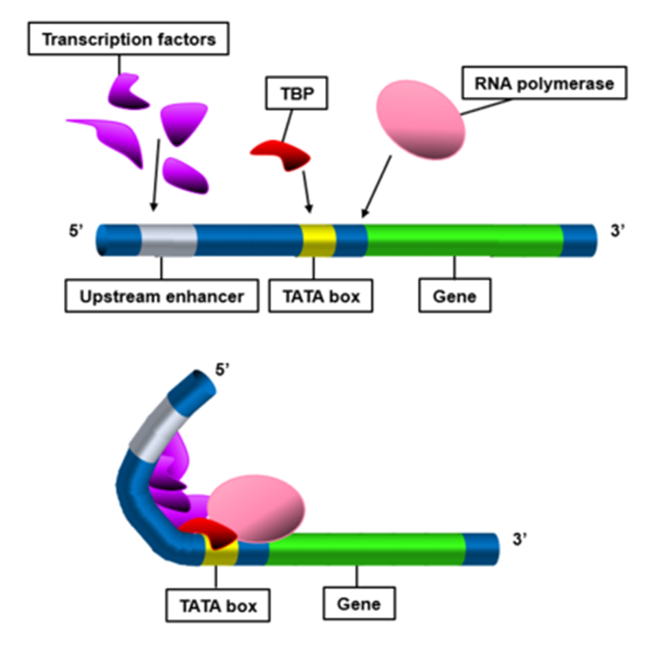
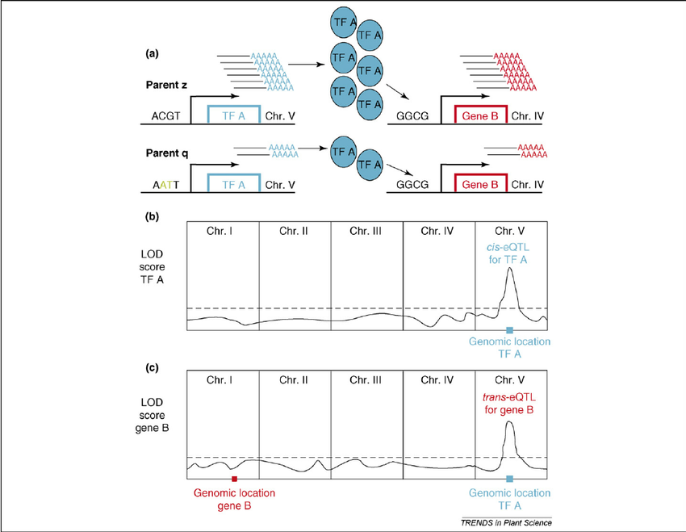
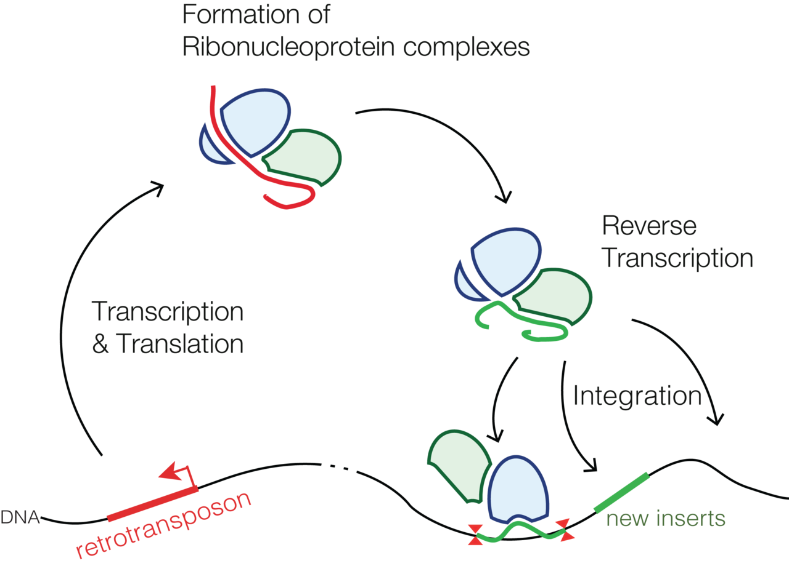

# 제7장 비코딩 유전체와 발현 조절

## 7.1 인간 유전체의 구성

인간 유전체는 단백질을 코딩하는 영역이 전체의 극히 일부에 불과하다는 특징을 가진다. 단백질 코딩 유전자는 전체 유전체의 1.5%에 불과하며, 나머지는 인트론(26%), LINE(Long Interspersed Nuclear Elements, 20%), SINE(Short Interspersed Nuclear Elements, 13%), LTR 레트로트랜스포존(8%), 단순 반복 서열(3%), 분절 중복(5%) 등의 비코딩 영역으로 구성되어 있다.

**Figure 7.1** 인간 유전체 구성 - 단백질 코딩 영역과 비코딩 영역의 비율

**Figure 7.2** 트랜스포제이블 요소 - 인간 유전체에 존재하는 다양한 트랜스포제이블 요소들

**Figure 7.3** LINE 반복 서열 - 인간 유전체에서 LINE 요소들의 분포와 진화

이러한 구성을 통해 알 수 있듯이, 인간 유전체의 대부분은 비코딩 영역으로 이루어져 있다. 과거에는 이러한 비코딩 영역을 '정크 DNA(junk DNA)'라고 불렀지만, 현재는 이들이 유전자 발현 조절과 유전체 구조 유지에 중요한 역할을 한다는 것이 밝혀지고 있다.

## 7.2 GWAS 변이의 분포와 비코딩 영역의 중요성

전장유전체연관분석(Genome-Wide Association Studies, GWAS)을 통해 발견된 질병 관련 변이들의 분포를 분석해보면 흥미로운 패턴을 발견할 수 있다. GWAS 변이의 대부분은 비코딩 영역(인터제닉 및 인트라제닉)에 집중되어 있으며, 프로모터 영역에 일부가, 그리고 코딩 영역에는 극히 일부만이 분포하고 있다.

### 7.2.1 질병별 GWAS 변이 분포

질병별 분석 결과를 보면, 대부분의 질병에서 인핸서 영역에 많은 연관 SNP가 집중되어 있다. 일부 질병은 인핸서 및 프로모터 영역에 고르게 분포하는 패턴을 보이기도 한다.

**Figure 7.4** GWAS 변이 분포 - 질병 관련 GWAS 변이들의 유전체 영역별 분포 패턴

**Figure 7.5** 전사인자와 인한서 - 전사인자와 인한서 요소에서의 GWAS 변이 또는 인한서 요소에서의 변이 또는 전사인자 결합 부위에서의 변이 집중도

이러한 분포 패턴은 질병 감수성이 단백질 서열의 변화보다는 유전자 발현 조절의 변화와 더 밀접한 관련이 있음을 시사한다. 따라서 후성유전체학적 접근이 질병의 분자적 기전을 이해하는 데 필수적이다.

## 7.3 발현 수량적 형질 유전자좌(eQTL)

### 7.3.1 QTL과 eQTL의 개념

**QTL(Quantitative Trait Loci)**은 다유전자 형질에 영향을 미치는 유전변이들의 위치를 의미한다. 이 중에서 **eQTL(Expression Quantitative Trait Loci)**은 특히 유전자의 발현에 영향을 미치는 유전변이들의 위치를 가리킨다.

### 7.3.2 eQTL의 분류

eQTL은 작용 방식에 따라 크게 두 가지로 분류된다. Cis-eQTL은 동일한 염색체상에서 비교적 가까운 거리(일반적으로 표적 유전자로부터 1Mb 이내)에 있는 유전자의 발현에 직접적인 조절 작용을 통해 영향을 미치는 변이이다. 반면 Trans-eQTL은 다른 염색체나 같은 염색체라도 멀리 떨어진 유전자의 발현에 영향을 미치는 변이로, 전사인자나 신호전달 경로를 통한 간접적인 조절 작용을 하며 네트워크 효과를 통해 다수 유전자의 발현에 동시에 영향을 미칠 수 있다.

**Figure 7.6** eQTL 개념 - Cis-eQTL과 Trans-eQTL의 차이점과 작용 메커니즘

### 7.3.3 eQTL 분석의 의의

GWAS 연구에서 질병과 연관된 변이를 발견하는 것은 첫 번째 단계일 뿐이다. 이러한 변이가 실제로 어떤 유전자의 발현에 영향을 미치는지 파악해야 질병의 분자적 메커니즘을 이해할 수 있는데, 바로 여기서 eQTL 분석이 중요한 역할을 한다.

eQTL 분석을 통해 우리는 여러 중요한 정보를 얻을 수 있다. 먼저 특정 유전적 변이가 실제로 어떤 유전자의 발현을 조절하는지 명확히 할 수 있으며, 그 조절 효과가 얼마나 강한지, 그리고 발현을 증가시키는지 감소시키는지도 정량적으로 측정할 수 있다. 특히 같은 변이라도 조직에 따라 다른 영향을 미칠 수 있기 때문에, 조직별 발현 조절 패턴을 파악하는 것은 질병의 조직 특이성을 이해하는 데 필수적이다. 나아가 여러 유전자들이 어떻게 네트워크를 이루어 질병 발생에 기여하는지도 eQTL 분석을 통해 규명할 수 있다.

### 7.3.4 GTEx 프로젝트

**GTEx(Genotype-Tissue Expression)** 프로젝트는 인간의 다양한 조직에서 유전자 발현 패턴과 유전적 변이의 연관성을 체계적으로 분석하는 대규모 연구 프로젝트다. 이 프로젝트는 49개의 서로 다른 조직에서 약 900명의 기증자로부터 수집된 데이터를 바탕으로 조직별 eQTL 지도를 구축했다.

GTEx 데이터베이스는 eQTL 연구의 표준 참조자료로 활용되고 있다. 이 데이터베이스를 통해 연구자들은 특정 유전적 변이가 어떤 조직에서 어떤 유전자의 발현에 영향을 미치는지 확인할 수 있으며, 조직별 발현 조절의 차이를 비교분석할 수 있다. GTEx는 또한 질병 관련 GWAS 변이들이 실제로 어떤 조직에서 어떤 유전자의 발현을 조절하는지 해석하는 데 핵심적인 역할을 한다.

## 7.4 트랜스포존과 유전체 진화

**레트로트랜스포존(Retrotransposon)**은 RNA를 중간체로 하여 역전사 과정을 통해 유전체 내에서 자신을 복사하고 이동하는 유전 요소다. 이들은 유전체 내에 존재하는 레트로바이러스의 흔적으로 여겨진다.

내인성 레트로바이러스(Endogenous Retroviruses, ERVs)는 과거에 생식세포계열에 감염되어 유전체에 통합된 레트로바이러스의 남은 서열이다. 바이러스 RNA와 단백질이 리보핵단백질 복합체를 형성하고, 역전사 과정을 통해 RNA가 DNA로 변환된다. 형성된 DNA는 숙주 세포의 유전체에 통합되어 새로운 바이러스 입자를 생산한다.

트랜스포존은 유전체에 다양한 영향을 미친다. 이들은 프로모터나 인핸서 역할을 통해 유전자 발현을 조절하고, 상동 재조합을 통해 큰 규모의 구조적 변이를 일으켜 유전체를 재배열한다. 또한 다른 방식의 스플라이싱을 통해 새로운 엑손을 제공하여 유전자 다양성을 증가시키고, 메틸화 패턴의 변화를 통한 후성유전학적 조절 기능을 수행한다.

**Figure 7.7** 레트로트랜스포존 - 레트로트랜스포존의 구조와 역전사 과정을 통한 복제 메커니즘

## 7.5 비코딩 RNA의 종류와 기능

**비코딩 RNA(non-coding RNA, ncRNA)**는 단백질로 번역되지 않지만 다양한 생물학적 기능을 수행하는 RNA 분자들이다. 인간 유전체에서 전사되는 RNA의 대부분이 비코딩 RNA이며, 유전자 발현 조절에 중요한 역할을 한다.

주요 비코딩 RNA로는 마이크로RNA (miRNA), 긴 비코딩 RNA (lncRNA), 작은 간섭 RNA (siRNA), 환형 RNA (circRNA) 등이 있다. 마이크로RNA는 약 20개 뉴클레오타이드 길이의 짧은 RNA로, 표적 mRNA에 결합하여 유전자 발현을 억제한다. 암에서는 종양억제 miRNA의 감소와 종양촉진 miRNA의 증가가 관찰되며, 이를 바탕으로 miRNA 기반 치료제가 개발되고 있다.

긴 비코딩 RNA는 200개 뉴클레오타이드 이상의 긴 RNA로, 크로마틴 구조 변화, 전사 조절, miRNA 스펀지 역할을 한다. 일부 긴 비코딩 RNA는 암 발생과 진행에 관여하는 것으로 알려져 있다. 작은 간섭 RNA는 약 21-23개 뉴클레오타이드 길이의 이중가닥 RNA로, 표적 mRNA의 특이적 분해를 통해 유전자 발현을 억제한다. 현재 여러 siRNA 치료제가 임상에서 승인되어 사용되고 있다.

## 7.6 비코딩 RNA의 의생명정보학적 분석

비코딩 RNA 연구에는 다양한 의생명정보학적 방법과 도구가 활용된다. RNA 시퀀싱을 통해 비코딩 RNA의 발현을 분석하고, 다양한 예측 도구를 사용하여 miRNA의 표적 유전자를 예측한다. 또한 유전자 온톨로지와 경로 분석을 통해 비코딩 RNA의 기능을 분석한다.

주요 데이터베이스로는 miRNA, 긴 비코딩 RNA, 암 관련 변이, 조직별 발현 패턴을 다루는 다양한 전문 데이터베이스들이 있다. 이들은 각각 서열과 주석 정보, 질병 관련 변이, 조직별 발현 패턴 등을 제공한다.

생물정보학적 도구로는 miRNA 표적 예측과 RNA 구조 예측을 위한 예측 소프트웨어, 비코딩 RNA 발현 분석을 위한 작업 과정, 그리고 네트워크 분석과 발현 패턴 시각화 도구 등이 있다. 이러한 도구들은 비코딩 RNA의 기능과 질병과의 연관성을 이해하는 데 필수적이다.

## 7.7 치료적 응용과 전망

비코딩 RNA는 현재 다양한 치료법의 표적이 되고 있다. siRNA 치료제는 유전성 질환 치료에서 승인을 받아 임상에서 사용되고 있으며, 안티센스 올리고뉴클레오타이드는 여러 질환 치료에 활용되고 있다. miRNA 기반 치료법도 임상시험이 진행되고 있어 향후 새로운 치료 옵션이 될 것으로 기대된다.

미래에는 환자별 비코딩 RNA 발현 양상을 바탕으로 한 개인 맞춤형 치료가 가능할 것으로 전망된다. 비코딩 RNA는 질병의 진단, 예후 예측, 치료 반응 모니터링을 위한 바이오마커로도 활용될 것이다. 또한 나노기술을 이용한 표적 전달 시스템의 발전으로 비코딩 RNA 기반 치료제의 효율성과 안전성이 더욱 향상될 것으로 예상된다.

## 7.8 결론

비코딩 유전체는 과거 '정크 DNA'로 여겨졌으나, 현재는 유전자 발현 조절에 핵심적인 역할을 하는 것으로 밝혀졌다. GWAS 변이의 대부분이 비코딩 영역에 분포한다는 사실은 질병이 단백질 서열 변화보다는 발현 조절 변화와 더 밀접한 관련이 있음을 보여준다.

비코딩 RNA는 miRNA, lncRNA, siRNA 등 다양한 종류가 있으며, 각각 고유한 방식으로 유전자 발현을 조절한다. 이들의 이상은 암, 신경질환, 심혈관질환 등과 연관되어 있어 새로운 진단 바이오마커와 치료 표적으로 주목받고 있다.

의생명정보학적 측면에서는 RNA-seq 기술과 다양한 분석 도구들을 통해 비코딩 RNA의 기능을 예측하고 분석할 수 있다. 특히 miRNA 표적 예측, 발현 패턴 분석, 네트워크 분석 등이 중요한 연구 방법론이다.

현재 siRNA 치료제가 임상에서 성공을 거두고 있으며, 향후 비코딩 RNA를 활용한 개인 맞춤형 치료법 개발이 기대된다. 이러한 비코딩 영역의 이해는 정밀의학 시대의 핵심 요소가 될 것이다.