# 제8장 후성유전체학

## 8.1 크로마틴 구조와 후성유전학적 조절

### 8.1.1 크로마틴의 기본 구조

DNA는 히스톤 단백질을 감싸 **뉴클레오솜(nucleosome)**을 형성하고, 이들이 연결되어 크로마틴 구조를 이룬다. 크로마틴의 응축 정도에 따라 유전자 접근성이 달라지며, 이는 유전자 발현 조절의 핵심 메커니즘이다.

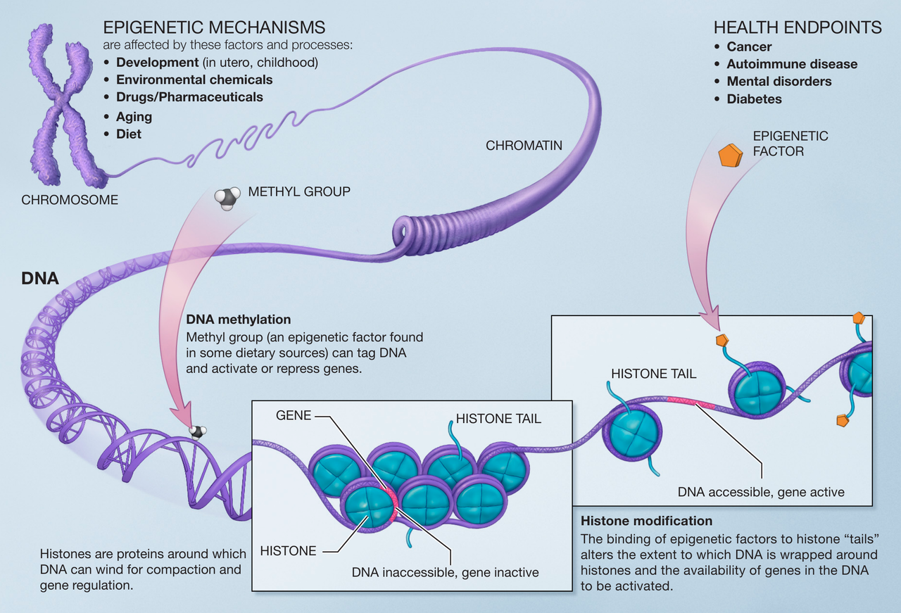

**Figure 8.1** 후성유전체 - DNA 메틸화, 히스톤 수정, 크로마틴 구조와 유전자 발현 조절

### 8.1.2 후성유전학적 조절 요인

후성유전학적 조절은 다양한 내외부적 요인의 영향을 받는다. 내부적 요인으로는 세포 분화와 발달 과정에서의 프로그래밍과 관련된 발달 단계와 세포 분열과 관련된 크로마틴 변화를 수반하는 세포 주기가 있다. 외부적 요인으로는 내분비 교란물질이나 중금속 같은 환경 화학물질, 치료제나 독성물질 노출과 관련된 약물, 시간 경과에 따른 점진적 변화로 나타나는 노화, 그리고 영양소와 대사물질의 영향을 포함하는 식이 요인 등이 있다.

### 8.1.3 질병과의 연관성

후성유전학적 변화는 다양한 질병과 밀접한 관련이 있다. 암에서는 종양 억제 유전자의 과메틸화와 암유전자의 저메틸화가 관찰되며, 이러한 변화가 암 발생과 진행에 중요한 역할을 한다. 자가면역질환에서는 면역 관련 유전자의 비정상적 발현 조절이 나타나 면역 반응의 균형이 깨지게 된다. 정신질환의 경우 신경발달과 신경가소성 관련 유전자의 조절 이상이 주요 특징이며, 당뇨병에서는 대사 관련 유전자의 발현 조절 장애가 질병 발생의 핵심 메커니즘으로 작용한다.

## 8.2 DNA 메틸화의 분자적 기전

### 8.2.1 DNA 메틸화의 기본 개념

DNA 메틸화는 사이토신 염기에 메틸기(-CH₃)를 부착하는 후성유전학적 변형으로, 주로 CpG 디뉴클레오타이드에서 발생한다. 이러한 메틸화 과정은 유전자 발현을 조절하는 중요한 메커니즘이다.

### 8.2.2 메틸화와 유전자 발현의 관계

메틸화와 유전자 발현 간의 관계는 두 가지 주요 상태로 나타난다. 정상적인 저메틸화 상태에서는 크로마틴이 개방되어 전사인자의 접근이 용이하며, RNA 중합효소 복합체가 효율적으로 전사를 수행한다. 반면 과메틸화 상태에서는 메틸화된 CpG가 메틸 CpG 결합 단백질을 유인하여 크로마틴이 응축되고, 히스톤 탈아세틸화효소 복합체의 동원으로 인해 전사가 억제된다.

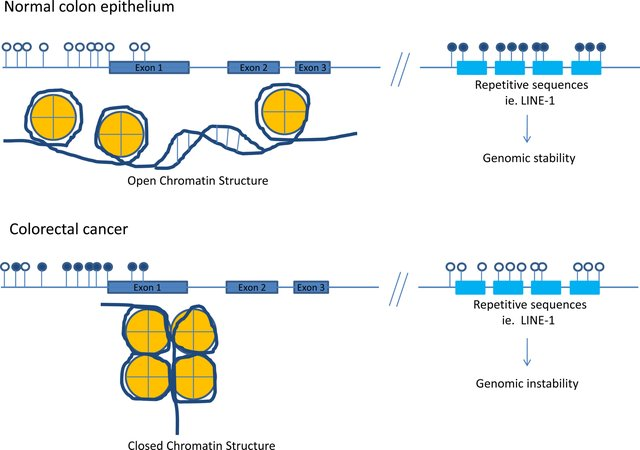

**Figure 8.2** DNA 메틸화 - 메틸화와 유전자 발현 억제 메커니즘

### 8.2.3 메틸화의 생화학적 특성

DNA에서는 여러 형태의 메틸화가 존재할 수 있다. 5-메틸사이토신(5mC)은 진핵생물과 원핵생물 모두에서 가장 잘 알려진 형태이다. 6-메틸아데닌(6mA) 및 4-메틸사이토신(4mC)은 주로 원핵생물에서 발견된다.

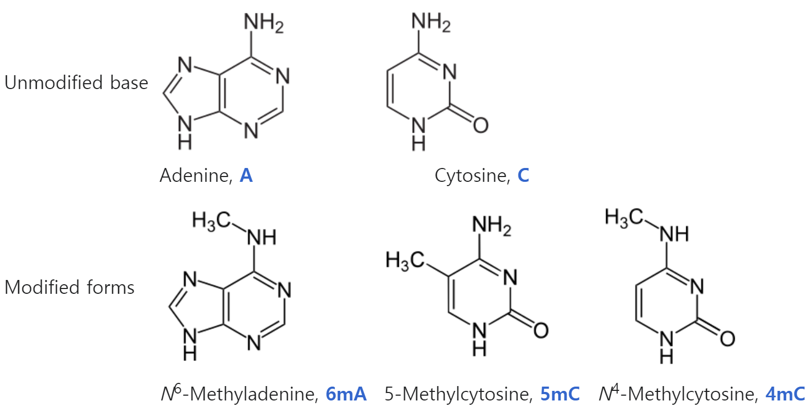

**Figure 8.3** 다양한 메틸화 형태 - 5mC, 6mA, 4mC 등 다양한 DNA 메틸화 형태들의 화학 구조

## 8.3 전장 바이설파이트 시퀀싱(WGBS)

### 8.3.1 WGBS의 원리

전장 바이설파이트 시퀀싱(Whole Genome Bisulfite Sequencing, WGBS)은 유전체 전체에서 5-메틸사이토신(5mC)의 위치를 단일 염기 해상도로 검출하는 기술이다. 이 기술의 핵심은 바이설파이트 화학적 처리를 통해 비메틸화된 사이토신을 우라실로 변환시키는 것인데, 이때 우라실은 DNA에서 일반적으로 사용되지 않는 염기이다. 일반적으로 DNA에서는 티민(T)이 사용되고 RNA에서만 우라실(U)이 사용되지만, 바이설파이트 처리 과정에서는 이러한 변환을 이용하여 메틸화 상태를 구별할 수 있게 된다.

### 8.3.2 바이설파이트 변환의 화학적 원리

바이설파이트 처리의 핵심 원리는 다음과 같다. 먼저 비메틸화된 사이토신은 바이설파이트 처리 시 우라실로 변환되는 반면, 메틸화된 사이토신은 이 처리에 저항하여 사이토신으로 유지된다. 이후 PCR 증폭 과정에서 우라실은 티민으로, 사이토신은 사이토신으로 유지되며, 최종적으로 시퀀싱을 통해 이러한 변환 패턴을 분석하여 원래의 메틸화 상태를 추론할 수 있다.

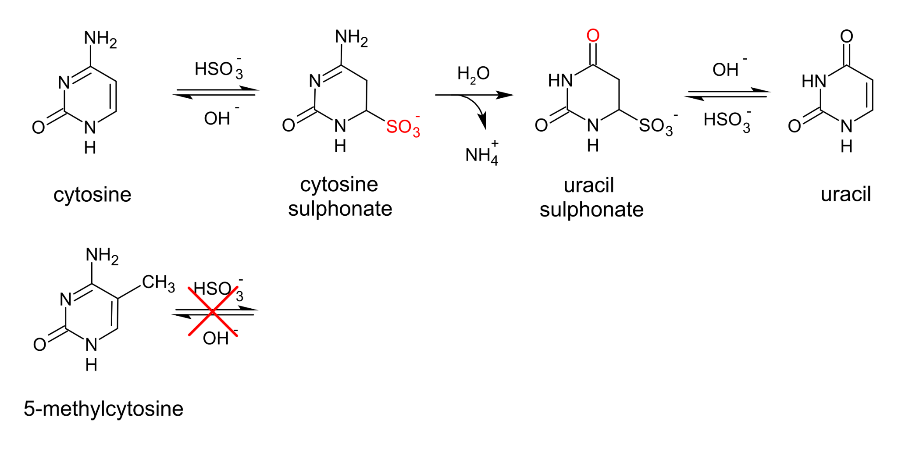

**Figure 8.4** WGBS 바이설파이트 처리 - 바이설파이트 화학적 처리를 통한 메틸화 검출 원리

### 8.3.3 WGBS 실험 과정

WGBS 파이프라인은 여러 단계로 구성된다. 먼저 고품질 유전체 DNA를 추출하여 샘플을 준비하고, 화학적 처리를 통해 사이토신을 바이설파이트로 변환한다. 이후 시퀀싱용 DNA 라이브러리를 구축하고 대용량 병렬 시퀀싱을 수행한다. 마지막으로 생물정보학 분석 단계에서는 BSMAP, Bismark 등의 전용 도구를 사용하여 정렬을 수행하고, 각 CpG 위치별 메틸화 수준을 계산하며, 변환 효율성 및 커버리지에 대한 품질 관리를 수행한다.

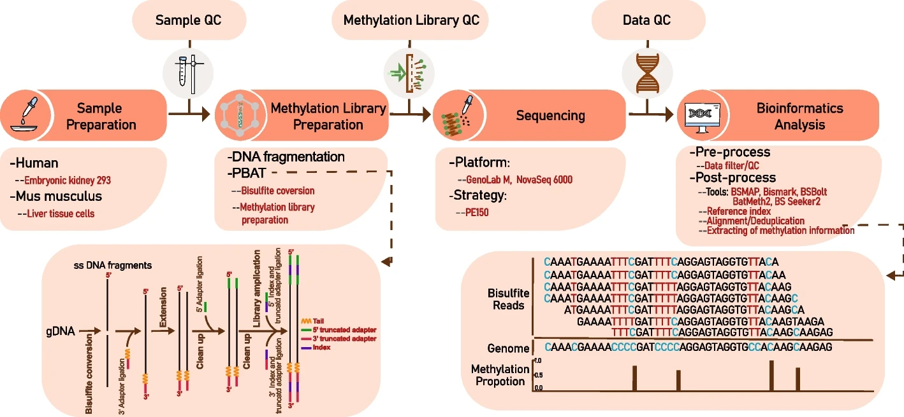

**Figure 8.5** WGBS 개요 - 전장 바이설파이트 시퀀싱의 전체적인 실험 과정

### 8.3.4 WGBS 데이터의 해석

WGBS 데이터 분석에서는 여러 주요 요소들을 고려해야 한다. 변환 효율성은 비메틸화 사이토신의 변환율로 95% 이상을 권장하며, 정확한 메틸화 수준 측정을 위해서는 충분한 시퀀싱 깊이와 커버리지가 필요하다. 또한 유전체 영역별 CpG 밀도의 차이와 세포나 조직 간 메틸화 패턴의 차이인 조직 특이성도 중요한 고려사항이다.

## 8.4 후성유전체 연관 분석(EWAS)

### 8.4.1 EWAS의 정의와 목적

**후성유전체 연관 분석(Epigenome-wide Association Study, EWAS)**은 유전체 전반의 메틸화 패턴과 특정 표현형(질병, 형질) 간의 연관성을 통계적으로 검정하는 연구 방법이다. EWAS는 6장에서 다룬 유전체 전장 연관 분석(GWAS)과 본질적으로 유사한 접근법을 사용하지만, DNA 서열 변이 대신 후성유전학적 변화(주로 DNA 메틸화)를 분석 대상으로 한다는 점에서 차이가 있다.

### 8.4.2 EWAS와 GWAS의 차이점

EWAS의 연구 설계는 GWAS와 기본적으로 동일하지만, 별다른 측정 대상과 고려사항들로 인해 여러 중요한 차이점들이 있다. 가장 기본적인 차이는 측정 대상에서 나타난다. GWAS가 DNA 서열 변이(예: SNP, CNV)를 대상으로 하는 반면, EWAS는 CpG 지점별 DNA 메틸화 수준을 분석한다.

기술적 고려사항에서도 중요한 차이가 있다. 현실에서 블액 내 세포 유형별 메틸화 패턴의 차이로 인해 세포 구성 효과를 반드시 보정해야 하며, 메틸화는 환경 요인에 의해 더 큰 영향을 받는 특성이 있다. 또한 메틸화 패턴이 시료 보관 조건에 더 민감하기 때문에 시료 안정성에도 주의를 기울여야 한다. 통계적 측면에서는 EWAS에서 CpG 지점 수가 약 2700만 개에 달하므로 GWAS보다 더 엄격한 유의수준을 적용해야 한다.

### 8.4.3 EWAS의 주요 발견들

EWAS 연구를 통해 다양한 환경 요인과 질병에서의 메틸화 변화가 밝혀졌다. 환경 요인 측면에서는 흡연이 특정 CpG 지점에서 일관된 메틸화 변화를 일으키고, 대기오염은 염증 관련 유전자의 메틸화 변화와 연관되어 있다. 또한 스트레스는 시상하부-뇌하수체-부신 축 관련 유전자의 조절 변화를 유발한다.

질병 관련 연구에서는 여러 중요한 발견들이 있었다. 당뇨병에서는 포도당 대사 관련 유전자의 메틸화 이상이 발견되었고, 심혈관질환에서는 지질 대사와 염증 관련 유전자에서 의미 있는 변화가 관찰되었다. 정신질환의 경우에도 신경발달 및 신경전달물질 관련 유전자의 조절 이상이 확인되었다.

## 8.5 크로마틴 면역침강 시퀀싱(ChIP-seq)

### 8.5.1 ChIP-seq의 기본 원리

크로마틴 면역침강 시퀀싱(Chromatin Immunoprecipitation sequencing, ChIP-seq)은 특정 단백질(전사인자, 히스톤 변형 등)이 결합한 DNA 서열을 유전체 전체에서 식별하는 기술이다.

### 8.5.2 ChIP-seq 실험 과정

#### 주요 실험 단계

ChIP-seq 실험 과정은 5개의 주요 단계로 구성된다. 첫 번째 단계인 교차결합(Crosslinking)에서는 포름알데하이드를 사용하여 살아있는 세포 내에서 일어나는 단백질-DNA 상호작용을 고정하여 in vivo 상태를 보존한다. 두 번째 단계는 크로마틴 전단(Shearing) 과정으로, 초음파 처리를 통한 물리적 방법 또는 MNase 등을 이용한 효소적 방법으로 크로마틴을 200-500bp 크기로 절단한다.

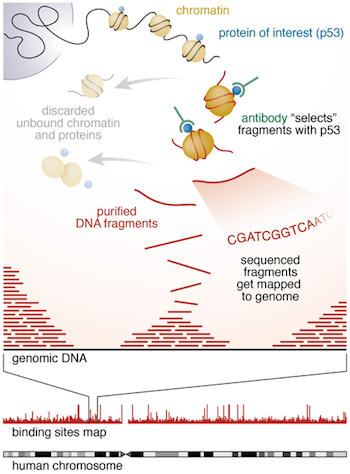

**Figure 8.6** ChIP-seq 과정 - 크로마틴 면역침강 시퀀싱의 실험 과정

세 번째 단계인 면역침강(Immunoprecipitation)에서는 표적 단백질에 특이적인 항체를 사용하여 Protein A/G 비드를 통해 항체-항원 복합체를 포획하고, 충분한 세척을 통해 비특이적 결합을 제거한다. 네 번째 단계에서는 역교차결합 및 DNA 정제 과정을 통해 고온 처리로 단백질-DNA 교차결합을 해제하고, 프로테아제 K 처리로 단백질을 제거하여 고순도 DNA를 회수한다. 마지막 단계에서는 라이브러리 제작 및 시퀀싱을 위해 시퀀싱 어댑터를 부착하고 PCR 증폭을 거쳐 고처리량 시퀀싱을 수행한다.

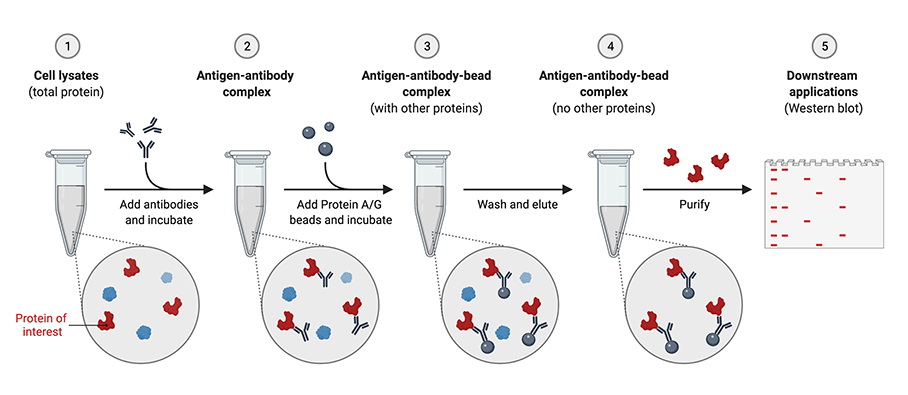

**Figure 8.7** 면역침강 과정 - 항체-항원 결합과 자성 비드를 이용한 분리 과정

ChIP-seq 실험에서 대조 실험은 결과의 신뢰성을 확보하는 데 필수적이다. Input DNA는 면역침강 없이 동일하게 처리한 전체 크로마틴으로 배경 신호를 평가하는 데 사용되며, IgG 대조는 비특이적 항체를 사용한 음성 대조로 비특이적 결합을 평가한다. 또한 실험 재현성 확보를 위해 독립적인 생물학적 복제 실험을 수행해야 한다.

### 8.5.3 면역침강의 생화학적 원리

면역침강의 생화학적 원리는 5개의 순차적 단계로 이루어진다. 먼저 표적 단백질에 대한 특이적 항체-항원 결합이 일어난 후, Protein A/G가 항체의 Fc 부위에 결합하여 비드 복합체를 형성한다. 이후 자성 비드를 이용한 자기 분리를 통해 복합체를 회수하고, 체계적인 세척 과정을 통해 비특이적 결합물질을 제거한다. 마지막으로 용출 과정을 통해 표적 복합체만을 선택적으로 회수한다.

### 8.5.4 ChIP-seq 데이터 분석

#### 전처리 및 품질 관리
ChIP-seq 데이터 분석은 전처리 및 품질 관리 단계에서 시작된다. 이 단계에서는 FastQC 등을 이용한 시퀀싱 품질 평가와 BWA, Bowtie2 등을 이용한 레퍼런스 유전체 정렬을 수행하며, PCR 중복으로 인한 편향을 제거하기 위해 중복 서열을 제거한다.

#### 피크 호출(Peak Calling)
피크 호출은 ChIP-seq 데이터에서 단백질이 결합한 유전체 영역을 식별하는 핵심 단계이다. MACS2, HOMER 등의 알고리즘을 사용하여 대조군 대비 통계적으로 유의한 신호 강화 영역을 식별한다. 피크의 형태는 표적 단백질의 특성에 따라 구분되는데, 전사인자의 경우 특정 DNA 서열에 직접 결합하여 좁은 피크(Sharp peaks)를 형성하는 반면, 히스톤 변형의 경우 넓은 크로마틴 도메인에 걸쳐 분포하여 넓은 피크(Broad peaks)를 나타낸다.

#### 기능적 주석화
피크 호출을 통해 식별된 결합 부위의 생물학적 의미를 파악하는 기능적 주석화 과정이 이어진다. 프로모터 분석에서는 전사개시점(TSS) 주변의 결합 패턴을 조사하여 유전자 전사에 미치는 직접적 영향을 평가하며, 인핸서 식별을 통해 원위 조절 요소를 발견하여 장거리 유전자 조절 메커니즘을 규명한다. 유전자 온톨로지 분석을 통해 결합 표적 유전자들의 기능적 특성을 분석하고, 모티프 분석을 통해 단백질이 인식하는 특정 DNA 서열 패턴의 특성을 규명한다.

### 8.5.5 ChIP-seq의 응용 분야

#### 전사 조절 연구
ChIP-seq는 전사 조절 메커니즘을 규명하는 핵심 도구로 활용된다. 전사인자 결합 지도 작성을 통해 조직 및 세포 특이적 결합 패턴을 밝혀내고, 여러 전사인자의 협동적 결합을 통한 조합적 조절 메커니즘을 이해할 수 있다. 이러한 결과를 통합하여 유전자 발현을 조절하는 복잡한 조절 네트워크의 전체적인 구조를 규명한다.

#### 후성유전학적 연구
후성유전학적 연구 분야에서 ChIP-seq는 크로마틴 구조와 기능을 이해하는 데 필수적인 기술이다. H3K4me3, H3K27me3 등 다양한 히스톤 변형의 유전체 전반에 걸친 분포 지도를 작성하여 크로마틴의 기능적 상태를 파악하고, 활성 및 억제 크로마틴 도메인을 식별한다. 특히 발달 과정이나 질병 상태에서 일어나는 후성유전학적 스위치 현상을 추적하여 크로마틴 상태의 동적 변화를 규명할 수 있다.

## 8.6 표적 시퀀싱과 캡처 기술

### 8.6.1 표적 시퀀싱의 필요성

전장 유전체 시퀀싱이나 전장 후성유전체 분석은 비용과 시간이 많이 소요되는 반면, 연구 목적에 따라서는 특정 영역에만 집중하는 것이 더 효율적일 수 있다. 표적 시퀀싱은 이러한 요구를 충족하는 비용 효율적인 대안이다.

### 8.6.2 엑솜 시퀀싱과 표적 후성유전체 분석

표적 시퀀싱은 특정 관심 영역에 대한 프로브를 사용하여 해당 영역의 DNA만 선택적으로 포획하고 시퀀싱하는 기술이다.

#### 전체 엑솜 시퀀싱(Whole Exome Sequencing)
전체 엑솜 시퀀싱은 10만 개 이상의 엑솜 영역을 대상으로 하여 전체 유전체의 약 1-2%에 해당하는 코딩 영역을 포괄적으로 분석하는 기술이다. 이 방법은 단백질 기능에 직접적인 영향을 미치는 변이를 집중적으로 탐지할 수 있어 유전질환 진단 및 암 유전학 연구에서 널리 활용되고 있다.

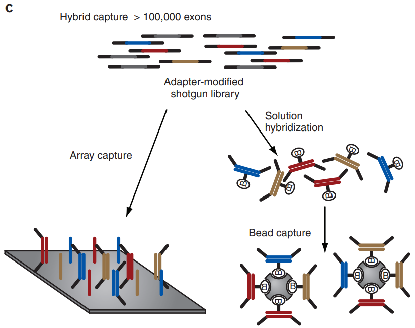

**Figure 8.8** 표적 시퀀싱 - 특정 유전체 영역에 대한 선택적 시퀀싱 과정

#### 표적 바이설파이트 시퀀싱
표적 바이설파이트 시퀀싱은 프로모터, 인핸서, CpG island 등 핵심 조절 영역에 집중하여 DNA 메틸화 패턴을 분석하는 기술이다. 이 접근법은 전장유전체 바이설파이트 시퀀싱(WGBS)에 비해 훨씬 경제적이면서도 특정 질병이나 생물학적 경로에 집중된 후성유전학 연구에서 높은 해상도의 결과를 제공한다.

## 8.7 ATAC-seq: 접근 가능한 크로마틴 분석

### 8.7.1 ATAC-seq의 기본 원리

**ATAC-seq(Assay for Transposase-Accessible Chromatin using sequencing)**은 Tn5 전이효소의 태그멘테이션(tagmentation) 반응을 이용하여 접근 가능한 크로마틴 영역을 식별하는 기술이다.

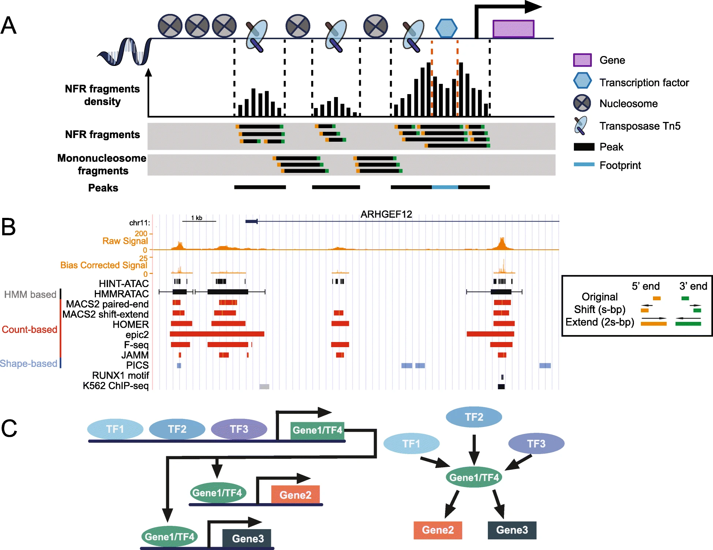

**Figure 8.9** ATAC-seq 원리 - Tn5 전이효소를 이용한 접근 가능한 크로마틴 분석

### 8.7.2 Tn5 태그멘테이션의 분자적 기전

#### 태그멘테이션 과정
1. **Tn5 결합**: 전이효소가 접근 가능한 DNA에 결합
2. **동시 절단 및 삽입**: DNA 절단과 어댑터 삽입을 한 번에 수행
3. **이중가닥 절단**: 약 300bp 간격으로 양쪽 가닥 모두 절단
4. **어댑터 부착**: 시퀀싱용 어댑터가 절단 부위에 직접 삽입

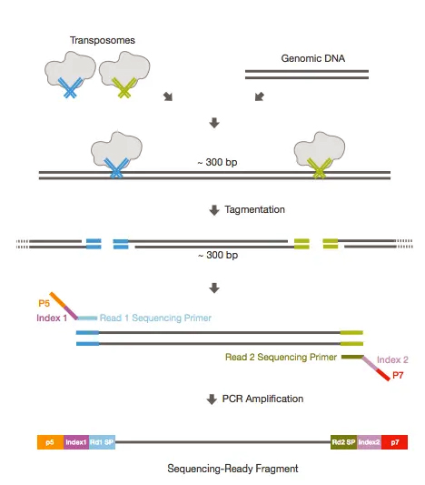

**Figure 8.10** 태그멘테이션 과정 - Tn5 전이효소의 동시 절단 및 어댑터 삽입

#### 크로마틴 접근성과 단편 길이
크로마틴의 구조적 특성에 따라 Tn5 전이효소의 접근 정도와 생성되는 DNA 단편의 길이가 달라진다. 열린 크로마틴 영역에서는 전이효소가 쉽게 접근하여 짧은 단편을 생성하고 높은 시퀀싱 신호를 나타내는 반면, 뉴클레오솜이 결합된 영역에서는 약 200bp 주기의 특징적인 길이 분포를 보인다. 응축된 크로마틴에서는 전이효소의 접근이 제한되어 신호가 현저하게 감소한다.

### 8.7.3 ATAC-seq 실험 과정

#### 샘플 준비
ATAC-seq 실험의 성공을 위해서는 고품질 샘플 준비가 필수적이다. 신선한 세포를 분리하거나 핵만을 선택적으로 추출하여 사용하며, 일반적으로 50,000에서 100,000개의 세포를 사용한다. 전 과정에서 적절한 이온 강도와 pH를 유지하는 버퍼 조건을 유지하여 크로마틴 구조를 보존한다.

#### 태그멘테이션 반응
태그멘테이션 반응은 ATAC-seq의 핵심 단계로, 37°C에서 30분에서 60분간 수행된다. 사용하는 세포 수에 따라 Tn5 전이효소의 농도를 신중하게 조절하여 최적의 태그멘테이션 효율을 달성하고, 반응 완료 후에는 EDTA 처리를 통해 효소 활성을 중단시켜 반응을 종료한다.

#### 라이브러리 증폭
태그멘테이션 반응으로 생성된 DNA 단편에 삽입된 어댑터를 이용하여 PCR 증폭을 수행한다. 이 과정에서는 과도한 증폭으로 인한 편향을 방지하기 위해 적절한 PCR 사이클 수를 신중하게 결정해야 하며, 마지막으로 크기 선별 과정을 통해 원하는 크기 범위의 DNA 단편만을 선택적으로 회수한다.

### 8.7.4 ATAC-seq 데이터 분석

#### 품질 평가 지표
- **TSS 농축도**: 전사 시작 지점 주변의 신호 강화 정도
- **뉴클레오솜 패턴**: 단편 길이 분포에서 200bp 주기성 확인
- **미토콘드리아 DNA 비율**: 핵 DNA의 순도 평가

#### 피크 호출 및 분석
ATAC-seq 데이터로부터 의미 있는 생물학적 정보를 추출하기 위해 피크 호출 및 분석 과정을 수행한다. 접근성 피크는 통계적으로 유의한 신호 강화를 보이는 영역으로 활성 조절 요소를 나타내며, 전사인자 풋프린팅 분석을 통해 피크 내에서 보호된 영역을 식별하여 결합 인자를 예측할 수 있다. 또한 조직이나 세포 간 차별적 접근성 패턴을 비교하여 세포형 특이적 인핸서를 식별한다.

## 8.8 크로마틴 형태 포획(3C 및 Hi-C)

### 8.8.1 크로마틴 형태 포획의 개념

**크로마틴 형태 포획(Chromatin Conformation Capture, 3C)**은 물리적으로 근접한 크로마틴 영역 간의 상호작용을 탐지하여 3차원 유전체 구조를 분석하는 기술이다.

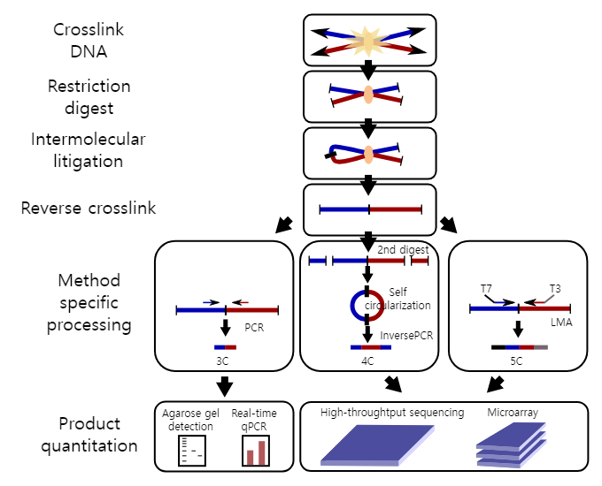

**Figure 8.11** 크로마틴 형태 포획 - 3C 기술을 이용한 크로마틴 상호작용 분석

### 8.8.2 3C 기술의 원리

#### 기본 과정
3C 기술은 5단계의 순차적 과정을 통해 크로마틴 상호작용을 분석한다. 첫 번째 단계에서는 포름알데하이드를 사용하여 살아있는 세포 내에서 일어나는 크로마틴 상호작용을 고정하고, 두 번째 단계에서는 제한효소를 처리하여 크로마틴을 특정 부위에서 절단한다. 세 번째 단계에서는 희석된 조건에서 DNA 연결효소를 이용하여 공간적으로 근접한 DNA 단편들을 분자간 연결시키며, 네 번째 단계에서는 역교차결합을 통해 단백질을 제거하고 DNA를 회수한다. 마지막 단계에서는 PCR 또는 시퀀싱을 통해 상호작용하는 DNA 영역들을 검출하고 정량화한다.

#### 생물학적 의의
근접한 크로마틴 영역들이 서로 상호작용하여 그 양을 측정함으로써 3차원 공간에서의 유전체 구조를 추론할 수 있다.

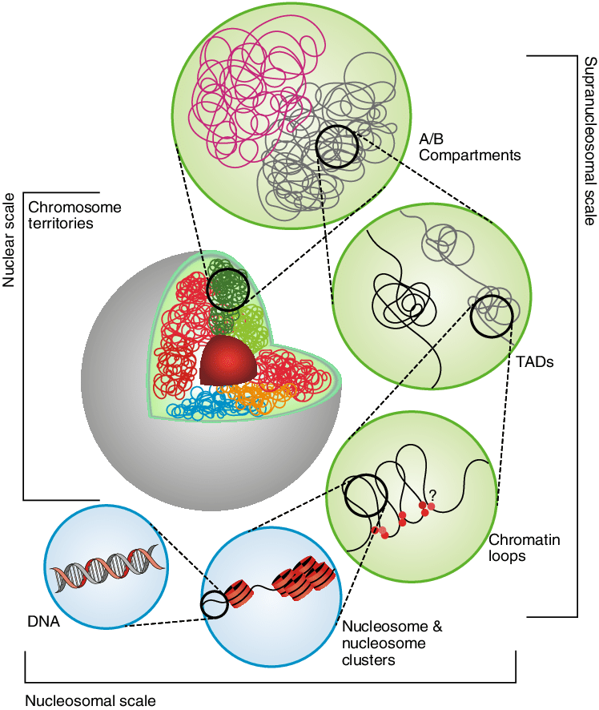

**Figure 8.12** 3차원 유전체 구조 - 크로마틴 상호작용을 통한 공간적 구조

### 8.8.3 Hi-C: 유전체 전체 크로마틴 상호작용

#### Hi-C의 특징
Hi-C 기술은 3C 기술의 발전된 형태로 여러 독특한 특징을 가지고 있다. 전유전체 접근법을 통해 유전체 내 모든 가능한 크로마틴 상호작용을 동시에 분석할 수 있으며, 수 킬로베이스 단위의 고해상도로 상호작용 지도를 작성할 수 있다. 또한 상호작용 빈도를 정량적으로 측정하여 크로마틴 상호작용의 강도를 정확하게 평가할 수 있다.

#### Hi-C 데이터의 활용
Hi-C 데이터는 3차원 유전체 구조를 이해하는 데 다양하게 활용된다. 프로모터와 인핸서 간의 장거리 상호작용 등 유전자 발현 조절에 중요한 3차원 구조를 규명한다.

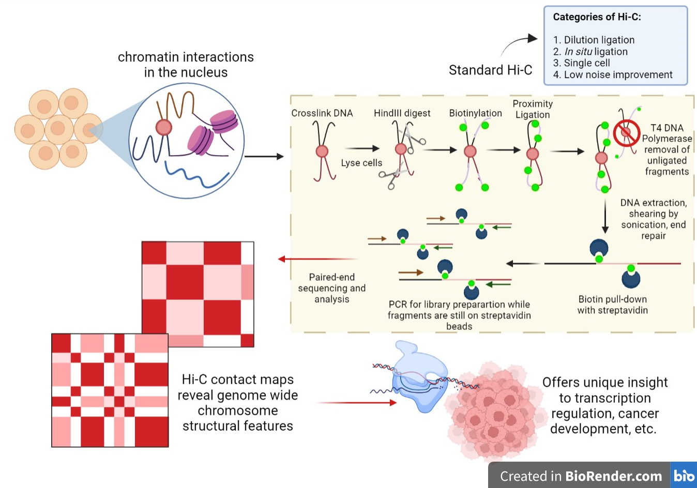

**Figure 8.13** Hi-C 기술 - 전유전체 크로마틴 상호작용 분석 과정

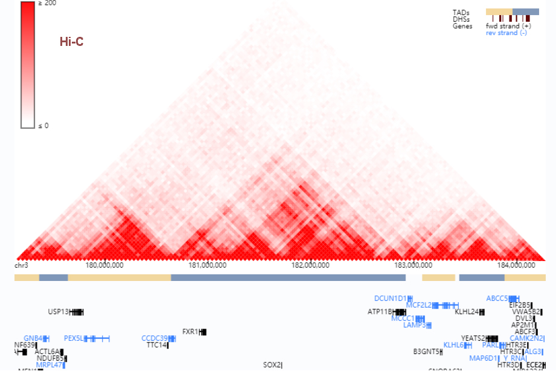

**Figure 8.14** Hi-C 결과 - 크로마틴 상호작용 빈도 지도와 구조적 도메인

## 8.9 피크 호출 방법론

### 8.9.1 피크 호출의 기본 원리

피크 호출은 ChIP-seq, ATAC-seq 등 후성유전체 데이터에서 통계적으로 유의한 신호 영역을 식별하는 핵심 과정이다. 기본적으로 배경 신호 대비 현저히 높은 시퀀싱 읽기 수를 보이는 연속된 유전체 영역을 찾아내며, 이때 거짓 양성을 최소화하면서 진정한 결합 부위나 활성 영역을 정확히 검출하는 것이 목표이다.

### 8.9.2 피크 형태와 특성

#### 피크 유형별 특징
후성유전체 데이터에서 관찰되는 피크는 표적 단백질과 실험 조건에 따라 서로 다른 형태를 보인다. 전사인자 결합 부위는 일반적으로 좁고 뾰족한 피크(Sharp peaks)를 형성하며 수백 염기쌍 범위에서 강한 신호를 나타낸다. 반면 히스톤 변형은 넓고 완만한 피크(Broad peaks)를 형성하여 수 킬로염기쌍에 걸쳐 분포하며, 크로마틴 접근성 신호는 중간 정도의 폭을 가진 피크를 보인다.

#### 신호 분포 패턴
각 피크 유형은 고유한 신호 분포 패턴을 가진다. 전사인자 피크는 중심에서 최고점을 보이고 양쪽으로 급격히 감소하는 패턴을 보이며, 히스톤 변형 피크는 평탄한 고원 형태나 여러 개의 작은 봉우리가 연결된 형태를 나타낸다. 이러한 패턴의 차이는 피크 호출 알고리즘 선택에 중요한 기준이 된다.

### 8.9.3 피크 호출 방법론

#### 통계적 접근법
MACS2, HOMER 등의 전통적인 피크 호출 도구는 포아송 분포나 음이항 분포를 기반으로 한 통계적 모델을 사용한다. 이들은 국소적 배경 신호를 추정하고 이를 기준으로 통계적 유의성을 계산하여 피크를 식별한다. 은닉 마르코프 모델(HMM)을 활용한 방법은 인접한 위치 간의 공간적 연속성을 고려하여 더 정확한 피크 경계를 결정할 수 있다.

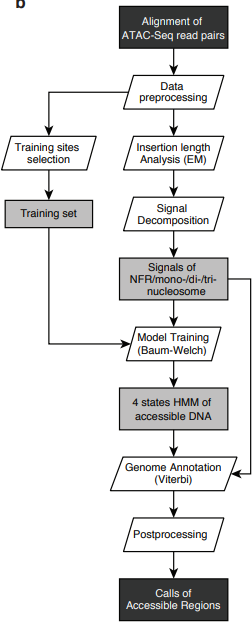

**Figure 8.15** ATAC-seq 피크 호출 - HMM 기반 피크 호출 예제와 결과

#### 기계학습 기반 접근법
최근에는 딥러닝을 포함한 기계학습 기법이 피크 호출에 적용되고 있다. 합성곱 신경망(CNN)은 피크의 형태적 특징을 학습하여 복잡한 신호 패턴을 인식할 수 있으며, 순환 신경망(RNN)은 시계열 신호의 장거리 의존성을 모델링할 수 있다. 이러한 방법들은 대용량 훈련 데이터를 통해 다양한 실험 조건에서 robust한 성능을 보이는 장점이 있다.

#### 통합적 접근법
현대적인 피크 호출 파이프라인은 여러 방법을 조합하여 사용한다. 초기 후보 영역을 통계적 방법으로 식별한 후 기계학습 모델로 정제하거나, 서로 다른 알고리즘의 결과를 ensemble하여 신뢰도를 높이는 접근법이 널리 사용되고 있다. 또한 멀티모달 데이터를 활용하여 여러 후성유전체 신호를 동시에 고려하는 통합적 피크 호출 방법도 개발되고 있다.

## 8.10 결론

후성유전체학은 DNA 서열 변화 없이도 유전자 발현이 조절되는 메커니즘을 연구하는 분야로, 현대 의생명정보학에서 핵심적인 역할을 담당하고 있다. 유전체 서열 정보만으로는 설명할 수 없는 생물학적 현상들이 점점 더 많이 발견되면서 후성유전체학의 중요성이 더욱 부각되고 있다.

동일한 유전체 서열을 가진 일란성 쌍둥이의 표현형 차이, 환경 요인에 의한 유전자 발현 변화, GWAS 변이의 기능적 해석 등은 모두 후성유전학적 정보 없이는 완전히 이해할 수 없는 현상들이다. 이에 따라 현대 생의학 연구는 "무엇이 있는가"를 보여주는 유전체 정보에서 "언제, 어디서, 어떻게 조절되는가"를 설명하는 후성유전체 정보를 함께 분석하는 통합적 접근법을 채택하고 있다.

WGBS, ChIP-seq, ATAC-seq, Hi-C 등 다양한 후성유전체 기술들을 통합적으로 활용함으로써 암, 신경질환, 대사질환 등의 분야에서 새로운 이해를 얻고 있으며, 단일세포 분석과 기계학습 기법의 발전과 함께 개인 맞춤 의학 실현에 핵심적인 기여를 할 것으로 기대된다.