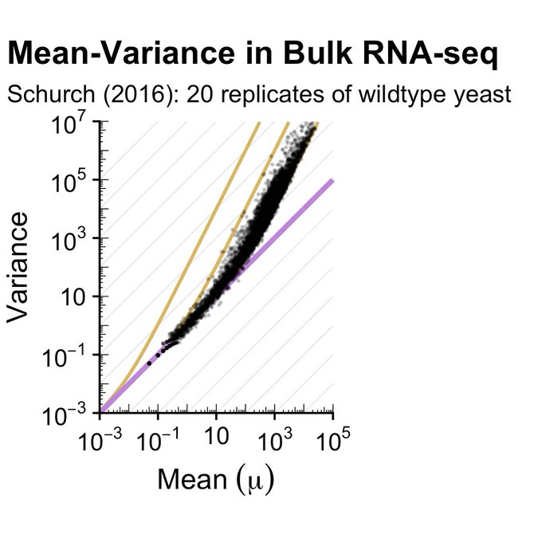
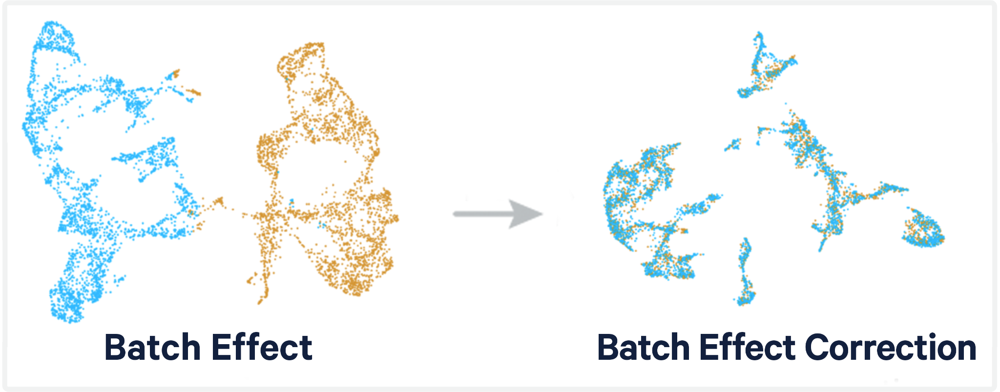

# 제9장 전사체학 기초

## 9.1 전사체학 개요

전사체학(Transcriptomics)은 특정 조건에서 세포 또는 조직이 발현하는 모든 RNA 분자를 종합적으로 분석하는 학문 분야이다. 유전체학이 생명체가 가진 유전적 잠재력을 보여준다면, 전사체학은 특정 시점과 조건에서 실제로 활성화되고 있는 유전자들의 발현 패턴을 제시한다. 이는 생명 현상을 이해하는 데 있어 정적인 설계도에서 동적인 실행 과정으로의 관점 전환을 의미한다.

전사체학은 다양한 생물학적 질문에 답할 수 있다. 예를 들어, 특정 질병 상태에서 어떤 유전자들이 비정상적으로 발현되는지, 약물 치료에 대한 세포의 반응은 어떤지, 발생 과정에서 세포가 어떻게 분화하는지 등을 분자 수준에서 규명할 수 있다. 또한 환경 변화나 스트레스에 대한 생물체의 적응 반응을 전사체 차원에서 해석할 수 있다.


**Figure 9.1** 유전자 발현 히트맵 - 다양한 조건에서의 유전자 발현 패턴 비교

## 9.2 마이크로어레이 기술

### 9.2.1 마이크로어레이의 기본 원리

마이크로어레이(microarray)는 RNA-seq 이전에 유전자 발현을 대규모로 분석하는 주요 기술이다. 이 기술은 고체 기판(주로 유리 슬라이드) 위에 수천에서 수만 개의 DNA 프로브를 배열하여 특정 유전자의 발현량을 측정한다. 각 프로브는 특정 유전자 서열에 상보적인 단일가닥 DNA 올리고뉴클레오타이드로 구성되며, 표적 RNA와 혼성화(hybridization)를 통해 결합한다.


**Figure 9.2** 마이크로어레이 - DNA 프로브 배열과 혼성화 원리

실험 과정에서는 먼저 샘플에서 추출한 RNA를 역전사하여 cDNA로 변환한 후, 형광 염료로 표지한다. 일반적으로 대조군과 실험군을 서로 다른 색깔의 형광 염료(Cy3, Cy5)로 표지하여 동일한 칩에서 동시에 분석할 수 있다. 표지된 cDNA가 칩 위의 해당 프로브와 혼성화하면 형광 신호가 발생하며, 이 신호의 강도가 해당 유전자의 발현량에 비례한다.


**Figure 9.3** 마이크로어레이 유전자 발현 - 형광 신호를 통한 발현량 측정

### 9.2.2 마이크로어레이의 장단점

**장점**으로는 상대적으로 저렴한 비용과 표준화된 프로토콜로 인한 높은 재현성을 들 수 있다. 또한 잘 알려진 유전자들에 대해서는 매우 정확한 정량이 가능하며, 대용량 샘플 처리에 적합하다. 데이터 분석 파이프라인이 성숙되어 있어 결과 해석이 용이하다.

**단점**으로는 미리 설계된 프로브에 해당하는 유전자만 측정할 수 있어 새로운 전사체나 이소폼을 발견할 수 없다는 제한이 있다. 또한 발현량이 매우 높거나 낮은 유전자의 정확한 측정이 어려우며, 특이성이 낮은 문제도 한계로 지적된다.

### 9.2.3 마이크로어레이 데이터 분석

마이크로어레이 데이터 분석은 여러 전처리 단계를 거친다. **배경 보정(background correction)**에서는 비특이적 혼성화로 인한 배경 신호를 제거하고, **정규화(normalization)**를 통해 칩 간의 기술적 변이를 보정한다. 대표적인 정규화 방법으로는 분위수 정규화(quantile normalization)와 RMA(Robust Multi-array Average) 방법이 있다.

차등 발현 분석에서는 t-검정, ANOVA, 또는 더 정교한 통계 모델을 사용하여 조건 간 발현 차이를 검정한다. 다중 검정 보정을 통해 위양성률을 조절하며, fold change와 통계적 유의성을 동시에 고려하여 생물학적으로 의미 있는 유전자를 선별한다.

## 9.3 정량적 중합효소연쇄반응(qPCR)

### 9.3.1 qPCR의 기본 원리

정량적 중합효소연쇄반응(quantitative PCR, qPCR 또는 real-time PCR)은 특정 유전자의 발현량을 정확하고 신속하게 측정할 수 있는 기술이다. 전사체학 연구에서는 주로 RT-qPCR(Reverse Transcription qPCR) 형태로 사용되며, 먼저 RNA를 cDNA로 역전사한 후 특정 유전자 서열을 실시간으로 증폭하면서 그 양을 정량화한다.

qPCR의 핵심은 PCR 증폭 과정에서 실시간으로 형성되는 PCR 산물의 양을 모니터링하는 것이다. 매 사이클마다 측정되는 형광 신호의 강도는 초기 주형 DNA(또는 cDNA)의 양에 비례하므로, 이를 통해 원래 샘플에 존재했던 RNA의 양을 역추적할 수 있다.

### 9.3.4 qPCR의 장단점과 응용

**장점**으로는 높은 정확도와 정밀도, 빠른 분석 속도(2-3시간), 넓은 발현 범위(7-8 log), 높은 특이성을 들 수 있다. 또한 상대적으로 저렴한 비용으로 소수의 유전자를 정확하게 분석할 수 있어 마이크로어레이나 RNA-seq 결과의 검증에 자주 사용된다.

**단점**으로는 한 번에 분석할 수 있는 유전자 수가 제한적이며(일반적으로 1-100개), 새로운 전사체나 스플라이싱 변이를 발견할 수 없다. 또한 참조 유전자의 선택이 결과에 큰 영향을 미칠 수 있다.

## 9.4 Bulk RNA 시퀀싱

RNA 시퀀싱(RNA-seq)은 차세대 시퀀싱(NGS) 기술을 기반으로 한 전사체 분석 기법이다. 마이크로어레이나 qPCR과 달리 RNA-seq은 미리 설계된 프로브나 프라이머 없이도 샘플에 존재하는 모든 RNA 분자를 정량화할 수 있다. 이는 알려지지 않은 전사체나 새로운 스플라이싱 변이체의 발견을 가능하게 하며, 전장 유전체 수준에서 전사체의 전체적인 그림을 제공한다.

NGS 기술의 발전과 비용 감소로 인해 RNA-seq은 현재 전사체학 연구의 표준 방법으로 자리잡았다. 한 번의 실험으로 수만 개의 유전자를 동시에 분석할 수 있으며, 매우 넓은 발현 범위와 높은 해상도를 제공한다. 또한 정량적 분석뿐만 아니라 새로운 전사체 발견, 대립유전자별 발현 분석, 융합 유전자 검출 등 다양한 분석이 가능하다.

### 9.4.1 실험 과정

Bulk RNA 시퀀싱은 많은 수의 세포에서 추출한 RNA를 집합적으로 분석하는 방법이다. 실험 과정은 여러 단계로 구성되며, 각 단계는 정확한 전사체 정보를 얻기 위해 필수적이다.

전통적인 RNA-seq 방법에서는 Polyadenylation을 이용한 mRNA 선택이 중요한 첫 단계이다. Polyadenylation은 전사 후 과정으로, mRNA의 3' 끝에 약 200개의 아데닌(A) 뉴클레오타이드가 연속으로 붙는 현상이다. 이 polyA 꼬리는 mRNA의 안정성을 증가시키고, 세포질로의 이동과 번역을 조절하는 역할을 한다. RNA-seq 실험에서는 이 polyA 꼬리에 올리고-dT 프라이머를 결합시켜 mRNA를 선택적으로 포획한다.


**Figure 9.4** 폴리아데닐화 - mRNA 3' 끝의 polyA 꼬리 형성과 선택적 포획

포획 또는 선택된 RNA는 이후 적절한 크기로 단편화되고, 역전사효소를 이용하여 cDNA로 합성되며, 그 이후는 일반적인 NGS 시퀀싱 라이브러리 준비 과정과 동일하다.


**Figure 9.5** RNA-seq 라이브러리 구축 - RNA에서 시퀀싱 라이브러리까지의 과정

**Poly-A 기반 RNA 시퀀싱의 한계**

하지만 이러한 polyA 선택 방법에는 중요한 한계가 있다. 첫째, 많은 비암호화 RNA(lncRNA, circRNA 등)들이 polyA 꼬리를 갖지 않아 분석에서 제외된다. 둘째, 히스톤 mRNA처럼 polyA 꼬리가 없는 일부 코딩 RNA도 놓치게 된다. 셋째, RNA 분해 과정에 있거나 부분적으로 손상된 RNA는 polyA 꼬리가 짧아져 포획되지 않을 수 있다. 이러한 한계를 극복하기 위해 Total RNA-seq이 개발되기도 하였다.

### 9.4.2 데이터 정량화와 정규화

RNA-seq 데이터에서 유전자 발현을 정량화할 때는 단순히 매핑된 리드 수를 세는 것만으로는 충분하지 않다. 유전자의 길이에 따라 더 많은 리드가 매핑될 수 있으며, 이를 보정해야 정확한 발현 수준을 측정할 수 있다. 길이가 긴 유전자는 자연스럽게 더 많은 리드를 생성하므로, 실제 발현량을 비교하기 위해서는 길이 보정이 필수적이다.

이러한 문제를 해결하기 위해 FPKM(Fragments Per Kilobase of transcript per Million mapped reads)과 TPM(Transcripts Per Million) 같은 정규화 방법이 사용된다.


**Figure 9.6** RNA-seq 정규화 필요성 - 유전자 길이와 라이브러리 크기 보정의 중요성

**FPKM (Fragments Per Kilobase of transcript per Million mapped reads)**:
```
FPKM = (Raw Counts × 10^9) / (Gene Length in Kbp × Total Mapped Reads)
```

FPKM은 원시 카운트를 유전자 길이(염기쌍 단위)와 총 매핑된 리드 수로 나누어 계산한다. 계산 과정에서 10^9을 곱하는 이유는 킬로베이스와 백만 단위로 정규화하기 위함이다.

**TPM (Transcripts Per Million)**:
```
1. RPK = Raw Counts / Gene Length in Kbp
2. TPM = RPK / (Sum of all RPK) × 1,000,000
```

TPM은 먼저 각 유전자의 원시 카운트를 길이로 나누어 rate를 계산한 후, 모든 유전자의 rate 합으로 나누고 백만을 곱하여 정규화한다. 흥미롭게도 TPM은 RPK 대신에 FPKM 값을 사용하여 계산해도 동일한 결과를 얻을 수 있다. 즉, `TPM = FPKM / (Sum of all FPKMs) × 1,000,000`로도 계산이 가능하다.

정규화의 필요성을 이해하기 위해 다음과 같은 예시를 살펴보자. 5개 유전자에 대한 원시 데이터가 있다고 가정하면:
- 유전자 A: 길이 1Kbp, 리드 수 200개
- 유전자 B: 길이 1.2Kbp, 리드 수 300개
- 유전자 C: 길이 0.8Kbp, 리드 수 150개
- 유전자 D: 길이 1.5Kbp, 리드 수 400개
- 유전자 E: 길이 0.9Kbp, 리드 수 250개

단순히 리드 수만 비교하면 D > B > E > A > C 순서가 되지만, 실제로는 유전자 길이를 고려해야 한다. 위 예시에서 총 매핑된 리드가 1천만 개 (10^7 개) 라고 가정하면, FPKM 공식을 사용하여 다음과 같이 계산할 수 있다:

```
FPKM = (Raw Counts × 10^9) / (Gene Length in Kbp × Total Mapped Reads)
     = (Raw Counts / Gene Length in Kbp) × (10^9 / Total Mapped Reads)
```

- 유전자 A: (200/1) / 10 = 20 FPKM
- 유전자 B: (300/1.2) / 10 = 25 FPKM
- 유전자 C: (150/0.8) / 10 = 18.75 FPKM
- 유전자 D: (400/1.5) / 10 = 26.67 FPKM
- 유전자 E: (250/0.9) / 10 = 27.78 FPKM

이제 발현 순서가 E > D > B > A > C로 바뀌어, 유전자 길이를 보정한 실제 발현 수준을 반영한다.

동일한 예시에서 TPM을 계산해보면, 모든 유전자의 RPK의 합이 20,000이라고 가정할 때:
- 유전자 A: 200/1000 = 0.2 RPK
- 유전자 B: 300/1200 = 0.25 RPK
- 유전자 C: 150/800 = 0.1875 RPK
- 유전자 D: 400/1500 = 0.267 RPK
- 유전자 E: 250/900 = 0.278 RPK

Sum of RPK = 20,000

각 유전자의 TPM:
- 유전자 A: (0.2/20,000) × 1,000,000 = 10 TPM
- 유전자 B: (0.25/20,000) × 1,000,000 = 12.5 TPM
- 유전자 C: (0.1875/20,000) × 1,000,000 = 9.375 TPM
- 유전자 D: (0.267/20,000) × 1,000,000 = 13.33 TPM
- 유전자 E: (0.278/20,000) × 1,000,000 = 13.89 TPM

TPM의 총합은 정확히 1,000,000이 되며, 발현 순서는 FPKM과 동일하게 E > D > B > A > C이다.

두 방법의 주요 차이점은 정규화 순서에 있다. FPKM은 먼저 전체 라이브러리 크기로 정규화한 후 유전자 길이로 보정하는 반면, TPM은 먼저 유전자 길이로 정규화한 후 라이브러리 크기를 보정한다. 이로 인해 TPM은 각 샘플 내에서 모든 유전자의 TPM 값의 합이 정확히 1,000,000이 되는 특성을 가지며, 이는 샘플 간 비교에서 더 일관성 있는 결과를 제공한다. 최근에는 DESeq2나 edgeR 같은 도구들이 사용하는 정규화된 카운트 방법들이 차등 발현 분석에서 더 선호되고 있다.

### 9.4.3 유전자 발현의 확률적 모델

유전자 발현은 본질적으로 확률적(stochastic) 과정으로 이해할 수 있다. 즉, RNA Pol II가 DNA 상의 여러 유전자들 중 무작위로 특정 유전자에 결합하는 것으로 모델링할 수 있다. 이러한 무작위적 확률 과정을 "랜덤 프로세스" 라 부른다.

사고실험을 통해 랜덤 프로세스로부터 유전자 발현을 모델링하면, 단위 시간 안에 어떤 사건이 몇 번 발생할 것인지를 나타내는 포아송 분포(Poisson distribution)가 자연스럽게 도출된다. 포아송 분포는 다음과 같은 확률 질량 함수를 가진다:

f(x; θ) = (θ^x e^(-θ)) / x!

여기서 θ = (평균) = (분산)으로, 포아송 분포의 핵심 특징은 평균과 분산이 같다는 점이다. 그러나 유전자 발현을 포함하여 자연에서 발견되는 실제 데이터는 많은 경우 평균이 높아질 때 그보다 분산이 높아지는 과대산포(Overdispersion) 현상을 보인다.


**Figure 9.7** 평균-분산 관계와 과대산포 - 포아송 분포 대비 실제 데이터의 과대산포 현상

실제 유전자 발현 데이터를 분석해보면 포아송 분포의 기본 가정과 달리 과대산포 현상이 광범위하게 관찰된다. 이는 유전자 발현이 완전한 무작위 과정이 아님을 나타낸다. 예를 들어, Bulk RNA-seq 데이터의 mean-variance plot에서는 대부분의 유전자에서 분산이 평균보다 훨씬 큰 값을 보이는 것이 확인되며, 따라서 이를 단순한 포아송 분포로는 적절히 모델링할 수 없다. 이러한 과대산포 문제를 해결하기 위해 음이항분포 모델이 도입되었다.



**Figure 9.8** RNA-seq 평균-분산 관계 - Bulk RNA-seq 데이터에서 관찰되는 과대산포

음이항분포는 분산이 평균보다 큰 데이터를 효과적으로 모델링할 수 있으며, 다양한 모수 조합(n=20 p=0.25, n=20 p=0.5, n=20 p=0.75)에 따라 서로 다른 분포 형태를 보인다.


**Figure 9.9** 음이항분포 - 다양한 모수 조합에 따른 음이항분포의 형태

실제 유전자 발현 데이터의 히스토그램들을 관찰하면, 모든 실험 조건과 복제에서 일관되게 음이항분포의 특징적인 형태를 보이는 것을 확인할 수 있다. 이는 음이항분포가 RNA-seq 데이터의 본질적 특성을 잘 반영하는 통계 모델임을 보여주며, 현재 DESeq2, edgeR 같은 주요 차등 발현 분석 도구들이 모두 음이항분포를 기반으로 설계되어 있는 이유이기도 하다.


**Figure 9.10** RNA-seq 분포 - 실제 유전자 발현 데이터의 음이항분포 특성

### 9.4.4 데이터 변환과 정규화

RNA-seq 데이터는 카운트 데이터의 특성상 이분산성(heteroscedasticity)을 보인다. 이분산성이 있는 데이터의 분산을 평평하게 만들어주는 변환이 필요하며, 이를 위해 여러 가지 변환 방법이 사용된다.

**분산 안정화 변환(Variance-stabilizing transform, VST)**은 이분산성이 있는 데이터들의 분산을 평평하게 만들어주는 변환이다. sqrt(x), pearson residual, log(x+1) 등 여러 가지가 있다.

이 중에서 **로그 변환(log transform)**은 RNA-seq 데이터 분석에 일반적으로 가장 널리 활용되는 방법으로, 가장 기본적인 방법으로 log(x+1)을 취하는 것이다. 로그 변환의 목적은 분포를 정규분포(normal distribution)와 비슷하게 만들어주고, 평균에 따른 분산을 일정하게 만들어주는 것이다.


**Figure 9.11** RNA-seq 로그 변환 분포 - 로그 변환 후 정규분포에 근접한 형태

## 9.5 배치 효과와 보정

### 9.5.1 배치 효과의 원인

배치 효과(batch effect)는 RNA-seq 데이터에서 생물학적 변이가 아닌 기술적 변이로 인해 발생하는 체계적 편향을 의미한다. 이는 실험 설계와 수행 과정에서 다양한 요인에 의해 발생할 수 있다. 주요 원인으로는 실험 날짜, 시퀀싱 장비, 시약 배치(lot), 실험자, 실험실 환경(온도, 습도) 같은 기술적 요인이 있다. 또한 샘플의 유전적 배경, 연령, 성별, 질병 상태, 조직 채취 조건 같은 생물학적 요인도 배치 효과를 유발할 수 있다. 이러한 배치 효과를 적절히 제거하지 않으면 실제 생물학적 신호가 가려져 잘못된 결론에 도달할 수 있다.



**Figure 9.12** 배치 보정 - 배치 효과 전후의 데이터 또는 평균 비교

### 9.5.2 정규화 기법

배치 효과를 보정하고 샘플 간 비교 가능성을 높이기 위해 다양한 정규화 기법이 사용된다.

**분위수 정규화(Quantile normalization)**는 모든 샘플이 동일한 분포를 갖도록 조정하는 방법이다. 각 샘플의 유전자 발현값을 순위별로 정렬한 후, 동일한 순위의 값들을 평균으로 대체하여 모든 샘플이 같은 분포를 갖도록 만든다.

**상위 분위수 정규화(Upper quartile normalization)**는 상위 75% 분위수를 기준으로 정규화하는 방법으로, 낮은 발현값에서 발생하는 노이즈의 영향을 줄이고 높은 발현값에 초점을 맞춘다.

**중앙값 정규화(Median normalization)**는 각 샘플의 중앙값을 기준으로 정규화하는 방법으로, 극값의 영향을 최소화하여 견고한(robust) 결과를 얻을 수 있다.

**DESeq 정규화(DESeq normalization)**는 기하평균(geometric mean)을 이용해 크기 인자(size factor)를 계산하고, 제로 카운트가 많은 RNA-seq 데이터의 특성을 고려하여 보정하는 방법이다. 각 유전자의 모든 샘플에 대한 기하평균을 계산한 후, 이를 기준으로 샘플별 크기 인자를 구하여 정규화를 수행한다.

## 9.6 차등 발현 분석

### 9.6.1 개념

차등 발현 분석(differential expression analysis)은 두 개 이상의 조건 사이에서 발현량이 유의하게 다른 유전자를 찾아내는 과정이다. 실무에서는 DEA(Differential Expression Analysis) 또는 DEG(Differentially Expressed Gene) 분석이라는 표현으로 자주 사용된다. 이는 RNA-seq 분석의 핵심 단계로, 질병과 정상 상태, 치료 전후, 시간 경과에 따른 변화 등을 비교하여 생물학적으로 의미 있는 유전자를 식별하는 것이다.

### 9.6.2 주요 분석 도구

**DESeq2**는 음이항 분포 모델(negative binomial model)과 수축 추정(shrinkage estimation)을 활용하여 작은 샘플 크기에서도 안정적으로 동작하는 도구이다. 베이지안 접근법을 사용하여 log2 fold change를 보정하고, 분산을 정확히 추정한다.

**edgeR**은 일반화 선형 모델(generalized linear model)과 정확 검정(exact test)을 제공하며, 복잡한 실험 설계도 처리할 수 있다. 음이항 분포를 기반으로 하며, 태그별 분산(tagwise dispersion)을 추정하여 각 유전자의 특성을 고려한다.

**limma-voom**은 전통적인 선형 모델을 RNA-seq 데이터에 적용할 수 있도록 분산을 조정하는 방법이다. voom 변환을 통해 평균-분산 관계를 모델링하고, limma의 경험적 베이즈 방법을 사용한다.

### 9.6.3 핵심 통계 지표

**log2 fold change (log2FC)**는 조건 간 발현 비율을 로그 값으로 표현한 것이다. |log2FC| ≥ 1이면 두 배 이상의 발현 차이를 의미하며, 양수는 증가, 음수는 감소를 나타낸다.

**p-value**는 관찰된 발현 차이가 우연히 발생할 확률을 나타낸다. 일반적으로 p < 0.05를 유의수준으로 사용한다.

**adjusted p-value (FDR)**는 다중 검정 보정을 통해 위양성률을 조절한 값이다. Benjamini-Hochberg 방법이 가장 널리 사용된다.

### 9.6.4 화산 플롯(Volcano plot)

화산 플롯은 차등 발현 분석 결과를 시각화하는 대표적인 방법이다. 이름은 그래프의 형태가 화산 모양과 유사하기 때문에 붙여졌다. X축에 log2FC, Y축에 `-log10(p-value)`를 두고 시각화하면 오른쪽 상단은 유의하게 증가한 유전자, 왼쪽 상단은 유의하게 감소한 유전자를 나타낸다. 일반적으로 `|log2FC| ≥ 1`, `p-value ≤ 0.05`를 컷오프로 사용하여 통계적으로 유의하고 생물학적으로 의미 있는 유전자를 식별한다.


**Figure 9.13** 화산 플롯 - 차등 발현 분석 결과의 시각화

## 9.7 RNA-seq 데이터 분석 파이프라인

RNA-seq 데이터 분석은 원시 시퀀싱 데이터에서 생물학적으로 의미 있는 정보를 추출하기 위한 체계적인 과정이다. 이 파이프라인은 데이터의 특성과 연구 목적에 따라 단계별로 수행되며, 각 단계는 다음 단계의 분석 품질에 직접적인 영향을 미친다.

### 9.7.1 데이터 전처리

**품질 평가와 필터링**: 시퀀싱에서 생성된 원시 FASTQ 파일은 먼저 품질 평가를 거쳐야 한다. FastQC는 리드의 품질 점수 분포, GC 함량, 서열 중복도, 어댑터 오염 등을 종합적으로 평가한다. 품질이 낮은 리드나 어댑터 서열이 포함된 부분은 후속 분석의 정확도를 떨어뜨리므로 제거해야 한다. 이 과정에서 리드의 양 끝에서 품질이 낮은 염기를 잘라내고(trimming), 전체적으로 품질이 낮은 리드는 완전히 제거한다(filtering).

**참조 게놈 정렬**: 전처리된 리드들은 참조 게놈에 매핑되어야 한다. RNA-seq 데이터의 특수성은 인트론 스플라이싱으로 인해 리드가 여러 엑손에 걸쳐 있을 수 있다는 점이다. 따라서 STAR나 HISAT2 같은 스플라이스 인식 정렬기(splice-aware aligner)를 사용한다. 이들 도구는 알려진 스플라이스 사이트 정보를 활용하고, 새로운 스플라이스 접합부도 발견할 수 있다. 정렬 결과는 SAM/BAM 형식으로 저장되며, 각 리드의 게놈 상 위치와 매핑 품질 정보를 포함한다.


**Figure 9.14** RNA 스플라이싱 - 엑손 연결과 인트론 제거 과정

**발현량 정량화**: 정렬된 리드를 바탕으로 각 유전자의 발현량을 계산한다. HTSeq나 featureCounts는 유전자 수준에서 리드 카운트를 계산하는 도구로, 각 유전자의 엑손 영역에 매핑된 리드 수를 집계한다. 반면 kallisto나 salmon은 전사체 수준에서 발현량을 추정하는 도구로, 각 전사체 이소폼별로 발현량을 정량화할 수 있다. 이들은 k-mer 기반 알고리즘을 사용하여 빠른 속도로 정량화를 수행한다.

### 9.7.2 다운스트림 데이터 분석

**주성분 분석(PCA)**: PCA는 고차원 데이터의 주요 변이를 저차원으로 투영하여 샘플 간 유사성을 시각화한다. 이를 통해 실험 조건에 따른 샘플 그룹화, 배치 효과의 존재, 이상값(outlier) 샘플을 확인할 수 있다. 생물학적 복제들이 서로 가깝게 클러스터되고, 실험 조건이 다른 그룹들이 명확히 분리되는 것이 이상적이다.

**클러스터링 분석**: 클러스터링 분석은 샘플 간의 유사성을 바탕으로 그룹을 형성하여 데이터 구조를 파악한다. 샘플 간 거리 행렬을 계산하고 이를 시각적으로 표현하여 샘플들의 관계를 이해할 수 있다. 이는 PCA와 상호 보완적인 정보를 제공하며, 샘플 간의 상대적 유사성을 정량적으로 평가할 수 있다. 유클리드 거리나 상관계수 기반 거리를 사용하여 샘플 간 유사도를 계산한다.

**품질 검증**: 생물학적 복제 간 상관 분석을 통해 실험의 재현성을 평가한다. 높은 상관계수(r > 0.9)는 실험이 일관되게 수행되었음을 의미하며, 낮은 상관계수는 기술적 문제나 샘플 품질 이슈를 시사한다.

### 9.7.3 생물학적 해석

차등 발현 분석을 통해 개별 유전자의 변화를 확인한 후, 기능적으로 연관된 유전자 집합 수준에서의 해석이 필요하다. 이를 위해 세 가지 주요 접근법이 사용된다.

**과대표 분석(Over-Representation Analysis, ORA)**: 5장에서 소개한 ORA는 차등 발현 유전자 목록에서 특정 생물학적 경로나 기능 범주의 유전자들이 통계적으로 유의하게 많이 포함되어 있는지 검정한다. Fisher의 정확 검정이나 하이퍼기하분포를 사용하여 우연히 발생할 확률을 계산한다.

**유전자 집합 풍부도 분석(Gene Set Enrichment Analysis, GSEA)**: GSEA는 미리 정의된 임계값 없이 전체 유전자 목록을 순위화하여 분석한다. 특정 생물학적 경로나 기능 범주에 속하는 유전자들이 전체적으로 상향 또는 하향 조절되는지 통계적으로 검정한다. 이는 개별 유전자 수준에서는 유의하지 않지만 경로 수준에서는 의미 있는 변화를 포착할 수 있어, 생물학적 메커니즘을 이해하는 데 중요하다.

**네트워크 기반 분석**: 유전자 간의 상호작용 정보를 활용하여 생물학적 네트워크 상에서 변화를 해석한다. IPA(Ingenuity Pathway Analysis) 같은 도구는 차등 발현 유전자들을 알려진 상호작용 네트워크에 매핑하여 핵심 조절 분자와 활성화된 경로를 예측한다.

## 9.8 결론

RNA 시퀀싱은 유전자 발현을 전사체 수준에서 정량적으로 분석할 수 있는 강력한 기술이다. 벌크 RNA-seq을 통해 조직이나 세포 집단의 평균적인 발현 패턴을 파악할 수 있으며, 차등 발현 분석을 통해 다양한 조건 간의 유전자 발현 변화를 체계적으로 규명할 수 있다.

RNA-seq 데이터 분석에서는 음이항분포 기반의 통계 모델을 사용하여 과대산포 현상을 적절히 처리하고, 다양한 정규화 기법을 통해 샘플 간 비교 가능성을 확보한다. 특히 DESeq2, edgeR, limma-voom 같은 전용 도구들이 개발되어 신뢰성 있는 차등 발현 분석을 수행할 수 있다.

분석 파이프라인은 원시 데이터 전처리부터 생물학적 해석까지 체계적으로 구성되며, 각 단계에서 적절한 품질 관리와 검증이 필요하다. 최종적으로는 ORA, GSEA, 네트워크 기반 분석을 통해 개별 유전자 수준을 넘어선 생물학적 의미를 도출할 수 있다.

RNA-seq 기술은 질병 바이오마커 발굴, 약물 반응성 예측, 정밀의학 구현 등 임상 분야에서도 광범위하게 활용되고 있다. 앞으로는 장거리 시퀀싱, 실시간 분석, 다중 오믹스 통합 등의 기술 발전과 함께 딥러닝 기반 자동 해석이 RNA-seq의 가치를 더욱 높일 것으로 전망된다.